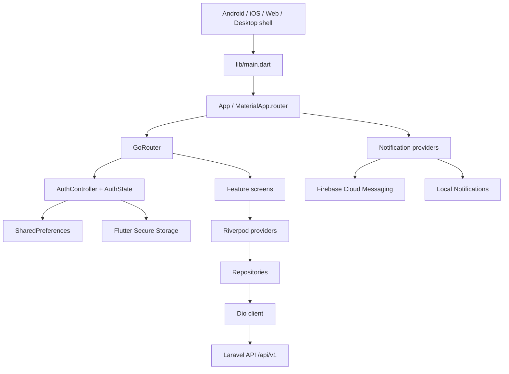
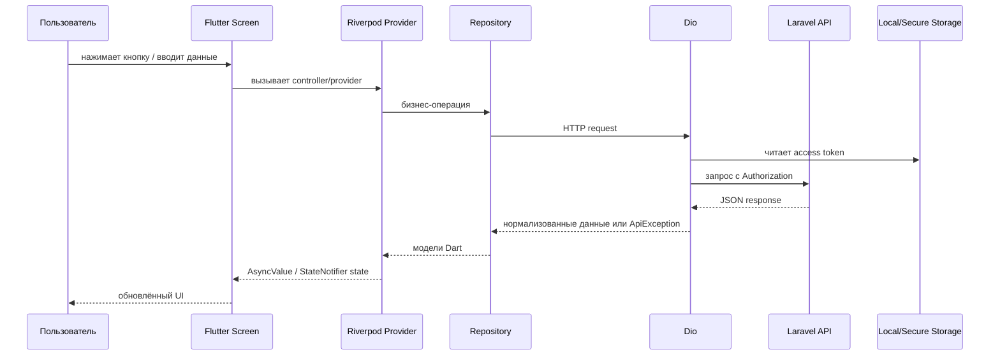
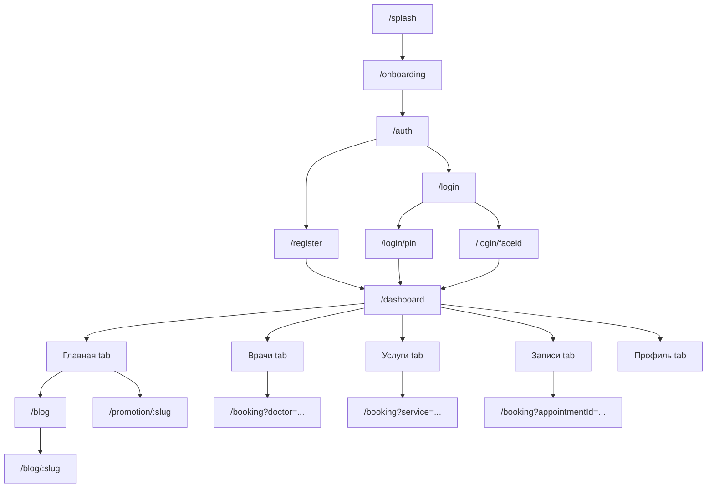
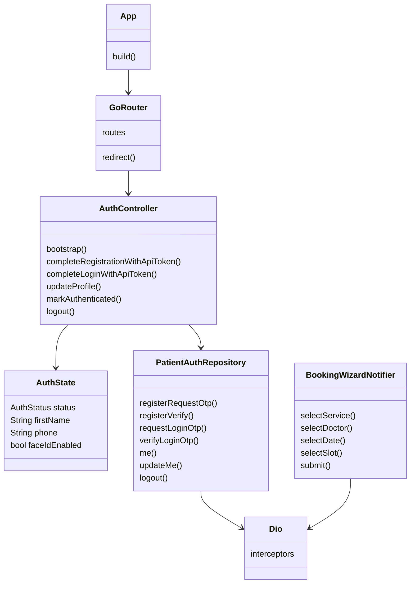
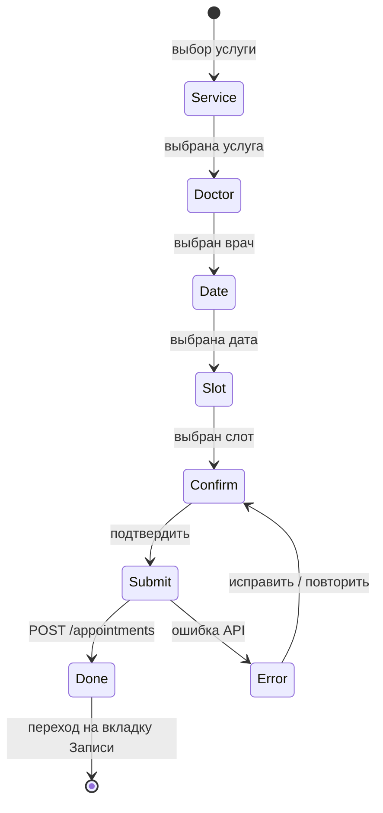

# Полное руководство по проекту flutter_application_diplom

## 1. Введение

Этот документ подробно разбирает мобильное приложение из папки `mobileApp`. Проект называется `flutter_application_diplom`, а в пользовательском интерфейсе приложение отображается как медицинское приложение клиники «Маяк Здоровья».

Главная мысль: это Flutter-приложение для пациента клиники. Пользователь проходит онбординг, регистрируется или входит по SMS-коду, настраивает PIN и биометрию, затем попадает в личный кабинет с врачами, услугами, записями, блогом, акциями и профилем.

Проект написан не на HTML/CSS/JS как классический сайт, а на **Flutter + Dart**. Flutter сам рисует интерфейс на Android, iOS, Web, Linux, macOS и Windows. HTML здесь есть только в web-обёртке `web/index.html`, которая запускает Flutter-приложение в браузере.

## 2. Короткая карта технологий

| Технология | Где используется | Зачем нужна |
|---|---|---|
| Flutter | весь `lib/` | UI, экраны, анимации, навигация, работа под разные платформы |
| Dart | весь код приложения | язык программирования Flutter |
| Riverpod | `flutter_riverpod` | состояние приложения, зависимости, загрузка данных |
| GoRouter | `go_router` | маршруты `/splash`, `/dashboard`, `/booking`, `/blog/:slug` и т.д. |
| Dio | `core/network/dio_client.dart` | HTTP-запросы к Laravel API |
| SharedPreferences | `core/storage/storage_service.dart` | простые локальные данные: имя, телефон, PIN, флаг регистрации |
| Flutter Secure Storage | `core/storage/secure_storage.dart` | защищённое хранение access/refresh token |
| Firebase Messaging | `core/notifications/*` | push-уведомления |
| Local Notifications | `core/notifications/local_notifications_service.dart` | показ уведомлений, когда приложение открыто |
| local_auth | `core/biometric/biometric_auth_service.dart` | Face ID / Touch ID / отпечаток |
| flutter_html | `dashboard/blog`, `promotions` | отображение HTML-контента статей и акций |
| google_fonts | UI-файлы | шрифт Inter |
| flutter_animate | экраны | плавные появления, слайды, анимации |

## 3. Как приложение работает в целом

### 3.1. Запуск приложения

1. Операционная система запускает нативный контейнер:
   - Android: `MainActivity.kt`;
   - iOS: `AppDelegate.swift`;
   - Web: `web/index.html`;
   - Desktop: CMake/runner-файлы.
2. Flutter передаёт управление в `lib/main.dart`.
3. `main.dart` вызывает `WidgetsFlutterBinding.ensureInitialized()`, чтобы Flutter успел подготовить движок до асинхронных операций.
4. Если включён Firebase (`USE_FIREBASE=true`), приложение пытается инициализировать Firebase и регистрирует фоновый обработчик push-сообщений.
5. Запускается `runApp(const ProviderScope(child: App()))`.
6. `ProviderScope` включает Riverpod для всего приложения.
7. `App` создаёт `MaterialApp.router`, подключает русскую локализацию, тему, роутер и сервисы уведомлений.

Ключевой код:

```dart
Future<void> main() async {
  WidgetsFlutterBinding.ensureInitialized();

  if (kFirebaseEnabled) {
    await Firebase.initializeApp();
    FirebaseMessaging.onBackgroundMessage(firebaseMessagingBackgroundHandler);
  }

  runApp(const ProviderScope(child: App()));
}
```

### 3.2. Главная идея состояния авторизации

В приложении есть enum `AuthStatus`:

```dart
enum AuthStatus {
  unknown,
  unregistered,
  registeredLoggedOut,
  authenticated,
}
```

Он отвечает на вопрос: «что сейчас известно о пользователе?»

- `unknown` — приложение только стартовало и ещё читает локальное хранилище.
- `unregistered` — локально нет признака регистрации.
- `registeredLoggedOut` — пользователь зарегистрирован, но ещё не ввёл PIN / Face ID в этой сессии.
- `authenticated` — пользователь полностью вошёл и может видеть личный кабинет.

Именно этот статус управляет маршрутизацией. Например, если пользователь не вошёл и пытается открыть `/dashboard`, роутер отправит его на `/login/pin` или `/login/faceid`.

### 3.3. Главный пользовательский сценарий

Типичный путь нового пользователя:

1. Splash-экран.
2. Онбординг.
3. Экран выбора: войти или зарегистрироваться.
4. Регистрация:
   - личные данные;
   - телефон;
   - SMS OTP;
   - PIN;
   - Face ID / биометрия.
5. Dashboard.
6. Просмотр врачей, услуг, записей, блога, акций, профиля.
7. Создание записи на приём через booking wizard.

Типичный путь уже зарегистрированного пользователя:

1. Splash-экран.
2. Bootstrap читает локальные данные.
3. Если включена биометрия — `/login/faceid`, иначе `/login/pin`.
4. После успешного подтверждения — `/dashboard`.

## 4. Mermaid-диаграммы

### 4.1. Диаграмма архитектуры



Пояснение: экран не ходит напрямую в сеть. Обычно экран читает Riverpod provider, provider вызывает repository, repository использует Dio, Dio отправляет запрос в backend.

### 4.2. Поток данных



### 4.3. Пользовательский путь регистрации

```mermaid
flowchart LR
    Splash[/Splash/] --> Onboarding[/Onboarding/]
    Onboarding --> Auth[/Auth screen/]
    Auth --> Step1[ФИО, дата рождения, пол]
    Step1 --> Step2[Телефон]
    Step2 --> API1[POST register/request-otp]
    API1 --> Step3[SMS OTP]
    Step3 --> API2[POST register/verify]
    API2 --> Pin[Создание PIN]
    Pin --> Bio[Настройка Face ID]
    Bio --> Dashboard[/Dashboard/]
```



### 4.4. Карта мобильного приложения



### 4.5. Диаграмма компонентов и классов



### 4.6. Диаграмма записи на приём



## 5. Структура проекта

На верхнем уровне `mobileApp` — стандартный Flutter-проект:

```text
mobileApp/
  android/              Android-обёртка
  ios/                  iOS-обёртка
  lib/                  основной Dart-код приложения
  linux/                Linux desktop-обёртка
  macos/                macOS desktop-обёртка
  web/                  Web-обёртка
  windows/              Windows desktop-обёртка
  pubspec.yaml          зависимости Flutter
  analysis_options.yaml правила анализа Dart
  README.md             краткое описание проекта
```

Самая важная папка — `lib/`. В ней код разделён по смыслу:

- `app/` — корневой виджет и роутинг.
- `core/` — общие сервисы: сеть, хранилище, уведомления, цвета, кнопки.
- `features/` — функциональные модули приложения: auth, registration, login, dashboard, booking.

## 6. Подробный разбор файлов верхнего уровня

### `.gitignore`

Файл Git с правилами игнорирования. В Flutter обычно исключает build-артефакты, временные файлы IDE и сгенерированные локальные данные. Нужен, чтобы не коммитить мусор вроде `build/`.

### `.metadata`

Служебный файл Flutter. Хранит информацию о версии Flutter, платформенных проектах и миграциях. Его обычно не редактируют руками.

### `README.md`

Содержит только стандартный шаблон:

```md
# flutter_application_diplom

A new Flutter project.
```

То есть README пока не объясняет архитектуру. Этот `GUIDE.md` фактически закрывает этот пробел.

### `analysis_options.yaml`

Подключает стандартные правила линтинга Flutter:

```yaml
include: package:flutter_lints/flutter.yaml
```

Это значит, что `flutter analyze` будет проверять код по набору рекомендаций `flutter_lints`.

### `pubspec.yaml`

Главная конфигурация Flutter-пакета. Важные части:

```yaml
name: flutter_application_diplom
version: 0.1.0
environment:
  sdk: ^3.10.8
dependencies:
  go_router: ^17.2.0
  flutter_riverpod: ^2.6.1
  dio: ^5.7.0
  shared_preferences: ^2.5.5
  flutter_secure_storage: ^9.2.2
  local_auth: ^2.3.0
  firebase_core: ^3.6.0
  firebase_messaging: ^15.1.3
```

Роль файла: Flutter читает его при `flutter pub get` и скачивает зависимости. Если здесь убрать `dio`, сетевой слой перестанет собираться. Если убрать `go_router`, сломается `app/router.dart`.

### `pubspec.lock`

Автоматически сгенерированный lock-файл. В нём зафиксированы точные версии пакетов, которые были установлены. Его обычно не редактируют вручную.

## 7. Подробный разбор `lib/`

### `lib/main.dart`

Точка входа. Здесь приложение стартует.

Логические блоки:

1. Импорт Firebase, Flutter и Riverpod.
2. `WidgetsFlutterBinding.ensureInitialized()` — подготовка Flutter engine.
3. Условная инициализация Firebase.
4. Регистрация background handler для push-уведомлений.
5. `runApp(const ProviderScope(child: App()))`.

Связи:

- Импортирует `app/app.dart`.
- Импортирует `core/firebase_config.dart`.
- Импортирует `core/notifications/firebase_messaging_service.dart`.

### `lib/app/app.dart`

Корневой виджет приложения.

Ключевые действия:

- запускает notification controller через `ref.watch(notificationControllerProvider)`;
- запускает синхронизацию FCM-токена через `ref.watch(pushTokenSyncProvider)`;
- слушает `authControllerProvider` и после логина переотправляет push token уже с авторизацией;
- настраивает `MaterialApp.router`;
- включает русскую локализацию;
- задаёт тему приложения.

Важный фрагмент:

```dart
ref.listen<AuthState>(authControllerProvider, (previous, current) {
  if (current.status == AuthStatus.authenticated &&
      previous?.status != AuthStatus.authenticated) {
    ref.read(pushTokenSyncProvider).resendAfterLogin();
  }
});
```

Новичку: `listen` — это реакция на изменение состояния. Когда пользователь стал authenticated, приложение понимает: «теперь backend сможет связать FCM-токен с конкретным пациентом».

### `lib/app/router.dart`

Центральная карта маршрутов.

Маршруты:

| Route | Экран |
|---|---|
| `/splash` | `SplashScreen` |
| `/onboarding` | `OnboardingScreen` |
| `/auth` | `AuthScreen` |
| `/register` | `RegistrationScreen` |
| `/login` | `LoginScreen` |
| `/login/pin` | `LoginPinScreen` |
| `/login/faceid` | `LoginFaceIdScreen` |
| `/dashboard` | `DashboardScreen` |
| `/blog` | `BlogScreen` |
| `/blog/:slug` | `ArticleScreen` |
| `/promotion/:slug` | `PromotionDetailScreen` |
| `/booking` | `BookingScreen` |

Самое важное — `redirect`. Он смотрит на `AuthStatus`:

- `unknown` держит пользователя на splash;
- `unregistered` не пускает в приватные экраны;
- `registeredLoggedOut` отправляет на PIN или Face ID;
- `authenticated` не пускает обратно на авторизацию.

`_AuthRefreshNotifier` связывает Riverpod и GoRouter: когда меняется auth status, GoRouter пересчитывает redirect.

## 8. Core-слой

### `lib/core/firebase_config.dart`

Содержит один флаг:

```dart
const bool kFirebaseEnabled = bool.fromEnvironment(
  'USE_FIREBASE',
  defaultValue: true,
);
```

При запуске можно отключить Firebase:

```bash
flutter run --dart-define=USE_FIREBASE=false
```

Это полезно, если Firebase ещё не настроен.

### `lib/core/network/api_exception.dart`

Определяет типы ошибок API:

- `ApiException` — обычная ошибка backend;
- `NetworkException` — ошибка сети без HTTP-статуса;
- `UnauthorizedException` — 401, пользователь не авторизован.

Зачем это нужно: экраны не должны вручную разбирать все варианты `DioException`. Они могут получить нормализованное сообщение.

### `lib/core/network/dio_client.dart`

Создаёт общий `Dio`.

Важные части:

- `resolvedApiBaseUrl` выбирает базовый URL:
  - сначала `API_BASE`;
  - иначе `API_BASE_URL`;
  - иначе `http://10.0.2.2:8000/api/v1`.
- `_AuthInterceptor` добавляет `Authorization: Bearer <token>`.
- `_ErrorInterceptor` превращает ошибки backend в `ApiException`.

Пример:

```dart
final token = await _storage.readAccessToken();
if (token != null && token.isNotEmpty) {
  options.headers['Authorization'] = 'Bearer $token';
}
```

Новичку: interceptor — это «перехватчик». Он автоматически срабатывает перед каждым запросом или после каждой ошибки. Поэтому каждому repository не нужно отдельно добавлять токен.

### `lib/core/storage/storage_service.dart`

Обёртка над `SharedPreferences`.

Хранит:

- флаг регистрации;
- имя, фамилию, отчество;
- телефон;
- дату рождения;
- пол;
- PIN;
- включён ли Face ID.

Важно: PIN здесь хранится в обычном preferences. Access token хранится отдельно в secure storage.

### `lib/core/storage/secure_storage.dart`

Обёртка над `FlutterSecureStorage`.

Хранит:

- `auth_access_token`;
- `auth_refresh_token`.

Это более защищённое хранилище, чем SharedPreferences, поэтому оно подходит для токенов.

### `lib/core/storage/providers.dart`

Riverpod providers для сервисов:

```dart
final storageServiceProvider = Provider<StorageService>((ref) {
  return StorageService();
});
```

Зачем: вместо создания `StorageService()` в каждом экране приложение берёт сервис через `ref.watch` / `ref.read`.

### `lib/core/biometric/biometric_auth_service.dart`

Обёртка над `local_auth`.

Решает задачи:

- проверить, доступна ли биометрия;
- показать системный диалог Face ID / Touch ID / отпечатка;
- вернуть понятные русские сообщения ошибок.

Особенность Android: в комментариях указано, что на части Android-устройств для приложений может требоваться отпечаток, а не только face unlock.

### `lib/core/notifications/firebase_messaging_service.dart`

Сервис Firebase Cloud Messaging.

Что делает:

- запрашивает permission на уведомления;
- настраивает foreground presentation options;
- слушает `FirebaseMessaging.onMessage`;
- слушает `FirebaseMessaging.onMessageOpenedApp`;
- читает initial message, если приложение открыли тапом по push;
- отдаёт stream обновления FCM-токена.

Фоновый обработчик:

```dart
@pragma('vm:entry-point')
Future<void> firebaseMessagingBackgroundHandler(RemoteMessage message) async {
  debugPrint('[FCM:background] ${message.messageId} ${message.data}');
}
```

Он top-level, потому что Firebase требует функцию верхнего уровня для background isolate.

### `lib/core/notifications/local_notifications_service.dart`

Показывает локальные уведомления, когда приложение открыто. На iOS/Android push в foreground часто не показывается автоматически так, как хочется приложению, поэтому используется `flutter_local_notifications`.

### `lib/core/notifications/notification_payload.dart`

Типизированная модель payload push-уведомления:

```json
{
  "type": "news",
  "entity_id": "123",
  "screen": "/news/123",
  "title": "...",
  "body": "..."
}
```

Класс достаёт `type`, `entityId`, `screen`, `title`, `body`.

### `lib/core/notifications/notification_router.dart`

Решает, куда вести пользователя после тапа по уведомлению.

Если payload содержит `screen`, приложение делает:

```dart
_router.go(screen);
```

Иначе смотрит на `type`: `news`, `appointment`, `promo` и т.д.

### `lib/core/notifications/providers.dart`

Склеивает FCM, local notifications и backend.

Главные элементы:

- `firebaseMessagingServiceProvider`;
- `localNotificationsServiceProvider`;
- `notificationControllerProvider`;
- `pushTokenSyncProvider`.

`PushTokenSync` отправляет FCM-токен на backend:

```dart
await dio.post(
  '/devices/register',
  data: {
    'fcm_token': token,
    'platform': defaultTargetPlatform.name,
  },
);
```

### `lib/core/constants/app_colors.dart`

Цветовая палитра приложения: primary, background, surface, text colors, error, success, gradients.

Используется почти во всех экранах, чтобы UI был единым.

### `lib/core/constants/app_text_styles.dart`

Единые текстовые стили на базе `GoogleFonts.inter`: `h1`, `h2`, `body`, `caption`, `buttonLarge` и т.д.

Если проект расширять, лучше использовать эти стили, а не каждый раз писать новый `TextStyle`.

### `lib/core/widgets/primary_button.dart`

Переиспользуемая основная кнопка с градиентом. Есть состояние `isEnabled`, иконка, высота, радиус.

### `lib/core/widgets/outline_button.dart`

Переиспользуемая контурная кнопка. Используется там, где действие вторичное.

### `lib/core/widgets/clinic_logo.dart`

Виджет логотипа клиники. SVG встроен строкой и перекрашивается через переданный `color`.

## 9. Auth, registration и login

### `lib/features/auth/domain/auth_state.dart`

Модель состояния авторизации.

Содержит:

- `status`;
- ФИО;
- телефон;
- дату рождения;
- пол;
- `faceIdEnabled`.

Есть вычисляемые поля:

- `fullName`;
- `shortName`;
- `copyWith`.

### `lib/features/auth/data/patient_auth_repository.dart`

Repository для API авторизации пациента.

Методы:

| Метод | Endpoint |
|---|---|
| `registerRequestOtp` | `POST /auth/register/request-otp` |
| `registerVerify` | `POST /auth/register/verify` |
| `requestLoginOtp` | `POST /auth/login/request-otp` |
| `verifyLoginOtp` | `POST /auth/login/verify` |
| `me` | `GET /me` |
| `updateMe` | `PATCH /me` |
| `logout` | `POST /me/logout` |

Новичку: repository — это слой, который знает про backend API. Экран не должен знать точные URL.

### `lib/features/auth/data/patient_auth_providers.dart`

Создаёт `patientAuthRepositoryProvider`, который отдаёт `PatientAuthRepository` с подключенным `dioProvider`.

### `lib/features/auth/presentation/controllers/auth_controller.dart`

Главная state machine авторизации.

Ключевые методы:

- `bootstrap()` — читает storage и определяет статус пользователя;
- `completeRegistrationWithApiToken()` — сохраняет токен и регистрационные данные;
- `completeLoginWithApiToken()` — сохраняет токен и данные пациента после входа;
- `updateProfile()` — обновляет профиль через API и локальное состояние;
- `savePin()` / `getStoredPin()` — работа с PIN;
- `setFaceIdEnabled()` — сохраняет настройку биометрии;
- `markAuthenticated()` — переводит состояние в authenticated;
- `logout()` — вызывает backend logout и чистит локальные данные.

Связан с:

- `StorageService`;
- `SecureStorage`;
- `PatientAuthRepository`;
- `GoRouter` через `authControllerProvider`.

### `lib/features/auth/auth_screen.dart`

Экран выбора «Войти» или «Зарегистрироваться». Это публичная точка входа после онбординга.

### `lib/features/registration/domain/registration_data.dart`

Модель временных данных регистрации.

Важный getter:

```dart
String get phoneE164 => '375$phone';
```

В форме пользователь вводит 9 национальных цифр, а API получает номер в формате без плюса: `375XXXXXXXXX`.

### `lib/features/registration/presentation/controllers/registration_controller.dart`

Riverpod `StateNotifier` для wizard регистрации.

Хранит:

- текущий шаг;
- введённые данные;
- методы перехода вперёд/назад.

### `lib/features/registration/registration_screen.dart`

Собирает wizard регистрации. По `state.step` показывает один из экранов:

1. `Step1Personal`;
2. `Step2Phone`;
3. `Step3Otp`;
4. `PinSetupScreen`;
5. `FaceIdSetupScreen`.

Использует `AnimatedSwitcher`, чтобы переходы между шагами были плавными.

### `lib/features/registration/steps/step1_personal.dart`

Первый шаг регистрации: ФИО, дата рождения, пол.

Проверяет ввод:

- кириллица;
- валидная дата;
- выбран пол.

После успешной валидации сохраняет данные в `RegistrationController`.

### `lib/features/registration/steps/step2_phone.dart`

Второй шаг: ввод телефона.

Делает API-запрос:

```dart
registerRequestOtp(phone: data.phoneE164)
```

Если backend вернул ошибку, показывает snackbar или сообщение возле поля.

### `lib/features/registration/steps/step3_otp.dart`

Третий шаг: ввод SMS-кода из 6 цифр.

Логика:

1. пользователь вводит код;
2. когда код заполнен, вызывается `registerVerify`;
3. backend возвращает token и patient;
4. `AuthController.completeRegistrationWithApiToken` сохраняет token и данные;
5. wizard идёт к настройке PIN.

### `lib/features/registration/steps/pin_setup.dart`

Экран создания PIN-кода. Обычно используется после регистрации и после OTP-входа.

Сценарий:

1. пользователь вводит 4 цифры;
2. подтверждает их повторным вводом;
3. PIN сохраняется через `AuthController.savePin`;
4. вызывается `onNext`.

### `lib/features/registration/steps/face_id_setup.dart`

Настройка биометрии.

Если пользователь включает Face ID:

1. вызывается `BiometricAuthService.authenticate`;
2. при успехе сохраняется `faceIdEnabled=true`;
3. `AuthController.markAuthenticated()`;
4. переход на `/dashboard`.

Если пользователь пропускает — приложение всё равно может перейти дальше, но вход будет через PIN.

### `lib/features/registration/steps/_numpad.dart`

Переиспользуемая цифровая клавиатура для PIN-экранов.

### `lib/features/registration/steps/_progress_bar.dart`

Индикатор прогресса регистрации.

### `lib/features/registration/steps/_reg_field.dart`

Переиспользуемый виджет поля формы регистрации.

### `lib/features/login/presentation/controllers/login_flow_controller.dart`

Контроллер короткого login wizard:

- `step=1` — ввод телефона;
- `step=2` — ввод OTP.

`autoDispose` означает, что состояние сбрасывается, когда экран больше не нужен.

### `lib/features/login/login_screen.dart`

Переключает `LoginPhoneScreen` и `LoginOtpScreen` через `AnimatedSwitcher`.

### `lib/features/login/login_phone.dart`

Экран ввода телефона для входа.

Делает:

```dart
requestLoginOtp(phone: '375$_phone')
```

Если backend отвечает «Номер не найден», экран показывает CTA для регистрации.

### `lib/features/login/login_otp.dart`

Экран ввода OTP при входе.

После успешного `verifyLoginOtp`:

1. сохраняет token и patient через `completeLoginWithApiToken`;
2. показывает success view;
3. открывает `PinSetupScreen`;
4. потом открывает `FaceIdSetupScreen`;
5. после этого пользователь попадает в dashboard.

Важно: после OTP-входа приложение не сразу отправляет в dashboard. Оно заново настраивает PIN/биометрию.

### `lib/features/login/login_pin.dart`

Экран входа по PIN.

Логика:

- читает сохранённый PIN;
- разрешает максимум 5 попыток;
- после 5 ошибок блокирует ввод на 5 минут;
- при правильном PIN вызывает `markAuthenticated()` и `context.go('/dashboard')`;
- также умеет пробовать биометрию.

### `lib/features/login/login_face_id.dart`

Экран входа через Face ID / Touch ID / отпечаток.

Содержит анимированную область сканирования. При успехе:

```dart
ref.read(authControllerProvider.notifier).markAuthenticated();
context.go('/dashboard');
```

При ошибке показывает возможность повторить или войти по PIN.

## 10. Splash и onboarding

### `lib/features/splash/splash_screen.dart`

Стартовый экран. Ждёт около 3 секунд, вызывает `authController.bootstrap()` и решает, куда вести пользователя:

- registeredLoggedOut → PIN/Face ID;
- authenticated → dashboard;
- unregistered/unknown → onboarding.

### `lib/features/onboarding/onboarding_screen.dart`

Три слайда знакомства с приложением. Есть auto-advance примерно раз в 10 секунд, кнопка «Пропустить» и переход на `/auth`.

## 11. Dashboard

### `lib/features/dashboard/dashboard_tab_provider.dart`

Хранит индекс активной вкладки dashboard. Вкладки:

0. Главная.
1. Врачи.
2. Услуги.
3. Записи.
4. Профиль.

### `lib/features/dashboard/dashboard_screen.dart`

Главный экран после входа.

Использует `IndexedStack`, поэтому вкладки не пересоздаются при переключении. Это важно: если пользователь ввёл поисковый запрос во вкладке врачей, переключился и вернулся — состояние может сохраниться.

Также обрабатывает кнопку Back:

- если открыт detail врача — закрывает его;
- если открыта вложенная страница услуг — возвращает на уровень выше;
- иначе требует двойное нажатие Back для выхода.

### `lib/features/dashboard/home/home_screen.dart`

Главная вкладка.

Содержит:

- приветствие по времени суток;
- промо-слайдер;
- ближайшие записи;
- категории услуг;
- врачей;
- блог;
- акции.

Она читает много providers:

- `authControllerProvider`;
- `upcomingAppointmentsProvider`;
- `blogPreviewProvider`;
- `doctorsListProvider`;
- `homePromotionsProvider`;
- `serviceDirectionsProvider`.

### `lib/features/dashboard/widgets/doctor_grid_card.dart`

Переиспользуемая карточка врача для сеток и блоков услуг. Позволяет не дублировать UI врача в разных экранах.

### `lib/features/dashboard/common/html_prose.dart`

Общие стили для HTML-контента. Используется статьями и акциями, где backend может прислать HTML.

## 12. Врачи

### `lib/features/dashboard/doctors/doctor_models.dart`

Модели врача:

- `DoctorModel`;
- `DoctorWorkItem`;
- `DoctorEduItem`;
- `DoctorReviewVm`;
- enum категории врача;
- enum возрастной группы.

Есть много helper-getters:

- `fullName`;
- `compactName`;
- `experienceYearsLabel`;
- `gradeName`;
- `gradeColor`.

Это не просто DTO, а view model с логикой отображения.

### `lib/features/dashboard/doctors/doctors_repository.dart`

Repository врачей.

Endpoints:

- `GET /doctors`;
- `GET /doctors/{slug}`.

Поддерживает фильтры:

- specialization;
- patient_age.

### `lib/features/dashboard/doctors/doctors_providers.dart`

Providers врачей:

- `doctorsRepositoryProvider`;
- `doctorsListProvider`;
- `doctorDetailProvider`;
- `doctorsPendingSlugProvider`;
- `doctorsSubNavProvider`.

`doctorsSubNavProvider` — важная деталь. Он хранит вложенную навигацию внутри вкладки «Врачи»: список → детальная карточка.

### `lib/features/dashboard/doctors/doctors_screen.dart`

Экран врачей.

Умеет:

- загружать список врачей;
- показывать loading/error/data;
- фильтровать по поиску, специальности, категории, возрасту;
- открывать детальную карточку врача;
- переходить к записи на приём.

## 13. Услуги

### `lib/features/dashboard/services/services_data.dart`

Модели услуг:

- `ServiceCategory`;
- `ServiceOffer`;
- `ServiceDoctorSnapshot`.

Также содержит helper-функции склонения:

- `categoryWord`;
- `serviceWord`.

Есть временный список `serviceDoctorsSnapshots`, помеченный комментарием как пока не подключённый к API.

### `lib/features/dashboard/services/services_repository.dart`

Repository услуг.

Endpoints:

- `GET /service-directions`;
- `GET /service-directions/{slug}/services`.

### `lib/features/dashboard/services/services_providers.dart`

Providers услуг:

- `servicesRepositoryProvider`;
- `serviceDirectionsProvider`;
- `servicesInDirectionProvider`;
- `servicesPendingCategorySlugProvider`;
- `serviceDoctorsProvider`;
- `servicesSubNavProvider`.

`ServicesSubNavState` хранит:

- выбранную категорию;
- выбранную услугу.

Это даёт вложенную навигацию: категории → список услуг → карточка услуги.

### `lib/features/dashboard/services/services_screen.dart`

Экран услуг.

Сценарии:

- показать категории;
- поиск по категориям;
- открыть категорию;
- поиск по услугам внутри категории;
- открыть детальную услугу;
- увидеть врачей, оказывающих услугу;
- перейти в booking.

## 14. Записи

### `lib/features/dashboard/appointments/appointment_model.dart`

Модели записи:

- `AppointmentModel`;
- `AppointmentDoctorInfo`;
- `AppointmentServiceInfo`;
- enum `AppointmentApiStatus`.

Есть computed properties:

- `isUpcoming`;
- `isCompleted`;
- `isCancelled`.

Они помогают UI не сравнивать raw-строки статусов.

### `lib/features/dashboard/appointments/appointments_repository.dart`

Repository записей.

Endpoints:

- `GET /appointments?status=upcoming`;
- `GET /appointments?status=past`;
- `POST /appointments/{id}/cancel`;
- `POST /appointments/{id}/reschedule`.

### `lib/features/dashboard/appointments/appointments_providers.dart`

Providers:

- `appointmentsRepositoryProvider`;
- `upcomingAppointmentsProvider`;
- `pastAppointmentsProvider`;
- `appointmentsPendingDetailProvider`.

`appointmentsPendingDetailProvider` нужен, чтобы с главной открыть конкретную запись во вкладке «Записи».

### `lib/features/dashboard/appointments/appointments_screen.dart`

Экран записей.

Содержит локальную UI-модель `_Apt`, которая преобразует backend model в удобный формат для карточек: дата, время, врач, услуга, статус, цена, можно ли отменить.

Умеет:

- переключать будущие/прошедшие записи;
- показывать детали записи;
- отменять запись;
- переносить запись через `/booking?appointmentId=...`;
- повторно записаться к тому же врачу/на ту же услугу.

## 15. Блог

### `lib/features/dashboard/blog/article_model.dart`

Модель статьи:

- id;
- slug;
- title;
- category;
- author;
- publishedAt;
- readingTime;
- coverUrl;
- content.

Есть `formattedDate` и `readTimeLabel`.

### `lib/features/dashboard/blog/blog_repository.dart`

Repository блога.

Endpoints:

- `GET /articles`;
- `GET /article-categories`;
- `GET /articles/{slug}`.

Поддерживает query:

- category;
- q;
- limit.

### `lib/features/dashboard/blog/blog_providers.dart`

Providers:

- `blogPreviewProvider` — короткий список для главной;
- `blogFilteredProvider` — список с фильтрами;
- `articleCategoriesProvider`;
- `articleDetailProvider`.

### `lib/features/dashboard/blog/blog_screen.dart`

Экран списка статей.

Особенность: поиск debounced на 350 мс. Это значит, что запрос не обновляется на каждую букву мгновенно, а ждёт, пока пользователь чуть остановится.

### `lib/features/dashboard/blog/article_screen.dart`

Экран одной статьи.

Загружает статью по slug через `articleDetailProvider(slug)`, показывает обложку, метаданные и HTML-контент через `flutter_html`.

## 16. Акции

### `lib/features/dashboard/promotions/promotion_model.dart`

Модель акции:

- id;
- slug;
- title;
- shortDescription;
- imageUrl;
- category;
- dates;
- items;
- fullDescription.

Extension `displayImageUrl` превращает относительный URL картинки в абсолютный через `resolvedApiBaseUrl`.

### `lib/features/dashboard/promotions/promotions_repository.dart`

Repository акций.

Endpoints:

- `GET /promotions?limit=...`;
- `GET /promotions/{slug}`.

### `lib/features/dashboard/promotions/promotions_providers.dart`

Providers:

- `homePromotionsProvider`;
- `promotionDetailProvider`.

### `lib/features/dashboard/promotions/promotion_detail_screen.dart`

Экран детальной акции. Показывает обложку, период действия, описание и HTML-контент.

## 17. Профиль

### `lib/features/dashboard/profile/profile_screen.dart`

Экран профиля.

Показывает:

- ФИО;
- телефон;
- дату рождения;
- пол;
- меню разделов.

Действия:

- открыть редактирование профиля;
- перейти в историю записей;
- выйти из аккаунта.

Logout вызывает:

```dart
await ref.read(authControllerProvider.notifier).logout();
context.go('/auth');
```

### `lib/features/dashboard/profile/edit_profile_screen.dart`

Экран редактирования профиля.

Отправляет `PATCH /me` через:

```dart
ref.read(authControllerProvider.notifier).updateProfile(...)
```

Телефон read-only. Это явно указано в комментарии: смена номера — отдельный wizard вне MVP.

## 18. Booking wizard

### `lib/features/booking/data/booking_models.dart`

Модели для записи:

- `BookingServiceItem`;
- `BookingDoctorItem`.

Они легче, чем полноценные модели услуг/врачей, потому что wizard'у нужны только id, slug, имя, цена, описание, врач и рейтинг.

### `lib/features/booking/data/booking_catalog_repository.dart`

Repository каталога booking.

Endpoints:

- `GET /booking/services`;
- `GET /booking/doctors?service=...`;
- `GET /booking/dates`;
- `GET /booking/slots`.

Важная деталь по слотам:

```dart
return DateTime.tryParse('${raw}Z');
```

Сервер возвращает время без timezone suffix, поэтому код добавляет `Z`, чтобы Dart интерпретировал его как UTC, а потом переводит в local time.

### `lib/features/booking/data/booking_repository.dart`

Создание записи:

```dart
POST /appointments
```

Тело:

```json
{
  "service_id": 1,
  "doctor_id": 2,
  "start_at": "...",
  "note": "..."
}
```

### `lib/features/booking/data/booking_providers.dart`

Providers для booking:

- `bookingCatalogRepositoryProvider`;
- `bookingRepositoryProvider`;
- `bookingServicesProvider`;
- `bookingDoctorsProvider`;
- `bookingDatesProvider`;
- `bookingSlotsProvider`.

Используются family providers, потому что данные зависят от параметров: slug врача, услуги, даты.

### `lib/features/booking/state/booking_wizard_state.dart`

Состояние wizard:

- список шагов;
- текущий индекс;
- выбранная услуга;
- выбранный врач;
- выбранная дата;
- выбранный слот;
- loading submit;
- error;
- done.

### `lib/features/booking/state/booking_wizard_notifier.dart`

Логика wizard.

Умеет:

- строить список шагов с учётом query-параметров;
- выбирать услугу/врача/дату/слот;
- идти назад;
- submit;
- создавать новую запись или переносить существующую.

При успешном submit:

```dart
ref.invalidate(upcomingAppointmentsProvider);
ref.invalidate(pastAppointmentsProvider);
state = state.copyWith(isSubmitting: false, done: true);
```

То есть список записей сбрасывается, чтобы при возвращении загрузиться заново.

### `lib/features/booking/presentation/booking_screen.dart`

UI-контейнер wizard.

Принимает:

- `doctorSlug`;
- `serviceSlug`;
- `appointmentId`.

Если `appointmentId` есть, экран работает в режиме переноса записи.

### `lib/features/booking/presentation/steps/booking_service_step.dart`

Шаг выбора услуги. Загружает услуги, показывает список, сохраняет выбранную услугу в wizard state.

### `lib/features/booking/presentation/steps/booking_doctor_step.dart`

Шаг выбора врача. Загружает врачей, которые оказывают выбранную услугу.

### `lib/features/booking/presentation/steps/booking_date_step.dart`

Шаг выбора даты. Загружает доступные даты для пары услуга + врач.

### `lib/features/booking/presentation/steps/booking_slot_step.dart`

Шаг выбора времени. Загружает слоты для выбранной даты.

### `lib/features/booking/presentation/steps/booking_confirm_step.dart`

Финальный шаг. Показывает выбранные данные и отправляет запись.

### `lib/features/booking/presentation/widgets/booking_progress_bar.dart`

Индикатор шагов booking wizard.

## 19. Платформенные папки

Платформенные директории в Flutter нужны, чтобы один Dart-код запускался как нативное приложение.

### Android

| Файл | Назначение |
|---|---|
| `android/.gitignore` | игнор Android build-файлов |
| `android/build.gradle.kts` | общая Gradle-конфигурация Android-проекта |
| `android/settings.gradle.kts` | подключение Flutter Gradle plugin и Android module |
| `android/gradle.properties` | свойства Gradle |
| `android/gradle/wrapper/gradle-wrapper.properties` | версия Gradle wrapper |
| `android/app/build.gradle.kts` | конфигурация Android app: namespace, applicationId, Java 17, google-services |
| `android/app/google-services.json` | конфигурация Firebase Android |
| `android/app/src/main/AndroidManifest.xml` | permissions, activity, cleartext traffic, biometric permission |
| `android/app/src/debug/AndroidManifest.xml` | debug-настройки Android |
| `android/app/src/profile/AndroidManifest.xml` | profile-настройки Android |
| `android/app/src/main/kotlin/com/example/flutter_application_diplom/MainActivity.kt` | нативная Android activity, запускающая Flutter |
| `android/app/src/main/res/drawable/launch_background.xml` | splash background до старта Flutter |
| `android/app/src/main/res/drawable-v21/launch_background.xml` | splash background для Android API 21+ |
| `android/app/src/main/res/values/styles.xml` | Android темы |
| `android/app/src/main/res/values-night/styles.xml` | Android night-темы |
| `android/app/src/main/res/mipmap-*/*` | иконки приложения разных плотностей |

Важное в Android manifest:

```xml
<uses-permission android:name="android.permission.INTERNET" />
<uses-permission android:name="android.permission.USE_BIOMETRIC" />
<application android:usesCleartextTraffic="true">
```

`usesCleartextTraffic=true` нужен, потому что API по умолчанию может быть `http://10.0.2.2:8000`.

### iOS

| Файл/группа | Назначение |
|---|---|
| `ios/.gitignore` | игнор Xcode/Flutter временных файлов |
| `ios/Flutter/AppFrameworkInfo.plist` | настройки Flutter framework |
| `ios/Flutter/Debug.xcconfig` | debug config |
| `ios/Flutter/Release.xcconfig` | release config |
| `ios/Runner/AppDelegate.swift` | iOS entry point |
| `ios/Runner/Info.plist` | имя приложения, Face ID permission, App Transport Security |
| `ios/Runner/Runner-Bridging-Header.h` | bridging header |
| `ios/Runner/Base.lproj/LaunchScreen.storyboard` | launch screen |
| `ios/Runner/Base.lproj/Main.storyboard` | main storyboard |
| `ios/Runner/Assets.xcassets/AppIcon.appiconset/*` | iOS app icons |
| `ios/Runner/Assets.xcassets/LaunchImage.imageset/*` | launch images |
| `ios/Runner.xcodeproj/*` | Xcode project |
| `ios/Runner.xcworkspace/*` | Xcode workspace |
| `ios/RunnerTests/RunnerTests.swift` | заготовка iOS tests |

Важное в `Info.plist`:

```xml
<key>NSFaceIDUsageDescription</key>
<string>Разблокировка приложения Face ID или Touch ID</string>
<key>NSAllowsArbitraryLoads</key>
<true/>
```

Первое нужно для Face ID. Второе разрешает небезопасные HTTP-загрузки, что удобно для локальной разработки.

### Web

| Файл | Назначение |
|---|---|
| `web/index.html` | HTML-оболочка, которая загружает Flutter web |
| `web/manifest.json` | PWA manifest |
| `web/favicon.png` | favicon |
| `web/icons/Icon-192.png` | PWA icon |
| `web/icons/Icon-512.png` | PWA icon |
| `web/icons/Icon-maskable-192.png` | maskable PWA icon |
| `web/icons/Icon-maskable-512.png` | maskable PWA icon |

В `index.html` нет бизнес-логики. Главная строка:

```html
<script src="flutter_bootstrap.js" async></script>
```

Она запускает Flutter web bundle.

### Linux

| Файл | Назначение |
|---|---|
| `linux/.gitignore` | игнор Linux build-файлов |
| `linux/CMakeLists.txt` | CMake-конфигурация Linux app |
| `linux/flutter/CMakeLists.txt` | подключение Flutter Linux engine |
| `linux/flutter/generated_plugin_registrant.cc` | регистрация Flutter plugins |
| `linux/flutter/generated_plugin_registrant.h` | header регистрации plugins |
| `linux/flutter/generated_plugins.cmake` | список plugins для CMake |
| `linux/runner/CMakeLists.txt` | сборка runner |
| `linux/runner/main.cc` | desktop entry point |
| `linux/runner/my_application.cc` | GTK application implementation |
| `linux/runner/my_application.h` | header GTK application |

### macOS

| Файл/группа | Назначение |
|---|---|
| `macos/.gitignore` | игнор macOS/Xcode временных файлов |
| `macos/Flutter/Flutter-Debug.xcconfig` | debug config |
| `macos/Flutter/Flutter-Release.xcconfig` | release config |
| `macos/Flutter/GeneratedPluginRegistrant.swift` | регистрация plugins |
| `macos/Runner/AppDelegate.swift` | macOS app delegate |
| `macos/Runner/MainFlutterWindow.swift` | главное Flutter-окно |
| `macos/Runner/Info.plist` | настройки приложения |
| `macos/Runner/Base.lproj/MainMenu.xib` | меню macOS-приложения |
| `macos/Runner/Configs/*.xcconfig` | конфигурации Xcode |
| `macos/Runner/*.entitlements` | permissions sandbox/network |
| `macos/Runner/Assets.xcassets/AppIcon.appiconset/*` | иконки macOS |
| `macos/Runner.xcodeproj/*` | Xcode project |
| `macos/Runner.xcworkspace/*` | Xcode workspace |
| `macos/RunnerTests/RunnerTests.swift` | заготовка тестов |

### Windows

| Файл | Назначение |
|---|---|
| `windows/.gitignore` | игнор Windows build-файлов |
| `windows/CMakeLists.txt` | CMake-конфигурация Windows app |
| `windows/flutter/CMakeLists.txt` | Flutter Windows engine |
| `windows/flutter/generated_plugin_registrant.cc` | регистрация plugins |
| `windows/flutter/generated_plugin_registrant.h` | header регистрации plugins |
| `windows/flutter/generated_plugins.cmake` | список plugins |
| `windows/runner/CMakeLists.txt` | runner build |
| `windows/runner/Runner.rc` | ресурсы Windows app |
| `windows/runner/flutter_window.cpp` | окно Flutter |
| `windows/runner/flutter_window.h` | header окна Flutter |
| `windows/runner/main.cpp` | Windows entry point |
| `windows/runner/resource.h` | resource IDs |
| `windows/runner/resources/app_icon.ico` | иконка |
| `windows/runner/runner.exe.manifest` | Windows manifest |
| `windows/runner/utils.cpp` | utility-функции |
| `windows/runner/utils.h` | utility header |
| `windows/runner/win32_window.cpp` | Win32 window implementation |
| `windows/runner/win32_window.h` | Win32 window header |

## 20. Как читать и расширять проект

Если нужно понять новый экран, двигайтесь так:

1. Найдите route в `lib/app/router.dart`.
2. Откройте экран из `features/...`.
3. Посмотрите, какие providers он читает через `ref.watch`.
4. Найдите provider.
5. Найдите repository.
6. Посмотрите endpoint и модель ответа.
7. Вернитесь в экран и проверьте, как AsyncValue превращается в UI.

Пример для врачей:

```text
/dashboard tab Врачи
→ DoctorsScreen
→ doctorsListProvider
→ DoctorsRepository.fetchList()
→ GET /doctors
→ DoctorModel.fromApiList()
→ карточки врачей
```

## 21. Глоссарий

- **Widget** — строительный блок UI во Flutter.
- **StatefulWidget** — widget с внутренним изменяемым состоянием.
- **ConsumerWidget / ConsumerStatefulWidget** — widget, который умеет читать Riverpod providers.
- **Provider** — способ дать приложению зависимость или состояние.
- **StateNotifier** — объект, который хранит state и изменяет его методами.
- **FutureProvider** — provider для асинхронной загрузки данных.
- **Repository** — слой, который работает с API.
- **Interceptor** — перехватчик HTTP-запросов/ответов.
- **Route** — адрес экрана.
- **Slug** — человекочитаемый идентификатор в URL, например `cardiologist`.
- **OTP** — одноразовый SMS-код.
- **FCM** — Firebase Cloud Messaging.
- **Secure Storage** — защищённое хранилище токенов.

## 22. Итоговая картина

`mobileApp` — это уже не пустой Flutter-шаблон, а полноценное пациентское приложение:

- есть авторизация через OTP;
- есть локальный PIN и Face ID;
- есть защищённое хранение токена;
- есть централизованный сетевой слой;
- есть вкладочный dashboard;
- есть API-интеграция с врачами, услугами, записями, блогом и акциями;
- есть booking wizard;
- есть push-уведомления;
- есть платформенные настройки Android/iOS/Web/Desktop.

Самые важные файлы для понимания всего проекта:

1. `lib/main.dart` — старт приложения.
2. `lib/app/app.dart` — корневой Flutter app.
3. `lib/app/router.dart` — маршруты и auth redirects.
4. `lib/features/auth/presentation/controllers/auth_controller.dart` — состояние авторизации.
5. `lib/core/network/dio_client.dart` — HTTP и токены.
6. `lib/features/dashboard/dashboard_screen.dart` — главный экран после входа.
7. `lib/features/booking/state/booking_wizard_notifier.dart` — логика записи на приём.

Если понять эти семь файлов, остальная структура становится намного проще: большинство экранов повторяют один и тот же паттерн «экран → provider → repository → API → модель → UI».
