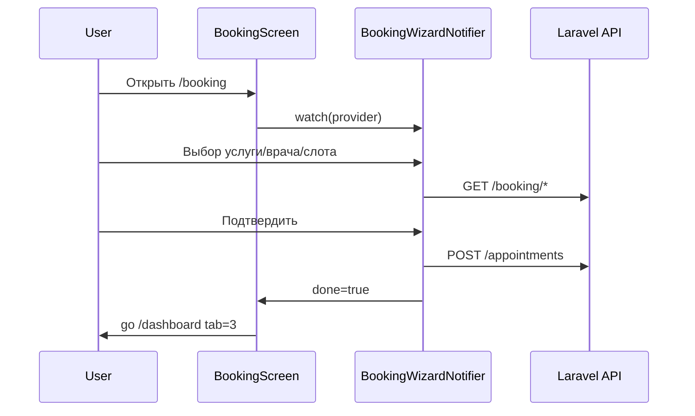
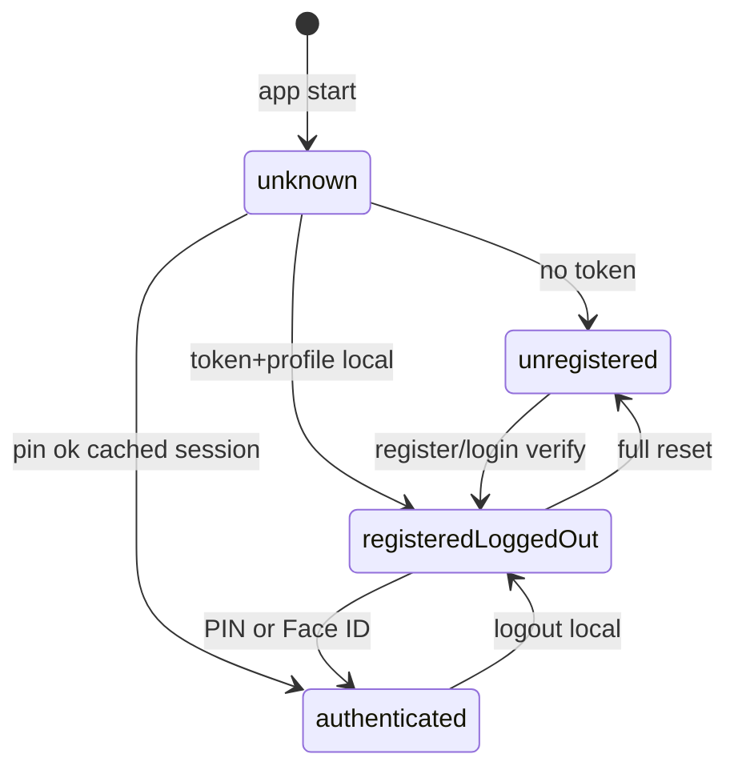
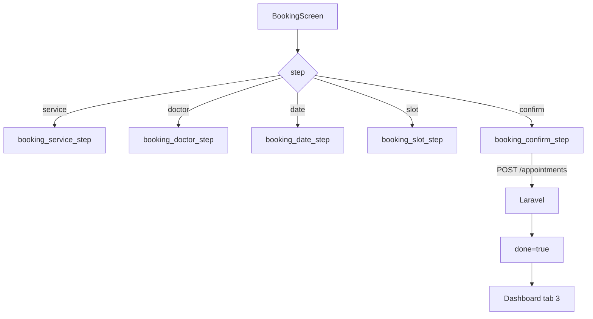

# Полное руководство по проекту «Маяк Здоровья» — МАКСИМАЛЬНО ПОДРОБНО

> **Для кого:** вы **не писали** этот код и **ничего не понимаете** в `GUIDEMOBILE.md` — он сжатый справочник.  
> **Этот файл** — развёрнутый учебник (~11 000+ строк): объяснения простыми словами, **§25 — все 85 Dart-файлов** с листингами кода, построчные разборы PIN/OTP/booking.

**Где лежит проект:** папка `mobileApp/`  
**Сервер (данные):** папка `site/` (Laravel), адрес API: `http://...:8000/api/v1`

---

## Как читать (обязательно)

| Порядок | Раздел | Зачем |
|--------|--------|-------|
| 1 | [§0 — С абсолютного нуля](#0-с-абсолютного-нуля-если-ничего-не-понятно) | Термины, «что это за проект», без кода |
| 2 | [§1 — История одного запуска](#1-история-одного-запуска-приложения-от-иконки-до-главной) | Цельная картина в голове |
| 3 | [§2 — main.dart построчно](#2-libmaindart--каждая-строка) | Первая точка входа |
| 4 | [§3 — app.dart и router.dart](#3-libappappdart-и-libapprouterdart) | Корень UI и «охранник» маршрутов |
| 5 | [§4 — Авторизация целиком](#4-авторизация-от-нуля-до-кабинета) | OTP, PIN, токен, 4 статуса |
| 6 | [§5 — Dashboard и вкладки](#5-dashboard--главный-экран-после-входа) | 5 вкладок, IndexedStack |
| 7 | [§6 — Запись на приём (booking)](#6-запись-на-приём-booking-wizard) | Визард 3–5 шагов |
| 8 | [§7 — Сеть и backend site](#7-сеть-dio-и-папка-site) | Как приложение говорит с сервером |
| 9 | Справочник | `GUIDEMOBILE.md` §6 — список всех 85 файлов |

**Не пытайтесь прочитать всё за один вечер.** Один раздел = одна сессия.

---

# 0. С абсолютного нуля (если ничего не понятно)

## 0.1. Это НЕ «сайт» в привычном смысле

Когда говорят «сайт», часто имеют в виду:

- папку с `index.html`, `style.css`, `script.js`;
- браузер открывает страницу, сервер отдаёт HTML.

**Папка `mobileApp` — это мобильное приложение**, как «Альфа-Банк» или «Госуслуги» на телефоне:

- ставится **APK** (Android) или через App Store (iOS);
- интерфейс рисуется **не браузером**, а фреймворком **Flutter** (язык **Dart**);
- данные (врачи, записи, OTP) приходят **с сервера** из папки **`site/`** — там Laravel (PHP), это **API**, не страницы для пациента.

**Аналогия:**  
- `site/` — кухня ресторана (готовит данные).  
- `mobileApp` — официант с планшетом (показывает меню, принимает заказ, относит на кухню).

Админка клиники (редактирование врачей, статей) — в **`site/admin`**, в приложении пациента её **нет**.

---

## 0.2. Что такое Flutter и Dart (одним абзацем каждый)

**Dart** — язык программирования (как JavaScript или Python). Все файлы логики приложения: `*.dart` в папке `lib/`.

**Flutter** — набор инструментов от Google, чтобы из Dart рисовать **экраны** на Android и iOS (и ещё desktop/web, но здесь главное — телефон).

**Widget (виджет)** — любой кусок интерфейса: кнопка, текст, весь экран. Всё приложение — **дерево виджетов** (виджет внутри виджета).  
Пример: `Scaffold` (каркас экрана) → `Column` (колонка) → `Text('Привет')`.

**Не путайте:** файл `home_screen.dart` — это **код экрана**, а не картинка. Картинки лежат в `assets/images/`.

---

## 0.3. Технологии проекта — таблица «что это и зачем»

| Технология | Простыми словами | Где в проекте |
|------------|------------------|---------------|
| **Flutter / Dart** | Рисует UI, обрабатывает нажатия | Вся папка `lib/` |
| **Riverpod** | «Память приложения» + доступ к сервисам (сеть, хранилище) без глобальных переменных | `*_providers.dart`, `auth_controller.dart` |
| **GoRouter** | Какой **экран** сейчас показан (`/splash`, `/dashboard`…) и **куда перенаправить** если не залогинен | `lib/app/router.dart` |
| **Dio** | HTTP-клиент: GET/POST на Laravel | `lib/core/network/dio_client.dart` |
| **SharedPreferences** | Простое локальное хранилище (имя, PIN, флаг «зарегистрирован») — **не зашифровано** | `storage_service.dart` |
| **flutter_secure_storage** | Зашифрованное хранилище для **токена API** | `secure_storage.dart` |
| **local_auth** | Face ID / отпечаток | `biometric_auth_service.dart` |
| **Firebase FCM** | Push-уведомления с сервера Google → на телефон | `core/notifications/` |
| **Laravel (site/)** | Сервер: OTP, записи, врачи, статьи | `site/routes/api.php` |

---

## 0.4. Папки `mobileApp` — «комнаты в доме»

```
mobileApp/
├── lib/                 ← ВСЯ логика и экраны (85 файлов .dart). ГЛАВНОЕ.
├── assets/images/       ← Картинки (онбординг)
├── android/             ← Настройки сборки APK, Firebase, разрешения
├── ios/                 ← Настройки сборки для iPhone
├── pubspec.yaml         ← Список библиотек (как package.json в Node)
├── build/               ← Мусор после сборки — НЕ ЧИТАТЬ
├── GUIDEMOBILE.md       ← Сжатый справочник
└── GUIDEMOBILE-PODROBNO.md  ← ВЫ ЗДЕСЬ (подробный учебник)
```

### Внутри `lib/` — как устроена «логика по фичам»

```
lib/
├── main.dart              ← Старт программы (как int main в C)
├── app/
│   ├── app.dart           ← Корневой виджет: тема, язык, роутер
│   └── router.dart        ← Все URL приложения + проверка «залогинен ли»
├── core/                  ← Общее для всех экранов: сеть, цвета, кнопки, push
│   ├── network/           ← Dio, ошибки API
│   ├── storage/           ← PIN, имя, токен
│   ├── notifications/   ← Firebase
│   └── widgets/           ← PrimaryButton, логотип
└── features/              ← Экраны по смыслу
    ├── splash/            ← Заставка 3 сек
    ├── onboarding/        ← 3 слайда «о клинике»
    ├── auth/              ← Выбор: войти / регистрация
    ├── registration/      ← 5 шагов регистрации
    ├── login/             ← PIN, Face ID, вход по SMS
    ├── dashboard/         ← Кабинет: главная, врачи, услуги, записи, профиль
    └── booking/           ← Мастер «записаться на приём»
```

**Паттерн feature-first:** всё про «запись на приём» лежит в `features/booking/`, про «вход» — в `features/login/` и `features/auth/`. Так проще искать код.

---

## 0.5. Четыре статуса пользователя — запомните ЭТО

Весь проект крутится вокруг `AuthStatus` в файле `lib/features/auth/domain/auth_state.dart`:

| Статус | Что значит для человека | Что в телефоне сохранено |
|--------|-------------------------|---------------------------|
| `unknown` | Только что открыли app, ещё не проверили память | — |
| `unregistered` | Никогда не регистрировались в этом приложении | Нет флага `mayak_registered` |
| `registeredLoggedOut` | Уже пациент, но **не ввели PIN/Face ID** в этот сеанс | Есть имя, телефон, **токен на сервере**, PIN в prefs |
| `authenticated` | Прошли PIN или Face ID — **полный доступ** к кабинету | То же + «сессия UI» открыта |

**Частая ошибка понимания:** `registeredLoggedOut` — это **не** «вышел из аккаунта». Это нормально после SMS-кода: сервер уже выдал токен, но приложение **намеренно** не пускает в кабинет, пока не введёте PIN (как банковское приложение).

---

## 0.6. Два вида «памяти» на телефоне

1. **SharedPreferences** (`StorageService`) — обычный файл настроек:
   - имя, фамилия, телефон;
   - PIN (4 цифры);
   - флаг Face ID включён;
   - `mayak_registered = true`.

2. **Secure Storage** — зашифровано:
   - `auth_access_token` — ключ к API (Laravel Sanctum), как «пропуск на сервер».

**Каждый запрос к API** (кроме OTP) Dio **подставляет** токен в заголовок:

```
Authorization: Bearer 1|abcdef...
```

Код это делает в `dio_client.dart` → `_AuthInterceptor`.

---

# 1. История одного запуска приложения (от иконки до главной)

Представьте **первый запуск** на новом телефоне.

### Шаг A. Нажали иконку «Маяк Здоровья»

1. Android запускает `MainActivity` → Flutter → вызывается **`main()`** в `lib/main.dart`.
2. `main()` инициализирует Firebase (если включён), оборачивает приложение в **`ProviderScope`** (Riverpod) и запускает виджет **`App`**.

### Шаг B. `App` создаёт роутер

3. `App` (`lib/app/app.dart`) включает push-уведомления и говорит: «покажи экран по адресу **`/splash`**» (это `initialLocation` в `router.dart`).

### Шаг C. Splash 3 секунды

4. `SplashScreen` показывает логотип и волны **3 секунды**.
5. Потом вызывает **`authController.bootstrap()`**:
   - читает `mayak_registered` из SharedPreferences;
   - если false → статус **`unregistered`**;
   - если true → читает PIN/Face ID флаги, токен из Secure Storage;
   - если есть токен и интернет → `GET /me` обновляет имя с сервера.

6. По статусу делает **`context.go(...)`**:
   - `unregistered` → **`/onboarding`** (3 слайда);
   - `registeredLoggedOut` → **`/login/pin`** или **`/login/faceid`**;
   - `authenticated` → **`/dashboard`**.

### Шаг D. Онбординг → Auth

7. Пользователь листает онбординг, жмёт «Начать» → **`/auth`**.
8. Две кнопки: **Войти** (`/login`) или **Зарегистрироваться** (`/register`).

### Шаг E. Регистрация (5 шагов в одном маршруте `/register`)

9. **Шаг 1** — ФИО, дата рождения, пол (только в памяти `RegistrationData`, на сервер ещё не отправили).
10. **Шаг 2** — телефон → **`POST /auth/register/request-otp`** → SMS с кодом.
11. **Шаг 3** — ввод 6 цифр → **`POST /auth/register/verify`** → сервер возвращает **token** + patient → сохраняют в Secure + prefs → статус **`registeredLoggedOut`**.
12. **Шаг 4** — придумать PIN (4 цифры) → сохранить в prefs.
13. **Шаг 5** — Face ID да/нет → **`markAuthenticated()`** → статус **`authenticated`** → GoRouter перенаправляет на **`/dashboard`**.

### Шаг F. Dashboard

14. Внизу 5 вкладок: Главная, Врачи, Услуги, Записи, Профиль.
15. «Записаться» открывает **`/booking`** — визард выбора услуги/врача/даты/времени → **`POST /appointments`**.

**При втором запуске** (уже регистрировались): splash → bootstrap → сразу PIN/Face ID → dashboard (онбординг пропускается).

---

# 2. `lib/main.dart` — каждая строка

Ниже **весь файл** из репозитория и комментарий к **каждой** строке.

```dart
// Строка 1-9: import — подключение чужих библиотек и наших файлов
import 'package:firebase_core/firebase_core.dart';           // Ядро Firebase
import 'package:firebase_messaging/firebase_messaging.dart'; // Push FCM
import 'package:flutter/foundation.dart';                  // kDebugMode
import 'package:flutter/material.dart';                      // WidgetsFlutterBinding, runApp
import 'package:flutter_riverpod/flutter_riverpod.dart';     // ProviderScope

import 'app/app.dart';                                       // Виджет App — корень UI
import 'core/firebase_config.dart';                          // Флаг USE_FIREBASE
import 'core/notifications/firebase_messaging_service.dart'; // Обработчик push в фоне
```

```dart
// Строка 11: main — единственная функция, с которой Dart «входит» в программу
Future<void> main() async {
  // async = внутри можно await (ждать Firebase, сеть и т.д.)
```

```dart
  // Строка 12: БЕЗ ЭТОГО нельзя вызывать плагины до runApp
  WidgetsFlutterBinding.ensureInitialized();
  // «Привяжи Flutter к движку ОС» — обязательная церемония
```

```dart
  // Строки 14-28: Firebase — только если kFirebaseEnabled == true
  if (kFirebaseEnabled) {
    try {
      await Firebase.initializeApp();  // Читает google-services.json / iOS config
      FirebaseMessaging.onBackgroundMessage(
        firebaseMessagingBackgroundHandler,
      );
      // ↑ Регистрация функции на push, когда приложение СВЁРНУТО или закрыто.
      //   Эта функция должна быть top-level (не метод класса).
    } catch (e, st) {
      if (kDebugMode) {
        debugPrint('[main] Firebase init failed: $e\n$st');
      }
      // В debug печатаем ошибку, но app всё равно запустится без push
    }
  } else if (kDebugMode) {
    debugPrint('[main] Firebase disabled ...');
  }
```

```dart
  // Строка 30: ЗАПУСК UI
  runApp(const ProviderScope(child: App()));
  // ProviderScope — «контейнер» для Riverpod: все ref.read/watch работают ВНУТРИ дерева ниже
  // child: App() — корневой виджет нашего приложения
}
```

**Итог `main.dart`:** подготовить ОС → опционально Firebase → `runApp(App)` внутри Riverpod. **Никаких экранов здесь нет** — только старт.

---

# 3. `lib/app/app.dart` и `lib/app/router.dart`

## 3.1. `app.dart` — что делает корень UI

```dart
class App extends ConsumerWidget {
  // ConsumerWidget = виджет, у которого есть ref (доступ к Riverpod)
```

В `build`:

| Строка кода | Зачем |
|-------------|-------|
| `ref.watch(notificationControllerProvider)` | При первом показе App **запускается** инициализация FCM + локальных уведомлений. Результат не используется — это **побочный эффект**. |
| `ref.watch(pushTokenSyncProvider)` | Получить FCM-токен и отправить на сервер `POST /devices/register` (может быть ещё без Bearer). |
| `ref.listen(authControllerProvider, ...)` | Когда статус стал **`authenticated`**, вызвать **`resendAfterLogin()`** — повторно отправить FCM-токен **уже с Authorization**, чтобы сервер привязал push к пациенту. |
| `ref.watch(appRouterProvider)` | Получить настроенный GoRouter. |
| `MaterialApp.router(routerConfig: router, ...)` | Material Design + навигация через router (не старый `routes: {}`). |
| `locale: Locale('ru', 'RU')` | Русский интерфейс дат/кнопок где поддерживает Flutter. |
| `theme: ThemeData(seedColor: 0xFF4682B4)` | Синий цвет клиники. |

**Аналогия:** `App` — это «диспетчерская»: включает связь (push), следит «вошёл ли пользователь», и отдаёт карту маршрутов (`GoRouter`).

---

## 3.2. `router.dart` — маршруты и охранник

### Список URL (как страницы, но без браузера)

| URL | Экран |
|-----|-------|
| `/splash` | Заставка |
| `/onboarding` | 3 слайда |
| `/auth` | Войти / Регистрация |
| `/register` | Мастер регистрации 5 шагов |
| `/login` | Вход по телефону + OTP |
| `/login/pin` | Ввод PIN |
| `/login/faceid` | Face ID |
| `/dashboard` | Кабинет с 5 вкладками |
| `/blog`, `/blog/:slug` | Статьи |
| `/promotion/:slug` | Акция |
| `/booking?doctor=&service=&appointmentId=` | Запись / перенос |

### Функция `redirect` — «охранник на двери»

Вызывается **перед каждым переходом** и когда меняется `AuthStatus`.

**Пример 1:** статус `unknown` → разрешён **только** `/splash`. Попытка открыть `/dashboard` → redirect вернёт `'/splash'`.

**Пример 2:** статус `unregistered` → можно ходить по `/onboarding`, `/auth`, `/register`, `/login*`. Любой другой URL → **`/auth`**.

**Пример 3:** статус `registeredLoggedOut` → по умолчанию кидает на PIN или Face ID. Но **разрешены** `/login`, `/register` (чтобы не оборвать регистрацию на шаге PIN).

**Пример 4:** статус `authenticated` → если лезете на `/login` → перекинет на **`/dashboard`**.

### `_AuthRefreshNotifier`

GoRouter сам не знает про Riverpod. Этот класс **слушает** `authControllerProvider` и при смене `status` вызывает `notifyListeners()` → GoRouter **пересчитывает** redirect.

**Сценарий:** на `/login/pin` ввели верный PIN → `markAuthenticated()` → status стал `authenticated` → notifier сработал → redirect увидел «authenticated на public route» → **`/dashboard`**. Без этого вы бы остались на PIN-экране.

### Booking URL с параметрами

```
/booking?doctor=ivanov&service=uzi
```

`router.dart` читает `state.uri.queryParameters` и передаёт в `BookingScreen`. Визард **пропускает** шаги, если врач и услуга уже в URL.

---

# 4. Авторизация от нуля до кабинета

## 4.1. `auth_state.dart` — модель «кто пользователь сейчас»

Поля `AuthState`:

- `status` — один из 4 enum (см. §0.5);
- `firstName`, `lastName`, `middleName`, `phone`, `birthDate`, `gender` — для UI;
- `faceIdEnabled` — показывать ли экран Face ID при входе.

Геттеры:

- `fullName` — «Фамилия Имя Отчество» для профиля;
- `shortName` — «Имя Фамилия» для шапки.

`copyWith` — способ обновить **одно** поле, не переписывая весь объект (стандарт Dart).

---

## 4.2. `storage_service.dart` — построчно что хранится

Ключи (строки 10-18):

```dart
'mayak_registered'  // bool — прошёл ли регистрацию хотя бы раз
'mayak_firstName'     // String
'mayak_lastName'
'mayak_middleName'
'mayak_phone'
'mayak_birthDate'     // строка, формат как отправляли на API
'mayak_gender'
'mayak_pin'           // 4 символа, например "1234"
'mayak_faceId'        // bool — включён быстрый вход по биометрии
```

**`saveRegistration`** (строки 49-65): записывает все поля + **`mayak_registered = true`**. Вызывается после успешного OTP при регистрации и при обновлении профиля с сервера.

**`getPin`** (строки 46-47): если PIN не задавали — вернёт **`'0000'`** (удобно для разработки, в продакшене PIN всегда задаётся на шаге 4).

**`clear`** (строки 77-80): стирает **всё** при logout.

---

## 4.3. `secure_storage.dart` — токен API

- `auth_access_token` — строка вида `1|xxxx` от Laravel Sanctum.
- `saveTokens` — пишет access (и опционально refresh).
- `readAccessToken` — читает перед каждым HTTP-запросом в `_AuthInterceptor`.

**Почему токен не в SharedPreferences?** Токен = ключ к медицинским данным на сервере. Secure Storage использует Keychain (iOS) / EncryptedSharedPreferences (Android).

---

## 4.4. `patient_auth_repository.dart` — разговор с сервером

Это **не UI**, только HTTP. Методы:

| Метод | Что отправляет | Ответ |
|-------|----------------|-------|
| `registerRequestOtp` | ФИО, дата рождения, пол, phone | 200, SMS уходит с backend |
| `registerVerify` | phone + otp | `{ data: { token, patient } }` |
| `requestLoginOtp` | phone | SMS |
| `verifyLoginOtp` | phone + otp | token + patient |
| `me` | заголовок Bearer | объект patient |
| `updateMe` | PATCH поля | обновлённый patient |
| `logout` | Bearer | токен отзывается на сервере |

**Формат телефона:** E.164 **без плюса**, например `375291234567` — так ждёт backend.

**`_parseTokenAndPatient`:** достаёт из JSON `data.token` и `data.patient`. Если структура другая — `StateError` (защита от «сломали API»).

---

## 4.5. `auth_controller.dart` — «мозг» авторизации

### `bootstrap()` — что происходит на splash

1. `isRegistered()` false → `unregistered`, **конец**.
2. Иначе читает имя, телефон, faceId из prefs.
3. Если **уже** был `authenticated` в этой сессии — оставляет authenticated (чтобы не выкинуть при пересборке splash).
4. Иначе → `registeredLoggedOut` (нужен PIN).
5. Если в Secure есть токен → пробует `GET /me` → обновляет имя. Сеть упала — **не страшно**, остаёмся на локальных данных.

### `completeRegistrationWithApiToken` — после SMS при регистрации

1. Сохраняет token в Secure.
2. `saveRegistration(...)` в prefs.
3. Статус → **`registeredLoggedOut`** (кабинет ещё закрыт!).
4. Дальше UI ведёт на PIN и Face ID.

### `markAuthenticated()` — после PIN/Face ID

Одна строка: `status = authenticated`. GoRouter делает остальное.

### `logout()`

1. `POST /me/logout` (игнорируем ошибку сети).
2. `storage.clear()` + `secure.clear()`.
3. `unregistered` → redirect на auth/onboarding.

---

## 4.6. `splash_screen.dart` — построчно логика

**Строки 23-30 `initState`:**

```dart
_waveController = AnimationController(duration: 3 sec)..repeat();
Future.delayed(3000 ms, _navigate);
```

3 секунды анимация **и** таймер навигации. Bootstrap вызывается **внутри** `_navigate` (после 3 сек), не параллельно с началом.

**`_navigate` (строки 33-49):**

1. `if (!mounted) return` — виджет уже уничтожен (пользователь вышел) → не вызывать `go`.
2. `await bootstrap()`.
3. `switch (auth.status)` → `context.go` на нужный маршрут.

**UI (строки 58-141):** градиент, логотип, `flutter_animate` fade/scale, внизу `_WavePainter` рисует синусоиду через `CustomPainter` — **чистая графика**, к бизнес-логике не относится.

---

## 4.7. `registration_screen.dart` — почему 5 шагов без смены URL

Один маршрут GoRouter: **`/register`**. Внутри — `AnimatedSwitcher` и `step` 1..5 из `RegistrationController`.

**Почему не `/register/step2`?** Меньше конфликтов с `redirect` в router (который режет не-public URL). Шаги — локальное состояние.

**`initState` reset:** при каждом заходе на регистрацию данные прошлой попытки **сбрасываются**.

**Шаги:**

| step | Виджет | Действие |
|------|--------|----------|
| 1 | Step1Personal | Собрать ФИО, пол, дату |
| 2 | Step2Phone | POST request-otp |
| 3 | Step3Otp | POST verify → token |
| 4 | PinSetupScreen | savePin |
| 5 | FaceIdSetupScreen | markAuthenticated → dashboard |

---

# 5. Dashboard — главный экран после входа

Файл: `lib/features/dashboard/dashboard_screen.dart`

## 5.1. `IndexedStack` — зачем

```dart
IndexedStack(
  index: currentIndex,  // 0..4
  children: [HomeScreen(), DoctorsScreen(), ServicesScreen(),
             AppointmentsScreen(), ProfileScreen()],
)
```

**Показывает одну вкладку**, но **не уничтожает** остальные — при переключении «Врачи» → «Главная» состояние списка врачей **сохраняется** (не перезагружается с нуля).

## 5.2. Нижняя навигация

`_BottomNav` — 5 иконок. `onTap` → `dashboardTabIndexProvider.state = i`.

Этот же provider booking ставит в **`3`** после успешной записи (чтобы открыть вкладку «Записи»).

## 5.3. Двойное «Назад» для выхода

`PopScope(canPop: false)` перехватывает кнопку Back:

1. Если на вкладке «Врачи» открыта **карточка врача** — сначала закрывает карточку (`doctorsSubNavProvider.popOneStep()`).
2. То же для «Услуги» — уровни категория → услуга.
3. Иначе первый Back → SnackBar «Нажмите ещё раз».
4. Второй Back в течение 2 сек → `SystemNavigator.pop()` — закрыть приложение.

---

# 6. Запись на приём (booking wizard)

## 6.1. Идея

Пользователь проходит **цепочку экранов** в одном `BookingScreen`:

1. Услуга (может пропуститься)
2. Врач (может пропуститься)
3. Дата (календарь, даты с API)
4. Слот (время)
5. Подтверждение → POST

Состояние хранит **`BookingWizardNotifier`** (Riverpod `Notifier`).

## 6.2. Динамические шаги `_computeSteps`

```dart
if (!hasService) steps.add(BookingStep.service);
if (!hasDoctor) steps.add(BookingStep.doctor);
steps.add(date); steps.add(slot); steps.add(confirm);
```

**Примеры:**

| URL | Шаги |
|-----|------|
| `/booking` | service → doctor → date → slot → confirm |
| `/booking?service=uzi` | doctor → date → slot → confirm |
| `/booking?doctor=ivanov&service=uzi` | date → slot → confirm |
| `/booking?appointmentId=42` | date → slot → confirm (перенос) |

## 6.3. `selectService` / `selectDoctor`

При смене услуги вызывается `copyWith(clearDoctor: true, clearDate: true, ...)` — **сбрасываются зависимые** выборы (нельзя оставить врача от старой услуги).

## 6.4. `submit()`

- Обычная запись: `bookingRepository.createAppointment` → `POST /appointments`.
- Перенос: `appointmentsRepository.reschedule` → `POST /appointments/{id}/reschedule`.
- После успеха: `ref.invalidate(upcomingAppointmentsProvider)` — список записей **перезапросится** с сервера.

---

# 7. Сеть (Dio) и папка `site`

## 7.1. Куда стучится приложение

Базовый URL в `dio_client.dart`:

- по умолчанию `http://10.0.2.2:8000/api/v1` — это **localhost вашего ПК**, видимый из **эмулятора Android**;
- на реальном телефоне — IP компьютера в Wi‑Fi: `http://192.168.1.5:8000/api/v1`;
- переопределение: `flutter run --dart-define=API_BASE_URL=...`

**Сервер должен слушать 0.0.0.0:**

```bash
cd site
php artisan serve --host=0.0.0.0 --port=8000
```

## 7.2. Цепочка одного запроса «список врачей»

1. `DoctorsScreen` → `ref.watch(doctorsListProvider)`.
2. `doctorsListProvider` → `DoctorsRepository.fetchList()`.
3. `repository` → `_dio.get('/doctors')`.
4. `_AuthInterceptor` добавляет Bearer (если есть).
5. Laravel `DoctorController@index` → JSON.
6. `DoctorModel.fromJson` в приложении → UI рисует карточки.

## 7.3. Таблица «функция в app → файл на site»

| Что делает пользователь | App | API | Site |
|-------------------------|-----|-----|------|
| Регистрация, SMS | step2, step3 | POST `/auth/register/*` | `PatientAuthController` |
| Вход SMS | login_phone, login_otp | POST `/auth/login/*` | то же |
| Профиль | profile, edit_profile | GET/PATCH `/me` | `PatientApiController` |
| Push-токен | pushTokenSync | POST `/devices/register` | `DeviceController` |
| Запись | booking | POST `/appointments` | `AppointmentApiController` |
| Врачи | doctors_screen | GET `/doctors` | `DoctorController` |
| Услуги | services_screen | GET `/service-directions` | `ServiceDirectionController` |
| Блог | blog | GET `/articles` | `ArticleController` |

---

## Дальше читать

1. **`GUIDEMOBILE.md`** — раздел **§14** (15 шагов с кодом) и **§15** (остальные файлы).
2. Открывайте в IDE файл из таблицы и сверяйте с описанием в §6 `GUIDEMOBILE.md`.
3. **Практика:** поставьте breakpoint в `splash_screen.dart` → `_navigate` → смотрите `auth.status` в отладчике.

---

## Чеклист «я понял»

- [ ] Могу объяснить разницу между **сайтом в браузере** и **этим Flutter app**
- [ ] Могу назвать 4 статуса `AuthStatus` и что видит пользователь
- [ ] Знаю, где лежит **PIN**, где **токен API**
- [ ] Понимаю, зачем после OTP статус `registeredLoggedOut`, а не сразу dashboard
- [ ] Могу проследить: кнопка «Записаться» → `/booking` → POST → вкладка «Записи»
- [ ] Знаю, зачем `10.0.2.2` в URL API

---

---

# 8. Вход по PIN и Face ID (повторный запуск)

## 8.1. Экран `login_pin.dart` — что происходит

1. При открытии экран читает PIN из `StorageService.getPin()` (async).
2. Пользователь нажимает цифры на `_Numpad` → собирается строка из 4 символов.
3. `_checkPin(pin)`:
   - если `pin == _storedPin` → `authController.markAuthenticated()` → через ~900 ms `context.go('/dashboard')`;
   - иначе `_attempts++`, при 5 ошибках — блокировка на 5 минут (`_lockUntilMs`).
4. Кнопка «Face ID» → `_tryBiometric()` → `BiometricAuthService.authenticate()` → при успехе тоже `markAuthenticated()` **без** сравнения PIN (биометрия = доказательство «это владелец телефона»).

**Связь с router:** пока status `registeredLoggedOut`, redirect не пустит на `/dashboard` без `markAuthenticated`.

## 8.2. Экран `login_face_id.dart`

Если при регистрации включили Face ID (`mayak_faceId = true`), splash ведёт сюда вместо PIN.

При успешной биометрии — тот же `markAuthenticated()` → redirect на dashboard.

## 8.3. Вход по SMS (`/login`) — отличие от регистрации

1. `LoginPhoneScreen` → `POST /auth/login/request-otp`.
2. `LoginOtpScreen` → `verifyLoginOtp` → `completeLoginWithApiToken` → снова status **`registeredLoggedOut`**.
3. Дальше **Navigator.push** на `PinSetupScreen` и `FaceIdSetupScreen` (не GoRouter!) — чтобы заново задать PIN после входа по SMS.

**Почему Navigator, а не GoRouter?** Исторически PIN-setup живёт в папке `registration/steps/` и открывается как «стек поверх» login, без смены URL `/register`.

---

# 9. `dio_client.dart` — полный разбор interceptors

## 9.1. Базовый URL

```dart
String.fromEnvironment('API_BASE_URL', defaultValue: 'http://10.0.2.2:8000/api/v1')
```

- `10.0.2.2` — специальный адрес **эмулятора Android** = localhost вашего ПК.
- Реальный телефон в Wi‑Fi не видит `10.0.2.2` — нужен IP ПК (`ipconfig` → IPv4).

## 9.2. `_AuthInterceptor`

**Когда:** перед **каждым** запросом.

**Что делает:** `readAccessToken()` из Secure Storage → если не пустой → `headers['Authorization'] = 'Bearer $token'`.

**Запросы без токена:** OTP (`/auth/register/request-otp`) — токена ещё нет, заголовок не добавляется. Сервер принимает без Bearer.

## 9.3. `_ErrorInterceptor`

**401** → превращает в `UnauthorizedException` (токен протух / невалиден).

**Другие ошибки** → читает тело JSON Laravel:
- поле `message` — текст ошибки;
- или первое сообщение из `errors` (валидация формы).

UI в экранах ловит: `if (e is DioException && e.error is ApiException) showSnackBar(...)`.

---

# 10. Главная страница `home_screen.dart` — из чего состоит

Файл большой, но логика **одна**: собрать блоки с API.

| Блок на экране | Provider / Repository | API |
|----------------|----------------------|-----|
| Карусель акций | `promotionsListProvider` | GET `/promotions` |
| Ближайшие записи | `upcomingAppointmentsProvider` | GET `/appointments` (фильтр на клиенте) |
| Направления услуг | `serviceDirectionsProvider` | GET `/service-directions` |
| Сетка врачей | `doctorsListProvider` | GET `/doctors` |
| Превью блога | `blogListProvider` | GET `/articles` |
| Кнопка «Записаться» | — | `context.push('/booking')` |

**Паттерн Riverpod:** `ref.watch(provider)` → при загрузке `AsyncValue.loading` → `data` рисуем список → `error` показываем текст.

---

# 11. «Я застрял на понятии» — куда смотреть

| Не понимаю… | Читать | Файл в коде |
|-------------|--------|-------------|
| С чего начинается программа | §2 PODROBNO | `lib/main.dart` |
| Почему меня кидает на PIN | §0.5, §4 | `router.dart`, `auth_state.dart` |
| Где хранится пароль от API | §0.6, §4.3 | `secure_storage.dart` |
| Как отправляется SMS-код | §4.4 | `patient_auth_repository.dart`, `step2_phone.dart` |
| 5 шагов регистрации | §4.7 | `registration_screen.dart` |
| 5 вкладок внизу | §5 | `dashboard_screen.dart` |
| Запись на приём | §6 | `booking_wizard_notifier.dart` |
| Почему нет связи с сервером | §7 | `dio_client.dart`, `php artisan serve` |
| Push-уведомления | GUIDEMOBILE §14 шаг 15 | `notifications/providers.dart` |
| Список всех файлов | GUIDEMOBILE §6 | — |

---

# 12. Практика: запуск с нуля (руками)

```bash
# Терминал 1 — backend
cd site
php artisan serve --host=0.0.0.0 --port=8000

# Терминал 2 — приложение
cd mobileApp
flutter pub get
flutter run --dart-define=API_BASE_URL=http://10.0.2.2:8000/api/v1 --dart-define=USE_FIREBASE=false
```

`USE_FIREBASE=false` — чтобы не настраивать Google Services при первом знакомстве.

**Что проверить:** на splash через 3 сек → onboarding → auth → register → после OTP должен быть PIN, не сразу dashboard.

---

*Этот файл дополняет `GUIDEMOBILE.md`. Для **каждого из 85 Dart-файлов** — краткая карточка в GUIDEMOBILE §6; для **глубины** — читайте PODROBNO + открывайте файл в IDE.*

*Если нужен разбор одного огромного файла (например `doctors_screen.dart`) — напишите какой файл, можно дописать отдельный §13 только для него.*

---

# 13. План обучения на 7 дней (пошагово)

Каждый день: 1–2 часа чтение + 30 мин код + 15 мин проверка чеклиста.

## День 1: §0–§1 PODROBNO

| | |
|---|---|
| Файлы в IDE | `main.dart` |
| Цель дня | Понимаю: Flutter app, не сайт; 4 AuthStatus; путь от иконки до dashboard |

## День 2: §2–§3

| | |
|---|---|
| Файлы в IDE | `main.dart, app.dart, router.dart` |
| Цель дня | Понимаю: ProviderScope, redirect, public routes |

## День 3: §4

| | |
|---|---|
| Файлы в IDE | `storage_service, secure_storage, auth_controller, splash` |
| Цель дня | Понимаю: где PIN и token; bootstrap |

## День 4: §4.7 + registration/*

| | |
|---|---|
| Файлы в IDE | `registration_screen, step1-3` |
| Цель дня | Понимаю: OTP request/verify |

## День 5: §8 + login/*

| | |
|---|---|
| Файлы в IDE | `login_pin, login_face_id` |
| Цель дня | Понимаю: markAuthenticated |

## День 6: §5–§6

| | |
|---|---|
| Файлы в IDE | `dashboard_screen, booking_*` |
| Цель дня | Понимаю: IndexedStack, wizard steps |

## День 7: §7 + site/routes/api.php

| | |
|---|---|
| Файлы в IDE | `dio_client, запуск flutter run` |
| Цель дня | Понимаю: API_BASE_URL, 10.0.2.2 |

---

# 14. Справочник: все 85 Dart-файлов (развёрнуто)

Ниже **каждый** файл: зачем существует, кто вызывает, что хранит/отправляет.

## 14.1. `lib/app/app.dart`

**Папка:** `lib\app`

**Тип файла:** Dart исходник — компилируется в приложение.

**Роль в проекте:**
- Корень UI: `MaterialApp.router`, тема, push, listen auth.

**Как открыть в IDE:** Ctrl+P → вставьте имя файла.

**Связи:** ищите `import` в начале файла — там список зависимостей.

**Отладка:** поставьте breakpoint в `build` или в первый `await` метода с API.

---

## 14.2. `lib/app/router.dart`

**Папка:** `lib\app`

**Тип файла:** Dart исходник — компилируется в приложение.

**Роль в проекте:**
- GoRouter: маршруты, redirect по AuthStatus, booking query.

**Как открыть в IDE:** Ctrl+P → вставьте имя файла.

**Связи:** ищите `import` в начале файла — там список зависимостей.

**Отладка:** поставьте breakpoint в `build` или в первый `await` метода с API.

---

## 14.3. `lib/core/biometric/biometric_auth_service.dart`

**Папка:** `lib\core\biometric`

**Тип файла:** Dart исходник — компилируется в приложение.

**Роль в проекте:**
- Вспомогательный модуль feature-first архитектуры.

**Как открыть в IDE:** Ctrl+P → вставьте имя файла.

**Связи:** ищите `import` в начале файла — там список зависимостей.

**Отладка:** поставьте breakpoint в `build` или в первый `await` метода с API.

---

## 14.4. `lib/core/constants/app_colors.dart`

**Папка:** `lib\core\constants`

**Тип файла:** Dart исходник — компилируется в приложение.

**Роль в проекте:**
- Вспомогательный модуль feature-first архитектуры.

**Как открыть в IDE:** Ctrl+P → вставьте имя файла.

**Связи:** ищите `import` в начале файла — там список зависимостей.

**Отладка:** поставьте breakpoint в `build` или в первый `await` метода с API.

---

## 14.5. `lib/core/constants/app_text_styles.dart`

**Папка:** `lib\core\constants`

**Тип файла:** Dart исходник — компилируется в приложение.

**Роль в проекте:**
- Вспомогательный модуль feature-first архитектуры.

**Как открыть в IDE:** Ctrl+P → вставьте имя файла.

**Связи:** ищите `import` в начале файла — там список зависимостей.

**Отладка:** поставьте breakpoint в `build` или в первый `await` метода с API.

---

## 14.6. `lib/core/firebase_config.dart`

**Папка:** `lib\core`

**Тип файла:** Dart исходник — компилируется в приложение.

**Роль в проекте:**
- Вспомогательный модуль feature-first архитектуры.

**Как открыть в IDE:** Ctrl+P → вставьте имя файла.

**Связи:** ищите `import` в начале файла — там список зависимостей.

**Отладка:** поставьте breakpoint в `build` или в первый `await` метода с API.

---

## 14.7. `lib/core/network/api_exception.dart`

**Папка:** `lib\core\network`

**Тип файла:** Dart исходник — компилируется в приложение.

**Роль в проекте:**
- Вспомогательный модуль feature-first архитектуры.

**Как открыть в IDE:** Ctrl+P → вставьте имя файла.

**Связи:** ищите `import` в начале файла — там список зависимостей.

**Отладка:** поставьте breakpoint в `build` или в первый `await` метода с API.

---

## 14.8. `lib/core/network/dio_client.dart`

**Папка:** `lib\core\network`

**Тип файла:** Dart исходник — компилируется в приложение.

**Роль в проекте:**
- HTTP к Laravel: baseUrl, Bearer interceptor, ошибки.

**Как открыть в IDE:** Ctrl+P → вставьте имя файла.

**Связи:** ищите `import` в начале файла — там список зависимостей.

**Отладка:** поставьте breakpoint в `build` или в первый `await` метода с API.

---

## 14.9. `lib/core/notifications/firebase_messaging_service.dart`

**Папка:** `lib\core\notifications`

**Тип файла:** Dart исходник — компилируется в приложение.

**Роль в проекте:**
- FCM + local notifications + sync token.

**Как открыть в IDE:** Ctrl+P → вставьте имя файла.

**Связи:** ищите `import` в начале файла — там список зависимостей.

**Отладка:** поставьте breakpoint в `build` или в первый `await` метода с API.

---

## 14.10. `lib/core/notifications/local_notifications_service.dart`

**Папка:** `lib\core\notifications`

**Тип файла:** Dart исходник — компилируется в приложение.

**Роль в проекте:**
- FCM + local notifications + sync token.

**Как открыть в IDE:** Ctrl+P → вставьте имя файла.

**Связи:** ищите `import` в начале файла — там список зависимостей.

**Отладка:** поставьте breakpoint в `build` или в первый `await` метода с API.

---

## 14.11. `lib/core/notifications/notification_payload.dart`

**Папка:** `lib\core\notifications`

**Тип файла:** Dart исходник — компилируется в приложение.

**Роль в проекте:**
- FCM + local notifications + sync token.

**Как открыть в IDE:** Ctrl+P → вставьте имя файла.

**Связи:** ищите `import` в начале файла — там список зависимостей.

**Отладка:** поставьте breakpoint в `build` или в первый `await` метода с API.

---

## 14.12. `lib/core/notifications/notification_router.dart`

**Папка:** `lib\core\notifications`

**Тип файла:** Dart исходник — компилируется в приложение.

**Роль в проекте:**
- FCM + local notifications + sync token.

**Как открыть в IDE:** Ctrl+P → вставьте имя файла.

**Связи:** ищите `import` в начале файла — там список зависимостей.

**Отладка:** поставьте breakpoint в `build` или в первый `await` метода с API.

---

## 14.13. `lib/core/notifications/providers.dart`

**Папка:** `lib\core\notifications`

**Тип файла:** Dart исходник — компилируется в приложение.

**Роль в проекте:**
- FCM + local notifications + sync token.
- Riverpod Provider: связывает классы с ref.read.

**Как открыть в IDE:** Ctrl+P → вставьте имя файла.

**Связи:** ищите `import` в начале файла — там список зависимостей.

**Отладка:** поставьте breakpoint в `build` или в первый `await` метода с API.

---

## 14.14. `lib/core/storage/providers.dart`

**Папка:** `lib\core\storage`

**Тип файла:** Dart исходник — компилируется в приложение.

**Роль в проекте:**
- Riverpod Provider: связывает классы с ref.read.

**Как открыть в IDE:** Ctrl+P → вставьте имя файла.

**Связи:** ищите `import` в начале файла — там список зависимостей.

**Отладка:** поставьте breakpoint в `build` или в первый `await` метода с API.

---

## 14.15. `lib/core/storage/secure_storage.dart`

**Папка:** `lib\core\storage`

**Тип файла:** Dart исходник — компилируется в приложение.

**Роль в проекте:**
- Зашифрованный access token Sanctum.

**Как открыть в IDE:** Ctrl+P → вставьте имя файла.

**Связи:** ищите `import` в начале файла — там список зависимостей.

**Отладка:** поставьте breakpoint в `build` или в первый `await` метода с API.

---

## 14.16. `lib/core/storage/storage_service.dart`

**Папка:** `lib\core\storage`

**Тип файла:** Dart исходник — компилируется в приложение.

**Роль в проекте:**
- SharedPreferences: профиль, PIN, mayak_registered.

**Как открыть в IDE:** Ctrl+P → вставьте имя файла.

**Связи:** ищите `import` в начале файла — там список зависимостей.

**Отладка:** поставьте breakpoint в `build` или в первый `await` метода с API.

---

## 14.17. `lib/core/widgets/clinic_logo.dart`

**Папка:** `lib\core\widgets`

**Тип файла:** Dart исходник — компилируется в приложение.

**Роль в проекте:**
- Вспомогательный модуль feature-first архитектуры.

**Как открыть в IDE:** Ctrl+P → вставьте имя файла.

**Связи:** ищите `import` в начале файла — там список зависимостей.

**Отладка:** поставьте breakpoint в `build` или в первый `await` метода с API.

---

## 14.18. `lib/core/widgets/outline_button.dart`

**Папка:** `lib\core\widgets`

**Тип файла:** Dart исходник — компилируется в приложение.

**Роль в проекте:**
- Вспомогательный модуль feature-first архитектуры.

**Как открыть в IDE:** Ctrl+P → вставьте имя файла.

**Связи:** ищите `import` в начале файла — там список зависимостей.

**Отладка:** поставьте breakpoint в `build` или в первый `await` метода с API.

---

## 14.19. `lib/core/widgets/primary_button.dart`

**Папка:** `lib\core\widgets`

**Тип файла:** Dart исходник — компилируется в приложение.

**Роль в проекте:**
- Вспомогательный модуль feature-first архитектуры.

**Как открыть в IDE:** Ctrl+P → вставьте имя файла.

**Связи:** ищите `import` в начале файла — там список зависимостей.

**Отладка:** поставьте breakpoint в `build` или в первый `await` метода с API.

---

## 14.20. `lib/features/auth/auth_screen.dart`

**Папка:** `lib\features\auth`

**Тип файла:** Dart исходник — компилируется в приложение.

**Роль в проекте:**
- Экран (виджет): build() рисует UI, ref.watch providers.

**Как открыть в IDE:** Ctrl+P → вставьте имя файла.

**Связи:** ищите `import` в начале файла — там список зависимостей.

**Отладка:** поставьте breakpoint в `build` или в первый `await` метода с API.

---

## 14.21. `lib/features/auth/data/patient_auth_providers.dart`

**Папка:** `lib\features\auth\data`

**Тип файла:** Dart исходник — компилируется в приложение.

**Роль в проекте:**
- Riverpod Provider: связывает классы с ref.read.
- FutureProvider / family для списков с API.

**Как открыть в IDE:** Ctrl+P → вставьте имя файла.

**Связи:** ищите `import` в начале файла — там список зависимостей.

**Отладка:** поставьте breakpoint в `build` или в первый `await` метода с API.

---

## 14.22. `lib/features/auth/data/patient_auth_repository.dart`

**Папка:** `lib\features\auth\data`

**Тип файла:** Dart исходник — компилируется в приложение.

**Роль в проекте:**
- POST/GET auth и /me — только HTTP.
- Класс *Repository: методы GET/POST, парсинг JSON.

**Как открыть в IDE:** Ctrl+P → вставьте имя файла.

**Связи:** ищите `import` в начале файла — там список зависимостей.

**Отладка:** поставьте breakpoint в `build` или в первый `await` метода с API.

---

## 14.23. `lib/features/auth/domain/auth_state.dart`

**Папка:** `lib\features\auth\domain`

**Тип файла:** Dart исходник — компилируется в приложение.

**Роль в проекте:**
- Модель: enum AuthStatus + поля профиля.

**Как открыть в IDE:** Ctrl+P → вставьте имя файла.

**Связи:** ищите `import` в начале файла — там список зависимостей.

**Отладка:** поставьте breakpoint в `build` или в первый `await` метода с API.

---

## 14.24. `lib/features/auth/presentation/controllers/auth_controller.dart`

**Папка:** `lib\features\auth\presentation\controllers`

**Тип файла:** Dart исходник — компилируется в приложение.

**Роль в проекте:**
- StateNotifier: bootstrap, login, logout, markAuthenticated.

**Как открыть в IDE:** Ctrl+P → вставьте имя файла.

**Связи:** ищите `import` в начале файла — там список зависимостей.

**Отладка:** поставьте breakpoint в `build` или в первый `await` метода с API.

---

## 14.25. `lib/features/booking/data/booking_catalog_repository.dart`

**Папка:** `lib\features\booking\data`

**Тип файла:** Dart исходник — компилируется в приложение.

**Роль в проекте:**
- Визард записи / перенос.
- Класс *Repository: методы GET/POST, парсинг JSON.

**Как открыть в IDE:** Ctrl+P → вставьте имя файла.

**Связи:** ищите `import` в начале файла — там список зависимостей.

**Отладка:** поставьте breakpoint в `build` или в первый `await` метода с API.

---

## 14.26. `lib/features/booking/data/booking_models.dart`

**Папка:** `lib\features\booking\data`

**Тип файла:** Dart исходник — компилируется в приложение.

**Роль в проекте:**
- Визард записи / перенос.
- fromJson: JSON Laravel → Dart объект.

**Как открыть в IDE:** Ctrl+P → вставьте имя файла.

**Связи:** ищите `import` в начале файла — там список зависимостей.

**Отладка:** поставьте breakpoint в `build` или в первый `await` метода с API.

---

## 14.27. `lib/features/booking/data/booking_providers.dart`

**Папка:** `lib\features\booking\data`

**Тип файла:** Dart исходник — компилируется в приложение.

**Роль в проекте:**
- Визард записи / перенос.
- Riverpod Provider: связывает классы с ref.read.
- FutureProvider / family для списков с API.

**Как открыть в IDE:** Ctrl+P → вставьте имя файла.

**Связи:** ищите `import` в начале файла — там список зависимостей.

**Отладка:** поставьте breakpoint в `build` или в первый `await` метода с API.

---

## 14.28. `lib/features/booking/data/booking_repository.dart`

**Папка:** `lib\features\booking\data`

**Тип файла:** Dart исходник — компилируется в приложение.

**Роль в проекте:**
- Визард записи / перенос.
- Класс *Repository: методы GET/POST, парсинг JSON.

**Как открыть в IDE:** Ctrl+P → вставьте имя файла.

**Связи:** ищите `import` в начале файла — там список зависимостей.

**Отладка:** поставьте breakpoint в `build` или в первый `await` метода с API.

---

## 14.29. `lib/features/booking/presentation/booking_screen.dart`

**Папка:** `lib\features\booking\presentation`

**Тип файла:** Dart исходник — компилируется в приложение.

**Роль в проекте:**
- Визард записи / перенос.
- Экран (виджет): build() рисует UI, ref.watch providers.

**Как открыть в IDE:** Ctrl+P → вставьте имя файла.

**Связи:** ищите `import` в начале файла — там список зависимостей.

**Отладка:** поставьте breakpoint в `build` или в первый `await` метода с API.

---

## 14.30. `lib/features/booking/presentation/steps/booking_confirm_step.dart`

**Папка:** `lib\features\booking\presentation\steps`

**Тип файла:** Dart исходник — компилируется в приложение.

**Роль в проекте:**
- Визард записи / перенос.

**Как открыть в IDE:** Ctrl+P → вставьте имя файла.

**Связи:** ищите `import` в начале файла — там список зависимостей.

**Отладка:** поставьте breakpoint в `build` или в первый `await` метода с API.

---

## 14.31. `lib/features/booking/presentation/steps/booking_date_step.dart`

**Папка:** `lib\features\booking\presentation\steps`

**Тип файла:** Dart исходник — компилируется в приложение.

**Роль в проекте:**
- Визард записи / перенос.

**Как открыть в IDE:** Ctrl+P → вставьте имя файла.

**Связи:** ищите `import` в начале файла — там список зависимостей.

**Отладка:** поставьте breakpoint в `build` или в первый `await` метода с API.

---

## 14.32. `lib/features/booking/presentation/steps/booking_doctor_step.dart`

**Папка:** `lib\features\booking\presentation\steps`

**Тип файла:** Dart исходник — компилируется в приложение.

**Роль в проекте:**
- Визард записи / перенос.

**Как открыть в IDE:** Ctrl+P → вставьте имя файла.

**Связи:** ищите `import` в начале файла — там список зависимостей.

**Отладка:** поставьте breakpoint в `build` или в первый `await` метода с API.

---

## 14.33. `lib/features/booking/presentation/steps/booking_service_step.dart`

**Папка:** `lib\features\booking\presentation\steps`

**Тип файла:** Dart исходник — компилируется в приложение.

**Роль в проекте:**
- Визард записи / перенос.

**Как открыть в IDE:** Ctrl+P → вставьте имя файла.

**Связи:** ищите `import` в начале файла — там список зависимостей.

**Отладка:** поставьте breakpoint в `build` или в первый `await` метода с API.

---

## 14.34. `lib/features/booking/presentation/steps/booking_slot_step.dart`

**Папка:** `lib\features\booking\presentation\steps`

**Тип файла:** Dart исходник — компилируется в приложение.

**Роль в проекте:**
- Визард записи / перенос.

**Как открыть в IDE:** Ctrl+P → вставьте имя файла.

**Связи:** ищите `import` в начале файла — там список зависимостей.

**Отладка:** поставьте breakpoint в `build` или в первый `await` метода с API.

---

## 14.35. `lib/features/booking/presentation/widgets/booking_progress_bar.dart`

**Папка:** `lib\features\booking\presentation\widgets`

**Тип файла:** Dart исходник — компилируется в приложение.

**Роль в проекте:**
- Визард записи / перенос.

**Как открыть в IDE:** Ctrl+P → вставьте имя файла.

**Связи:** ищите `import` в начале файла — там список зависимостей.

**Отладка:** поставьте breakpoint в `build` или в первый `await` метода с API.

---

## 14.36. `lib/features/booking/state/booking_wizard_notifier.dart`

**Папка:** `lib\features\booking\state`

**Тип файла:** Dart исходник — компилируется в приложение.

**Роль в проекте:**
- Визард записи / перенос.
- Notifier/StateNotifier: логика шагов и submit.

**Как открыть в IDE:** Ctrl+P → вставьте имя файла.

**Связи:** ищите `import` в начале файла — там список зависимостей.

**Отладка:** поставьте breakpoint в `build` или в первый `await` метода с API.

---

## 14.37. `lib/features/booking/state/booking_wizard_state.dart`

**Папка:** `lib\features\booking\state`

**Тип файла:** Dart исходник — компилируется в приложение.

**Роль в проекте:**
- Визард записи / перенос.

**Как открыть в IDE:** Ctrl+P → вставьте имя файла.

**Связи:** ищите `import` в начале файла — там список зависимостей.

**Отладка:** поставьте breakpoint в `build` или в первый `await` метода с API.

---

## 14.38. `lib/features/dashboard/appointments/appointment_model.dart`

**Папка:** `lib\features\dashboard\appointments`

**Тип файла:** Dart исходник — компилируется в приложение.

**Роль в проекте:**
- Кабинет: вкладки, списки с API.
- fromJson: JSON Laravel → Dart объект.

**Как открыть в IDE:** Ctrl+P → вставьте имя файла.

**Связи:** ищите `import` в начале файла — там список зависимостей.

**Отладка:** поставьте breakpoint в `build` или в первый `await` метода с API.

---

## 14.39. `lib/features/dashboard/appointments/appointments_providers.dart`

**Папка:** `lib\features\dashboard\appointments`

**Тип файла:** Dart исходник — компилируется в приложение.

**Роль в проекте:**
- Кабинет: вкладки, списки с API.
- Riverpod Provider: связывает классы с ref.read.
- FutureProvider / family для списков с API.

**Как открыть в IDE:** Ctrl+P → вставьте имя файла.

**Связи:** ищите `import` в начале файла — там список зависимостей.

**Отладка:** поставьте breakpoint в `build` или в первый `await` метода с API.

---

## 14.40. `lib/features/dashboard/appointments/appointments_repository.dart`

**Папка:** `lib\features\dashboard\appointments`

**Тип файла:** Dart исходник — компилируется в приложение.

**Роль в проекте:**
- Кабинет: вкладки, списки с API.
- Класс *Repository: методы GET/POST, парсинг JSON.

**Как открыть в IDE:** Ctrl+P → вставьте имя файла.

**Связи:** ищите `import` в начале файла — там список зависимостей.

**Отладка:** поставьте breakpoint в `build` или в первый `await` метода с API.

---

## 14.41. `lib/features/dashboard/appointments/appointments_screen.dart`

**Папка:** `lib\features\dashboard\appointments`

**Тип файла:** Dart исходник — компилируется в приложение.

**Роль в проекте:**
- Кабинет: вкладки, списки с API.
- Экран (виджет): build() рисует UI, ref.watch providers.

**Как открыть в IDE:** Ctrl+P → вставьте имя файла.

**Связи:** ищите `import` в начале файла — там список зависимостей.

**Отладка:** поставьте breakpoint в `build` или в первый `await` метода с API.

---

## 14.42. `lib/features/dashboard/blog/article_model.dart`

**Папка:** `lib\features\dashboard\blog`

**Тип файла:** Dart исходник — компилируется в приложение.

**Роль в проекте:**
- Кабинет: вкладки, списки с API.
- fromJson: JSON Laravel → Dart объект.

**Как открыть в IDE:** Ctrl+P → вставьте имя файла.

**Связи:** ищите `import` в начале файла — там список зависимостей.

**Отладка:** поставьте breakpoint в `build` или в первый `await` метода с API.

---

## 14.43. `lib/features/dashboard/blog/article_screen.dart`

**Папка:** `lib\features\dashboard\blog`

**Тип файла:** Dart исходник — компилируется в приложение.

**Роль в проекте:**
- Кабинет: вкладки, списки с API.
- Экран (виджет): build() рисует UI, ref.watch providers.

**Как открыть в IDE:** Ctrl+P → вставьте имя файла.

**Связи:** ищите `import` в начале файла — там список зависимостей.

**Отладка:** поставьте breakpoint в `build` или в первый `await` метода с API.

---

## 14.44. `lib/features/dashboard/blog/blog_providers.dart`

**Папка:** `lib\features\dashboard\blog`

**Тип файла:** Dart исходник — компилируется в приложение.

**Роль в проекте:**
- Кабинет: вкладки, списки с API.
- Riverpod Provider: связывает классы с ref.read.
- FutureProvider / family для списков с API.

**Как открыть в IDE:** Ctrl+P → вставьте имя файла.

**Связи:** ищите `import` в начале файла — там список зависимостей.

**Отладка:** поставьте breakpoint в `build` или в первый `await` метода с API.

---

## 14.45. `lib/features/dashboard/blog/blog_repository.dart`

**Папка:** `lib\features\dashboard\blog`

**Тип файла:** Dart исходник — компилируется в приложение.

**Роль в проекте:**
- Кабинет: вкладки, списки с API.
- Класс *Repository: методы GET/POST, парсинг JSON.

**Как открыть в IDE:** Ctrl+P → вставьте имя файла.

**Связи:** ищите `import` в начале файла — там список зависимостей.

**Отладка:** поставьте breakpoint в `build` или в первый `await` метода с API.

---

## 14.46. `lib/features/dashboard/blog/blog_screen.dart`

**Папка:** `lib\features\dashboard\blog`

**Тип файла:** Dart исходник — компилируется в приложение.

**Роль в проекте:**
- Кабинет: вкладки, списки с API.
- Экран (виджет): build() рисует UI, ref.watch providers.

**Как открыть в IDE:** Ctrl+P → вставьте имя файла.

**Связи:** ищите `import` в начале файла — там список зависимостей.

**Отладка:** поставьте breakpoint в `build` или в первый `await` метода с API.

---

## 14.47. `lib/features/dashboard/common/html_prose.dart`

**Папка:** `lib\features\dashboard\common`

**Тип файла:** Dart исходник — компилируется в приложение.

**Роль в проекте:**
- Кабинет: вкладки, списки с API.

**Как открыть в IDE:** Ctrl+P → вставьте имя файла.

**Связи:** ищите `import` в начале файла — там список зависимостей.

**Отладка:** поставьте breakpoint в `build` или в первый `await` метода с API.

---

## 14.48. `lib/features/dashboard/dashboard_screen.dart`

**Папка:** `lib\features\dashboard`

**Тип файла:** Dart исходник — компилируется в приложение.

**Роль в проекте:**
- Кабинет: вкладки, списки с API.
- Экран (виджет): build() рисует UI, ref.watch providers.

**Как открыть в IDE:** Ctrl+P → вставьте имя файла.

**Связи:** ищите `import` в начале файла — там список зависимостей.

**Отладка:** поставьте breakpoint в `build` или в первый `await` метода с API.

---

## 14.49. `lib/features/dashboard/dashboard_tab_provider.dart`

**Папка:** `lib\features\dashboard`

**Тип файла:** Dart исходник — компилируется в приложение.

**Роль в проекте:**
- Кабинет: вкладки, списки с API.

**Как открыть в IDE:** Ctrl+P → вставьте имя файла.

**Связи:** ищите `import` в начале файла — там список зависимостей.

**Отладка:** поставьте breakpoint в `build` или в первый `await` метода с API.

---

## 14.50. `lib/features/dashboard/doctors/doctor_models.dart`

**Папка:** `lib\features\dashboard\doctors`

**Тип файла:** Dart исходник — компилируется в приложение.

**Роль в проекте:**
- Кабинет: вкладки, списки с API.
- fromJson: JSON Laravel → Dart объект.

**Как открыть в IDE:** Ctrl+P → вставьте имя файла.

**Связи:** ищите `import` в начале файла — там список зависимостей.

**Отладка:** поставьте breakpoint в `build` или в первый `await` метода с API.

---

## 14.51. `lib/features/dashboard/doctors/doctors_providers.dart`

**Папка:** `lib\features\dashboard\doctors`

**Тип файла:** Dart исходник — компилируется в приложение.

**Роль в проекте:**
- Кабинет: вкладки, списки с API.
- Riverpod Provider: связывает классы с ref.read.
- FutureProvider / family для списков с API.

**Как открыть в IDE:** Ctrl+P → вставьте имя файла.

**Связи:** ищите `import` в начале файла — там список зависимостей.

**Отладка:** поставьте breakpoint в `build` или в первый `await` метода с API.

---

## 14.52. `lib/features/dashboard/doctors/doctors_repository.dart`

**Папка:** `lib\features\dashboard\doctors`

**Тип файла:** Dart исходник — компилируется в приложение.

**Роль в проекте:**
- Кабинет: вкладки, списки с API.
- Класс *Repository: методы GET/POST, парсинг JSON.

**Как открыть в IDE:** Ctrl+P → вставьте имя файла.

**Связи:** ищите `import` в начале файла — там список зависимостей.

**Отладка:** поставьте breakpoint в `build` или в первый `await` метода с API.

---

## 14.53. `lib/features/dashboard/doctors/doctors_screen.dart`

**Папка:** `lib\features\dashboard\doctors`

**Тип файла:** Dart исходник — компилируется в приложение.

**Роль в проекте:**
- Кабинет: вкладки, списки с API.
- Экран (виджет): build() рисует UI, ref.watch providers.

**Как открыть в IDE:** Ctrl+P → вставьте имя файла.

**Связи:** ищите `import` в начале файла — там список зависимостей.

**Отладка:** поставьте breakpoint в `build` или в первый `await` метода с API.

---

## 14.54. `lib/features/dashboard/home/home_screen.dart`

**Папка:** `lib\features\dashboard\home`

**Тип файла:** Dart исходник — компилируется в приложение.

**Роль в проекте:**
- Кабинет: вкладки, списки с API.
- Экран (виджет): build() рисует UI, ref.watch providers.

**Как открыть в IDE:** Ctrl+P → вставьте имя файла.

**Связи:** ищите `import` в начале файла — там список зависимостей.

**Отладка:** поставьте breakpoint в `build` или в первый `await` метода с API.

---

## 14.55. `lib/features/dashboard/profile/edit_profile_screen.dart`

**Папка:** `lib\features\dashboard\profile`

**Тип файла:** Dart исходник — компилируется в приложение.

**Роль в проекте:**
- Кабинет: вкладки, списки с API.
- Экран (виджет): build() рисует UI, ref.watch providers.

**Как открыть в IDE:** Ctrl+P → вставьте имя файла.

**Связи:** ищите `import` в начале файла — там список зависимостей.

**Отладка:** поставьте breakpoint в `build` или в первый `await` метода с API.

---

## 14.56. `lib/features/dashboard/profile/profile_screen.dart`

**Папка:** `lib\features\dashboard\profile`

**Тип файла:** Dart исходник — компилируется в приложение.

**Роль в проекте:**
- Кабинет: вкладки, списки с API.
- Экран (виджет): build() рисует UI, ref.watch providers.

**Как открыть в IDE:** Ctrl+P → вставьте имя файла.

**Связи:** ищите `import` в начале файла — там список зависимостей.

**Отладка:** поставьте breakpoint в `build` или в первый `await` метода с API.

---

## 14.57. `lib/features/dashboard/promotions/promotion_detail_screen.dart`

**Папка:** `lib\features\dashboard\promotions`

**Тип файла:** Dart исходник — компилируется в приложение.

**Роль в проекте:**
- Кабинет: вкладки, списки с API.
- Экран (виджет): build() рисует UI, ref.watch providers.

**Как открыть в IDE:** Ctrl+P → вставьте имя файла.

**Связи:** ищите `import` в начале файла — там список зависимостей.

**Отладка:** поставьте breakpoint в `build` или в первый `await` метода с API.

---

## 14.58. `lib/features/dashboard/promotions/promotion_model.dart`

**Папка:** `lib\features\dashboard\promotions`

**Тип файла:** Dart исходник — компилируется в приложение.

**Роль в проекте:**
- Кабинет: вкладки, списки с API.
- fromJson: JSON Laravel → Dart объект.

**Как открыть в IDE:** Ctrl+P → вставьте имя файла.

**Связи:** ищите `import` в начале файла — там список зависимостей.

**Отладка:** поставьте breakpoint в `build` или в первый `await` метода с API.

---

## 14.59. `lib/features/dashboard/promotions/promotions_providers.dart`

**Папка:** `lib\features\dashboard\promotions`

**Тип файла:** Dart исходник — компилируется в приложение.

**Роль в проекте:**
- Кабинет: вкладки, списки с API.
- Riverpod Provider: связывает классы с ref.read.
- FutureProvider / family для списков с API.

**Как открыть в IDE:** Ctrl+P → вставьте имя файла.

**Связи:** ищите `import` в начале файла — там список зависимостей.

**Отладка:** поставьте breakpoint в `build` или в первый `await` метода с API.

---

## 14.60. `lib/features/dashboard/promotions/promotions_repository.dart`

**Папка:** `lib\features\dashboard\promotions`

**Тип файла:** Dart исходник — компилируется в приложение.

**Роль в проекте:**
- Кабинет: вкладки, списки с API.
- Класс *Repository: методы GET/POST, парсинг JSON.

**Как открыть в IDE:** Ctrl+P → вставьте имя файла.

**Связи:** ищите `import` в начале файла — там список зависимостей.

**Отладка:** поставьте breakpoint в `build` или в первый `await` метода с API.

---

## 14.61. `lib/features/dashboard/services/services_data.dart`

**Папка:** `lib\features\dashboard\services`

**Тип файла:** Dart исходник — компилируется в приложение.

**Роль в проекте:**
- Кабинет: вкладки, списки с API.

**Как открыть в IDE:** Ctrl+P → вставьте имя файла.

**Связи:** ищите `import` в начале файла — там список зависимостей.

**Отладка:** поставьте breakpoint в `build` или в первый `await` метода с API.

---

## 14.62. `lib/features/dashboard/services/services_providers.dart`

**Папка:** `lib\features\dashboard\services`

**Тип файла:** Dart исходник — компилируется в приложение.

**Роль в проекте:**
- Кабинет: вкладки, списки с API.
- Riverpod Provider: связывает классы с ref.read.
- FutureProvider / family для списков с API.

**Как открыть в IDE:** Ctrl+P → вставьте имя файла.

**Связи:** ищите `import` в начале файла — там список зависимостей.

**Отладка:** поставьте breakpoint в `build` или в первый `await` метода с API.

---

## 14.63. `lib/features/dashboard/services/services_repository.dart`

**Папка:** `lib\features\dashboard\services`

**Тип файла:** Dart исходник — компилируется в приложение.

**Роль в проекте:**
- Кабинет: вкладки, списки с API.
- Класс *Repository: методы GET/POST, парсинг JSON.

**Как открыть в IDE:** Ctrl+P → вставьте имя файла.

**Связи:** ищите `import` в начале файла — там список зависимостей.

**Отладка:** поставьте breakpoint в `build` или в первый `await` метода с API.

---

## 14.64. `lib/features/dashboard/services/services_screen.dart`

**Папка:** `lib\features\dashboard\services`

**Тип файла:** Dart исходник — компилируется в приложение.

**Роль в проекте:**
- Кабинет: вкладки, списки с API.
- Экран (виджет): build() рисует UI, ref.watch providers.

**Как открыть в IDE:** Ctrl+P → вставьте имя файла.

**Связи:** ищите `import` в начале файла — там список зависимостей.

**Отладка:** поставьте breakpoint в `build` или в первый `await` метода с API.

---

## 14.65. `lib/features/dashboard/widgets/doctor_grid_card.dart`

**Папка:** `lib\features\dashboard\widgets`

**Тип файла:** Dart исходник — компилируется в приложение.

**Роль в проекте:**
- Кабинет: вкладки, списки с API.

**Как открыть в IDE:** Ctrl+P → вставьте имя файла.

**Связи:** ищите `import` в начале файла — там список зависимостей.

**Отладка:** поставьте breakpoint в `build` или в первый `await` метода с API.

---

## 14.66. `lib/features/login/login_face_id.dart`

**Папка:** `lib\features\login`

**Тип файла:** Dart исходник — компилируется в приложение.

**Роль в проекте:**
- PIN, Face ID, OTP вход.

**Как открыть в IDE:** Ctrl+P → вставьте имя файла.

**Связи:** ищите `import` в начале файла — там список зависимостей.

**Отладка:** поставьте breakpoint в `build` или в первый `await` метода с API.

---

## 14.67. `lib/features/login/login_otp.dart`

**Папка:** `lib\features\login`

**Тип файла:** Dart исходник — компилируется в приложение.

**Роль в проекте:**
- PIN, Face ID, OTP вход.

**Как открыть в IDE:** Ctrl+P → вставьте имя файла.

**Связи:** ищите `import` в начале файла — там список зависимостей.

**Отладка:** поставьте breakpoint в `build` или в первый `await` метода с API.

---

## 14.68. `lib/features/login/login_phone.dart`

**Папка:** `lib\features\login`

**Тип файла:** Dart исходник — компилируется в приложение.

**Роль в проекте:**
- PIN, Face ID, OTP вход.

**Как открыть в IDE:** Ctrl+P → вставьте имя файла.

**Связи:** ищите `import` в начале файла — там список зависимостей.

**Отладка:** поставьте breakpoint в `build` или в первый `await` метода с API.

---

## 14.69. `lib/features/login/login_pin.dart`

**Папка:** `lib\features\login`

**Тип файла:** Dart исходник — компилируется в приложение.

**Роль в проекте:**
- PIN, Face ID, OTP вход.

**Как открыть в IDE:** Ctrl+P → вставьте имя файла.

**Связи:** ищите `import` в начале файла — там список зависимостей.

**Отладка:** поставьте breakpoint в `build` или в первый `await` метода с API.

---

## 14.70. `lib/features/login/login_screen.dart`

**Папка:** `lib\features\login`

**Тип файла:** Dart исходник — компилируется в приложение.

**Роль в проекте:**
- PIN, Face ID, OTP вход.
- Экран (виджет): build() рисует UI, ref.watch providers.

**Как открыть в IDE:** Ctrl+P → вставьте имя файла.

**Связи:** ищите `import` в начале файла — там список зависимостей.

**Отладка:** поставьте breakpoint в `build` или в первый `await` метода с API.

---

## 14.71. `lib/features/login/presentation/controllers/login_flow_controller.dart`

**Папка:** `lib\features\login\presentation\controllers`

**Тип файла:** Dart исходник — компилируется в приложение.

**Роль в проекте:**
- PIN, Face ID, OTP вход.

**Как открыть в IDE:** Ctrl+P → вставьте имя файла.

**Связи:** ищите `import` в начале файла — там список зависимостей.

**Отладка:** поставьте breakpoint в `build` или в первый `await` метода с API.

---

## 14.72. `lib/features/onboarding/onboarding_screen.dart`

**Папка:** `lib\features\onboarding`

**Тип файла:** Dart исходник — компилируется в приложение.

**Роль в проекте:**
- 3 слайда → /auth.
- Экран (виджет): build() рисует UI, ref.watch providers.

**Как открыть в IDE:** Ctrl+P → вставьте имя файла.

**Связи:** ищите `import` в начале файла — там список зависимостей.

**Отладка:** поставьте breakpoint в `build` или в первый `await` метода с API.

---

## 14.73. `lib/features/registration/domain/registration_data.dart`

**Папка:** `lib\features\registration\domain`

**Тип файла:** Dart исходник — компилируется в приложение.

**Роль в проекте:**
- Мастер регистрации 5 шагов.

**Как открыть в IDE:** Ctrl+P → вставьте имя файла.

**Связи:** ищите `import` в начале файла — там список зависимостей.

**Отладка:** поставьте breakpoint в `build` или в первый `await` метода с API.

---

## 14.74. `lib/features/registration/presentation/controllers/registration_controller.dart`

**Папка:** `lib\features\registration\presentation\controllers`

**Тип файла:** Dart исходник — компилируется в приложение.

**Роль в проекте:**
- Мастер регистрации 5 шагов.

**Как открыть в IDE:** Ctrl+P → вставьте имя файла.

**Связи:** ищите `import` в начале файла — там список зависимостей.

**Отладка:** поставьте breakpoint в `build` или в первый `await` метода с API.

---

## 14.75. `lib/features/registration/registration_screen.dart`

**Папка:** `lib\features\registration`

**Тип файла:** Dart исходник — компилируется в приложение.

**Роль в проекте:**
- Мастер регистрации 5 шагов.
- Экран (виджет): build() рисует UI, ref.watch providers.

**Как открыть в IDE:** Ctrl+P → вставьте имя файла.

**Связи:** ищите `import` в начале файла — там список зависимостей.

**Отладка:** поставьте breakpoint в `build` или в первый `await` метода с API.

---

## 14.76. `lib/features/registration/steps/_numpad.dart`

**Папка:** `lib\features\registration\steps`

**Тип файла:** Dart исходник — компилируется в приложение.

**Роль в проекте:**
- Мастер регистрации 5 шагов.

**Как открыть в IDE:** Ctrl+P → вставьте имя файла.

**Связи:** ищите `import` в начале файла — там список зависимостей.

**Отладка:** поставьте breakpoint в `build` или в первый `await` метода с API.

---

## 14.77. `lib/features/registration/steps/_progress_bar.dart`

**Папка:** `lib\features\registration\steps`

**Тип файла:** Dart исходник — компилируется в приложение.

**Роль в проекте:**
- Мастер регистрации 5 шагов.

**Как открыть в IDE:** Ctrl+P → вставьте имя файла.

**Связи:** ищите `import` в начале файла — там список зависимостей.

**Отладка:** поставьте breakpoint в `build` или в первый `await` метода с API.

---

## 14.78. `lib/features/registration/steps/_reg_field.dart`

**Папка:** `lib\features\registration\steps`

**Тип файла:** Dart исходник — компилируется в приложение.

**Роль в проекте:**
- Мастер регистрации 5 шагов.

**Как открыть в IDE:** Ctrl+P → вставьте имя файла.

**Связи:** ищите `import` в начале файла — там список зависимостей.

**Отладка:** поставьте breakpoint в `build` или в первый `await` метода с API.

---

## 14.79. `lib/features/registration/steps/face_id_setup.dart`

**Папка:** `lib\features\registration\steps`

**Тип файла:** Dart исходник — компилируется в приложение.

**Роль в проекте:**
- Мастер регистрации 5 шагов.

**Как открыть в IDE:** Ctrl+P → вставьте имя файла.

**Связи:** ищите `import` в начале файла — там список зависимостей.

**Отладка:** поставьте breakpoint в `build` или в первый `await` метода с API.

---

## 14.80. `lib/features/registration/steps/pin_setup.dart`

**Папка:** `lib\features\registration\steps`

**Тип файла:** Dart исходник — компилируется в приложение.

**Роль в проекте:**
- Мастер регистрации 5 шагов.

**Как открыть в IDE:** Ctrl+P → вставьте имя файла.

**Связи:** ищите `import` в начале файла — там список зависимостей.

**Отладка:** поставьте breakpoint в `build` или в первый `await` метода с API.

---

## 14.81. `lib/features/registration/steps/step1_personal.dart`

**Папка:** `lib\features\registration\steps`

**Тип файла:** Dart исходник — компилируется в приложение.

**Роль в проекте:**
- Мастер регистрации 5 шагов.

**Как открыть в IDE:** Ctrl+P → вставьте имя файла.

**Связи:** ищите `import` в начале файла — там список зависимостей.

**Отладка:** поставьте breakpoint в `build` или в первый `await` метода с API.

---

## 14.82. `lib/features/registration/steps/step2_phone.dart`

**Папка:** `lib\features\registration\steps`

**Тип файла:** Dart исходник — компилируется в приложение.

**Роль в проекте:**
- Мастер регистрации 5 шагов.

**Как открыть в IDE:** Ctrl+P → вставьте имя файла.

**Связи:** ищите `import` в начале файла — там список зависимостей.

**Отладка:** поставьте breakpoint в `build` или в первый `await` метода с API.

---

## 14.83. `lib/features/registration/steps/step3_otp.dart`

**Папка:** `lib\features\registration\steps`

**Тип файла:** Dart исходник — компилируется в приложение.

**Роль в проекте:**
- Мастер регистрации 5 шагов.

**Как открыть в IDE:** Ctrl+P → вставьте имя файла.

**Связи:** ищите `import` в начале файла — там список зависимостей.

**Отладка:** поставьте breakpoint в `build` или в первый `await` метода с API.

---

## 14.84. `lib/features/splash/splash_screen.dart`

**Папка:** `lib\features\splash`

**Тип файла:** Dart исходник — компилируется в приложение.

**Роль в проекте:**
- 3 сек заставка + bootstrap + context.go.
- Экран (виджет): build() рисует UI, ref.watch providers.

**Как открыть в IDE:** Ctrl+P → вставьте имя файла.

**Связи:** ищите `import` в начале файла — там список зависимостей.

**Отладка:** поставьте breakpoint в `build` или в первый `await` метода с API.

---

## 14.85. `lib/main.dart`

**Папка:** `lib`

**Тип файла:** Dart исходник — компилируется в приложение.

**Роль в проекте:**
- Точка входа: Firebase + `runApp(ProviderScope(child: App()))`.

**Как открыть в IDE:** Ctrl+P → вставьте имя файла.

**Связи:** ищите `import` в начале файла — там список зависимостей.

**Отладка:** поставьте breakpoint в `build` или в первый `await` метода с API.

---


# 15. Riverpod с нуля (expanded)

Этот раздел объясняет **Riverpod 2.x** так, как он используется в проекте Mayak Medica. Riverpod — это DI + реактивное состояние поверх Flutter: вместо `InheritedWidget`/`Provider` вы объявляете **провайдеры** и читаете их через `WidgetRef`.

## 15.1. Зачем Riverpod в этом приложении

| Задача | Без Riverpod | С Riverpod |
|--------|--------------|------------|
| Один Dio на всё приложение | Singleton вручную | `dioProvider` |
| Статус входа | GlobalKey + setState | `authControllerProvider` |
| Список врачей с API | FutureBuilder везде | `doctorsListProvider` |
| Мастер записи | StatefulWidget 500+ строк | `bookingWizardProvider` |

Правило для новичка: **UI только рисует**, **репозиторий только HTTP**, **нотифаер/контроллер — логика**.

## 15.2. Provider — простейшая зависимость

`Provider` не хранит изменяемое состояние. Он создаёт объект один раз (или пересоздаёт при `invalidate`).

```dart
// lib/core/network/dio_client.dart (упрощённо)
final dioProvider = Provider<Dio>((ref) {
  final dio = Dio(BaseOptions(baseUrl: resolvedApiBaseUrl));
  dio.interceptors.add(_AuthInterceptor(ref));
  return dio;
});
```

**Кто читает:** `patientAuthRepositoryProvider`, `bookingRepositoryProvider`, все `*Repository`.

```dart
// В виджете — только read, не watch (Dio не меняется):
final dio = ref.read(dioProvider);
```

## 15.3. StateNotifierProvider — изменяемое состояние

`AuthController` extends `StateNotifier<AuthState>`:

```dart
final authControllerProvider =
    StateNotifierProvider<AuthController, AuthState>((ref) {
  return AuthController(ref.read(storageServiceProvider));
});
```

| Метод | Что делает |
|-------|------------|
| `bootstrap()` | Читает SecureStorage, выставляет `AuthStatus` |
| `markAuthenticated()` | `registeredLoggedOut` → `authenticated` |
| `completeRegistrationWithApiToken(...)` | Сохраняет token, status → `registeredLoggedOut` |

**В UI:**

```dart
final auth = ref.watch(authControllerProvider);
if (auth.status == AuthStatus.authenticated) { ... }

ref.read(authControllerProvider.notifier).markAuthenticated();
```

`ref.watch` — перестроить виджет при смене `AuthState`.  
`ref.read` — один раз взять notifier/значение (кнопка, callback).

## 15.4. FutureProvider — асинхронные данные с API

```dart
final doctorsListProvider = FutureProvider<List<DoctorModel>>((ref) async {
  final repo = ref.watch(doctorsRepositoryProvider);
  return repo.fetchDoctors();
});
```

В `build`:

```dart
final async = ref.watch(doctorsListProvider);
return async.when(
  data: (list) => ListView(...),
  loading: () => CircularProgressIndicator(),
  error: (e, st) => Text('Ошибка: $e'),
);
```

При pull-to-refresh: `ref.invalidate(doctorsListProvider)`.

## 15.5. family — параметризованный провайдер

Один тип провайдера, разные экземпляры по аргументу:

```dart
final bookingWizardProvider = StateNotifierProvider.family<
    BookingWizardNotifier,
    BookingWizardState,
    BookingWizardParams>((ref, params) {
  return BookingWizardNotifier(ref, params);
});
```

Использование:

```dart
final params = BookingWizardParams(doctorSlug: slug);
final state = ref.watch(bookingWizardProvider(params));
final notifier = ref.read(bookingWizardProvider(params).notifier);
```

Каждая комбинация `params` — **отдельное** состояние мастера записи.

## 15.6. autoDispose — освобождение памяти

```dart
final articleProvider = FutureProvider.autoDispose.family<Article, String>(
  (ref, slug) async { ... },
);
```

Когда экран закрыт и на провайдер никто не смотрит — состояние удаляется. Полезно для деталей статей/акций.

## 15.7. ref.watch vs ref.read — шпаргалка

| Ситуация | Использовать |
|----------|--------------|
| В `build`, нужна перерисовка при изменении | `ref.watch(provider)` |
| В `onPressed`, `initState` callback | `ref.read(provider.notifier)` |
| Слушать изменения без rebuild | `ref.listen(provider, (prev, next) { ... })` |
| Зависимость внутри другого провайдера | `ref.watch` / `ref.read` по необходимости |

**Ошибка новичка:** `ref.watch` внутри `onTap` → лишние подписки. В обработчиках — только `read`.

## 15.8. invalidate и refresh

```dart
ref.invalidate(appointmentsListProvider);  // сбросить кэш FutureProvider
await ref.refresh(doctorsListProvider.future);  // принудительно перезагрузить
```

После создания записи в `booking_confirm_step` обычно инвалидируют список записей.

## 15.9. select — узкая подписка

```dart
final firstName = ref.watch(
  authControllerProvider.select((s) => s.firstName),
);
```

Перестройка только когда меняется `firstName`, а не весь `AuthState`.

## 15.10. ProviderScope в main.dart

```dart
void main() async {
  WidgetsFlutterBinding.ensureInitialized();
  await Firebase.initializeApp();
  runApp(const ProviderScope(child: MayakApp()));
}
```

Без `ProviderScope` любой `ConsumerWidget` упадёт.

## 15.11. Связь с GoRouter

`appRouterProvider` читает `authControllerProvider` в `redirect`. При смене auth нужно уведомить роутер:

```dart
class _AuthRefreshNotifier extends ChangeNotifier {
  _AuthRefreshNotifier(this._ref) {
    _sub = _ref.listen(authControllerProvider, (_, __) => notifyListeners());
  }
}
```

Иначе redirect не сработает после `markAuthenticated()`.

## 15.12. Чеклист отладки Riverpod

1. DevTools → Provider tab: какой provider в error?
2. `ref.listen` + `debugPrint` на переходы состояния.
3. Проверить, не создаёте ли вы **новый** `family` ключ каждый build (новый `params` объект).
4. После logout — `invalidate` всех FutureProvider с PII.

---

# 16. login_pin.dart построчно

Файл: `lib/features/login/login_pin.dart` (~553 строки). Экран повторного входа по **4-значному PIN** и опционально **Face ID**.

## 16.1. Импорты (стр. 1–13)

| Строки | Импорт | Зачем |
|--------|--------|-------|
| 1 | `dart:async` | `Timer` для блокировки после 5 ошибок |
| 2–7 | Flutter, animate, riverpod, go_router, fonts | UI и навигация |
| 8–12 | biometric, colors, storage providers, auth_controller | Бизнес-логика входа |
| 13 | `_numpad.dart` | Общая цифровая клавиатура с регистрации |

## 16.2. Класс и константы (15–33)

```dart
class LoginPinScreen extends ConsumerStatefulWidget
```

| Константа | Значение | Смысл |
|-----------|----------|-------|
| `_pinLength` | 4 | Длина PIN |
| `_maxAttempts` | 5 | До блокировки |
| `_lockDurationSec` | 300 | 5 минут lock |

Состояние: `_current` (набираемые цифры), `_status` (idle/error/success/locked), `_attempts`, `_lockUntilMs`, `_storedPin`.

## 16.3. initState → _loadData (37–47)

1. `authController.bootstrap()` — подтянуть имя, faceId из storage.
2. `getStoredPin()` — PIN с устройства (не с сервера!).
3. `setState` — обновить UI.

**Отладка:** если PIN всегда неверный — проверьте, что после регистрации PIN записан в `StorageService`.

## 16.4. Таймер блокировки (55–78)

`_startLockTimer()` каждые 500 ms пересчитывает `_lockRemaining`. По истечении сбрасывает `_attempts` и `_status` в idle.

## 16.5. Ввод цифры (80–93)

`_addDigit`: игнор при locked/success; при 4 цифрах — `Future.delayed(200ms)` → `_checkPin`.

## 16.6. Удаление (95–103)

`_deleteDigit` — backspace одного символа.

## 16.7. Биометрия (105–133)

`_tryBiometric`:
- `biometricAuthServiceProvider.authenticate`
- успех → `markAuthenticated()` → `context.go('/dashboard')` через 900 ms
- `PlatformException` → SnackBar с `biometricPlatformErrorMessage`

**Важно:** биометрия **не сверяет PIN** — доверие к OS.

## 16.8. Проверка PIN (135–169)

| Ветка | Действие |
|-------|----------|
| `pin == _storedPin` | success → markAuthenticated → /dashboard |
| иначе | error, shake, attempts++ |
| attempts >= 5 | locked + таймер |

После ошибки (<5) через 600 ms очищается `_current`.

## 16.9. _dotColor и _formatLock (171–181)

- `_dotColor(index)` — success → зелёный, error → красный, иначе primary/прозрачный по длине `_current`.
- `_formatLock(secs)` — строка `м:сс` для таймера блокировки.

## 16.10. build — структура UI (183–338)

| Строки | Элемент | Поведение |
|--------|---------|-----------|
| 185–189 | `ref.watch(authControllerProvider)` | firstName, faceIdEnabled |
| 188–189 | `isDisabled` | locked или success → numpad off |
| 197–219 | Кнопка назад | `context.go('/login')` |
| 227–229 | ClinicLogo | fadeIn 400ms |
| 231–252 | Тексты | «Добро пожаловать» + имя + «Введите PIN» |
| 254–276 | TweenAnimationBuilder | shake при error, `_CheckIcon` при success |
| 278–297 | Сообщения | lock timer / осталось попыток |
| 298–320 | Face ID | только если `faceIdEnabled && !isDisabled` |
| 327–331 | Numpad | `_addDigit`, `_deleteDigit` |

## 16.11. _PinDot StatefulWidget (367–457)

`AnimationController` + `Curves.easeOutBack` — пружинная анимация заполнения точки. `didUpdateWidget` переключает forward/animateTo(0).

## 16.12. Face ID CustomPaint (461–552)

`_FaceIdBracketPainter` рисует угловые скобки, глаза, нос, улыбку в координатах 80×80. Не зависит от assets — всё в коде.

## 16.13. Вспомогательные виджеты (341–552)

- `_Status` enum
- `_CheckIcon` — анимация успеха
- `_PinDot` — spring scale при заполнении
- `_FaceIdSvgIcon` / `_FaceIdBracketPainter` — CustomPaint иконка

## 16.11. Связь с router

Пока `AuthStatus.registeredLoggedOut`, без `markAuthenticated()` redirect не пустит на `/dashboard` (см. `router.dart` строки 50–58).

## 16.12. Типичные баги

| Симптом | Причина |
|---------|---------|
| Сразу dashboard без PIN | status уже `authenticated` |
| Face ID не видна | `faceIdEnabled == false` в storage |
| Вечная блокировка | `_lockUntilMs` в прошлом не сброшен — перезапуск app |

---

# 17. step3_otp.dart построчно

Файл: `lib/features/registration/steps/step3_otp.dart` (~291 строка). Шаг 3 регистрации: **подтверждение SMS-кода** (6 цифр).

## 17.1. Параметры виджета (16–28)

`onNext` / `onBack` — колбэки `RegistrationScreen`, не GoRouter напрямую.

## 17.2. Контроллеры OTP (30–41)

6× `TextEditingController` + 6× `FocusNode`. Геттеры `_otp`, `_isComplete`.

## 17.3. dispose (43–52)

Обязательный dispose всех controllers/focus — иначе memory leak.

## 17.4. _onDigitChanged (54–63)

- Сброс `_otpError`
- Автофокус на следующую ячейку
- При полном коде → `_confirm()` автоматически

## 17.5. _onKeyBackspace (65–72)

Переход на предыдущую ячейку если текущая пуста.

## 17.6. _confirm — API (74–123)

Цепочка:
1. `registrationControllerProvider.data` — телефон E.164
2. `patientAuthRepository.registerVerify(phone, otp)`
3. `authController.completeRegistrationWithApiToken(...)`
4. `widget.onNext()` → pin_setup

Ошибки:
- 4xx → «Неверный или просроченный код»
- иначе SnackBar с `ApiException.message`
- очистка полей, фокус на [0]

**API:** `POST /auth/register/verify`

## 17.7. build (125–229)

- `RegistrationProgressBar(step: 3, total: 5)`
- Телефон из `select((s) => s.data.phone)`
- 6 `_OtpBox` в Row
- `PrimaryButton` «Подтвердить»

## 17.8. build — разметка (125–229)

| Блок | Строки | Деталь |
|------|--------|--------|
| Progress | 135 | step 3 из 5 |
| Back | 140–147 | `widget.onBack` |
| Заголовок | 153–167 | телефон `+375$phone` из registration |
| OTP row | 183–197 | 6 Expanded `_OtpBox` |
| Ошибка | 199–212 | `_otpError` красным |
| Кнопка | 217–224 | PrimaryButton, disabled если не 6 цифр |

## 17.9. _OtpBox (232–291)

`TextField` с `FilteringTextInputFormatter.digitsOnly`, `LengthLimitingTextInputFormatter(1)`.  
`enabledBorder` меняет цвет на primary когда ячейка не пуста.  
`onTapOutside` снимает фокус с клавиатуры.

## 17.10. Поток данных OTP

```text
RegistrationScreen
  → Step3Otp.onNext
  → patientAuthRepository.registerVerify
  → authController.completeRegistrationWithApiToken
  → PinSetupScreen (шаг 4)
```

## 17.11. Отличие от login_otp.dart

| | step3_otp | login_otp |
|---|-----------|-----------|
| API | register/verify | login/verify |
| После успеха | completeRegistration | completeLogin |
| Прогресс | 3/5 регистрация | экран входа |

---

# 18. Booking — полная цепочка

## 18.1. Точки входа

| Откуда | Маршрут | Параметры |
|--------|---------|-----------|
| Home «Записаться» | `/booking` | — |
| Карточка врача | `/booking?doctor=slug` | doctorSlug |
| Услуга | `/booking?service=slug` | serviceSlug |
| Перенос | `/booking?appointmentId=ID` | reschedule |

`router.dart` → `BookingScreen`.

## 18.2. BookingScreen (presentation/booking_screen.dart)

```dart
final state = ref.watch(bookingWizardProvider(params));
ref.listen(..., (prev, next) {
  if (next.done) {
    dashboardTabIndex = 3; // вкладка Записи
    context.go('/dashboard');
  }
});
```

Шаги UI по `state.step`: service → doctor → date → slot → confirm.

## 18.3. BookingWizardNotifier (state/booking_wizard_notifier.dart)

| Шаг | Данные | API каталог |
|-----|--------|-------------|
| service | serviceId | GET `/booking/services` |
| doctor | doctorId | GET `/booking/doctors` |
| date | date | GET `/booking/dates` |
| slot | startAt | GET `/booking/slots` |
| confirm | POST | POST `/appointments` |

`BookingCatalogRepository` — публичные GET (без Bearer).  
`BookingRepository.createAppointment` — **требует** Sanctum token.

## 18.4. Reschedule

Если `appointmentId != null`:
- загрузка существующей записи
- `POST /appointments/{id}/reschedule` вместо create

## 18.5. Файлы по слоям

```
booking_screen.dart          → UI shell
booking_*_step.dart          → каждый шаг
booking_wizard_notifier.dart → логика шагов
booking_wizard_state.dart    → immutable state
booking_providers.dart       → wiring Riverpod
booking_catalog_repository.dart
booking_repository.dart
booking_models.dart
```

## 18.6. Последовательность вызовов (успех)



## 18.7. booking_wizard_state.dart — поля

- `step` — enum BookingStep (service, doctor, date, slot, confirm)
- `selectedServiceId`, `selectedDoctorId`, `selectedDate`, `selectedSlot`
- `submitting`, `errorMessage`, `done`
- `canGoBack` — логика «назад» в AppBar

## 18.8. Пример query catalog API

```http
GET /api/v1/booking/slots?doctor_id=3&service_id=12&date=2026-05-21
```

Ответ парсится в `BookingSlot` → UI сетка времени.

## 18.9. Инвалидация после успеха

После `done=true` желательно `ref.invalidate(appointmentsListProvider)` чтобы вкладка «Записи» показала новую запись без ручного refresh.

## 18.10. Ошибки при отладке

- **401** на POST — токен не в interceptor (не logged in API-wise)
- Пустые слоты — неверная дата/врач/услуга в query
- Двойной submit — проверьте `state.submitting` в confirm step
- Reschedule — убедитесь что `appointmentId` передан в `BookingWizardParams`

---

# 19. home_screen.dart — структура

Файл: `lib/features/dashboard/home/home_screen.dart` (~1460 строк). Главная вкладка dashboard (index 0).

## 19.1. Импорты и константы (1–39)

Провайдеры: auth, appointments, blog, doctors, promotions, services, dashboardTabIndex.

`_promoGradientPalettes` — фоны карусели акций.  
`_promoAbsoluteImageUrl` — относительные пути → полный URL через `resolvedApiBaseUrl`.

## 19.2. HomeScreen State

- `PageController _promoController` для слайдера акций
- `_greet()` — утро/день/вечер по часу

## 19.3. CustomScrollView slivers

| Блок | Виджет | Действие |
|------|--------|----------|
| Шапка | `_Header` | Имя + приветствие |
| Акции | `_PromoSlider` | promotionsProvider |
| Записи | `_HomeUpcomingAppointments` | tab 3, detail |
| Категории | `_HomeServiceCategories` | tab 2 + slug |
| Врачи | сетка | doctorsProvider |
| Блог | превью | /blog |
| CTA | кнопка записи | `/booking` |

## 19.4. Навигация без GoRouter для табов

```dart
ref.read(dashboardTabIndexProvider.notifier).state = 3;
```

Внутренние вкладки `DashboardScreen` — IndexedStack, не отдельные routes.

## 19.5. Зависимости API

| Provider | Endpoint |
|----------|----------|
| promotionsListProvider | GET `/promotions` |
| doctorsListProvider | GET `/doctors` |
| appointmentsListProvider | GET `/appointments` |
| blog — через blog_providers | GET `/articles` |

## 19.6. Производительность

Файл большой: много private widgets (`_PromoCard`, `_DoctorRow`, ...). При лагах — вынесите субвиджеты в отдельные файлы (рефакторинг не обязателен для диплома).

## 19.7. Приватные виджеты (ориентир по файлу)

| Виджет | Назначение |
|--------|------------|
| `_Header` | Аватар-заглушка, приветствие, кнопка профиля |
| `_PromoSlider` | PageView акций + SmoothPageIndicator |
| `_HomeUpcomingAppointments` | горизонтальный список записей |
| `_HomeServiceCategories` | чипы направлений услуг |
| `_HomeDoctorsStrip` | топ врачей с API |
| `_HomeBlogPreview` | 2–3 статьи |
| `_BookAppointmentCta` | `context.push('/booking')` |

## 19.8. resolvedApiBaseUrl

Импорт из `dio_client.dart` — для картинок акций с относительным `/storage/...` путь превращается в абсолютный URL origin API.

## 19.9. Отладка

1. Breakpoint в `build` → смотрите `async.when` на каждом provider.
2. Пустой слайдер акций — 404/пустой JSON с сервера.
3. «Ближайшие записи» — фильтр по дате в `_HomeUpcomingAppointments`.
4. Таб не переключается — проверьте `dashboardTabIndexProvider`, не GoRouter.

---

# 20. site/routes/api.php

Laravel 13, префикс приложения: `/api/v1` (см. `bootstrap/app.php` или RouteServiceProvider).

## 20.1. Auth (без Bearer)

| Method | Path | Controller | Throttle |
|--------|------|------------|----------|
| POST | `/auth/register/request-otp` | PatientAuthController | otp-by-ip-phone |
| POST | `/auth/register/verify` | PatientAuthController | 12/min |
| POST | `/auth/login/request-otp` | PatientAuthController | otp-by-ip-phone |
| POST | `/auth/login/verify` | PatientAuthController | 12/min |
| POST | `/auth/refresh` | PatientAuthController | 20/min |

## 20.2. Booking catalog (публично)

| GET | Path |
|-----|------|
| `/booking/services` | BookingCatalogController@services |
| `/booking/doctors` | BookingCatalogController@doctors |
| `/booking/slots` | BookingCatalogController@slots |
| `/booking/dates` | BookingCatalogController@dates |

## 20.3. Sanctum (`auth:sanctum`)

| Method | Path | Назначение |
|--------|------|------------|
| POST | `/devices/register` | FCM token |
| POST | `/appointments` | Создать запись |
| GET/PATCH | `/me` | Профиль |
| POST | `/me/logout` | Выход |
| GET | `/appointments` | Список |
| GET | `/appointments/{id}` | Деталь |
| POST | `.../cancel` | Отмена |
| POST | `.../reschedule` | Перенос |

## 20.4. Публичный контент

- `/doctors`, `/doctors/{slug}`
- `/service-directions`, `.../services`
- `/article-categories`, `/articles`, `/articles/{slug}`
- `/promotions`, `/promotions/{slug}`

## 20.5. Middleware и throttle

- OTP: `throttle:otp-by-ip-phone` — защита от спама SMS
- Catalog: `throttle:booking-api-catalog`
- Sanctum group: 60 req/min для чтения appointments

## 20.6. Полный листинг api.php (64 строки)

```php
<?php

use App\Http\Controllers\Api\V1\AppointmentApiController;
use App\Http\Controllers\Api\V1\ArticleController;
use App\Http\Controllers\Api\V1\BookingCatalogController;
use App\Http\Controllers\Api\V1\DeviceController;
use App\Http\Controllers\Api\V1\DoctorController;
use App\Http\Controllers\Api\V1\PatientApiController;
use App\Http\Controllers\Api\V1\PatientAuthController;
use App\Http\Controllers\Api\V1\PromotionController;
use App\Http\Controllers\Api\V1\ServiceDirectionController;
use Illuminate\Support\Facades\Route;

Route::prefix('auth')->group(function (): void {
    Route::post('/register/request-otp', [PatientAuthController::class, 'registerRequestOtp'])
        ->middleware('throttle:otp-by-ip-phone');
    Route::post('/register/verify', [PatientAuthController::class, 'registerVerify'])
        ->middleware('throttle:12,1');
    Route::post('/login/request-otp', [PatientAuthController::class, 'loginRequestOtp'])
        ->middleware('throttle:otp-by-ip-phone');
    Route::post('/login/verify', [PatientAuthController::class, 'loginVerify'])
        ->middleware('throttle:12,1');
    Route::post('/refresh', [PatientAuthController::class, 'refresh'])
        ->middleware('throttle:20,1');
});

Route::middleware('throttle:booking-api-catalog')->group(function (): void {
    Route::get('/booking/services', [BookingCatalogController::class, 'services']);
    Route::get('/booking/doctors', [BookingCatalogController::class, 'doctors']);
    Route::get('/booking/slots', [BookingCatalogController::class, 'slots']);
    Route::get('/booking/dates', [BookingCatalogController::class, 'dates']);
});

Route::middleware(['auth:sanctum'])->group(function (): void {
    Route::middleware('throttle:30,1')->post('/devices/register', [DeviceController::class, 'register']);
    Route::middleware('throttle:10,1')->post('/appointments', [AppointmentApiController::class, 'store']);
    Route::middleware('throttle:60,1')->group(function (): void {
        Route::get('/me', [PatientApiController::class, 'me']);
        Route::patch('/me', [PatientApiController::class, 'update']);
        Route::post('/me/logout', [PatientApiController::class, 'logout']);
        Route::get('/appointments', [AppointmentApiController::class, 'index']);
        Route::get('/appointments/{appointment}', [AppointmentApiController::class, 'show']);
        Route::post('/appointments/{appointment}/cancel', [AppointmentApiController::class, 'cancel']);
        Route::post('/appointments/{appointment}/reschedule', [AppointmentApiController::class, 'reschedule']);
    });
});

Route::get('/doctors', [DoctorController::class, 'index']);
Route::get('/doctors/{slug}', [DoctorController::class, 'show'])->where('slug', '[a-z0-9\-]+');
Route::get('/service-directions', [ServiceDirectionController::class, 'index']);
Route::get('/service-directions/{slug}/services', [ServiceDirectionController::class, 'services'])
    ->where('slug', '[a-z0-9\-]+');
Route::get('/article-categories', [ArticleController::class, 'categories']);
Route::get('/articles', [ArticleController::class, 'index']);
Route::get('/articles/{slug}', [ArticleController::class, 'show'])->where('slug', '[a-z0-9\-]+');
Route::get('/promotions', [PromotionController::class, 'index']);
Route::get('/promotions/{slug}', [PromotionController::class, 'show'])->where('slug', '[a-z0-9\-]+');
```

## 20.7. Соответствие app ↔ api.php

Каждый `*_repository.dart` с путём `/...` должен иметь строку в этом файле. При 404 — сначала `php artisan route:list --path=api`.

---

# 21. FAQ расширенный

**Почему после OTP я не сразу в dashboard?**  
Статус `registeredLoggedOut` — нужен локальный PIN/Face ID. API-токен уже есть, но UI-сессия «закрыта».

**Где хранится PIN?**  
`StorageService` / SharedPreferences (локально). Сервер PIN не знает.

**Чем 10.0.2.2 отличается от localhost?**  
Только эмулятор Android. Реальный телефон → IP компьютера в Wi‑Fi.

**Почему Navigator.push для PIN после login SMS?**  
Исторически `pin_setup` из папки registration; не переведено на GoRouter.

**Как сбросить «застрявший» auth?**  
Очистить данные приложения или вызвать logout + удалить secure storage keys.

**401 на /me**  
Токен истёк или не сохранён после verify. Проверьте interceptor.

**Дублируются записи**  
Двойной tap на confirm — debounce через `submitting` flag.

**Push не приходит**  
`POST /devices/register`, Firebase config, разрешения Android 13+.

**Face ID на эмуляторе**  
Часто недоступен — тест на реальном устройстве.

**Где mock данные?**  
`services_data.dart` — статика; врачи/акции — с API.

**Что такое registeredLoggedOut?**  
Токен API сохранён, но локальная «сессия UI» закрыта до PIN/Face ID.

**Можно ли менять PIN без сервера?**  
Да, через `StorageService` / экран pin_setup после входа по SMS.

**Почему два storage (secure + prefs)?**  
Токен — SecureStorage; PIN/флаги — SharedPreferences.

**Как тестировать booking без SMS?**  
Залогиньтесь, откройте `/booking`, catalog GET работает без OTP повторно.

**Что если promotions пустые?**  
GET `/promotions` вернул `[]` — слайдер скрыт или placeholder.

**Riverpod family не сбрасывается?**  
Закройте booking route или используйте `autoDispose` в будущем рефакторинге.

---

# 22. Сценарии памяти (mental model)

## 22.1. Холодный старт

`splash` → bootstrap auth → redirect по status → pin/face/dashboard.

## 22.2. Первая регистрация

onboarding → auth → register steps 1-5 → API verify → pin → face → dashboard.

## 22.3. Повторный вход

splash → login_pin или face → markAuthenticated → dashboard.

## 22.4. Запись на приём

home/booking → wizard 5 шагов → POST appointment → tab записи.

## 22.5. Что держать в голове

- **Два слоя авторизации:** API token (Sanctum) + локальный PIN session.
- **Riverpod** связывает экраны с repos.
- **GoRouter** режет маршруты по `AuthStatus`.
- **site** — источник правды для данных.

## 22.6. Таблица «симптом → файл»

| Симптом | Смотреть первым |
|---------|-----------------|
| Застрял на splash | splash_screen, auth_controller bootstrap |
| OTP не приходит | step2_phone, Laravel log, throttle |
| PIN не принимает | login_pin, storage_service |
| 401 везде | dio_client interceptor, secure_storage token |
| Пустые врачи | doctors_repository, api.php GET /doctors |
| Запись не создаётся | booking_repository POST /appointments |

## 22.7. Порядок чтения кода для диплома

1. main.dart → app.dart → router.dart  
2. auth_state → auth_controller → patient_auth_repository  
3. login_pin / step3_otp  
4. booking_screen → booking_wizard_notifier  
5. home_screen → appointments_screen  

---

# 23. Диаграмма: Auth flow



---

# 24. Диаграмма: Booking flow



---

# 25. ПОДРОБНЫЙ разбор КАЖДОГО dart-файла в lib/

Ниже — **85 файлов**, отсортированы по пути. Для каждого: назначение, связи, отладка, фрагмент кода.

## 25.1. `app/app.dart`

### Назначение

Riverpod-провайдеры: DI и реактивное состояние для фичи. Ключевые типы: App. При отладке сопоставляйте с `router.dart` и `site/routes/api.php`.

### Кто вызывает / кто импортирует

Импортируют: `app/router.dart`, `core/constants/app_text_styles.dart`, `core/network/dio_client.dart`, `core/notifications/firebase_messaging_service.dart`, `core/notifications/notification_router.dart`, `core/widgets/outline_button.dart`, `core/widgets/primary_button.dart`, `features/auth/auth_screen.dart`, `features/auth/presentation/controllers/auth_controller.dart`, `features/booking/data/booking_catalog_repository.dart`, `features/booking/data/booking_repository.dart`, `features/booking/presentation/booking_screen.dart`.

### Ключевые классы и методы

Типы: `App`.

### API endpoints

Нет прямых HTTP-путей.

### Связи с другими файлами

Размер: **66** строк.

### Что смотреть при отладке

Breakpoint в `app/app.dart` — `build` или первый async-метод.

### Листинг

```dart
import 'package:flutter/material.dart';
import 'package:flutter/services.dart';
import 'package:flutter_localizations/flutter_localizations.dart';
import 'package:flutter_riverpod/flutter_riverpod.dart';

import '../core/notifications/providers.dart';
import '../features/auth/domain/auth_state.dart';
import '../features/auth/presentation/controllers/auth_controller.dart';
import 'router.dart';

class App extends ConsumerWidget {
  const App({super.key});

  @override
  Widget build(BuildContext context, WidgetRef ref) {
    // Запускаем FCM-сервис и показ foreground-уведомлений через local notifications
    ref.watch(notificationControllerProvider);

    // Синхронизируем FCM-токен сразу при старте (анонимно, до логина)
    ref.watch(pushTokenSyncProvider);

    // После успешного входа (PIN / Face ID / OTP) — отправляем токен снова,
    // теперь уже с действующим Authorization-заголовком
    ref.listen<AuthState>(authControllerProvider, (previous, current) {
      if (current.status == AuthStatus.authenticated &&
          previous?.status != AuthStatus.authenticated) {
        ref.read(pushTokenSyncProvider).resendAfterLogin();
      }
    });

    SystemChrome.setSystemUIOverlayStyle(
      const SystemUiOverlayStyle(
        statusBarColor: Colors.transparent,
        statusBarIconBrightness: Brightness.dark,
      ),
    );

    final router = ref.watch(appRouterProvider);

    return MaterialApp.router(
      title: 'Маяк Здоровья',
      debugShowCheckedModeBanner: false,
      routerConfig: router,
      localizationsDelegates: const [
        GlobalMaterialLocalizations.delegate,
        GlobalWidgetsLocalizations.delegate,
        GlobalCupertinoLocalizations.delegate,
      ],
      supportedLocales: const [
        Locale('ru', 'RU'),
        Locale('en', 'US'),
      ],
      locale: const Locale('ru', 'RU'),
      theme: ThemeData(
        colorScheme: ColorScheme.fromSeed(
          seedColor: const Color(0xFF4682B4),
        ),
        useMaterial3: true,
        scaffoldBackgroundColor: const Color(0xFFF7F9FC),
        splashColor: Colors.transparent,
        highlightColor: Colors.transparent,
      ),
    );
  }
}

```

## 25.2. `app/router.dart`

### Назначение

GoRouter: все URL, redirect по `AuthStatus`, связь splash/auth/login/dashboard/booking. Ключевые типы: _AuthRefreshNotifier. При отладке сопоставляйте с `router.dart` и `site/routes/api.php`.

### Кто вызывает / кто импортирует

Импортируют: `app/app.dart`, `core/notifications/notification_router.dart`, `features/auth/auth_screen.dart`, `features/booking/presentation/booking_screen.dart`, `features/dashboard/appointments/appointments_screen.dart`, `features/dashboard/blog/article_screen.dart`, `features/dashboard/blog/blog_screen.dart`, `features/dashboard/doctors/doctors_screen.dart`, `features/dashboard/home/home_screen.dart`, `features/dashboard/profile/profile_screen.dart`, `features/dashboard/promotions/promotion_detail_screen.dart`, `features/dashboard/services/services_screen.dart`.

### Ключевые классы и методы

Типы: `_AuthRefreshNotifier`.
Провайдеры: `appRouterProvider`.

### API endpoints

`/auth`, `/booking`.

### Связи с другими файлами

Размер: **210** строк.

### Что смотреть при отладке

Breakpoint в `app/router.dart` — `build` или первый async-метод.

### Листинг

```dart
import 'package:flutter/material.dart';
import 'package:flutter_riverpod/flutter_riverpod.dart';
import 'package:go_router/go_router.dart';

import '../features/auth/auth_screen.dart';
import '../features/auth/domain/auth_state.dart';
import '../features/auth/presentation/controllers/auth_controller.dart';
import '../features/dashboard/blog/article_screen.dart';
import '../features/dashboard/blog/blog_screen.dart';
import '../features/dashboard/dashboard_screen.dart';
import '../features/dashboard/promotions/promotion_detail_screen.dart';
import '../features/login/login_face_id.dart';
import '../features/login/login_pin.dart';
import '../features/login/login_screen.dart';
import '../features/onboarding/onboarding_screen.dart';
import '../features/registration/registration_screen.dart';
import '../features/booking/presentation/booking_screen.dart';
import '../features/splash/splash_screen.dart';

final appRouterProvider = Provider<GoRouter>((ref) {
  final refresh = _AuthRefreshNotifier(ref);
  ref.onDispose(refresh.dispose);

  return GoRouter(
    initialLocation: '/splash',
    refreshListenable: refresh,
    redirect: (context, state) {
      final auth = ref.read(authControllerProvider);
      final status = auth.status;
      final loc = state.matchedLocation;

      // Пока статус не определён — держим на splash
      if (status == AuthStatus.unknown) {
        return loc == '/splash' ? null : '/splash';
      }

      // Публичные маршруты (аутентификация, онбординг)
      const publicRoutes = ['/splash', '/onboarding', '/auth', '/register',
          '/login', '/login/pin', '/login/faceid'];
      final isPublic = publicRoutes.any((r) => loc.startsWith(r));

      // Не зарегистрирован → онбординг / auth
      if (status == AuthStatus.unregistered) {
        return isPublic ? null : '/auth';
      }

      // Зарегистрирован, но не прошёл PIN/Face ID.
      // /login разрешён: пользователь может нажать «Войти по номеру» на экране PIN.
      // /register разрешён: чтобы PIN/FaceID-setup в конце регистрации не прерывался.
      if (status == AuthStatus.registeredLoggedOut) {
        if (loc == '/login' ||
            loc == '/login/pin' ||
            loc == '/login/faceid' ||
            loc.startsWith('/register')) {
          return null;
        }
        // Любой другой маршрут (в т.ч. /splash) → ведём на нужный экран входа.
        return auth.faceIdEnabled ? '/login/faceid' : '/login/pin';
      }

      // Полностью авторизован — не пускаем обратно на авторизацию
      if (status == AuthStatus.authenticated && isPublic) {
        return '/dashboard';
      }

      return null;
    },
    routes: [
      GoRoute(
        path: '/splash',
        pageBuilder: (context, state) =>
            _buildPage(state, const SplashScreen()),
      ),
      GoRoute(
        path: '/onboarding',
        pageBuilder: (context, state) =>
            _buildPage(state, const OnboardingScreen()),
      ),
      GoRoute(
        path: '/auth',
```

> **Файл большой (210 строк).** Показаны первые 80. Полный код: `lib/app/router.dart` в IDE.

## 25.3. `core/biometric/biometric_auth_service.dart`

### Назначение

Инфраструктура ядра приложения — переиспользуется несколькими фичами. Ключевые типы: BiometricAuthService. При отладке сопоставляйте с `router.dart` и `site/routes/api.php`.

### Кто вызывает / кто импортирует

Импортируют: `core/storage/providers.dart`, `features/login/login_face_id.dart`, `features/login/login_pin.dart`, `features/registration/steps/face_id_setup.dart`.

### Ключевые классы и методы

Типы: `BiometricAuthService`.

### API endpoints

Нет прямых HTTP-путей.

### Связи с другими файлами

Размер: **99** строк.

### Что смотреть при отладке

Смотрите `AuthStatus`, SecureStorage, throttle OTP.

### Листинг

```dart
import 'package:flutter/foundation.dart';
import 'package:flutter/services.dart';
import 'package:local_auth/error_codes.dart' as auth_error;
import 'package:local_auth/local_auth.dart';
import 'package:local_auth_android/local_auth_android.dart';
import 'package:local_auth_darwin/local_auth_darwin.dart';
import 'package:local_auth_platform_interface/local_auth_platform_interface.dart';
import 'package:local_auth_windows/local_auth_windows.dart';

/// Русские подписи системных диалогов [local_auth] (по умолчанию они на английском).
const List<AuthMessages> kLocalAuthMessagesRu = <AuthMessages>[
  IOSAuthMessages(
    lockOut:
        'Биометрия отключена. Заблокируйте и разблокируйте экран, затем повторите.',
    goToSettingsButton: 'Настройки',
    goToSettingsDescription:
        'На устройстве не настроена биометрия для приложений. Включите Face ID или Touch ID в настройках iPhone.',
    cancelButton: 'Отмена',
  ),
  AndroidAuthMessages(
    biometricHint:
        'Отпечаток или лицо — как предложит система (на части Android только отпечаток)',
    biometricNotRecognized: 'Не распознано. Повторите.',
    biometricRequiredTitle: 'Биометрия для приложений',
    biometricSuccess: 'Готово',
    cancelButton: 'Отмена',
    signInTitle: 'Подтверждение',
    deviceCredentialsRequiredTitle: 'Нужна защита устройства',
    deviceCredentialsSetupDescription:
        'Задайте PIN или пароль экрана блокировки в настройках телефона.',
    goToSettingsButton: 'В настройки',
    goToSettingsDescription:
        'Приложениям нужна «сильная» биометрия (часто отпечаток). '
        'Только разблокировка лицом для экрана без отпечатка Android часто не показывает. '
        'Откройте Настройки → Безопасность / Пароль и биометрия — добавьте отпечаток или данные для приложений.',
  ),
  WindowsAuthMessages(),
];

/// Обёртка над [LocalAuthentication] для входа и настройки биометрии.
class BiometricAuthService {
  BiometricAuthService({LocalAuthentication? localAuth})
      : _auth = localAuth ?? LocalAuthentication();

  final LocalAuthentication _auth;

  /// Есть ли на устройстве доступная для приложения биометрия (отпечаток, Face ID и т.д.).
  Future<bool> isBiometricAvailable() async {
    try {
      final supported = await _auth.isDeviceSupported();
      if (!supported) return false;
      final types = await _auth.getAvailableBiometrics();
      if (types.isNotEmpty) return true;
      return await _auth.canCheckBiometrics;
    } on PlatformException {
      return false;
    }
  }

  /// [biometricOnly]: `true` — только Face ID / отпечаток (без обхода PIN-ом телефона).
  /// Для включения функции в настройках регистрации используйте `true`;
  /// для обычного входа в приложение часто оставляют `false`, чтобы был запасной
  /// способ через код устройства.
  Future<bool> authenticate({
    required String localizedReason,
    bool biometricOnly = false,
  }) async {
    return _auth.authenticate(
      localizedReason: localizedReason,
      authMessages: kLocalAuthMessagesRu,
      options: AuthenticationOptions(
        stickyAuth: true,
        biometricOnly: biometricOnly,
        useErrorDialogs: true,
        // Android: true помогает части прошивок показать полноценный сценарий с Face Unlock
        // (подтверждение после распознавания). На iOS оставляем false — Face ID без лишнего шага.
        sensitiveTransaction: defaultTargetPlatform == TargetPlatform.android,
      ),
    );
  }
}

/// Сообщение пользователю по коду из [PlatformException] (биометрия).
String biometricPlatformErrorMessage(PlatformException e) {
  switch (e.code) {
    case auth_error.notEnrolled:
      return 'Для приложений не зарегистрирована биометрия. На Android часто нужен отпечаток в настройках, а не только лицо для экрана.';
    case auth_error.passcodeNotSet:
      return 'На устройстве не задан PIN или пароль экрана блокировки — они нужны вместе с биометрией.';
    case auth_error.notAvailable:
      return 'Биометрия недоступна на этом устройстве или для этого приложения.';
    case auth_error.lockedOut:
    case auth_error.permanentlyLockedOut:
      return 'Слишком много попыток. Разблокируйте устройство PIN-кодом и попробуйте позже.';
    default:
      return 'Не удалось использовать биометрию. Повторите попытку или войдите по PIN.';
  }
}

```

## 25.4. `core/constants/app_colors.dart`

### Назначение

Инфраструктура ядра приложения — переиспользуется несколькими фичами. Ключевые типы: AppColors. При отладке сопоставляйте с `router.dart` и `site/routes/api.php`.

### Кто вызывает / кто импортирует

Импортируют: `core/constants/app_text_styles.dart`, `core/widgets/outline_button.dart`, `core/widgets/primary_button.dart`, `features/auth/auth_screen.dart`, `features/booking/presentation/booking_screen.dart`, `features/booking/presentation/steps/booking_confirm_step.dart`, `features/booking/presentation/steps/booking_date_step.dart`, `features/booking/presentation/steps/booking_doctor_step.dart`, `features/booking/presentation/steps/booking_service_step.dart`, `features/booking/presentation/steps/booking_slot_step.dart`, `features/booking/presentation/widgets/booking_progress_bar.dart`, `features/dashboard/appointments/appointments_screen.dart`.

### Ключевые классы и методы

Типы: `AppColors`.

### API endpoints

Нет прямых HTTP-путей.

### Связи с другими файлами

Размер: **34** строк.

### Что смотреть при отладке

Breakpoint в `core/constants/app_colors.dart` — `build` или первый async-метод.

### Листинг

```dart
import 'package:flutter/material.dart';

class AppColors {
  AppColors._();

  static const Color primary = Color(0xFF4682B4);
  static const Color primaryDark = Color(0xFF1E5A99);
  static const Color background = Color(0xFFF7F9FC);
  static const Color surface = Color(0xFFFFFFFF);
  static const Color textPrimary = Color(0xFF101623);
  static const Color textSecondary = Color(0xFF717784);
  static const Color textHint = Color(0xFFA1A8B0);
  static const Color border = Color(0xFFE2E6EA);
  static const Color borderLight = Color(0xFFEEF2F7);
  static const Color error = Color(0xFFE53935);
  static const Color success = Color(0xFF22C55E);
  static const Color inputFill = Color(0xFFF8F9FA);
  static const Color cardShadow = Color(0x12000000);

  static const LinearGradient primaryGradient = LinearGradient(
    begin: Alignment.topLeft,
    end: Alignment.bottomRight,
    colors: [primary, primaryDark],
    stops: [0.0, 1.0],
  );

  static const LinearGradient splashGradient = LinearGradient(
    begin: Alignment(0.0, -1.0),
    end: Alignment(-0.5, 1.0),
    colors: [primary, primaryDark],
    stops: [0.0, 1.0],
  );
}

```

## 25.5. `core/constants/app_text_styles.dart`

### Назначение

Инфраструктура ядра приложения — переиспользуется несколькими фичами. Ключевые типы: AppTextStyles. При отладке сопоставляйте с `router.dart` и `site/routes/api.php`.

### Кто вызывает / кто импортирует

Точка входа или wiring; прямых импортов в lib не найдено.

### Ключевые классы и методы

Типы: `AppTextStyles`.

### API endpoints

Нет прямых HTTP-путей.

### Связи с другими файлами

Размер: **87** строк.

### Что смотреть при отладке

Breakpoint в `core/constants/app_text_styles.dart` — `build` или первый async-метод.

### Листинг

```dart
import 'package:flutter/material.dart';
import 'package:google_fonts/google_fonts.dart';
import 'app_colors.dart';

class AppTextStyles {
  AppTextStyles._();

  static TextStyle get h1 => GoogleFonts.inter(
        fontSize: 26,
        fontWeight: FontWeight.w700,
        color: AppColors.textPrimary,
        height: 1.25,
      );

  static TextStyle get h2 => GoogleFonts.inter(
        fontSize: 22,
        fontWeight: FontWeight.w700,
        color: AppColors.textPrimary,
        height: 1.3,
      );

  static TextStyle get h3 => GoogleFonts.inter(
        fontSize: 20,
        fontWeight: FontWeight.w700,
        color: AppColors.textPrimary,
        height: 1.2,
      );

  static TextStyle get h4 => GoogleFonts.inter(
        fontSize: 17,
        fontWeight: FontWeight.w700,
        color: AppColors.textPrimary,
      );

  static TextStyle get bodyLarge => GoogleFonts.inter(
        fontSize: 16,
        fontWeight: FontWeight.w400,
        color: AppColors.textPrimary,
        height: 1.5,
      );

  static TextStyle get body => GoogleFonts.inter(
        fontSize: 15,
        fontWeight: FontWeight.w400,
        color: AppColors.textPrimary,
        height: 1.6,
      );

  static TextStyle get bodySmall => GoogleFonts.inter(
        fontSize: 14,
        fontWeight: FontWeight.w400,
        color: AppColors.textSecondary,
        height: 1.6,
      );

  static TextStyle get caption => GoogleFonts.inter(
        fontSize: 12,
        fontWeight: FontWeight.w400,
        color: AppColors.textHint,
      );

  static TextStyle get captionSmall => GoogleFonts.inter(
        fontSize: 11.5,
        fontWeight: FontWeight.w400,
        color: AppColors.textHint,
      );

  static TextStyle get label => GoogleFonts.inter(
        fontSize: 13,
        fontWeight: FontWeight.w500,
        color: AppColors.textPrimary,
      );

  static TextStyle get buttonLarge => GoogleFonts.inter(
        fontSize: 16,
        fontWeight: FontWeight.w600,
        color: Colors.white,
        letterSpacing: 0.1,
      );

  static TextStyle get buttonMedium => GoogleFonts.inter(
        fontSize: 15,
        fontWeight: FontWeight.w600,
        color: Colors.white,
      );
}

```

## 25.6. `core/firebase_config.dart`

### Назначение

Инфраструктура ядра приложения — переиспользуется несколькими фичами. При отладке сопоставляйте с `router.dart` и `site/routes/api.php`.

### Кто вызывает / кто импортирует

Импортируют: `main.dart`.

### Ключевые классы и методы


### API endpoints

Нет прямых HTTP-путей.

### Связи с другими файлами

Размер: **7** строк.

### Что смотреть при отладке

Breakpoint в `core/firebase_config.dart` — `build` или первый async-метод.

### Листинг

```dart
/// google-services.json добавлен — Firebase включён по умолчанию.
/// Для явного отключения: flutter run --dart-define=USE_FIREBASE=false
const bool kFirebaseEnabled = bool.fromEnvironment(
  'USE_FIREBASE',
  defaultValue: true,
);

```

## 25.7. `core/network/api_exception.dart`

### Назначение

Инфраструктура ядра приложения — переиспользуется несколькими фичами. Ключевые типы: ApiException, NetworkException, UnauthorizedException. При отладке сопоставляйте с `router.dart` и `site/routes/api.php`.

### Кто вызывает / кто импортирует

Импортируют: `core/network/dio_client.dart`, `features/booking/state/booking_wizard_notifier.dart`, `features/login/login_otp.dart`, `features/login/login_phone.dart`, `features/registration/steps/step2_phone.dart`, `features/registration/steps/step3_otp.dart`.

### Ключевые классы и методы

Типы: `ApiException`, `NetworkException`, `UnauthorizedException`.

### API endpoints

Нет прямых HTTP-путей.

### Связи с другими файлами

Размер: **21** строк.

### Что смотреть при отладке

Breakpoint в `core/network/api_exception.dart` — `build` или первый async-метод.

### Листинг

```dart
class ApiException implements Exception {
  final String message;
  final int? statusCode;
  final dynamic raw;

  const ApiException(this.message, {this.statusCode, this.raw});

  @override
  String toString() =>
      'ApiException(statusCode: $statusCode, message: $message)';
}

class NetworkException extends ApiException {
  const NetworkException(super.message, {super.raw}) : super(statusCode: null);
}

class UnauthorizedException extends ApiException {
  const UnauthorizedException([super.message = 'Unauthorized'])
      : super(statusCode: 401);
}

```

## 25.8. `core/network/dio_client.dart`

### Назначение

Riverpod-провайдеры: DI и реактивное состояние для фичи. Ключевые типы: _AuthInterceptor, _ErrorInterceptor. При отладке сопоставляйте с `router.dart` и `site/routes/api.php`.

### Кто вызывает / кто импортирует

Импортируют: `core/notifications/providers.dart`, `features/auth/data/patient_auth_providers.dart`, `features/booking/data/booking_providers.dart`, `features/dashboard/appointments/appointments_providers.dart`, `features/dashboard/blog/article_screen.dart`, `features/dashboard/blog/blog_providers.dart`, `features/dashboard/doctors/doctors_providers.dart`, `features/dashboard/home/home_screen.dart`, `features/dashboard/promotions/promotion_detail_screen.dart`, `features/dashboard/promotions/promotion_model.dart`, `features/dashboard/promotions/promotions_providers.dart`, `features/dashboard/services/services_providers.dart`.

### Ключевые классы и методы

Типы: `_AuthInterceptor`, `_ErrorInterceptor`.
Провайдеры: `dioProvider`.

### API endpoints

Нет прямых HTTP-путей.

### Связи с другими файлами

Размер: **113** строк.

### Что смотреть при отладке

Проверьте `API_BASE_URL`, Bearer в interceptor, код ответа 4xx/5xx.

### Листинг

```dart
import 'package:dio/dio.dart';
import 'package:flutter_riverpod/flutter_riverpod.dart';

import '../storage/secure_storage.dart';
import '../storage/providers.dart';
import 'api_exception.dart';

/// Базовый URL Laravel API (префикс `/api/v1` на сервере).
///
/// Запуск бэкенда: `php artisan serve --host=0.0.0.0 --port=8000` (0.0.0.0 — иначе с
/// эмулятора/телефона до `127.0.0.1` на ПК не достучаться).
///
/// - Эмулятор Android → `10.0.2.2` = localhost машины, где крутится `artisan serve`.
/// - Телефон в Wi‑Fi → IP ПК в той же сети (`ipconfig`, IPv4 адаптера).
/// - USB: `adb reverse tcp:8000 tcp:8000` и тогда `http://127.0.0.1:8000/api/v1`.
///
/// Переопределение: `--dart-define=API_BASE=...` или `API_BASE_URL=...`.
/// Значение должно включать суффикс `/api/v1` (как на сервере Laravel).
const String kApiBaseFromDefine = String.fromEnvironment('API_BASE');
const String kApiBaseUrlFromEnv = String.fromEnvironment(
  'API_BASE_URL',
  defaultValue: 'http://10.0.2.2:8000/api/v1',
);

/// Итоговая база: приоритет `API_BASE`, иначе `API_BASE_URL`/дефолт; без хвостового `/`.
String get resolvedApiBaseUrl {
  final raw = kApiBaseFromDefine.isNotEmpty ? kApiBaseFromDefine : kApiBaseUrlFromEnv;
  return raw.endsWith('/') ? raw.substring(0, raw.length - 1) : raw;
}

final dioProvider = Provider<Dio>((ref) {
  final secure = ref.watch(secureStorageProvider);

  final dio = Dio(
    BaseOptions(
      baseUrl: resolvedApiBaseUrl,
      connectTimeout: const Duration(seconds: 15),
      receiveTimeout: const Duration(seconds: 20),
      sendTimeout: const Duration(seconds: 20),
      headers: {
        'Accept': 'application/json',
        'Content-Type': 'application/json',
      },
    ),
  );

  dio.interceptors.add(_AuthInterceptor(secure));
  dio.interceptors.add(_ErrorInterceptor());

  return dio;
});

class _AuthInterceptor extends Interceptor {
  final SecureStorage _storage;

  _AuthInterceptor(this._storage);

  @override
  Future<void> onRequest(
    RequestOptions options,
    RequestInterceptorHandler handler,
  ) async {
    final token = await _storage.readAccessToken();
    if (token != null && token.isNotEmpty) {
      options.headers['Authorization'] = 'Bearer $token';
    }
    handler.next(options);
  }
}

class _ErrorInterceptor extends Interceptor {
  @override
  void onError(DioException err, ErrorInterceptorHandler handler) {
    final status = err.response?.statusCode;

    if (status == 401) {
      handler.reject(DioException(
        requestOptions: err.requestOptions,
        response: err.response,
        error: const UnauthorizedException(),
        type: err.type,
      ));
      return;
    }

    final message = _extractMessage(err);

    handler.reject(DioException(
      requestOptions: err.requestOptions,
      response: err.response,
      error: ApiException(message, statusCode: status, raw: err),
      type: err.type,
    ));
  }

  String _extractMessage(DioException err) {
    final data = err.response?.data;
    if (data is Map) {
      if (data['message'] is String) {
        return data['message'] as String;
      }
      final errors = data['errors'];
      if (errors is Map && errors.isNotEmpty) {
        final first = errors.values.first;
        if (first is List && first.isNotEmpty && first.first is String) {
          return first.first as String;
        }
      }
    }
    return err.message ?? 'Network error';
  }
}

```

## 25.9. `core/notifications/firebase_messaging_service.dart`

### Назначение

Riverpod-провайдеры: DI и реактивное состояние для фичи. Ключевые типы: FirebaseMessagingService. При отладке сопоставляйте с `router.dart` и `site/routes/api.php`.

### Кто вызывает / кто импортирует

Импортируют: `core/notifications/providers.dart`, `main.dart`.

### Ключевые классы и методы

Типы: `FirebaseMessagingService`.

### API endpoints

Нет прямых HTTP-путей.

### Связи с другими файлами

Размер: **110** строк.

### Что смотреть при отладке

Breakpoint в `core/notifications/firebase_messaging_service.dart` — `build` или первый async-метод.

### Листинг

```dart
import 'dart:async';

import 'package:firebase_messaging/firebase_messaging.dart';
import 'package:flutter/foundation.dart';

import 'notification_payload.dart';

/// Обработчик фоновых сообщений — должен быть top-level функцией.
///
/// Подключается в `main.dart`:
/// ```dart
/// FirebaseMessaging.onBackgroundMessage(firebaseMessagingBackgroundHandler);
/// ```
@pragma('vm:entry-point')
Future<void> firebaseMessagingBackgroundHandler(RemoteMessage message) async {
  if (kDebugMode) {
    debugPrint('[FCM:background] ${message.messageId} ${message.data}');
  }
  // Здесь нельзя трогать UI-слой. Максимум — писать в storage/лог.
}

/// Инициализация FCM, запрос permission, получение/refresh токена
/// и подписка на входящие сообщения.
///
/// В UI используется через `firebaseMessagingServiceProvider`.
class FirebaseMessagingService {
  FirebaseMessagingService({FirebaseMessaging? messaging})
      : _messaging = messaging ?? FirebaseMessaging.instance;

  final FirebaseMessaging _messaging;

  final StreamController<NotificationPayload> _incoming =
      StreamController<NotificationPayload>.broadcast();
  final StreamController<NotificationPayload> _opened =
      StreamController<NotificationPayload>.broadcast();
  final StreamController<String> _tokenRefresh =
      StreamController<String>.broadcast();

  /// Сообщения, пришедшие в foreground.
  Stream<NotificationPayload> get onMessage => _incoming.stream;

  /// Сообщения, по которым пользователь тапнул (app в background / terminated).
  Stream<NotificationPayload> get onMessageOpenedApp => _opened.stream;

  /// Новый FCM token — нужно отправить на backend.
  Stream<String> get onTokenRefresh => _tokenRefresh.stream;

  bool _initialized = false;

  Future<void> init() async {
    if (_initialized) return;
    _initialized = true;

    await _messaging.requestPermission(
      alert: true,
      badge: true,
      sound: true,
    );

    await _messaging.setForegroundNotificationPresentationOptions(
      alert: true,
      badge: true,
      sound: true,
    );

    FirebaseMessaging.onMessage.listen((msg) {
      _incoming.add(NotificationPayload.fromData(_mergeNotification(msg)));
    });

    FirebaseMessaging.onMessageOpenedApp.listen((msg) {
      _opened.add(NotificationPayload.fromData(_mergeNotification(msg)));
    });

    // Сообщение, от которого приложение было запущено из terminated.
    final initial = await _messaging.getInitialMessage();
    if (initial != null) {
      _opened.add(NotificationPayload.fromData(_mergeNotification(initial)));
    }

    _messaging.onTokenRefresh.listen(_tokenRefresh.add);
  }

  Future<String?> getToken() => _messaging.getToken();

  Future<void> deleteToken() => _messaging.deleteToken();

  /// Объединяет data-payload с title/body из FCM notification-поля.
  /// Нужно для foreground-сообщений: там title/body живут в msg.notification,
  /// а не в msg.data.
  Map<String, dynamic> _mergeNotification(RemoteMessage msg) {
    return {
      ...msg.data,
      if (msg.notification?.title != null) 'title': msg.notification!.title!,
      if (msg.notification?.body != null) 'body': msg.notification!.body!,
    };
  }

  Future<void> subscribeToTopic(String topic) =>
      _messaging.subscribeToTopic(topic);

  Future<void> unsubscribeFromTopic(String topic) =>
      _messaging.unsubscribeFromTopic(topic);

  void dispose() {
    _incoming.close();
    _opened.close();
    _tokenRefresh.close();
  }
}

```

## 25.10. `core/notifications/local_notifications_service.dart`

### Назначение

Инфраструктура ядра приложения — переиспользуется несколькими фичами. Ключевые типы: LocalNotificationsService. При отладке сопоставляйте с `router.dart` и `site/routes/api.php`.

### Кто вызывает / кто импортирует

Импортируют: `core/notifications/providers.dart`.

### Ключевые классы и методы

Типы: `LocalNotificationsService`.

### API endpoints

Нет прямых HTTP-путей.

### Связи с другими файлами

Размер: **61** строк.

### Что смотреть при отладке

Breakpoint в `core/notifications/local_notifications_service.dart` — `build` или первый async-метод.

### Листинг

```dart
import 'package:flutter_local_notifications/flutter_local_notifications.dart';

import 'notification_payload.dart';

/// Показ локальных уведомлений, когда приложение в foreground
/// (iOS + Android сами push не покажут, если мы хотим полный контроль).
class LocalNotificationsService {
  LocalNotificationsService([FlutterLocalNotificationsPlugin? plugin])
      : _plugin = plugin ?? FlutterLocalNotificationsPlugin();

  final FlutterLocalNotificationsPlugin _plugin;

  static const _androidChannel = AndroidNotificationChannel(
    'mayak_default',
    'Уведомления',
    description: 'Основные уведомления клиники',
    importance: Importance.high,
  );

  bool _initialized = false;

  Future<void> init() async {
    if (_initialized) return;
    _initialized = true;

    const android = AndroidInitializationSettings('@mipmap/ic_launcher');
    const ios = DarwinInitializationSettings(
      requestAlertPermission: true,
      requestBadgePermission: true,
      requestSoundPermission: true,
    );

    await _plugin.initialize(
      const InitializationSettings(android: android, iOS: ios),
    );

    await _plugin
        .resolvePlatformSpecificImplementation<
            AndroidFlutterLocalNotificationsPlugin>()
        ?.createNotificationChannel(_androidChannel);
  }

  Future<void> showFromPayload(NotificationPayload p) async {
    const android = AndroidNotificationDetails(
      'mayak_default',
      'Уведомления',
      importance: Importance.high,
      priority: Priority.high,
    );
    const ios = DarwinNotificationDetails();

    await _plugin.show(
      DateTime.now().millisecondsSinceEpoch ~/ 1000,
      p.title,
      p.body,
      const NotificationDetails(android: android, iOS: ios),
      payload: p.raw.toString(),
    );
  }
}

```

## 25.11. `core/notifications/notification_payload.dart`

### Назначение

Инфраструктура ядра приложения — переиспользуется несколькими фичами. Ключевые типы: NotificationPayload. При отладке сопоставляйте с `router.dart` и `site/routes/api.php`.

### Кто вызывает / кто импортирует

Импортируют: `core/notifications/firebase_messaging_service.dart`, `core/notifications/local_notifications_service.dart`, `core/notifications/notification_router.dart`, `core/notifications/providers.dart`.

### Ключевые классы и методы

Типы: `NotificationPayload`.

### API endpoints

Нет прямых HTTP-путей.

### Связи с другими файлами

Размер: **41** строк.

### Что смотреть при отладке

Breakpoint в `core/notifications/notification_payload.dart` — `build` или первый async-метод.

### Листинг

```dart
/// Типизированная модель data-payload'а push-уведомления.
///
/// Формат payload'а (со стороны Laravel):
/// ```json
/// {
///   "type": "news",          // или "order", "chat", "promo"
///   "entity_id": "123",
///   "screen": "/news/123",
///   "title": "...",
///   "body": "..."
/// }
/// ```
class NotificationPayload {
  final String? type;
  final String? entityId;
  final String? screen;
  final String? title;
  final String? body;
  final Map<String, dynamic> raw;

  const NotificationPayload({
    required this.type,
    required this.entityId,
    required this.screen,
    required this.title,
    required this.body,
    required this.raw,
  });

  factory NotificationPayload.fromData(Map<String, dynamic> data) {
    return NotificationPayload(
      type: data['type']?.toString(),
      entityId: data['entity_id']?.toString() ?? data['entityId']?.toString(),
      screen: data['screen']?.toString(),
      title: data['title']?.toString(),
      body: data['body']?.toString(),
      raw: data,
    );
  }
}

```

## 25.12. `core/notifications/notification_router.dart`

### Назначение

GoRouter: все URL, redirect по `AuthStatus`, связь splash/auth/login/dashboard/booking. Ключевые типы: NotificationRouter. При отладке сопоставляйте с `router.dart` и `site/routes/api.php`.

### Кто вызывает / кто импортирует

Точка входа или wiring; прямых импортов в lib не найдено.

### Ключевые классы и методы

Типы: `NotificationRouter`.

### API endpoints

Нет прямых HTTP-путей.

### Связи с другими файлами

Размер: **33** строк.

### Что смотреть при отладке

Breakpoint в `core/notifications/notification_router.dart` — `build` или первый async-метод.

### Листинг

```dart
import 'package:go_router/go_router.dart';

import 'notification_payload.dart';

/// Определяет, куда вести пользователя по тапу на push-уведомление.
class NotificationRouter {
  NotificationRouter(this._router);

  final GoRouter _router;

  void handleTap(NotificationPayload payload) {
    final screen = payload.screen;
    if (screen != null && screen.isNotEmpty) {
      _router.go(screen);
      return;
    }

    switch (payload.type) {
      case 'news':
        if (payload.entityId != null) _router.go('/news/${payload.entityId}');
        break;
      case 'appointment':
        _router.go('/dashboard');
        break;
      case 'promo':
        _router.go('/dashboard');
        break;
      default:
        _router.go('/dashboard');
    }
  }
}

```

## 25.13. `core/notifications/providers.dart`

### Назначение

Riverpod-провайдеры: DI и реактивное состояние для фичи. Ключевые типы: _NotificationController, PushTokenSync. При отладке сопоставляйте с `router.dart` и `site/routes/api.php`.

### Кто вызывает / кто импортирует

Импортируют: `app/app.dart`, `core/network/dio_client.dart`, `features/auth/presentation/controllers/auth_controller.dart`, `features/booking/presentation/steps/booking_date_step.dart`, `features/booking/presentation/steps/booking_doctor_step.dart`, `features/booking/presentation/steps/booking_service_step.dart`, `features/booking/presentation/steps/booking_slot_step.dart`, `features/booking/state/booking_wizard_notifier.dart`, `features/dashboard/appointments/appointments_screen.dart`, `features/dashboard/blog/article_screen.dart`, `features/dashboard/blog/blog_screen.dart`, `features/dashboard/dashboard_screen.dart`.

### Ключевые классы и методы

Типы: `_NotificationController`, `PushTokenSync`.
Провайдеры: `firebaseMessagingServiceProvider`, `localNotificationsServiceProvider`, `notificationControllerProvider`, `pushTokenSyncProvider`.

### API endpoints

`/devices/register`.

### Связи с другими файлами

Размер: **142** строк.

### Что смотреть при отладке

Проверьте `API_BASE_URL`, Bearer в interceptor, код ответа 4xx/5xx.

### Листинг

```dart
import 'dart:async';

import 'package:dio/dio.dart';
import 'package:flutter/foundation.dart';
import 'package:flutter_riverpod/flutter_riverpod.dart';

import '../network/dio_client.dart';
import 'firebase_messaging_service.dart';
import 'local_notifications_service.dart';
import 'notification_payload.dart';

/// Долгоживущий singleton FCM-сервиса.
final firebaseMessagingServiceProvider = Provider<FirebaseMessagingService>(
  (ref) {
    final service = FirebaseMessagingService();
    ref.onDispose(service.dispose);
    return service;
  },
);

final localNotificationsServiceProvider = Provider<LocalNotificationsService>(
  (ref) => LocalNotificationsService(),
);

/// Слушает входящие push-сообщения в foreground и показывает
/// локальное уведомление (поведение можно менять под бизнес-логику).
///
/// Активируется через `ref.listen(notificationControllerProvider, ...)`
/// или просто `ref.watch(...)` где это нужно.
final notificationControllerProvider = Provider<_NotificationController>(
  (ref) {
    final fcm = ref.watch(firebaseMessagingServiceProvider);
    final local = ref.watch(localNotificationsServiceProvider);

    final controller = _NotificationController(fcm: fcm, local: local);

    // Инициализируем оба сервиса перед стартом подписок.
    // Используем Future чтобы не блокировать синхронный build.
    Future(() async {
      await local.init();
      await fcm.init();
      controller.start();
    });

    ref.onDispose(controller.dispose);
    return controller;
  },
);

class _NotificationController {
  _NotificationController({required this.fcm, required this.local});

  final FirebaseMessagingService fcm;
  final LocalNotificationsService local;

  final StreamController<NotificationPayload> _taps =
      StreamController<NotificationPayload>.broadcast();

  StreamSubscription<NotificationPayload>? _fgSub;
  StreamSubscription<NotificationPayload>? _openedSub;

  /// Поток тапов по уведомлениям — на него подписывается роутинг-слой.
  Stream<NotificationPayload> get onTap => _taps.stream;

  void start() {
    _fgSub = fcm.onMessage.listen((payload) async {
      try {
        await local.showFromPayload(payload);
      } catch (e, st) {
        if (kDebugMode) {
          debugPrint('[notifications] local show failed: $e\n$st');
        }
      }
    });

    _openedSub = fcm.onMessageOpenedApp.listen(_taps.add);
  }

  void dispose() {
    _fgSub?.cancel();
    _openedSub?.cancel();
    _taps.close();
  }
}

/// Синхронизация FCM-токена с Laravel backend.
///
/// Отправляет токен при старте, при обновлении (`onTokenRefresh`) и после
/// входа пользователя (вызывается из `AuthController` после успешного логина).
final pushTokenSyncProvider = Provider<PushTokenSync>((ref) {
  final dio = ref.watch(dioProvider);
  final fcm = ref.watch(firebaseMessagingServiceProvider);

  final sync = PushTokenSync(dio: dio, fcm: fcm);
  sync.start();
  ref.onDispose(sync.dispose);
  return sync;
});

class PushTokenSync {
  PushTokenSync({required this.dio, required this.fcm});

  final Dio dio;
  final FirebaseMessagingService fcm;

  StreamSubscription<String>? _refreshSub;

  void start() {
    _refreshSub = fcm.onTokenRefresh.listen(_sendToBackend);
    // первичная отправка
    fcm.getToken().then((token) {
      if (token != null) _sendToBackend(token);
    }).catchError((_) {});
  }

  /// Переотправить токен — вызывается из AuthController после login/register.
  Future<void> resendAfterLogin() async {
    final token = await fcm.getToken();
    if (token != null) await _sendToBackend(token);
  }

  Future<void> _sendToBackend(String token) async {
    try {
      await dio.post(
        '/devices/register',
        data: {
          'fcm_token': token,
          'platform': defaultTargetPlatform.name,
        },
      );
    } catch (e) {
      if (kDebugMode) {
        debugPrint('[push] failed to register token: $e');
      }
    }
  }

  void dispose() {
    _refreshSub?.cancel();
  }
}

```

## 25.14. `core/storage/providers.dart`

### Назначение

Riverpod-провайдеры: DI и реактивное состояние для фичи. При отладке сопоставляйте с `router.dart` и `site/routes/api.php`.

### Кто вызывает / кто импортирует

Импортируют: `app/app.dart`, `core/network/dio_client.dart`, `features/auth/presentation/controllers/auth_controller.dart`, `features/booking/presentation/steps/booking_date_step.dart`, `features/booking/presentation/steps/booking_doctor_step.dart`, `features/booking/presentation/steps/booking_service_step.dart`, `features/booking/presentation/steps/booking_slot_step.dart`, `features/booking/state/booking_wizard_notifier.dart`, `features/dashboard/appointments/appointments_screen.dart`, `features/dashboard/blog/article_screen.dart`, `features/dashboard/blog/blog_screen.dart`, `features/dashboard/dashboard_screen.dart`.

### Ключевые классы и методы

Провайдеры: `storageServiceProvider`, `secureStorageProvider`, `biometricAuthServiceProvider`.

### API endpoints

Нет прямых HTTP-путей.

### Связи с другими файлами

Размер: **18** строк.

### Что смотреть при отладке

Breakpoint в `core/storage/providers.dart` — `build` или первый async-метод.

### Листинг

```dart
import 'package:flutter_riverpod/flutter_riverpod.dart';

import '../biometric/biometric_auth_service.dart';
import 'secure_storage.dart';
import 'storage_service.dart';

final storageServiceProvider = Provider<StorageService>((ref) {
  return StorageService();
});

final secureStorageProvider = Provider<SecureStorage>((ref) {
  return SecureStorage();
});

final biometricAuthServiceProvider = Provider<BiometricAuthService>((ref) {
  return BiometricAuthService();
});

```

## 25.15. `core/storage/secure_storage.dart`

### Назначение

Riverpod-провайдеры: DI и реактивное состояние для фичи. Ключевые типы: SecureStorage. При отладке сопоставляйте с `router.dart` и `site/routes/api.php`.

### Кто вызывает / кто импортирует

Импортируют: `core/network/dio_client.dart`, `core/storage/providers.dart`, `features/auth/presentation/controllers/auth_controller.dart`.

### Ключевые классы и методы

Типы: `SecureStorage`.

### API endpoints

Нет прямых HTTP-путей.

### Связи с другими файлами

Размер: **34** строк.

### Что смотреть при отладке

Проверьте `API_BASE_URL`, Bearer в interceptor, код ответа 4xx/5xx.

### Листинг

```dart
import 'package:flutter_secure_storage/flutter_secure_storage.dart';

/// Безопасное хранилище для токенов (access / refresh).
///
/// Используется в `dioProvider` для прикладывания `Authorization`-заголовка
/// и в `pushTokenSyncProvider` при необходимости.
class SecureStorage {
  static const _keyAccessToken = 'auth_access_token';
  static const _keyRefreshToken = 'auth_refresh_token';

  final FlutterSecureStorage _storage;

  SecureStorage([FlutterSecureStorage? storage])
      : _storage = storage ?? const FlutterSecureStorage();

  Future<String?> readAccessToken() => _storage.read(key: _keyAccessToken);
  Future<String?> readRefreshToken() => _storage.read(key: _keyRefreshToken);

  Future<void> saveTokens({
    required String accessToken,
    String? refreshToken,
  }) async {
    await _storage.write(key: _keyAccessToken, value: accessToken);
    if (refreshToken != null) {
      await _storage.write(key: _keyRefreshToken, value: refreshToken);
    }
  }

  Future<void> clear() async {
    await _storage.delete(key: _keyAccessToken);
    await _storage.delete(key: _keyRefreshToken);
  }
}

```

## 25.16. `core/storage/storage_service.dart`

### Назначение

Инфраструктура ядра приложения — переиспользуется несколькими фичами. Ключевые типы: StorageService. При отладке сопоставляйте с `router.dart` и `site/routes/api.php`.

### Кто вызывает / кто импортирует

Импортируют: `core/storage/providers.dart`, `features/auth/presentation/controllers/auth_controller.dart`.

### Ключевые классы и методы

Типы: `StorageService`.

### API endpoints

Нет прямых HTTP-путей.

### Связи с другими файлами

Размер: **82** строк.

### Что смотреть при отладке

Breakpoint в `core/storage/storage_service.dart` — `build` или первый async-метод.

### Листинг

```dart
import 'package:shared_preferences/shared_preferences.dart';

/// Хранилище пользовательских данных в `SharedPreferences`.
///
/// Этот класс остаётся низкоуровневым сервисом — всю работу с ним
/// в UI-слое стоит вести через Riverpod-контроллеры (`AuthController`).
class StorageService {
  StorageService();

  static const _keyRegistered = 'mayak_registered';
  static const _keyFirstName = 'mayak_firstName';
  static const _keyLastName = 'mayak_lastName';
  static const _keyMiddleName = 'mayak_middleName';
  static const _keyPhone = 'mayak_phone';
  static const _keyBirthDate = 'mayak_birthDate';
  static const _keyGender = 'mayak_gender';
  static const _keyPin = 'mayak_pin';
  static const _keyFaceId = 'mayak_faceId';

  Future<SharedPreferences> get _prefs => SharedPreferences.getInstance();

  Future<bool> isRegistered() async =>
      (await _prefs).getBool(_keyRegistered) ?? false;

  Future<bool> isFaceIdEnabled() async =>
      (await _prefs).getBool(_keyFaceId) ?? false;

  Future<String> getFirstName() async =>
      (await _prefs).getString(_keyFirstName) ?? '';

  Future<String> getLastName() async =>
      (await _prefs).getString(_keyLastName) ?? '';

  Future<String> getMiddleName() async =>
      (await _prefs).getString(_keyMiddleName) ?? '';

  Future<String> getPhone() async =>
      (await _prefs).getString(_keyPhone) ?? '';

  Future<String> getBirthDate() async =>
      (await _prefs).getString(_keyBirthDate) ?? '';

  Future<String> getGender() async =>
      (await _prefs).getString(_keyGender) ?? '';

  Future<String> getPin() async =>
      (await _prefs).getString(_keyPin) ?? '0000';

  Future<void> saveRegistration({
    required String firstName,
    required String lastName,
    required String phone,
    String middleName = '',
    String birthDate = '',
    String gender = '',
  }) async {
    final p = await _prefs;
    await p.setString(_keyFirstName, firstName);
    await p.setString(_keyLastName, lastName);
    await p.setString(_keyMiddleName, middleName);
    await p.setString(_keyPhone, phone);
    await p.setString(_keyBirthDate, birthDate);
    await p.setString(_keyGender, gender);
    await p.setBool(_keyRegistered, true);
  }

  Future<void> savePin(String pin) async {
    final p = await _prefs;
    await p.setString(_keyPin, pin);
  }

  Future<void> saveFaceId(bool enabled) async {
    final p = await _prefs;
    await p.setBool(_keyFaceId, enabled);
  }

  Future<void> clear() async {
    final p = await _prefs;
    await p.clear();
  }
}

```

## 25.17. `core/widgets/clinic_logo.dart`

### Назначение

Инфраструктура ядра приложения — переиспользуется несколькими фичами. Ключевые типы: ClinicLogo. При отладке сопоставляйте с `router.dart` и `site/routes/api.php`.

### Кто вызывает / кто импортирует

Импортируют: `features/auth/auth_screen.dart`, `features/login/login_face_id.dart`, `features/login/login_pin.dart`, `features/registration/steps/pin_setup.dart`, `features/splash/splash_screen.dart`.

### Ключевые классы и методы

Типы: `ClinicLogo`.

### API endpoints

Нет прямых HTTP-путей.

### Связи с другими файлами

Размер: **32** строк.

### Что смотреть при отладке

Breakpoint в `core/widgets/clinic_logo.dart` — `build` или первый async-метод.

### Листинг

```dart
import 'package:flutter/material.dart';
import 'package:flutter_svg/flutter_svg.dart';

class ClinicLogo extends StatelessWidget {
  final double width;
  final Color color;

  const ClinicLogo({
    super.key,
    this.width = 120,
    this.color = const Color(0xFF4682B4),
  });

  @override
  Widget build(BuildContext context) {
    final height = (width / 102) * 61;
    final argb = color.toARGB32();
    final colorHex =
        '#${argb.toRadixString(16).substring(2).toUpperCase()}';

    return SvgPicture.string(
      '''<svg width="102" height="61" viewBox="0 0 102 61" fill="none" xmlns="http://www.w3.org/2000/svg">
<path fill-rule="evenodd" clip-rule="evenodd" d="M36.053 26.1274C36.0087 26.1034 35.9601 26.0739 35.9081 26.04L36.053 26.1274ZM35.3553 25.6254C34.8066 25.1786 34.1692 24.5877 33.8451 24.2974C32.3802 22.8976 30.8532 21.7786 28.9169 20.8505C23.0675 18.0467 16.4237 19.1279 10.6592 21.7326C8.9853 22.4888 4.41166 24.9707 3.64282 25.901C4.1391 25.7108 4.83777 25.2105 5.36366 24.9272C5.97243 24.5994 6.47665 24.3394 7.14083 24.0089C8.30181 23.4312 9.63591 22.9257 11.0064 22.4811C17.1484 20.489 23.3099 20.917 28.8431 24.0744C30.77 25.1739 31.8895 26.1382 33.4691 27.5119C37.9984 31.4512 45.0846 33.3869 52.4708 32.8628C55.7248 32.632 58.8412 32.0305 61.7815 31.2044C63.4713 30.7297 66.1761 29.8267 67.8045 29.1329C68.253 28.9417 69.3691 28.361 69.6696 28.2938C69.1309 28.3483 67.3277 29.0374 66.5855 29.258C65.5227 29.5739 64.4098 29.8668 63.2887 30.1225C60.9199 30.6627 58.4865 31.0536 55.957 31.2423C52.1844 31.5233 48.1162 31.3071 44.4992 30.314C43.4056 30.0136 42.5253 29.652 41.5449 29.32L39.7029 10.7332H42.0219V9.34227H38.5051V4.19732H40.1723L37.5947 2.09864L35.0171 0L32.4395 2.09864L29.862 4.19732H31.5493V9.34227H28.0535V10.7332H30.341L30.295 10.7372L30.3191 17.7215L31.3345 10.7332H35.3365L35.3553 25.6254ZM37.1731 9.34227V4.19732H35.0171H32.8814V9.34227H37.1731Z" fill="$colorHex"/>
<path fill-rule="evenodd" clip-rule="evenodd" d="M15.9375 23.8491C19.7226 23.9578 22.4794 24.6172 25.2217 26.1148C26.6125 26.8742 27.4529 27.5494 28.5432 28.4045C32.0224 31.1333 35.2158 32.9328 40.0765 34.0199C44.0352 34.9053 46.9022 34.7939 51 34.5691C50.2646 34.4763 47.527 34.5769 45.538 34.3671C40.6813 33.8551 36.4861 32.2938 32.7434 29.7823C30.1336 28.0312 29.337 26.7249 25.8899 25.1915C23.1943 23.9925 19.6875 23.3765 16.6094 23.6694C16.4199 23.6873 16.1007 23.7524 15.9375 23.8491Z" fill="$colorHex"/>
<path d="M4.49478 42.5641C4.30015 43.2549 4.15849 44.0667 4.01696 44.8095C3.87541 44.0667 3.71615 43.2894 3.55689 42.5641L1.92883 36.83H0V48.9198H1.50409V42.4087C1.50409 41.7523 1.50409 41.0614 1.48648 40.4224L1.57487 41.0097L3.34454 47.3137H4.6895L6.45906 41.0097L6.52982 40.4052V48.9198H8.034V36.83H6.10506L4.49478 42.5641ZM12.9004 45.8802H15.2186L16.068 48.9198H17.6076L14.2099 36.83H12.8827L9.48504 48.9198H11.0246L13.3074 40.7161C13.4844 40.0597 13.4667 39.3862 13.5374 38.7126C13.6259 39.3862 13.6082 40.0597 13.7852 40.7161L14.8116 44.4812H12.281L12.9004 45.8802ZM24.8806 36.83H22.0492C19.9788 36.83 18.8639 38.2462 18.8639 39.9388V41.4933C18.8639 42.685 19.3948 43.7212 20.4743 44.2394L18.6693 48.9198H20.2796L21.9961 44.5848H23.3764L22.757 43.1858H22.0492C20.952 43.1858 20.3681 42.4087 20.3681 41.4933V39.9388C20.3681 39.0234 20.952 38.229 22.0492 38.229H24.8806V36.83ZM23.3764 48.9198H24.8806V38.229L23.3764 38.799V48.9198ZM29.11 43.5831L32.3307 48.9198H34.0118L30.2779 42.7195L33.8348 36.83H32.1714L28.933 42.1669H28.6145V36.83H27.1103V48.9198H28.6145V42.4777L29.11 43.5831ZM38.2412 47.5209V48.9198H41.0902C43.2315 48.9198 44.4171 47.642 44.4171 46.1394V45.0858C44.4171 44.1703 43.8863 43.3412 43.0368 42.8577C43.8331 42.3568 44.2401 41.5451 44.2401 40.6643V39.6107C44.2401 38.1081 43.1252 36.83 41.0548 36.83H38.2057V38.229H41.0548C42.152 38.229 42.7359 38.868 42.7359 39.6107V40.6643C42.7359 41.4933 42.152 42.1669 41.0548 42.1669H38.5597L39.1614 43.5831H41.0902C42.2405 43.5831 42.9129 44.2566 42.9129 45.0858V46.1394C42.9129 46.8817 42.2405 47.5209 41.0902 47.5209H38.2412ZM47.6732 38.799C47.3722 45.3446 46.9828 47.5209 45.5143 47.5209V51.5105H46.9123V48.9198H52.097V51.5105H53.5304V47.5209H47.9564C48.7528 46.0183 49.0356 43.0476 49.1772 38.229H51.1771V47.5209L52.6812 46.9508V36.83H47.7264L47.6732 38.229H49.1772L47.6732 38.799ZM61.5825 39.9215V39.697C61.5825 37.8145 60.2551 36.7437 58.4146 36.7437H57.8836C55.8309 36.7437 54.7162 37.9526 54.7162 40.077V45.6729C54.7162 47.7972 55.8309 49.0064 57.8836 49.0064H58.4146C60.4851 49.0064 61.5825 47.7972 61.5825 45.6729V39.9906L60.078 40.5779V45.6729C60.078 46.9683 59.4765 47.5899 58.3968 47.5899H57.9014C56.8222 47.5899 56.2202 46.9683 56.2202 45.6729V40.077C56.2202 38.7816 56.8222 38.1598 57.9014 38.1598H58.3968C59.4232 38.1598 60.0252 38.7299 60.078 39.9215H61.5825ZM65.1744 48.9198V43.1858L65.7941 44.5848H66.5017C68.5722 44.5848 69.6869 43.1686 69.6869 41.4933V39.9388C69.6869 38.2462 68.5722 36.83 66.5017 36.83H63.6525V48.9198H65.1744ZM65.1744 43.1858V38.229H66.5017C67.5987 38.229 68.1829 39.0234 68.1829 39.9388V41.4933C68.1829 42.4087 67.5987 43.1858 66.5017 43.1858H65.1744ZM78.1279 39.9215V39.697C78.1279 37.8145 76.801 36.7437 74.9604 36.7437H74.4295C72.3767 36.7437 71.262 37.9526 71.262 40.077V45.6729C71.262 47.7972 72.3767 49.0064 74.4295 49.0064H74.9604C77.0309 49.0064 78.1279 47.7972 78.1279 45.6729V39.9906L76.6239 40.5779V45.6729C76.6239 46.9683 76.0223 47.5899 74.9427 47.5899H74.4473C73.3676 47.5899 72.7661 46.9683 72.7661 45.6729V40.077C72.7661 38.7816 73.3676 38.1598 74.4473 38.1598H74.9427C75.9691 38.1598 76.5706 38.7299 76.6239 39.9215H78.1279ZM80.1984 48.9198H83.207C85.2597 48.9198 86.3922 47.5729 86.3922 45.9838V45.0858C86.3922 44.1875 85.6663 43.3241 84.6049 42.8231C85.6841 42.3395 86.215 41.5623 86.215 40.6643V39.7661C86.215 38.1772 85.1003 36.83 83.0298 36.83H80.1984V48.9198ZM81.7025 42.1669L82.3217 43.5831H83.0298C84.2333 43.5831 84.8704 44.2566 84.8704 45.0858V45.9838C84.8704 46.8126 84.2862 47.5209 83.207 47.5209H81.7025V42.1669ZM81.7025 42.1669V38.229H83.0298C84.1268 38.229 84.711 38.9371 84.711 39.7661V40.6643C84.711 41.4933 84.0562 42.1669 82.8704 42.1669H81.7025ZM89.9312 36.83H88.4094V48.9198H91.2586C93.3291 48.9198 94.4438 47.5038 94.4438 45.8111V44.2566C94.4438 42.5813 93.3291 41.1651 91.2586 41.1651H89.9312V36.83ZM90.5505 42.5641H91.2586C92.3555 42.5641 92.9398 43.3413 92.9398 44.2566V45.8111C92.9398 46.7265 92.3555 47.5209 91.2586 47.5209H89.9312V41.1651L90.5505 42.5641ZM102 36.83H99.1686C97.0981 36.83 95.9834 38.2462 95.9834 39.9388V41.4933C95.9834 42.685 96.5143 43.7212 97.5935 44.2394L95.7889 48.9198H97.3991L99.1153 44.5848H100.496L99.8762 43.1858H99.1686C98.0716 43.1858 97.4874 42.4087 97.4874 41.4933V39.9388C97.4874 39.0234 98.0716 38.229 99.1686 38.229H102V36.83ZM100.496 48.9198H102V38.229L100.496 38.799V48.9198Z" fill="$colorHex"/>
</svg>''',
      width: width,
      height: height,
    );
  }
}

```

## 25.18. `core/widgets/outline_button.dart`

### Назначение

Инфраструктура ядра приложения — переиспользуется несколькими фичами. Ключевые типы: AppOutlineButton. При отладке сопоставляйте с `router.dart` и `site/routes/api.php`.

### Кто вызывает / кто импортирует

Импортируют: `features/auth/auth_screen.dart`, `features/registration/steps/face_id_setup.dart`.

### Ключевые классы и методы

Типы: `AppOutlineButton`.

### API endpoints

Нет прямых HTTP-путей.

### Связи с другими файлами

Размер: **51** строк.

### Что смотреть при отладке

Breakpoint в `core/widgets/outline_button.dart` — `build` или первый async-метод.

### Листинг

```dart
import 'package:flutter/material.dart';
import 'package:google_fonts/google_fonts.dart';
import '../constants/app_colors.dart';

class AppOutlineButton extends StatelessWidget {
  final String label;
  final VoidCallback? onTap;
  final double height;
  final double borderRadius;
  final Color borderColor;
  final Color textColor;

  const AppOutlineButton({
    super.key,
    required this.label,
    this.onTap,
    this.height = 54,
    this.borderRadius = 30,
    this.borderColor = AppColors.primary,
    this.textColor = AppColors.primary,
  });

  @override
  Widget build(BuildContext context) {
    return GestureDetector(
      behavior: HitTestBehavior.opaque,
      onTap: onTap,
      child: Container(
        width: double.infinity,
        height: height,
        decoration: BoxDecoration(
          color: Colors.transparent,
          borderRadius: BorderRadius.circular(borderRadius),
          border: Border.all(color: borderColor, width: 1.5),
        ),
        child: Center(
          child: Text(
            label,
            style: GoogleFonts.inter(
              fontSize: 16,
              fontWeight: FontWeight.w500,
              color: textColor,
              letterSpacing: 0.1,
            ),
          ),
        ),
      ),
    );
  }
}

```

## 25.19. `core/widgets/primary_button.dart`

### Назначение

Инфраструктура ядра приложения — переиспользуется несколькими фичами. Ключевые типы: PrimaryButton. При отладке сопоставляйте с `router.dart` и `site/routes/api.php`.

### Кто вызывает / кто импортирует

Импортируют: `features/auth/auth_screen.dart`, `features/login/login_otp.dart`, `features/login/login_phone.dart`, `features/registration/steps/face_id_setup.dart`, `features/registration/steps/step1_personal.dart`, `features/registration/steps/step2_phone.dart`, `features/registration/steps/step3_otp.dart`.

### Ключевые классы и методы

Типы: `PrimaryButton`.

### API endpoints

Нет прямых HTTP-путей.

### Связи с другими файлами

Размер: **67** строк.

### Что смотреть при отладке

Breakpoint в `core/widgets/primary_button.dart` — `build` или первый async-метод.

### Листинг

```dart
import 'package:flutter/material.dart';
import 'package:google_fonts/google_fonts.dart';
import '../constants/app_colors.dart';

class PrimaryButton extends StatelessWidget {
  final String label;
  final VoidCallback? onTap;
  final double height;
  final double borderRadius;
  final bool isEnabled;
  final Widget? icon;

  const PrimaryButton({
    super.key,
    required this.label,
    this.onTap,
    this.height = 54,
    this.borderRadius = 30,
    this.isEnabled = true,
    this.icon,
  });

  @override
  Widget build(BuildContext context) {
    return GestureDetector(
      behavior: HitTestBehavior.opaque,
      onTap: isEnabled ? onTap : null,
      child: AnimatedContainer(
        width: double.infinity,
        duration: const Duration(milliseconds: 200),
        height: height,
        decoration: BoxDecoration(
          gradient: isEnabled ? AppColors.primaryGradient : null,
          color: isEnabled ? null : AppColors.border,
          borderRadius: BorderRadius.circular(borderRadius),
          boxShadow: isEnabled
              ? [
                  BoxShadow(
                    color: AppColors.primary.withAlpha(80),
                    blurRadius: 20,
                    offset: const Offset(0, 6),
                  ),
                ]
              : null,
        ),
        child: Center(
          child: Row(
            mainAxisSize: MainAxisSize.min,
            children: [
              if (icon != null) ...[icon!, const SizedBox(width: 8)],
              Text(
                label,
                style: GoogleFonts.inter(
                  fontSize: 16,
                  fontWeight: FontWeight.w600,
                  color: isEnabled ? Colors.white : AppColors.textHint,
                  letterSpacing: 0.1,
                ),
              ),
            ],
          ),
        ),
      ),
    );
  }
}

```

## 25.20. `features/auth/auth_screen.dart`

### Назначение

Экран пользовательского интерфейса на Flutter (ConsumerWidget/StatefulWidget). Ключевые типы: AuthScreen. При отладке сопоставляйте с `router.dart` и `site/routes/api.php`.

### Кто вызывает / кто импортирует

Импортируют: `app/router.dart`.

### Ключевые классы и методы

Типы: `AuthScreen`.

### API endpoints

Нет прямых HTTP-путей.

### Связи с другими файлами

Размер: **136** строк.

### Что смотреть при отладке

Смотрите `AuthStatus`, SecureStorage, throttle OTP.

### Листинг

```dart
import 'package:flutter/material.dart';
import 'package:flutter_animate/flutter_animate.dart';
import 'package:go_router/go_router.dart';
import 'package:google_fonts/google_fonts.dart';
import '../../core/constants/app_colors.dart';
import '../../core/widgets/clinic_logo.dart';
import '../../core/widgets/primary_button.dart';
import '../../core/widgets/outline_button.dart';

class AuthScreen extends StatelessWidget {
  const AuthScreen({super.key});

  @override
  Widget build(BuildContext context) {
    return Scaffold(
      backgroundColor: Colors.white,
      body: SafeArea(
        child: Column(
          children: [
            // Main content
            Expanded(
              child: Padding(
                padding: const EdgeInsets.symmetric(horizontal: 32),
                child: Column(
                  mainAxisAlignment: MainAxisAlignment.center,
                  children: [
                    // Logo
                    const ClinicLogo(width: 160, color: AppColors.primary)
                        .animate()
                        .fadeIn(duration: 600.ms, curve: Curves.easeOut)
                        .moveY(begin: -20, end: 0, duration: 600.ms),

                    const SizedBox(height: 36),

                    // Heading
                    Column(
                      children: [
                        Text(
                          'Начнём!',
                          style: GoogleFonts.inter(
                            fontSize: 26,
                            fontWeight: FontWeight.w700,
                            color: const Color(0xFF101623),
                            height: 1.25,
                          ),
                        ),
                        const SizedBox(height: 10),
                        Text(
                          'Войдите или зарегистрируйтесь, чтобы получить доступ ко всем возможностям клиники',
                          textAlign: TextAlign.center,
                          style: GoogleFonts.inter(
                            fontSize: 15,
                            color: const Color(0xFF717784),
                            height: 1.6,
                          ),
                        ),
                      ],
                    )
                        .animate()
                        .fadeIn(delay: 120.ms, duration: 550.ms)
                        .moveY(begin: 14, end: 0, duration: 550.ms),

                    const SizedBox(height: 40),

                    // Buttons
                    Column(
                      children: [
                        PrimaryButton(
                          label: 'Войти',
                          onTap: () => context.go('/login'),
                        ),
                        const SizedBox(height: 12),
                        AppOutlineButton(
                          label: 'Зарегистрироваться',
                          onTap: () => context.go('/register'),
                        ),
                      ],
                    )
                        .animate()
                        .fadeIn(delay: 240.ms, duration: 500.ms)
                        .moveY(begin: 18, end: 0, duration: 500.ms),
                  ],
                ),
              ),
            ),

            // Privacy footer
            Padding(
              padding: const EdgeInsets.fromLTRB(24, 8, 24, 20),
              child: RichText(
                textAlign: TextAlign.center,
                text: TextSpan(
                  style: GoogleFonts.inter(
                    fontSize: 11.5,
                    color: AppColors.textHint,
                    height: 1.7,
                  ),
                  children: [
                    const TextSpan(text: 'Продолжая, вы соглашаетесь с '),
                    WidgetSpan(
                      child: GestureDetector(
                        child: Text(
                          'Политикой конфиденциальности',
                          style: GoogleFonts.inter(
                            fontSize: 11.5,
                            color: AppColors.primary,
                            height: 1.7,
                          ),
                        ),
                      ),
                    ),
                    const TextSpan(text: ' и '),
                    WidgetSpan(
                      child: GestureDetector(
                        child: Text(
                          'Пользовательским соглашением',
                          style: GoogleFonts.inter(
                            fontSize: 11.5,
                            color: AppColors.primary,
                            height: 1.7,
                          ),
                        ),
                      ),
                    ),
                  ],
                ),
              ),
            ).animate().fadeIn(delay: 450.ms, duration: 400.ms),

          ],
        ),
      ),
    );
  }
}

```

## 25.21. `features/auth/data/patient_auth_providers.dart`

### Назначение

Riverpod-провайдеры: DI и реактивное состояние для фичи. При отладке сопоставляйте с `router.dart` и `site/routes/api.php`.

### Кто вызывает / кто импортирует

Импортируют: `features/auth/presentation/controllers/auth_controller.dart`, `features/login/login_otp.dart`, `features/login/login_phone.dart`, `features/registration/steps/step2_phone.dart`, `features/registration/steps/step3_otp.dart`.

### Ключевые классы и методы

Провайдеры: `patientAuthRepositoryProvider`.

### API endpoints

Нет прямых HTTP-путей.

### Связи с другими файлами

Размер: **9** строк.

### Что смотреть при отладке

Проверьте `API_BASE_URL`, Bearer в interceptor, код ответа 4xx/5xx.

### Листинг

```dart
import 'package:flutter_riverpod/flutter_riverpod.dart';

import '../../../core/network/dio_client.dart';
import 'patient_auth_repository.dart';

final patientAuthRepositoryProvider = Provider<PatientAuthRepository>((ref) {
  return PatientAuthRepository(ref.watch(dioProvider));
});

```

## 25.22. `features/auth/data/patient_auth_repository.dart`

### Назначение

Слой данных — HTTP к Laravel API через Dio, парсинг JSON в модели. Ключевые типы: PatientAuthRepository. При отладке сопоставляйте с `router.dart` и `site/routes/api.php`.

### Кто вызывает / кто импортирует

Импортируют: `features/auth/data/patient_auth_providers.dart`, `features/auth/presentation/controllers/auth_controller.dart`.

### Ключевые классы и методы

Типы: `PatientAuthRepository`.

### API endpoints

`/auth/register/request-otp`, `/auth/register/verify`, `/auth/login/request-otp`, `/auth/login/verify`, `/me`, `/me/logout`.

### Связи с другими файлами

Размер: **128** строк.

### Что смотреть при отладке

Проверьте `API_BASE_URL`, Bearer в interceptor, код ответа 4xx/5xx.

### Листинг

```dart
import 'package:dio/dio.dart';

/// Регистрация и вход пациента по OTP (API сайта, префикс `/api/v1`).
class PatientAuthRepository {
  PatientAuthRepository(this._dio);

  final Dio _dio;

  Future<void> registerRequestOtp({
    required String lastName,
    required String firstName,
    String? middleName,
    required String birthDate,
    required String gender,
    /// E.164 без «+», например `375291234567`.
    required String phone,
  }) async {
    await _dio.post<Map<String, dynamic>>(
      '/auth/register/request-otp',
      data: {
        'last_name': lastName,
        'first_name': firstName,
        if (middleName != null && middleName.isNotEmpty) 'middle_name': middleName,
        'birth_date': birthDate,
        'gender': gender,
        'phone': phone,
      },
    );
  }

  Future<({String token, Map<String, dynamic> patient})> registerVerify({
    /// Должен совпадать с номером в [registerRequestOtp] (E.164 без «+»).
    required String phone,
    required String otp,
  }) async {
    final res = await _dio.post<Map<String, dynamic>>(
      '/auth/register/verify',
      data: {
        'phone': phone,
        'otp': otp,
      },
    );
    return _parseTokenAndPatient(res);
  }

  Future<void> requestLoginOtp({
    /// E.164 без «+», например `375291234567` (как в регистрации).
    required String phone,
  }) async {
    await _dio.post<Map<String, dynamic>>(
      '/auth/login/request-otp',
      data: {'phone': phone},
    );
  }

  Future<({String token, Map<String, dynamic> patient})> verifyLoginOtp({
    required String phone,
    required String otp,
  }) async {
    final res = await _dio.post<Map<String, dynamic>>(
      '/auth/login/verify',
      data: {
        'phone': phone,
        'otp': otp,
      },
    );
    return _parseTokenAndPatient(res);
  }

  /// Текущий пациент (`GET /me`, Bearer прикладывает Dio).
  Future<Map<String, dynamic>> me() async {
    final res = await _dio.get<Map<String, dynamic>>('/me');
    final data = res.data?['data'];
    if (data is! Map<String, dynamic>) {
      throw StateError('Invalid API response: missing data');
    }
    return data;
  }

  /// Обновление профиля (`PATCH /me`).
  ///
  /// Все поля опциональны — передаются только те, что нужно изменить.
  /// Возвращает обновлённые данные пациента.
  Future<Map<String, dynamic>> updateMe({
    String? lastName,
    String? firstName,
    String? middleName,
    String? birthDate,
    String? gender,
    String? email,
  }) async {
    final body = <String, dynamic>{
      'last_name': lastName,
      'first_name': firstName,
      'middle_name': middleName,
      'birth_date': birthDate,
      'gender': gender,
      'email': email,
    }..removeWhere((_, v) => v == null);
    final res = await _dio.patch<Map<String, dynamic>>('/me', data: body);
    final data = res.data?['data'];
    if (data is! Map<String, dynamic>) {
      throw StateError('Invalid API response: missing data');
    }
    return data;
  }

  /// Отзыв текущего Sanctum-токена (`POST /me/logout`).
  Future<void> logout() async {
    await _dio.post<Map<String, dynamic>>('/me/logout');
  }

  static ({String token, Map<String, dynamic> patient}) _parseTokenAndPatient(
    Response<Map<String, dynamic>> res,
  ) {
    final data = res.data?['data'];
    if (data is! Map<String, dynamic>) {
      throw StateError('Invalid API response: missing data');
    }
    final token = data['token'];
    final patient = data['patient'];
    if (token is! String || patient is! Map<String, dynamic>) {
      throw StateError('Invalid API response: token or patient');
    }
    return (token: token, patient: patient);
  }
}

```

## 25.23. `features/auth/domain/auth_state.dart`

### Назначение

Модуль `features/auth/domain/auth_state.dart` мобильного клиента клиники «Маяк». Ключевые типы: AuthStatus, AuthState. При отладке сопоставляйте с `router.dart` и `site/routes/api.php`.

### Кто вызывает / кто импортирует

Импортируют: `app/app.dart`, `app/router.dart`, `features/auth/presentation/controllers/auth_controller.dart`, `features/splash/splash_screen.dart`.

### Ключевые классы и методы

Типы: `AuthStatus`, `AuthState`.

### API endpoints

Нет прямых HTTP-путей.

### Связи с другими файлами

Размер: **71** строк.

### Что смотреть при отладке

Смотрите `AuthStatus`, SecureStorage, throttle OTP.

### Листинг

```dart
/// Состояние авторизации пользователя.
///
/// - [unknown] — ещё не проверили `SharedPreferences` (splash);
/// - [unregistered] — первый запуск приложения;
/// - [registeredLoggedOut] — пользователь зарегистрирован, но не прошёл PIN / Face ID;
/// - [authenticated] — пользователь вошёл в аккаунт.
enum AuthStatus {
  unknown,
  unregistered,
  registeredLoggedOut,
  authenticated,
}

class AuthState {
  final AuthStatus status;
  final String firstName;
  final String lastName;
  final String middleName;
  final String phone;
  final String birthDate;
  final String gender;
  final bool faceIdEnabled;

  const AuthState({
    this.status = AuthStatus.unknown,
    this.firstName = '',
    this.lastName = '',
    this.middleName = '',
    this.phone = '',
    this.birthDate = '',
    this.gender = '',
    this.faceIdEnabled = false,
  });

  const AuthState.unknown() : this();

  /// Полное имя: «Фамилия Имя Отчество» или «Имя Фамилия» без отчества.
  String get fullName {
    final parts = [lastName, firstName, if (middleName.isNotEmpty) middleName];
    return parts.where((e) => e.isNotEmpty).join(' ');
  }

  /// Краткое имя для шапки: «Имя Фамилия».
  String get shortName {
    final parts = [firstName, if (lastName.isNotEmpty) lastName];
    return parts.where((e) => e.isNotEmpty).join(' ');
  }

  AuthState copyWith({
    AuthStatus? status,
    String? firstName,
    String? lastName,
    String? middleName,
    String? phone,
    String? birthDate,
    String? gender,
    bool? faceIdEnabled,
  }) {
    return AuthState(
      status: status ?? this.status,
      firstName: firstName ?? this.firstName,
      lastName: lastName ?? this.lastName,
      middleName: middleName ?? this.middleName,
      phone: phone ?? this.phone,
      birthDate: birthDate ?? this.birthDate,
      gender: gender ?? this.gender,
      faceIdEnabled: faceIdEnabled ?? this.faceIdEnabled,
    );
  }
}

```

## 25.24. `features/auth/presentation/controllers/auth_controller.dart`

### Назначение

Riverpod-провайдеры: DI и реактивное состояние для фичи. Ключевые типы: AuthController. При отладке сопоставляйте с `router.dart` и `site/routes/api.php`.

### Кто вызывает / кто импортирует

Импортируют: `app/app.dart`, `app/router.dart`, `features/dashboard/home/home_screen.dart`, `features/dashboard/profile/edit_profile_screen.dart`, `features/dashboard/profile/profile_screen.dart`, `features/login/login_face_id.dart`, `features/login/login_otp.dart`, `features/login/login_pin.dart`, `features/registration/steps/face_id_setup.dart`, `features/registration/steps/pin_setup.dart`, `features/registration/steps/step3_otp.dart`, `features/splash/splash_screen.dart`.

### Ключевые классы и методы

Типы: `AuthController`.
Провайдеры: `authControllerProvider`.

### API endpoints

Нет прямых HTTP-путей.

### Связи с другими файлами

Размер: **204** строк.

### Что смотреть при отладке

Проверьте `API_BASE_URL`, Bearer в interceptor, код ответа 4xx/5xx.

### Листинг

```dart
import 'package:dio/dio.dart';
import 'package:flutter_riverpod/flutter_riverpod.dart';

import '../../../../core/storage/providers.dart';
import '../../../../core/storage/secure_storage.dart';
import '../../../../core/storage/storage_service.dart';
import '../../data/patient_auth_providers.dart';
import '../../data/patient_auth_repository.dart';
import '../../domain/auth_state.dart';

/// Контроллер авторизации. Хранит текущее состояние пользователя
/// и предоставляет методы для регистрации, входа, логаута,
/// смены PIN / Face ID и редактирования профиля.
class AuthController extends StateNotifier<AuthState> {
  AuthController(this._storage, this._secureStorage, this._authRepository)
      : super(const AuthState(status: AuthStatus.unknown));

  final StorageService _storage;
  final SecureStorage _secureStorage;
  final PatientAuthRepository _authRepository;

  /// Загрузка состояния из persisted storage — вызывается на splash-экране.
  /// Идемпотентна: если пользователь уже авторизован, текущий статус
  /// сохраняется (обновляются только профильные поля).
  Future<void> bootstrap() async {
    final isRegistered = await _storage.isRegistered();
    if (!isRegistered) {
      state = state.copyWith(status: AuthStatus.unregistered);
      return;
    }

    final firstName = await _storage.getFirstName();
    final lastName = await _storage.getLastName();
    final middleName = await _storage.getMiddleName();
    final phone = await _storage.getPhone();
    final birthDate = await _storage.getBirthDate();
    final gender = await _storage.getGender();
    final faceId = await _storage.isFaceIdEnabled();

    final nextStatus = state.status == AuthStatus.authenticated
        ? AuthStatus.authenticated
        : AuthStatus.registeredLoggedOut;

    state = AuthState(
      status: nextStatus,
      firstName: firstName,
      lastName: lastName,
      middleName: middleName,
      phone: phone,
      birthDate: birthDate,
      gender: gender,
      faceIdEnabled: faceId,
    );

    final token = await _secureStorage.readAccessToken();
    if (token != null && token.isNotEmpty) {
      try {
        final p = await _authRepository.me();
        await _applyPatientData(p, keepPhone: phone);
      } on DioException {
        // Сеть / протухший токен — остаёмся на локальных данных
      }
    }
  }

  /// Завершение регистрации после успешной верификации OTP на сервере.
  Future<void> completeRegistrationWithApiToken({
    required String accessToken,
    required String firstName,
    required String lastName,
    required String phone,
    String middleName = '',
    String birthDate = '',
    String gender = '',
  }) async {
    await _secureStorage.saveTokens(accessToken: accessToken);
    await _storage.saveRegistration(
      firstName: firstName,
      lastName: lastName,
      middleName: middleName,
```

> **Файл большой (204 строк).** Показаны первые 80. Полный код: `lib/features/auth/presentation/controllers/auth_controller.dart` в IDE.

## 25.25. `features/booking/data/booking_catalog_repository.dart`

### Назначение

Слой данных — HTTP к Laravel API через Dio, парсинг JSON в модели. Ключевые типы: BookingCatalogRepository. При отладке сопоставляйте с `router.dart` и `site/routes/api.php`.

### Кто вызывает / кто импортирует

Импортируют: `features/booking/data/booking_providers.dart`, `features/dashboard/services/services_providers.dart`.

### Ключевые классы и методы

Типы: `BookingCatalogRepository`.

### API endpoints

`/booking/services`, `/booking/doctors`, `/booking/dates`, `/booking/slots`.

### Связи с другими файлами

Размер: **91** строк.

### Что смотреть при отладке

Проверьте `API_BASE_URL`, Bearer в interceptor, код ответа 4xx/5xx.

### Листинг

```dart
import 'package:dio/dio.dart';

import 'booking_models.dart';

class BookingCatalogRepository {
  BookingCatalogRepository(this._dio);

  final Dio _dio;

  Future<List<BookingServiceItem>> fetchServices({String? doctorSlug}) async {
    final q = <String, dynamic>{};
    if (doctorSlug != null && doctorSlug.isNotEmpty) {
      q['doctor'] = doctorSlug;
    }
    final res = await _dio.get<Map<String, dynamic>>(
      '/booking/services',
      queryParameters: q.isEmpty ? null : q,
    );
    final data = res.data?['data'];
    if (data is! List) return [];
    return data
        .map((e) => BookingServiceItem.fromJson(Map<String, dynamic>.from(e as Map)))
        .toList();
  }

  Future<List<BookingDoctorItem>> fetchDoctors(String serviceSlug) async {
    final res = await _dio.get<Map<String, dynamic>>(
      '/booking/doctors',
      queryParameters: {'service': serviceSlug},
    );
    final data = res.data?['data'];
    if (data is! List) return [];
    return data
        .map((e) => BookingDoctorItem.fromJson(Map<String, dynamic>.from(e as Map)))
        .toList();
  }

  /// Returns list of date strings "yyyy-MM-dd".
  Future<List<String>> fetchDates({
    required String serviceSlug,
    required String doctorSlug,
    String? from,
    String? to,
  }) async {
    final q = <String, dynamic>{
      'service': serviceSlug,
      'doctor': doctorSlug,
    };
    if (from != null) q['from'] = from;
    if (to != null) q['to'] = to;

    final res = await _dio.get<Map<String, dynamic>>(
      '/booking/dates',
      queryParameters: q,
    );
    final data = res.data?['data'];
    if (data is! List) return [];
    return data.map((e) => e.toString()).toList();
  }

  /// Returns list of slot DateTimes (local).
  Future<List<DateTime>> fetchSlots({
    required String serviceSlug,
    required String doctorSlug,
    required String date,
  }) async {
    final res = await _dio.get<Map<String, dynamic>>(
      '/booking/slots',
      queryParameters: {
        'service': serviceSlug,
        'doctor': doctorSlug,
        'date': date,
      },
    );
    final data = res.data?['data'];
    if (data is! List) return [];

    return data
        .map((e) {
          final raw = e.toString();
          // Server returns slot times in its timezone (app.timezone=UTC) without
          // any suffix. Append 'Z' so Dart always parses as UTC, then convert
          // to device-local time for display.
          return DateTime.tryParse('${raw}Z');
        })
        .whereType<DateTime>()
        .map((dt) => dt.toLocal())
        .toList();
  }
}

```

## 25.26. `features/booking/data/booking_models.dart`

### Назначение

Модуль `features/booking/data/booking_models.dart` мобильного клиента клиники «Маяк». Ключевые типы: BookingServiceItem, BookingDoctorItem. При отладке сопоставляйте с `router.dart` и `site/routes/api.php`.

### Кто вызывает / кто импортирует

Импортируют: `features/booking/data/booking_catalog_repository.dart`, `features/booking/data/booking_providers.dart`, `features/booking/presentation/steps/booking_doctor_step.dart`, `features/booking/presentation/steps/booking_service_step.dart`, `features/booking/state/booking_wizard_notifier.dart`, `features/booking/state/booking_wizard_state.dart`, `features/dashboard/services/services_providers.dart`.

### Ключевые классы и методы

Типы: `BookingServiceItem`, `BookingDoctorItem`.

### API endpoints

Нет прямых HTTP-путей.

### Связи с другими файлами

Размер: **69** строк.

### Что смотреть при отладке

Смотрите `bookingWizardProvider` и шаг wizard.

### Листинг

```dart
class BookingServiceItem {
  final int id;
  final String slug;
  final String name;
  final String priceLabel;
  final String description;

  const BookingServiceItem({
    required this.id,
    required this.slug,
    required this.name,
    required this.priceLabel,
    required this.description,
  });

  factory BookingServiceItem.fromJson(Map<String, dynamic> json) {
    return BookingServiceItem(
      id: (json['id'] as num).toInt(),
      slug: (json['slug'] as String?) ?? '',
      name: (json['name'] as String?) ?? '',
      priceLabel: (json['price_label'] as String?) ?? '—',
      description: (json['description'] as String?) ?? '',
    );
  }
}

class BookingDoctorItem {
  final int id;
  final String slug;
  final String lastName;
  final String firstName;
  final String middleName;
  final String specialty;
  final String? photoUrl;
  final double rating;

  const BookingDoctorItem({
    required this.id,
    required this.slug,
    required this.lastName,
    required this.firstName,
    required this.middleName,
    required this.specialty,
    this.photoUrl,
    required this.rating,
  });

  String get fullName {
    final parts = [lastName, firstName, middleName]
        .map((s) => s.trim())
        .where((s) => s.isNotEmpty)
        .toList();
    return parts.join(' ');
  }

  factory BookingDoctorItem.fromJson(Map<String, dynamic> json) {
    return BookingDoctorItem(
      id: (json['id'] as num).toInt(),
      slug: (json['slug'] as String?) ?? '',
      lastName: (json['last_name'] as String?) ?? '',
      firstName: (json['first_name'] as String?) ?? '',
      middleName: (json['middle_name'] as String?) ?? '',
      specialty: (json['specialty'] as String?) ?? '',
      photoUrl: json['photo_url'] as String?,
      rating: ((json['rating'] as num?)?.toDouble()) ?? 0.0,
    );
  }
}

```

## 25.27. `features/booking/data/booking_providers.dart`

### Назначение

Riverpod-провайдеры: DI и реактивное состояние для фичи. Ключевые типы: _DatesParams, _SlotsParams. При отладке сопоставляйте с `router.dart` и `site/routes/api.php`.

### Кто вызывает / кто импортирует

Импортируют: `features/booking/presentation/steps/booking_date_step.dart`, `features/booking/presentation/steps/booking_doctor_step.dart`, `features/booking/presentation/steps/booking_service_step.dart`, `features/booking/presentation/steps/booking_slot_step.dart`, `features/booking/state/booking_wizard_notifier.dart`.

### Ключевые классы и методы

Типы: `_DatesParams`, `_SlotsParams`.
Провайдеры: `bookingCatalogRepositoryProvider`, `bookingRepositoryProvider`, `bookingServicesProvider`, `bookingDoctorsProvider`, `bookingDatesProvider`, `bookingSlotsProvider`.

### API endpoints

Нет прямых HTTP-путей.

### Связи с другими файлами

Размер: **127** строк.

### Что смотреть при отладке

Проверьте `API_BASE_URL`, Bearer в interceptor, код ответа 4xx/5xx.

### Листинг

```dart
import 'package:flutter_riverpod/flutter_riverpod.dart';

import '../../../core/network/dio_client.dart';
import 'booking_catalog_repository.dart';
import 'booking_models.dart';
import 'booking_repository.dart';

final bookingCatalogRepositoryProvider =
    Provider<BookingCatalogRepository>((ref) {
  return BookingCatalogRepository(ref.watch(dioProvider));
});

final bookingRepositoryProvider = Provider<BookingRepository>((ref) {
  return BookingRepository(ref.watch(dioProvider));
});

// ─── Catalog Providers ────────────────────────────────────────────────────────

final bookingServicesProvider = FutureProvider.autoDispose
    .family<List<BookingServiceItem>, String?>((ref, doctorSlug) {
  return ref
      .watch(bookingCatalogRepositoryProvider)
      .fetchServices(doctorSlug: doctorSlug);
});

final bookingDoctorsProvider = FutureProvider.autoDispose
    .family<List<BookingDoctorItem>, String>((ref, serviceSlug) {
  return ref
      .watch(bookingCatalogRepositoryProvider)
      .fetchDoctors(serviceSlug);
});

class _DatesParams {
  final String serviceSlug;
  final String doctorSlug;
  final String? from;
  final String? to;

  const _DatesParams({
    required this.serviceSlug,
    required this.doctorSlug,
    this.from,
    this.to,
  });

  @override
  bool operator ==(Object other) =>
      other is _DatesParams &&
      other.serviceSlug == serviceSlug &&
      other.doctorSlug == doctorSlug &&
      other.from == from &&
      other.to == to;

  @override
  int get hashCode =>
      Object.hash(serviceSlug, doctorSlug, from, to);
}

final bookingDatesProvider = FutureProvider.autoDispose
    .family<List<String>, _DatesParams>((ref, p) {
  return ref.watch(bookingCatalogRepositoryProvider).fetchDates(
        serviceSlug: p.serviceSlug,
        doctorSlug: p.doctorSlug,
        from: p.from,
        to: p.to,
      );
});

DatesParams bookingDatesParams({
  required String serviceSlug,
  required String doctorSlug,
  String? from,
  String? to,
}) =>
    _DatesParams(
      serviceSlug: serviceSlug,
      doctorSlug: doctorSlug,
      from: from,
      to: to,
    );

typedef DatesParams = _DatesParams;

class _SlotsParams {
  final String serviceSlug;
  final String doctorSlug;
  final String date;

  const _SlotsParams({
    required this.serviceSlug,
    required this.doctorSlug,
    required this.date,
  });

  @override
  bool operator ==(Object other) =>
      other is _SlotsParams &&
      other.serviceSlug == serviceSlug &&
      other.doctorSlug == doctorSlug &&
      other.date == date;

  @override
  int get hashCode => Object.hash(serviceSlug, doctorSlug, date);
}

final bookingSlotsProvider = FutureProvider.autoDispose
    .family<List<DateTime>, _SlotsParams>((ref, p) {
  return ref.watch(bookingCatalogRepositoryProvider).fetchSlots(
        serviceSlug: p.serviceSlug,
        doctorSlug: p.doctorSlug,
        date: p.date,
      );
});

typedef SlotsParams = _SlotsParams;

SlotsParams bookingSlotsParams({
  required String serviceSlug,
  required String doctorSlug,
  required String date,
}) =>
    _SlotsParams(
      serviceSlug: serviceSlug,
      doctorSlug: doctorSlug,
      date: date,
    );

```

## 25.28. `features/booking/data/booking_repository.dart`

### Назначение

Слой данных — HTTP к Laravel API через Dio, парсинг JSON в модели. Ключевые типы: BookingRepository. При отладке сопоставляйте с `router.dart` и `site/routes/api.php`.

### Кто вызывает / кто импортирует

Импортируют: `features/booking/data/booking_providers.dart`.

### Ключевые классы и методы

Типы: `BookingRepository`.

### API endpoints

`/appointments`.

### Связи с другими файлами

Размер: **33** строк.

### Что смотреть при отладке

Проверьте `API_BASE_URL`, Bearer в interceptor, код ответа 4xx/5xx.

### Листинг

```dart
import 'package:dio/dio.dart';

class BookingRepository {
  BookingRepository(this._dio);

  final Dio _dio;

  /// Creates a new appointment. Returns the created appointment id.
  Future<int> createAppointment({
    required int serviceId,
    required int doctorId,
    required DateTime startAt,
    String? note,
  }) async {
    final body = <String, dynamic>{
      'service_id': serviceId,
      'doctor_id': doctorId,
      'start_at': startAt.toUtc().toIso8601String(),
      if (note != null && note.trim().isNotEmpty) 'note': note.trim(),
    };

    final res = await _dio.post<Map<String, dynamic>>(
      '/appointments',
      data: body,
    );
    final data = res.data?['data'];
    if (data is Map) {
      return (data['id'] as num?)?.toInt() ?? 0;
    }
    return 0;
  }
}

```

## 25.29. `features/booking/presentation/booking_screen.dart`

### Назначение

Экран пользовательского интерфейса на Flutter (ConsumerWidget/StatefulWidget). Ключевые типы: BookingScreen. При отладке сопоставляйте с `router.dart` и `site/routes/api.php`.

### Кто вызывает / кто импортирует

Импортируют: `app/router.dart`.

### Ключевые классы и методы

Типы: `BookingScreen`.

### API endpoints

Нет прямых HTTP-путей.

### Связи с другими файлами

Размер: **143** строк.

### Что смотреть при отладке

Смотрите `bookingWizardProvider` и шаг wizard.

### Листинг

```dart
import 'package:flutter/material.dart';
import 'package:flutter_riverpod/flutter_riverpod.dart';
import 'package:go_router/go_router.dart';
import 'package:google_fonts/google_fonts.dart';

import '../../../core/constants/app_colors.dart';
import '../../dashboard/dashboard_tab_provider.dart';
import '../state/booking_wizard_notifier.dart';
import '../state/booking_wizard_state.dart';
import 'steps/booking_confirm_step.dart';
import 'steps/booking_date_step.dart';
import 'steps/booking_doctor_step.dart';
import 'steps/booking_service_step.dart';
import 'steps/booking_slot_step.dart';
import 'widgets/booking_progress_bar.dart';

class BookingScreen extends ConsumerWidget {
  final String? doctorSlug;
  final String? serviceSlug;
  final int? appointmentId;

  const BookingScreen({
    super.key,
    this.doctorSlug,
    this.serviceSlug,
    this.appointmentId,
  });

  @override
  Widget build(BuildContext context, WidgetRef ref) {
    final params = BookingWizardParams(
      doctorSlug: doctorSlug,
      serviceSlug: serviceSlug,
      appointmentId: appointmentId,
    );

    final state = ref.watch(bookingWizardProvider(params));

    // Navigate away once booking is done.
    ref.listen<BookingWizardState>(bookingWizardProvider(params), (prev, next) {
      if (!next.done) return;
      // Go to Appointments tab (index 3).
      ref.read(dashboardTabIndexProvider.notifier).state = 3;
      if (context.mounted) {
        context.go('/dashboard');
      }
    });

    final notifier = ref.read(bookingWizardProvider(params).notifier);

    return Scaffold(
      backgroundColor: AppColors.background,
      appBar: AppBar(
        backgroundColor: Colors.white,
        elevation: 0,
        scrolledUnderElevation: 1,
        shadowColor: const Color(0x1A000000),
        leading: IconButton(
          icon: const Icon(Icons.arrow_back_ios_new_rounded, size: 18),
          color: AppColors.textPrimary,
          onPressed: () {
            if (state.canGoBack) {
              notifier.back();
            } else {
              context.pop();
            }
          },
        ),
        title: Text(
          params.isReschedule ? 'Перенос записи' : 'Запись на приём',
          style: GoogleFonts.inter(
            fontSize: 16,
            fontWeight: FontWeight.w700,
            color: AppColors.textPrimary,
          ),
        ),
        actions: [
          TextButton(
            onPressed: () => context.pop(),
            child: Text(
              'Отмена',
              style: GoogleFonts.inter(
                fontSize: 14,
                fontWeight: FontWeight.w500,
                color: AppColors.textSecondary,
              ),
            ),
          ),
        ],
      ),
      body: Column(
        children: [
          BookingProgressBar(
            steps: state.steps,
            currentIndex: state.stepIndex,
          ),
          Expanded(
            child: AnimatedSwitcher(
              duration: const Duration(milliseconds: 250),
              transitionBuilder: (child, animation) {
                return FadeTransition(
                  opacity: animation,
                  child: SlideTransition(
                    position: Tween<Offset>(
                      begin: const Offset(0.06, 0),
                      end: Offset.zero,
                    ).animate(
                      CurvedAnimation(
                        parent: animation,
                        curve: Curves.easeOut,
                      ),
                    ),
                    child: child,
                  ),
                );
              },
              child: KeyedSubtree(
                key: ValueKey(state.currentStep),
                child: _buildStep(state.currentStep, params),
              ),
            ),
          ),
        ],
      ),
    );
  }

  Widget _buildStep(BookingStep step, BookingWizardParams params) {
    switch (step) {
      case BookingStep.service:
        return BookingServiceStep(params: params);
      case BookingStep.doctor:
        return BookingDoctorStep(params: params);
      case BookingStep.date:
        return BookingDateStep(params: params);
      case BookingStep.slot:
        return BookingSlotStep(params: params);
      case BookingStep.confirm:
        return BookingConfirmStep(params: params);
    }
  }
}

```

## 25.30. `features/booking/presentation/steps/booking_confirm_step.dart`

### Назначение

Riverpod-провайдеры: DI и реактивное состояние для фичи. Ключевые типы: BookingConfirmStep, _BookingConfirmStepState, _AvatarBox, _Row. При отладке сопоставляйте с `router.dart` и `site/routes/api.php`.

### Кто вызывает / кто импортирует

Импортируют: `features/booking/presentation/booking_screen.dart`.

### Ключевые классы и методы

Типы: `BookingConfirmStep`, `_BookingConfirmStepState`, `_AvatarBox`, `_Row`.

### API endpoints

Нет прямых HTTP-путей.

### Связи с другими файлами

Размер: **367** строк.

### Что смотреть при отладке

Смотрите `bookingWizardProvider` и шаг wizard.

### Листинг

```dart
import 'package:flutter/material.dart';
import 'package:flutter_riverpod/flutter_riverpod.dart';
import 'package:google_fonts/google_fonts.dart';

import '../../../../core/constants/app_colors.dart';
import '../../state/booking_wizard_notifier.dart';

class BookingConfirmStep extends ConsumerStatefulWidget {
  final BookingWizardParams params;

  const BookingConfirmStep({super.key, required this.params});

  @override
  ConsumerState<BookingConfirmStep> createState() => _BookingConfirmStepState();
}

class _BookingConfirmStepState extends ConsumerState<BookingConfirmStep> {
  final _noteCtrl = TextEditingController();

  @override
  void dispose() {
    _noteCtrl.dispose();
    super.dispose();
  }

  @override
  Widget build(BuildContext context) {
    final state = ref.watch(bookingWizardProvider(widget.params));
    final notifier = ref.read(bookingWizardProvider(widget.params).notifier);

    final doctorName = state.doctor?.fullName ?? '—';
    final specialty = state.doctor?.specialty ?? '';
    final photoUrl = state.doctor?.photoUrl;
    final serviceName = state.service?.name ?? '—';
    final priceLabel = state.service?.priceLabel ?? '—';
    final dateStr = state.date != null
        ? BookingWizardNotifier.formatDate(state.date!)
        : '—';
    final timeStr = state.slot != null
        ? BookingWizardNotifier.formatTime(state.slot!)
        : '—';

    return SingleChildScrollView(
      padding: const EdgeInsets.fromLTRB(20, 24, 20, 32),
      child: Column(
        crossAxisAlignment: CrossAxisAlignment.start,
        children: [
          Text(
            'Подтверждение записи',
            style: GoogleFonts.inter(
              fontSize: 20,
              fontWeight: FontWeight.w700,
              color: AppColors.textPrimary,
            ),
          ),
          const SizedBox(height: 4),
          Text(
            'Проверьте детали и нажмите «Записаться»',
            style: GoogleFonts.inter(
              fontSize: 13,
              color: AppColors.textSecondary,
            ),
          ),
          const SizedBox(height: 20),

          // Doctor card
          Container(
            padding: const EdgeInsets.all(14),
            decoration: BoxDecoration(
              color: Colors.white,
              borderRadius: BorderRadius.circular(18),
              border: Border.all(color: const Color(0xFFEEF2F7)),
              boxShadow: [
                BoxShadow(
                  color: Colors.black.withAlpha(10),
                  blurRadius: 10,
                  offset: const Offset(0, 2),
                ),
              ],
            ),
```

> **Файл большой (367 строк).** Показаны первые 80. Полный код: `lib/features/booking/presentation/steps/booking_confirm_step.dart` в IDE.

## 25.31. `features/booking/presentation/steps/booking_date_step.dart`

### Назначение

Riverpod-провайдеры: DI и реактивное состояние для фичи. Ключевые типы: BookingDateStep, _BookingDateStepState, _MonthCalendar, _DayCell. При отладке сопоставляйте с `router.dart` и `site/routes/api.php`.

### Кто вызывает / кто импортирует

Импортируют: `features/booking/presentation/booking_screen.dart`.

### Ключевые классы и методы

Типы: `BookingDateStep`, `_BookingDateStepState`, `_MonthCalendar`, `_DayCell`.

### API endpoints

Нет прямых HTTP-путей.

### Связи с другими файлами

Размер: **347** строк.

### Что смотреть при отладке

Смотрите `bookingWizardProvider` и шаг wizard.

### Листинг

```dart
import 'package:flutter/material.dart';
import 'package:flutter_riverpod/flutter_riverpod.dart';
import 'package:google_fonts/google_fonts.dart';
import 'package:intl/intl.dart';

import '../../../../core/constants/app_colors.dart';
import '../../data/booking_providers.dart';
import '../../state/booking_wizard_notifier.dart';

class BookingDateStep extends ConsumerStatefulWidget {
  final BookingWizardParams params;

  const BookingDateStep({super.key, required this.params});

  @override
  ConsumerState<BookingDateStep> createState() => _BookingDateStepState();
}

class _BookingDateStepState extends ConsumerState<BookingDateStep> {
  late DateTime _displayMonth;

  @override
  void initState() {
    super.initState();
    final now = DateTime.now();
    _displayMonth = DateTime(now.year, now.month);
  }

  void _prevMonth() {
    final now = DateTime.now();
    final current = DateTime(now.year, now.month);
    if (_displayMonth.isAfter(current)) {
      setState(() {
        _displayMonth = DateTime(_displayMonth.year, _displayMonth.month - 1);
      });
    }
  }

  void _nextMonth() {
    setState(() {
      _displayMonth = DateTime(_displayMonth.year, _displayMonth.month + 1);
    });
  }

  @override
  Widget build(BuildContext context) {
    final state = ref.watch(bookingWizardProvider(widget.params));
    final serviceSlug = state.service?.slug ?? widget.params.serviceSlug ?? '';
    final doctorSlug = state.doctor?.slug ?? widget.params.doctorSlug ?? '';

    // Load dates for a 60-day window starting from today
    final now = DateTime.now();
    final from = DateFormat('yyyy-MM-dd').format(now);
    final to = DateFormat('yyyy-MM-dd')
        .format(now.add(const Duration(days: 60)));

    final datesAsync = ref.watch(bookingDatesProvider(bookingDatesParams(
      serviceSlug: serviceSlug,
      doctorSlug: doctorSlug,
      from: from,
      to: to,
    )));

    return Column(
      crossAxisAlignment: CrossAxisAlignment.start,
      children: [
        Padding(
          padding: const EdgeInsets.fromLTRB(20, 24, 20, 4),
          child: Text(
            'Выберите дату',
            style: GoogleFonts.inter(
              fontSize: 20,
              fontWeight: FontWeight.w700,
              color: AppColors.textPrimary,
            ),
          ),
        ),
        Padding(
          padding: const EdgeInsets.fromLTRB(20, 2, 20, 16),
          child: Text(
```

> **Файл большой (347 строк).** Показаны первые 80. Полный код: `lib/features/booking/presentation/steps/booking_date_step.dart` в IDE.

## 25.32. `features/booking/presentation/steps/booking_doctor_step.dart`

### Назначение

Riverpod-провайдеры: DI и реактивное состояние для фичи. Ключевые типы: BookingDoctorStep, _DoctorTile, _Avatar, _ErrorRetry. При отладке сопоставляйте с `router.dart` и `site/routes/api.php`.

### Кто вызывает / кто импортирует

Импортируют: `features/booking/presentation/booking_screen.dart`.

### Ключевые классы и методы

Типы: `BookingDoctorStep`, `_DoctorTile`, `_Avatar`, `_ErrorRetry`.

### API endpoints

Нет прямых HTTP-путей.

### Связи с другими файлами

Размер: **235** строк.

### Что смотреть при отладке

Смотрите `bookingWizardProvider` и шаг wizard.

### Листинг

```dart
import 'package:flutter/material.dart';
import 'package:flutter_riverpod/flutter_riverpod.dart';
import 'package:google_fonts/google_fonts.dart';

import '../../../../core/constants/app_colors.dart';
import '../../data/booking_models.dart';
import '../../data/booking_providers.dart';
import '../../state/booking_wizard_notifier.dart';

class BookingDoctorStep extends ConsumerWidget {
  final BookingWizardParams params;

  const BookingDoctorStep({super.key, required this.params});

  @override
  Widget build(BuildContext context, WidgetRef ref) {
    final state = ref.watch(bookingWizardProvider(params));
    final serviceSlug = state.service?.slug ?? params.serviceSlug ?? '';
    final async = ref.watch(bookingDoctorsProvider(serviceSlug));

    return Column(
      crossAxisAlignment: CrossAxisAlignment.start,
      children: [
        Padding(
          padding: const EdgeInsets.fromLTRB(20, 24, 20, 4),
          child: Text(
            'Выберите врача',
            style: GoogleFonts.inter(
              fontSize: 20,
              fontWeight: FontWeight.w700,
              color: AppColors.textPrimary,
            ),
          ),
        ),
        if (state.service != null)
          Padding(
            padding: const EdgeInsets.fromLTRB(20, 0, 20, 16),
            child: Text(
              state.service!.name,
              style: GoogleFonts.inter(
                fontSize: 13,
                color: AppColors.textSecondary,
              ),
            ),
          )
        else
          const SizedBox(height: 16),
        Expanded(
          child: async.when(
            loading: () => const Center(
              child: CircularProgressIndicator(
                color: AppColors.primary,
                strokeWidth: 2.5,
              ),
            ),
            error: (e, _) => _ErrorRetry(
              message: 'Не удалось загрузить врачей',
              onRetry: () => ref.invalidate(bookingDoctorsProvider(serviceSlug)),
            ),
            data: (list) {
              if (list.isEmpty) {
                return Center(
                  child: Text(
                    'Нет доступных врачей',
                    style: GoogleFonts.inter(
                      fontSize: 14,
                      color: AppColors.textSecondary,
                    ),
                  ),
                );
              }
              return ListView.separated(
                padding: const EdgeInsets.fromLTRB(16, 0, 16, 32),
                itemCount: list.length,
                separatorBuilder: (_, _) => const SizedBox(height: 10),
                itemBuilder: (context, index) {
                  final item = list[index];
                  return _DoctorTile(
                    item: item,
                    onTap: () => ref
```

> **Файл большой (235 строк).** Показаны первые 80. Полный код: `lib/features/booking/presentation/steps/booking_doctor_step.dart` в IDE.

## 25.33. `features/booking/presentation/steps/booking_service_step.dart`

### Назначение

Riverpod-провайдеры: DI и реактивное состояние для фичи. Ключевые типы: BookingServiceStep, _ServiceTile, _ErrorRetry. При отладке сопоставляйте с `router.dart` и `site/routes/api.php`.

### Кто вызывает / кто импортирует

Импортируют: `features/booking/presentation/booking_screen.dart`.

### Ключевые классы и методы

Типы: `BookingServiceStep`, `_ServiceTile`, `_ErrorRetry`.

### API endpoints

Нет прямых HTTP-путей.

### Связи с другими файлами

Размер: **218** строк.

### Что смотреть при отладке

Смотрите `bookingWizardProvider` и шаг wizard.

### Листинг

```dart
import 'package:flutter/material.dart';
import 'package:flutter_riverpod/flutter_riverpod.dart';
import 'package:google_fonts/google_fonts.dart';

import '../../../../core/constants/app_colors.dart';
import '../../data/booking_models.dart';
import '../../data/booking_providers.dart';
import '../../state/booking_wizard_notifier.dart';

class BookingServiceStep extends ConsumerWidget {
  final BookingWizardParams params;

  const BookingServiceStep({super.key, required this.params});

  @override
  Widget build(BuildContext context, WidgetRef ref) {
    final async = ref.watch(bookingServicesProvider(params.doctorSlug));

    return Column(
      crossAxisAlignment: CrossAxisAlignment.start,
      children: [
        Padding(
          padding: const EdgeInsets.fromLTRB(20, 24, 20, 4),
          child: Text(
            'Выберите услугу',
            style: GoogleFonts.inter(
              fontSize: 20,
              fontWeight: FontWeight.w700,
              color: AppColors.textPrimary,
            ),
          ),
        ),
        Padding(
          padding: const EdgeInsets.fromLTRB(20, 2, 20, 16),
          child: Text(
            'Выберите услугу, на которую хотите записаться',
            style: GoogleFonts.inter(
              fontSize: 13,
              color: AppColors.textSecondary,
            ),
          ),
        ),
        Expanded(
          child: async.when(
            loading: () => const Center(
              child: CircularProgressIndicator(
                color: AppColors.primary,
                strokeWidth: 2.5,
              ),
            ),
            error: (e, _) => _ErrorRetry(
              message: 'Не удалось загрузить услуги',
              onRetry: () => ref.invalidate(
                bookingServicesProvider(params.doctorSlug),
              ),
            ),
            data: (list) {
              if (list.isEmpty) {
                return Center(
                  child: Text(
                    'Нет доступных услуг',
                    style: GoogleFonts.inter(
                      fontSize: 14,
                      color: AppColors.textSecondary,
                    ),
                  ),
                );
              }
              return ListView.separated(
                padding: const EdgeInsets.fromLTRB(16, 0, 16, 32),
                itemCount: list.length,
                separatorBuilder: (_, _) => const SizedBox(height: 10),
                itemBuilder: (context, index) {
                  final item = list[index];
                  return _ServiceTile(
                    item: item,
                    onTap: () => ref
                        .read(bookingWizardProvider(params).notifier)
                        .selectService(item),
                  );
```

> **Файл большой (218 строк).** Показаны первые 80. Полный код: `lib/features/booking/presentation/steps/booking_service_step.dart` в IDE.

## 25.34. `features/booking/presentation/steps/booking_slot_step.dart`

### Назначение

Riverpod-провайдеры: DI и реактивное состояние для фичи. Ключевые типы: BookingSlotStep, _SlotChip. При отладке сопоставляйте с `router.dart` и `site/routes/api.php`.

### Кто вызывает / кто импортирует

Импортируют: `features/booking/presentation/booking_screen.dart`.

### Ключевые классы и методы

Типы: `BookingSlotStep`, `_SlotChip`.

### API endpoints

Нет прямых HTTP-путей.

### Связи с другими файлами

Размер: **201** строк.

### Что смотреть при отладке

Смотрите `bookingWizardProvider` и шаг wizard.

### Листинг

```dart
import 'package:flutter/material.dart';
import 'package:flutter_riverpod/flutter_riverpod.dart';
import 'package:google_fonts/google_fonts.dart';

import '../../../../core/constants/app_colors.dart';
import '../../data/booking_providers.dart';
import '../../state/booking_wizard_notifier.dart';

class BookingSlotStep extends ConsumerWidget {
  final BookingWizardParams params;

  const BookingSlotStep({super.key, required this.params});

  @override
  Widget build(BuildContext context, WidgetRef ref) {
    final state = ref.watch(bookingWizardProvider(params));
    final serviceSlug = state.service?.slug ?? params.serviceSlug ?? '';
    final doctorSlug = state.doctor?.slug ?? params.doctorSlug ?? '';
    final date = state.date ?? '';

    final slotsAsync = ref.watch(bookingSlotsProvider(bookingSlotsParams(
      serviceSlug: serviceSlug,
      doctorSlug: doctorSlug,
      date: date,
    )));

    return Column(
      crossAxisAlignment: CrossAxisAlignment.start,
      children: [
        Padding(
          padding: const EdgeInsets.fromLTRB(20, 24, 20, 4),
          child: Text(
            'Выберите время',
            style: GoogleFonts.inter(
              fontSize: 20,
              fontWeight: FontWeight.w700,
              color: AppColors.textPrimary,
            ),
          ),
        ),
        Padding(
          padding: const EdgeInsets.fromLTRB(20, 2, 20, 16),
          child: Text(
            BookingWizardNotifier.formatDate(date),
            style: GoogleFonts.inter(
              fontSize: 13,
              color: AppColors.textSecondary,
            ),
          ),
        ),
        Expanded(
          child: slotsAsync.when(
            loading: () => const Center(
              child: CircularProgressIndicator(
                color: AppColors.primary,
                strokeWidth: 2.5,
              ),
            ),
            error: (e, _) => Center(
              child: Column(
                mainAxisSize: MainAxisSize.min,
                children: [
                  Text(
                    'Не удалось загрузить слоты',
                    style: GoogleFonts.inter(
                      fontSize: 14,
                      color: AppColors.textSecondary,
                    ),
                  ),
                  const SizedBox(height: 12),
                  TextButton(
                    onPressed: () => ref.invalidate(
                      bookingSlotsProvider(bookingSlotsParams(
                        serviceSlug: serviceSlug,
                        doctorSlug: doctorSlug,
                        date: date,
                      )),
                    ),
                    child: Text(
                      'Повторить',
```

> **Файл большой (201 строк).** Показаны первые 80. Полный код: `lib/features/booking/presentation/steps/booking_slot_step.dart` в IDE.

## 25.35. `features/booking/presentation/widgets/booking_progress_bar.dart`

### Назначение

Модуль `features/booking/presentation/widgets/booking_progress_bar.dart` мобильного клиента клиники «Маяк». Ключевые типы: BookingProgressBar. При отладке сопоставляйте с `router.dart` и `site/routes/api.php`.

### Кто вызывает / кто импортирует

Импортируют: `features/booking/presentation/booking_screen.dart`.

### Ключевые классы и методы

Типы: `BookingProgressBar`.

### API endpoints

Нет прямых HTTP-путей.

### Связи с другими файлами

Размер: **88** строк.

### Что смотреть при отладке

Смотрите `bookingWizardProvider` и шаг wizard.

### Листинг

```dart
import 'package:flutter/material.dart';
import 'package:google_fonts/google_fonts.dart';

import '../../../../core/constants/app_colors.dart';
import '../../state/booking_wizard_state.dart';

class BookingProgressBar extends StatelessWidget {
  final List<BookingStep> steps;
  final int currentIndex;

  const BookingProgressBar({
    super.key,
    required this.steps,
    required this.currentIndex,
  });

  static String _labelFor(BookingStep step) {
    switch (step) {
      case BookingStep.service:
        return 'Услуга';
      case BookingStep.doctor:
        return 'Врач';
      case BookingStep.date:
        return 'Дата';
      case BookingStep.slot:
        return 'Время';
      case BookingStep.confirm:
        return 'Итог';
    }
  }

  @override
  Widget build(BuildContext context) {
    return Container(
      color: Colors.white,
      padding: const EdgeInsets.symmetric(horizontal: 20, vertical: 10),
      child: Row(
        children: List.generate(steps.length, (index) {
          final step = steps[index];
          final isCompleted = index < currentIndex;
          final isCurrent = index == currentIndex;
          final isLast = index == steps.length - 1;

          return Expanded(
            child: Row(
              children: [
                Expanded(
                  child: Column(
                    mainAxisSize: MainAxisSize.min,
                    children: [
                      AnimatedContainer(
                        duration: const Duration(milliseconds: 200),
                        height: 4,
                        decoration: BoxDecoration(
                          color: isCompleted || isCurrent
                              ? AppColors.primary
                              : const Color(0xFFE2E6EA),
                          borderRadius: BorderRadius.circular(2),
                        ),
                      ),
                      const SizedBox(height: 5),
                      Text(
                        _labelFor(step),
                        style: GoogleFonts.inter(
                          fontSize: 10,
                          fontWeight: isCurrent
                              ? FontWeight.w700
                              : FontWeight.w400,
                          color: isCurrent
                              ? AppColors.primary
                              : isCompleted
                                  ? AppColors.textSecondary
                                  : AppColors.textHint,
                        ),
                      ),
                    ],
                  ),
                ),
                if (!isLast) const SizedBox(width: 4),
              ],
            ),
          );
        }),
      ),
    );
  }
}

```

## 25.36. `features/booking/state/booking_wizard_notifier.dart`

### Назначение

Riverpod-провайдеры: DI и реактивное состояние для фичи. Ключевые типы: BookingWizardParams, BookingWizardNotifier. При отладке сопоставляйте с `router.dart` и `site/routes/api.php`.

### Кто вызывает / кто импортирует

Импортируют: `features/booking/presentation/booking_screen.dart`, `features/booking/presentation/steps/booking_confirm_step.dart`, `features/booking/presentation/steps/booking_date_step.dart`, `features/booking/presentation/steps/booking_doctor_step.dart`, `features/booking/presentation/steps/booking_service_step.dart`, `features/booking/presentation/steps/booking_slot_step.dart`.

### Ключевые классы и методы

Типы: `BookingWizardParams`, `BookingWizardNotifier`.
Провайдеры: `bookingWizardProvider`.

### API endpoints

Нет прямых HTTP-путей.

### Связи с другими файлами

Размер: **274** строк.

### Что смотреть при отладке

Проверьте `API_BASE_URL`, Bearer в interceptor, код ответа 4xx/5xx.

### Листинг

```dart
import 'package:dio/dio.dart';
import 'package:flutter_riverpod/flutter_riverpod.dart';
import 'package:intl/intl.dart';

import '../../../core/network/api_exception.dart';
import '../../dashboard/appointments/appointments_providers.dart';
import '../data/booking_models.dart';
import '../data/booking_providers.dart';
import 'booking_wizard_state.dart';

class BookingWizardParams {
  final String? doctorSlug;
  final String? serviceSlug;
  /// When non-null, the wizard is in reschedule mode:
  /// skips service/doctor steps and calls the reschedule endpoint.
  final int? appointmentId;

  const BookingWizardParams({
    this.doctorSlug,
    this.serviceSlug,
    this.appointmentId,
  });

  bool get isReschedule => appointmentId != null;

  @override
  bool operator ==(Object other) =>
      other is BookingWizardParams &&
      other.doctorSlug == doctorSlug &&
      other.serviceSlug == serviceSlug &&
      other.appointmentId == appointmentId;

  @override
  int get hashCode => Object.hash(doctorSlug, serviceSlug, appointmentId);
}

class BookingWizardNotifier
    extends AutoDisposeFamilyNotifier<BookingWizardState, BookingWizardParams> {
  @override
  BookingWizardState build(BookingWizardParams arg) {
    final steps = _computeSteps(
      hasDoctor: arg.doctorSlug != null,
      hasService: arg.serviceSlug != null,
    );
    final initial = BookingWizardState(steps: steps, stepIndex: 0);

    // When serviceSlug is pre-supplied, fetch the full item so confirm shows it.
    if (arg.serviceSlug != null) {
      Future.microtask(() => _prefetchService(arg.serviceSlug!));
    }
    // When BOTH are pre-supplied (steps=[date,slot,confirm]), also prefetch doctor.
    if (arg.doctorSlug != null && arg.serviceSlug != null) {
      Future.microtask(
        () => _prefetchDoctor(arg.serviceSlug!, arg.doctorSlug!),
      );
    }

    return initial;
  }

  /// Fetch services list and find the item matching [slug], then store it.
  Future<void> _prefetchService(String slug) async {
    try {
      final catalog = ref.read(bookingCatalogRepositoryProvider);
      final items = await catalog.fetchServices(
        doctorSlug: arg.doctorSlug,
      );
      final found = items.cast<BookingServiceItem?>().firstWhere(
            (s) => s?.slug == slug,
            orElse: () => null,
          );
      if (found != null) {
        state = state.copyWith(service: found);
      }
    } catch (_) {
      // Non-fatal — confirm will show "—" and submit will handle gracefully.
    }
  }

  /// Fetch doctors for [serviceSlug] and find the item matching [doctorSlug].
```

> **Файл большой (274 строк).** Показаны первые 80. Полный код: `lib/features/booking/state/booking_wizard_notifier.dart` в IDE.

## 25.37. `features/booking/state/booking_wizard_state.dart`

### Назначение

Модуль `features/booking/state/booking_wizard_state.dart` мобильного клиента клиники «Маяк». Ключевые типы: BookingStep, BookingWizardState. При отладке сопоставляйте с `router.dart` и `site/routes/api.php`.

### Кто вызывает / кто импортирует

Импортируют: `features/booking/presentation/booking_screen.dart`, `features/booking/presentation/widgets/booking_progress_bar.dart`, `features/booking/state/booking_wizard_notifier.dart`.

### Ключевые классы и методы

Типы: `BookingStep`, `BookingWizardState`.

### API endpoints

Нет прямых HTTP-путей.

### Связи с другими файлами

Размер: **63** строк.

### Что смотреть при отладке

Смотрите `bookingWizardProvider` и шаг wizard.

### Листинг

```dart
import '../data/booking_models.dart';

enum BookingStep { service, doctor, date, slot, confirm }

class BookingWizardState {
  final List<BookingStep> steps;
  final int stepIndex;
  final BookingServiceItem? service;
  final BookingDoctorItem? doctor;
  final String? date;
  final DateTime? slot;
  final bool isSubmitting;
  final String? error;
  final bool done;

  const BookingWizardState({
    required this.steps,
    required this.stepIndex,
    this.service,
    this.doctor,
    this.date,
    this.slot,
    this.isSubmitting = false,
    this.error,
    this.done = false,
  });

  BookingStep get currentStep => steps[stepIndex];

  int get totalSteps => steps.length;

  bool get canGoBack => stepIndex > 0;

  BookingWizardState copyWith({
    List<BookingStep>? steps,
    int? stepIndex,
    BookingServiceItem? service,
    bool clearService = false,
    BookingDoctorItem? doctor,
    bool clearDoctor = false,
    String? date,
    bool clearDate = false,
    DateTime? slot,
    bool clearSlot = false,
    bool? isSubmitting,
    String? error,
    bool clearError = false,
    bool? done,
  }) {
    return BookingWizardState(
      steps: steps ?? this.steps,
      stepIndex: stepIndex ?? this.stepIndex,
      service: clearService ? null : (service ?? this.service),
      doctor: clearDoctor ? null : (doctor ?? this.doctor),
      date: clearDate ? null : (date ?? this.date),
      slot: clearSlot ? null : (slot ?? this.slot),
      isSubmitting: isSubmitting ?? this.isSubmitting,
      error: clearError ? null : (error ?? this.error),
      done: done ?? this.done,
    );
  }
}

```

## 25.38. `features/dashboard/appointments/appointment_model.dart`

### Назначение

Модуль `features/dashboard/appointments/appointment_model.dart` мобильного клиента клиники «Маяк». Ключевые типы: AppointmentApiStatus, AppointmentDoctorInfo, AppointmentServiceInfo, AppointmentModel. При отладке сопоставляйте с `router.dart` и `site/routes/api.php`.

### Кто вызывает / кто импортирует

Импортируют: `features/dashboard/appointments/appointments_providers.dart`, `features/dashboard/appointments/appointments_repository.dart`, `features/dashboard/appointments/appointments_screen.dart`, `features/dashboard/home/home_screen.dart`.

### Ключевые классы и методы

Типы: `AppointmentApiStatus`, `AppointmentDoctorInfo`, `AppointmentServiceInfo`, `AppointmentModel`.

### API endpoints

Нет прямых HTTP-путей.

### Связи с другими файлами

Размер: **149** строк.

### Что смотреть при отладке

Breakpoint в `features/dashboard/appointments/appointment_model.dart` — `build` или первый async-метод.

### Листинг

```dart
// ─── Enums ───────────────────────────────────────────────────────────────────

enum AppointmentApiStatus { newApt, processing, completed, cancelled, rescheduled }

AppointmentApiStatus _parseStatus(String? value) {
  switch (value) {
    case 'new':
      return AppointmentApiStatus.newApt;
    case 'processing':
      return AppointmentApiStatus.processing;
    case 'completed':
      return AppointmentApiStatus.completed;
    case 'cancelled':
      return AppointmentApiStatus.cancelled;
    case 'rescheduled':
      return AppointmentApiStatus.rescheduled;
    default:
      return AppointmentApiStatus.newApt;
  }
}

// ─── Nested Models ────────────────────────────────────────────────────────────

class AppointmentDoctorInfo {
  final int id;
  final String slug;
  final String lastName;
  final String firstName;
  final String middleName;
  final String specialty;
  final String? photoUrl;

  const AppointmentDoctorInfo({
    required this.id,
    required this.slug,
    required this.lastName,
    required this.firstName,
    required this.middleName,
    required this.specialty,
    this.photoUrl,
  });

  String get fullName {
    final parts = [lastName, firstName, middleName]
        .map((s) => s.trim())
        .where((s) => s.isNotEmpty)
        .toList();
    return parts.join(' ');
  }

  factory AppointmentDoctorInfo.fromJson(Map<String, dynamic> json) {
    return AppointmentDoctorInfo(
      id: (json['id'] as num?)?.toInt() ?? 0,
      slug: (json['slug'] as String?) ?? '',
      lastName: (json['last_name'] as String?) ?? '',
      firstName: (json['first_name'] as String?) ?? '',
      middleName: (json['middle_name'] as String?) ?? '',
      specialty: (json['specialty'] as String?) ?? '',
      photoUrl: json['photo_url'] as String?,
    );
  }
}

class AppointmentServiceInfo {
  final int id;
  final String slug;
  final String name;
  final String priceLabel;

  const AppointmentServiceInfo({
    required this.id,
    required this.slug,
    required this.name,
    required this.priceLabel,
  });

  factory AppointmentServiceInfo.fromJson(Map<String, dynamic> json) {
    return AppointmentServiceInfo(
      id: (json['id'] as num?)?.toInt() ?? 0,
      slug: (json['slug'] as String?) ?? '',
      name: (json['name'] as String?) ?? '',
      priceLabel: (json['price_label'] as String?) ?? '',
    );
  }
}

// ─── Main Model ───────────────────────────────────────────────────────────────

class AppointmentModel {
  final int id;
  final AppointmentApiStatus status;
  final DateTime? startAt;
  final DateTime? endAt;
  final String? note;
  final String? cancellationReason;
  final DateTime? cancelledAt;
  final AppointmentDoctorInfo? doctor;
  final AppointmentServiceInfo? service;

  const AppointmentModel({
    required this.id,
    required this.status,
    this.startAt,
    this.endAt,
    this.note,
    this.cancellationReason,
    this.cancelledAt,
    this.doctor,
    this.service,
  });

  bool get isUpcoming =>
      status == AppointmentApiStatus.newApt ||
      status == AppointmentApiStatus.processing;

  bool get isCompleted => status == AppointmentApiStatus.completed;

  bool get isCancelled =>
      status == AppointmentApiStatus.cancelled ||
      status == AppointmentApiStatus.rescheduled;

  factory AppointmentModel.fromJson(Map<String, dynamic> json) {
    final doctorRaw = json['doctor'];
    final serviceRaw = json['service'];

    return AppointmentModel(
      id: (json['id'] as num?)?.toInt() ?? 0,
      status: _parseStatus(json['status'] as String?),
      startAt: json['start_at'] != null
          ? DateTime.tryParse(json['start_at'] as String)
          : null,
      endAt: json['end_at'] != null
          ? DateTime.tryParse(json['end_at'] as String)
          : null,
      note: json['note'] as String?,
      cancellationReason: json['cancellation_reason'] as String?,
      cancelledAt: json['cancelled_at'] != null
          ? DateTime.tryParse(json['cancelled_at'] as String)
          : null,
      doctor: doctorRaw is Map<String, dynamic>
          ? AppointmentDoctorInfo.fromJson(doctorRaw)
          : null,
      service: serviceRaw is Map<String, dynamic>
          ? AppointmentServiceInfo.fromJson(serviceRaw)
          : null,
    );
  }
}

```

## 25.39. `features/dashboard/appointments/appointments_providers.dart`

### Назначение

Riverpod-провайдеры: DI и реактивное состояние для фичи. При отладке сопоставляйте с `router.dart` и `site/routes/api.php`.

### Кто вызывает / кто импортирует

Импортируют: `features/booking/state/booking_wizard_notifier.dart`, `features/dashboard/appointments/appointments_screen.dart`, `features/dashboard/home/home_screen.dart`.

### Ключевые классы и методы

Провайдеры: `appointmentsRepositoryProvider`, `upcomingAppointmentsProvider`, `pastAppointmentsProvider`, `appointmentsPendingDetailProvider`.

### API endpoints

Нет прямых HTTP-путей.

### Связи с другими файлами

Размер: **24** строк.

### Что смотреть при отладке

Проверьте `API_BASE_URL`, Bearer в interceptor, код ответа 4xx/5xx.

### Листинг

```dart
import 'package:flutter_riverpod/flutter_riverpod.dart';

import '../../../core/network/dio_client.dart';
import 'appointment_model.dart';
import 'appointments_repository.dart';

final appointmentsRepositoryProvider = Provider<AppointmentsRepository>((ref) {
  return AppointmentsRepository(ref.watch(dioProvider));
});

final upcomingAppointmentsProvider =
    FutureProvider<List<AppointmentModel>>((ref) async {
  return ref.watch(appointmentsRepositoryProvider).fetchUpcoming();
});

final pastAppointmentsProvider =
    FutureProvider<List<AppointmentModel>>((ref) async {
  return ref.watch(appointmentsRepositoryProvider).fetchPast();
});

/// Запись с главной: открыть лист деталей на вкладке «Записи», затем сбросить в null.
final appointmentsPendingDetailProvider =
    StateProvider<AppointmentModel?>((ref) => null);

```

## 25.40. `features/dashboard/appointments/appointments_repository.dart`

### Назначение

Слой данных — HTTP к Laravel API через Dio, парсинг JSON в модели. Ключевые типы: AppointmentsRepository. При отладке сопоставляйте с `router.dart` и `site/routes/api.php`.

### Кто вызывает / кто импортирует

Импортируют: `features/dashboard/appointments/appointments_providers.dart`, `features/dashboard/appointments/appointments_screen.dart`.

### Ключевые классы и методы

Типы: `AppointmentsRepository`.

### API endpoints

`/appointments`, `/appointments/$id/cancel`, `/appointments/$id/reschedule`.

### Связи с другими файлами

Размер: **52** строк.

### Что смотреть при отладке

Проверьте `API_BASE_URL`, Bearer в interceptor, код ответа 4xx/5xx.

### Листинг

```dart
import 'package:dio/dio.dart';

import 'appointment_model.dart';

class AppointmentsRepository {
  AppointmentsRepository(this._dio);

  final Dio _dio;

  Future<List<AppointmentModel>> fetchUpcoming() => _fetch('upcoming');

  Future<List<AppointmentModel>> fetchPast() => _fetch('past');

  Future<List<AppointmentModel>> _fetch(String status) async {
    final res = await _dio.get<Map<String, dynamic>>(
      '/appointments',
      queryParameters: {'status': status},
    );

    final data = res.data?['data'];
    if (data is! List) {
      throw StateError('Invalid API response: expected data array');
    }

    return data
        .map((e) => AppointmentModel.fromJson(Map<String, dynamic>.from(e as Map)))
        .toList();
  }

  Future<void> cancelAppointment(int id, {String? reason}) async {
    await _dio.post<void>(
      '/appointments/$id/cancel',
      data: reason != null && reason.isNotEmpty ? {'reason': reason} : null,
    );
  }

  Future<AppointmentModel> rescheduleAppointment(
    int id,
    DateTime startAt,
  ) async {
    final res = await _dio.post<Map<String, dynamic>>(
      '/appointments/$id/reschedule',
      data: {'start_at': startAt.toUtc().toIso8601String()},
    );
    final data = res.data?['data'];
    if (data is Map<String, dynamic>) {
      return AppointmentModel.fromJson(data);
    }
    throw StateError('Invalid reschedule response');
  }
}

```

## 25.41. `features/dashboard/appointments/appointments_screen.dart`

### Назначение

Экран пользовательского интерфейса на Flutter (ConsumerWidget/StatefulWidget). Ключевые типы: _AptStatus, _Apt, _StatusCfg, AppointmentsScreen, _AppointmentsScreenState, _ErrorState. При отладке сопоставляйте с `router.dart` и `site/routes/api.php`.

### Кто вызывает / кто импортирует

Импортируют: `features/dashboard/dashboard_screen.dart`.

### Ключевые классы и методы

Типы: `_AptStatus`, `_Apt`, `_StatusCfg`, `AppointmentsScreen`, `_AppointmentsScreenState`, `_ErrorState`, `_Header`, `_Tab`, `_ListBody`, `_NextHighlight`, `_AptCard`, `_AvatarPlaceholder`, `_EmptyRefreshable`, `_EmptyState`, `_DetailSheet`, `_DetailSheetState`, `_DetailRow`, `_ActionButton`, `_CancelConfirmSheet`, `_CancelConfirmSheetState`.

### API endpoints

`/booking`.

### Связи с другими файлами

Размер: **1751** строк.

### Что смотреть при отладке

Breakpoint в `features/dashboard/appointments/appointments_screen.dart` — `build` или первый async-метод.

### Листинг

```dart
import 'package:flutter/material.dart';
import 'package:flutter_animate/flutter_animate.dart';
import 'package:flutter_riverpod/flutter_riverpod.dart';
import 'package:go_router/go_router.dart';
import 'package:google_fonts/google_fonts.dart';
import '../../../core/constants/app_colors.dart';
import '../dashboard_tab_provider.dart';
import 'appointment_model.dart';
import 'appointments_providers.dart';
import 'appointments_repository.dart';

// ─── Types ────────────────────────────────────────────────────────────────────

enum _AptStatus { upcoming, completed, cancelled }

class _Apt {
  final int id;
  final String doctor;
  final String doctorSlug;
  final String specialty;
  final String date;
  final DateTime dateRaw;
  final String time;
  final String service;
  final String serviceSlug;
  final String address;
  final String phone;
  final String avatar;
  final _AptStatus status;
  final String? diagnosis;
  final String price;
  final bool canCancel;
  final bool canReview;
  final bool reviewed;

  const _Apt({
    required this.id,
    required this.doctor,
    required this.doctorSlug,
    required this.specialty,
    required this.date,
    required this.dateRaw,
    required this.time,
    required this.service,
    required this.serviceSlug,
    required this.address,
    required this.phone,
    required this.avatar,
    required this.status,
    this.diagnosis,
    required this.price,
    this.canCancel = false,
    this.canReview = false,
    this.reviewed = false,
  });

  static const _months = [
    'января', 'февраля', 'марта', 'апреля', 'мая', 'июня',
    'июля', 'августа', 'сентября', 'октября', 'ноября', 'декабря',
  ];

  static String _formatDate(DateTime dt) {
    final now = DateTime.now();
    final today = DateTime(now.year, now.month, now.day);
    final day = DateTime(dt.year, dt.month, dt.day);
    final prefix = day == today ? 'Сегодня, ' : '';
    return '$prefix${dt.day} ${_months[dt.month - 1]} ${dt.year}';
  }

  static String _formatTime(DateTime dt) =>
      '${dt.hour.toString().padLeft(2, '0')}:${dt.minute.toString().padLeft(2, '0')}';

  factory _Apt.fromApi(AppointmentModel apt) {
    final startAt = apt.startAt?.toLocal() ?? DateTime.now();

    final _AptStatus uiStatus;
    if (apt.isCompleted) {
      uiStatus = _AptStatus.completed;
    } else if (apt.isCancelled) {
      uiStatus = _AptStatus.cancelled;
```

> **Файл большой (1751 строк).** Показаны первые 80. Полный код: `lib/features/dashboard/appointments/appointments_screen.dart` в IDE.

## 25.42. `features/dashboard/blog/article_model.dart`

### Назначение

Модуль `features/dashboard/blog/article_model.dart` мобильного клиента клиники «Маяк». Ключевые типы: ArticleModel. При отладке сопоставляйте с `router.dart` и `site/routes/api.php`.

### Кто вызывает / кто импортирует

Импортируют: `features/dashboard/blog/blog_providers.dart`, `features/dashboard/blog/blog_repository.dart`, `features/dashboard/blog/blog_screen.dart`, `features/dashboard/home/home_screen.dart`.

### Ключевые классы и методы

Типы: `ArticleModel`.

### API endpoints

Нет прямых HTTP-путей.

### Связи с другими файлами

Размер: **63** строк.

### Что смотреть при отладке

Breakpoint в `features/dashboard/blog/article_model.dart` — `build` или первый async-метод.

### Листинг

```dart
class ArticleModel {
  final int id;
  final String slug;
  final String title;
  final String? category;
  final String? categorySlug;
  final String? author;
  final DateTime? publishedAt;
  final int readingTime;
  final String? metaDescription;
  final String coverUrl;
  final String? content;

  const ArticleModel({
    required this.id,
    required this.slug,
    required this.title,
    required this.coverUrl,
    required this.readingTime,
    this.category,
    this.categorySlug,
    this.author,
    this.publishedAt,
    this.metaDescription,
    this.content,
  });

  factory ArticleModel.fromApi(Map<String, dynamic> json) {
    DateTime? parsedDate;
    final raw = json['published_at'];
    if (raw is String && raw.isNotEmpty) {
      parsedDate = DateTime.tryParse(raw);
    }

    return ArticleModel(
      id: (json['id'] as num?)?.toInt() ?? 0,
      slug: json['slug']?.toString() ?? '',
      title: json['title']?.toString() ?? '',
      coverUrl: json['cover_url']?.toString() ?? '',
      readingTime: (json['reading_time'] as num?)?.toInt() ?? 0,
      category: json['category']?.toString(),
      categorySlug: json['category_slug']?.toString(),
      author: json['author']?.toString(),
      publishedAt: parsedDate,
      metaDescription: json['meta_description']?.toString(),
      content: json['content']?.toString(),
    );
  }

  static const _months = [
    'янв', 'фев', 'мар', 'апр', 'мая', 'июн',
    'июл', 'авг', 'сен', 'окт', 'ноя', 'дек',
  ];

  String get formattedDate {
    final d = publishedAt;
    if (d == null) return '';
    return '${d.day} ${_months[d.month - 1]} ${d.year}';
  }

  String get readTimeLabel => readingTime > 0 ? '$readingTime мин' : '—';
}

```

## 25.43. `features/dashboard/blog/article_screen.dart`

### Назначение

Экран пользовательского интерфейса на Flutter (ConsumerWidget/StatefulWidget). Ключевые типы: ArticleScreen, _ErrorBody. При отладке сопоставляйте с `router.dart` и `site/routes/api.php`.

### Кто вызывает / кто импортирует

Импортируют: `app/router.dart`.

### Ключевые классы и методы

Типы: `ArticleScreen`, `_ErrorBody`.

### API endpoints

Нет прямых HTTP-путей.

### Связи с другими файлами

Размер: **338** строк.

### Что смотреть при отладке

Проверьте `API_BASE_URL`, Bearer в interceptor, код ответа 4xx/5xx.

### Листинг

```dart
import 'package:flutter/material.dart';
import 'package:flutter_html/flutter_html.dart';
import 'package:flutter_riverpod/flutter_riverpod.dart';
import 'package:go_router/go_router.dart';
import 'package:google_fonts/google_fonts.dart';

import '../../../core/constants/app_colors.dart';
import '../../../core/network/dio_client.dart';
import '../common/html_prose.dart';
import 'blog_providers.dart';

class ArticleScreen extends ConsumerWidget {
  final String slug;
  const ArticleScreen({super.key, required this.slug});

  @override
  Widget build(BuildContext context, WidgetRef ref) {
    final async = ref.watch(articleDetailProvider(slug));

    return Scaffold(
      backgroundColor: AppColors.background,
      body: async.when(
        loading: () =>
            const Center(child: CircularProgressIndicator(color: AppColors.primary)),
        error: (err, _) => _ErrorBody(
          message: err.toString(),
          onRetry: () => ref.invalidate(articleDetailProvider(slug)),
        ),
        data: (article) {
          return CustomScrollView(
            slivers: [
              SliverAppBar(
                expandedHeight: 240,
                pinned: true,
                backgroundColor: Colors.white,
                foregroundColor: const Color(0xFF222222),
                elevation: 0,
                leading: IconButton(
                  icon: Container(
                    padding: const EdgeInsets.all(6),
                    decoration: BoxDecoration(
                      color: Colors.white.withAlpha(220),
                      shape: BoxShape.circle,
                    ),
                    child: const Icon(Icons.arrow_back,
                        size: 20, color: Color(0xFF222222)),
                  ),
                  onPressed: () {
                    if (context.canPop()) {
                      context.pop();
                    } else {
                      context.go('/blog');
                    }
                  },
                ),
                flexibleSpace: FlexibleSpaceBar(
                  background: Image.network(
                    article.coverUrl,
                    fit: BoxFit.cover,
                    errorBuilder: (_, _, _) => Container(
                      color: const Color(0xFFE8F4FD),
                      child: const Icon(Icons.image_not_supported_outlined,
                          color: Color(0xFF9FB4CC), size: 48),
                    ),
                  ),
                ),
              ),
              SliverToBoxAdapter(
                child: Padding(
                  padding:
                      const EdgeInsets.fromLTRB(12, 10, 12, 28),
                  child: Container(
                    decoration: BoxDecoration(
                      color: Colors.white,
                      borderRadius: BorderRadius.circular(22),
                      boxShadow: [
                        BoxShadow(
                          color: AppColors.cardShadow.withAlpha(50),
                          blurRadius: 28,
                          offset: const Offset(0, 8),
```

> **Файл большой (338 строк).** Показаны первые 80. Полный код: `lib/features/dashboard/blog/article_screen.dart` в IDE.

## 25.44. `features/dashboard/blog/blog_providers.dart`

### Назначение

Riverpod-провайдеры: DI и реактивное состояние для фичи. Ключевые типы: BlogQuery. При отладке сопоставляйте с `router.dart` и `site/routes/api.php`.

### Кто вызывает / кто импортирует

Импортируют: `features/dashboard/blog/article_screen.dart`, `features/dashboard/blog/blog_screen.dart`, `features/dashboard/home/home_screen.dart`.

### Ключевые классы и методы

Типы: `BlogQuery`.
Провайдеры: `blogRepositoryProvider`, `blogPreviewProvider`, `blogListProvider`, `blogFilteredProvider`, `articleCategoriesProvider`, `articleDetailProvider`.

### API endpoints

Нет прямых HTTP-путей.

### Связи с другими файлами

Размер: **56** строк.

### Что смотреть при отладке

Проверьте `API_BASE_URL`, Bearer в interceptor, код ответа 4xx/5xx.

### Листинг

```dart
import 'package:flutter_riverpod/flutter_riverpod.dart';

import '../../../core/network/dio_client.dart';
import 'article_model.dart';
import 'blog_repository.dart';

export 'blog_repository.dart' show ArticleCategoryModel;

final blogRepositoryProvider = Provider<BlogRepository>((ref) {
  return BlogRepository(ref.watch(dioProvider));
});

/// Короткий список для главной (превью).
final blogPreviewProvider = FutureProvider<List<ArticleModel>>((ref) async {
  return ref.watch(blogRepositoryProvider).fetchList(limit: 6);
});

/// Полный список для отдельной страницы блога.
final blogListProvider = FutureProvider<List<ArticleModel>>((ref) async {
  return ref.watch(blogRepositoryProvider).fetchList();
});

/// Параметры фильтра списка блога (категория + поиск).
class BlogQuery {
  final String? categorySlug;
  final String search;
  const BlogQuery({this.categorySlug, this.search = ''});

  @override
  bool operator ==(Object other) =>
      other is BlogQuery &&
      other.categorySlug == categorySlug &&
      other.search == search;

  @override
  int get hashCode => Object.hash(categorySlug, search);
}

final blogFilteredProvider =
    FutureProvider.family<List<ArticleModel>, BlogQuery>((ref, query) async {
  return ref.watch(blogRepositoryProvider).fetchList(
        categorySlug: query.categorySlug,
        search: query.search.trim().isEmpty ? null : query.search.trim(),
      );
});

final articleCategoriesProvider =
    FutureProvider<List<ArticleCategoryModel>>((ref) async {
  return ref.watch(blogRepositoryProvider).fetchCategories();
});

final articleDetailProvider =
    FutureProvider.family<ArticleModel, String>((ref, slug) async {
  return ref.watch(blogRepositoryProvider).fetchDetail(slug);
});

```

## 25.45. `features/dashboard/blog/blog_repository.dart`

### Назначение

Слой данных — HTTP к Laravel API через Dio, парсинг JSON в модели. Ключевые типы: ArticleCategoryModel, BlogRepository. При отладке сопоставляйте с `router.dart` и `site/routes/api.php`.

### Кто вызывает / кто импортирует

Импортируют: `features/dashboard/blog/blog_providers.dart`.

### Ключевые классы и методы

Типы: `ArticleCategoryModel`, `BlogRepository`.

### API endpoints

`/articles`, `/articles/$slug`.

### Связи с другими файлами

Размер: **85** строк.

### Что смотреть при отладке

Проверьте `API_BASE_URL`, Bearer в interceptor, код ответа 4xx/5xx.

### Листинг

```dart
import 'package:dio/dio.dart';

import 'article_model.dart';

class ArticleCategoryModel {
  final int id;
  final String slug;
  final String name;
  final int articlesCount;

  const ArticleCategoryModel({
    required this.id,
    required this.slug,
    required this.name,
    required this.articlesCount,
  });

  factory ArticleCategoryModel.fromApi(Map<String, dynamic> json) {
    return ArticleCategoryModel(
      id: (json['id'] as num?)?.toInt() ?? 0,
      slug: json['slug']?.toString() ?? '',
      name: json['name']?.toString() ?? '',
      articlesCount: (json['articles_count'] as num?)?.toInt() ?? 0,
    );
  }
}

class BlogRepository {
  BlogRepository(this._dio);

  final Dio _dio;

  Future<List<ArticleModel>> fetchList({
    String? categorySlug,
    String? search,
    int? limit,
  }) async {
    final q = <String, dynamic>{};
    if (categorySlug != null && categorySlug.isNotEmpty) {
      q['category'] = categorySlug;
    }
    if (search != null && search.isNotEmpty) {
      q['q'] = search;
    }
    if (limit != null && limit > 0) {
      q['limit'] = limit;
    }

    final res = await _dio.get<Map<String, dynamic>>(
      '/articles',
      queryParameters: q.isEmpty ? null : q,
    );

    final data = res.data?['data'];
    if (data is! List) {
      throw StateError('Invalid API response: expected data array');
    }

    return data
        .map((e) => ArticleModel.fromApi(Map<String, dynamic>.from(e as Map)))
        .toList();
  }

  Future<List<ArticleCategoryModel>> fetchCategories() async {
    final res = await _dio.get<Map<String, dynamic>>('/article-categories');
    final data = res.data?['data'];
    if (data is! List) {
      throw StateError('Invalid API response: expected data array');
    }
    return data
        .map((e) => ArticleCategoryModel.fromApi(
            Map<String, dynamic>.from(e as Map)))
        .toList();
  }

  Future<ArticleModel> fetchDetail(String slug) async {
    final res = await _dio.get<Map<String, dynamic>>('/articles/$slug');
    final data = res.data?['data'];
    if (data is! Map) {
      throw StateError('Invalid API response: expected data object');
    }
    return ArticleModel.fromApi(Map<String, dynamic>.from(data));
  }
}

```

## 25.46. `features/dashboard/blog/blog_screen.dart`

### Назначение

Экран пользовательского интерфейса на Flutter (ConsumerWidget/StatefulWidget). Ключевые типы: BlogScreen, _BlogScreenState, _SearchField, _CategoriesTabs, _TabItem, _CategoryChip. При отладке сопоставляйте с `router.dart` и `site/routes/api.php`.

### Кто вызывает / кто импортирует

Импортируют: `app/router.dart`.

### Ключевые классы и методы

Типы: `BlogScreen`, `_BlogScreenState`, `_SearchField`, `_CategoriesTabs`, `_TabItem`, `_CategoryChip`, `_BlogCard`, `_ErrorView`.

### API endpoints

Нет прямых HTTP-путей.

### Связи с другими файлами

Размер: **530** строк.

### Что смотреть при отладке

Breakpoint в `features/dashboard/blog/blog_screen.dart` — `build` или первый async-метод.

### Листинг

```dart
import 'dart:async';

import 'package:flutter/material.dart';
import 'package:flutter_riverpod/flutter_riverpod.dart';
import 'package:go_router/go_router.dart';
import 'package:google_fonts/google_fonts.dart';

import '../../../core/constants/app_colors.dart';
import 'article_model.dart';
import 'blog_providers.dart';

class BlogScreen extends ConsumerStatefulWidget {
  const BlogScreen({super.key});

  @override
  ConsumerState<BlogScreen> createState() => _BlogScreenState();
}

class _BlogScreenState extends ConsumerState<BlogScreen> {
  String? _categorySlug;
  String _search = '';
  final TextEditingController _searchCtrl = TextEditingController();
  Timer? _debounce;

  @override
  void dispose() {
    _debounce?.cancel();
    _searchCtrl.dispose();
    super.dispose();
  }

  void _onSearchChanged(String value) {
    _debounce?.cancel();
    _debounce = Timer(const Duration(milliseconds: 350), () {
      if (!mounted) return;
      setState(() => _search = value);
    });
  }

  Future<void> _onRefresh() async {
    final query = BlogQuery(
      categorySlug: _categorySlug,
      search: _search,
    );
    await Future.wait([
      ref.refresh(articleCategoriesProvider.future),
      ref.refresh(blogFilteredProvider(query).future),
    ]);
  }

  @override
  Widget build(BuildContext context) {
    final query = BlogQuery(categorySlug: _categorySlug, search: _search);
    final listAsync = ref.watch(blogFilteredProvider(query));
    final categoriesAsync = ref.watch(articleCategoriesProvider);

    return Scaffold(
      backgroundColor: const Color(0xFFF7F9FC),
      appBar: AppBar(
        backgroundColor: Colors.white,
        elevation: 0,
        leading: IconButton(
          icon: const Icon(Icons.arrow_back, color: Color(0xFF222222)),
          onPressed: () {
            if (context.canPop()) {
              context.pop();
            } else {
              context.go('/dashboard');
            }
          },
        ),
        title: Text(
          'Блог о здоровье',
          style: GoogleFonts.inter(
            fontSize: 17,
            fontWeight: FontWeight.w700,
            color: const Color(0xFF222222),
          ),
        ),
        centerTitle: true,
```

> **Файл большой (530 строк).** Показаны первые 80. Полный код: `lib/features/dashboard/blog/blog_screen.dart` в IDE.

## 25.47. `features/dashboard/common/html_prose.dart`

### Назначение

Модуль `features/dashboard/common/html_prose.dart` мобильного клиента клиники «Маяк». При отладке сопоставляйте с `router.dart` и `site/routes/api.php`.

### Кто вызывает / кто импортирует

Импортируют: `features/dashboard/blog/article_screen.dart`, `features/dashboard/promotions/promotion_detail_screen.dart`.

### Ключевые классы и методы


### API endpoints

Нет прямых HTTP-путей.

### Связи с другими файлами

Размер: **294** строк.

### Что смотреть при отладке

Breakpoint в `features/dashboard/common/html_prose.dart` — `build` или первый async-метод.

### Листинг

```dart
import 'package:flutter/material.dart';
import 'package:flutter_html/flutter_html.dart';
import 'package:html/dom.dart' as html_dom;
import 'package:html/parser.dart' as html_parser;

import '../../../core/constants/app_colors.dart';

const Color articleBodyColor = Color(0xFF3D4F63);
const Color articleLeadColor = Color(0xFF475569);
const Color articleListSurface = Color(0xFFF4F8FC);

void _markLeadParagraph(html_dom.DocumentFragment frag) {
  final first = frag.querySelector('p');
  if (first != null && !first.classes.contains('article-lead')) {
    first.classes.add('article-lead');
  }
}

Map<String, Style> articleProseStyles({required String? fontFamily}) {
  final base = Style(
    fontFamily: fontFamily,
    color: articleBodyColor,
  );

  return {
    'body': base.merge(Style(
      margin: Margins.zero,
      padding: HtmlPaddings.zero,
      fontSize: FontSize(15),
      lineHeight: const LineHeight(1.68),
      textAlign: TextAlign.start,
    )),
    'p': Style(
      margin: Margins.only(bottom: 14),
      textAlign: TextAlign.start,
      fontSize: FontSize(15),
      lineHeight: const LineHeight(1.68),
      color: articleBodyColor,
      fontFamily: fontFamily,
    ),
    'p.article-lead': Style(
      fontSize: FontSize(16.5),
      lineHeight: const LineHeight(1.58),
      fontWeight: FontWeight.w500,
      color: articleLeadColor,
      margin: Margins.only(bottom: 18),
      fontFamily: fontFamily,
    ),
    'div': Style(
      textAlign: TextAlign.start,
      fontFamily: fontFamily,
    ),
    'h1': Style(
      fontSize: FontSize(22),
      fontWeight: FontWeight.w800,
      color: AppColors.textPrimary,
      margin: Margins.only(top: 8, bottom: 12),
      textAlign: TextAlign.start,
      letterSpacing: -0.4,
      fontFamily: fontFamily,
    ),
    'h2': Style(
      fontSize: FontSize(19),
      fontWeight: FontWeight.w800,
      color: AppColors.primaryDark,
      margin: Margins.only(top: 26, bottom: 12),
      padding: HtmlPaddings.only(left: 14),
      textAlign: TextAlign.start,
      letterSpacing: -0.35,
      lineHeight: const LineHeight(1.3),
      border: Border(
        left: BorderSide(
          color: AppColors.primary.withValues(alpha: 0.85),
          width: 4,
        ),
      ),
      fontFamily: fontFamily,
    ),
    'h3': Style(
      fontSize: FontSize(17),
```

> **Файл большой (294 строк).** Показаны первые 80. Полный код: `lib/features/dashboard/common/html_prose.dart` в IDE.

## 25.48. `features/dashboard/dashboard_screen.dart`

### Назначение

Экран пользовательского интерфейса на Flutter (ConsumerWidget/StatefulWidget). Ключевые типы: DashboardScreen, _DashboardScreenState, _BottomNav, _NavItem. При отладке сопоставляйте с `router.dart` и `site/routes/api.php`.

### Кто вызывает / кто импортирует

Импортируют: `app/router.dart`.

### Ключевые классы и методы

Типы: `DashboardScreen`, `_DashboardScreenState`, `_BottomNav`, `_NavItem`.

### API endpoints

Нет прямых HTTP-путей.

### Связи с другими файлами

Размер: **170** строк.

### Что смотреть при отладке

Breakpoint в `features/dashboard/dashboard_screen.dart` — `build` или первый async-метод.

### Листинг

```dart
import 'package:flutter/material.dart';
import 'package:flutter/services.dart';
import 'package:flutter_riverpod/flutter_riverpod.dart';
import 'package:google_fonts/google_fonts.dart';
import '../../core/constants/app_colors.dart';
import 'appointments/appointments_screen.dart';
import 'dashboard_tab_provider.dart';
import 'doctors/doctors_providers.dart';
import 'doctors/doctors_screen.dart';
import 'home/home_screen.dart';
import 'profile/profile_screen.dart';
import 'services/services_providers.dart';
import 'services/services_screen.dart';

class DashboardScreen extends ConsumerStatefulWidget {
  const DashboardScreen({super.key});

  @override
  ConsumerState<DashboardScreen> createState() => _DashboardScreenState();
}

class _DashboardScreenState extends ConsumerState<DashboardScreen> {
  static const _kExitConfirmWindow = Duration(seconds: 2);
  static const _kBackSnackText =
      'Нажмите «Назад» ещё раз, чтобы выйти из приложения';

  DateTime? _lastBackForExitAt;

  @override
  Widget build(BuildContext context) {
    final currentIndex = ref.watch(dashboardTabIndexProvider);
    ref.listen<int>(dashboardTabIndexProvider, (prev, next) {
      if (prev == next) return;
      if (_lastBackForExitAt != null) {
        setState(() => _lastBackForExitAt = null);
      }
    });

    return PopScope(
      canPop: false,
      onPopInvokedWithResult: (bool didPop, Object? result) {
        if (didPop) return;
        final tab = ref.read(dashboardTabIndexProvider);
        // Tab 1 — Doctors: close detail if open.
        if (tab == 1 &&
            ref.read(doctorsSubNavProvider.notifier).popOneStep()) {
          return;
        }
        // Tab 2 — Services: pop category/service levels.
        if (tab == 2 &&
            ref.read(servicesSubNavProvider.notifier).popOneStep()) {
          return;
        }
        final now = DateTime.now();
        if (_lastBackForExitAt != null &&
            now.difference(_lastBackForExitAt!) < _kExitConfirmWindow) {
          SystemNavigator.pop(animated: true);
        } else {
          setState(() => _lastBackForExitAt = now);
          ScaffoldMessenger.of(context).hideCurrentSnackBar();
          ScaffoldMessenger.of(context).showSnackBar(
            SnackBar(
              content: Text(
                _kBackSnackText,
                style: GoogleFonts.inter(fontSize: 14),
              ),
              duration: _kExitConfirmWindow,
              behavior: SnackBarBehavior.floating,
            ),
          );
        }
      },
      child: Scaffold(
        backgroundColor: AppColors.background,
        body: IndexedStack(
          index: currentIndex,
          children: const [
            HomeScreen(),
            DoctorsScreen(),
            ServicesScreen(),
```

> **Файл большой (170 строк).** Показаны первые 80. Полный код: `lib/features/dashboard/dashboard_screen.dart` в IDE.

## 25.49. `features/dashboard/dashboard_tab_provider.dart`

### Назначение

Экран пользовательского интерфейса на Flutter (ConsumerWidget/StatefulWidget). При отладке сопоставляйте с `router.dart` и `site/routes/api.php`.

### Кто вызывает / кто импортирует

Импортируют: `features/booking/presentation/booking_screen.dart`, `features/dashboard/appointments/appointments_screen.dart`, `features/dashboard/dashboard_screen.dart`, `features/dashboard/home/home_screen.dart`, `features/dashboard/profile/profile_screen.dart`.

### Ключевые классы и методы

Провайдеры: `dashboardTabIndexProvider`.

### API endpoints

Нет прямых HTTP-путей.

### Связи с другими файлами

Размер: **6** строк.

### Что смотреть при отладке

Breakpoint в `features/dashboard/dashboard_tab_provider.dart` — `build` или первый async-метод.

### Листинг

```dart
import 'package:flutter_riverpod/flutter_riverpod.dart';

/// Активная вкладка [DashboardScreen]: 0 — главная, 1 — врачи, 2 — услуги,
/// 3 — записи, 4 — профиль.
final dashboardTabIndexProvider = StateProvider<int>((ref) => 0);

```

## 25.50. `features/dashboard/doctors/doctor_models.dart`

### Назначение

Модуль `features/dashboard/doctors/doctor_models.dart` мобильного клиента клиники «Маяк». Ключевые типы: DoctorWorkItem, DoctorEduItem, DoctorReviewVm, DoctorGrade, DoctorAgeGroup, DoctorModel. При отладке сопоставляйте с `router.dart` и `site/routes/api.php`.

### Кто вызывает / кто импортирует

Импортируют: `features/dashboard/doctors/doctors_providers.dart`, `features/dashboard/doctors/doctors_repository.dart`, `features/dashboard/doctors/doctors_screen.dart`, `features/dashboard/home/home_screen.dart`.

### Ключевые классы и методы

Типы: `DoctorWorkItem`, `DoctorEduItem`, `DoctorReviewVm`, `DoctorGrade`, `DoctorAgeGroup`, `DoctorModel`.

### API endpoints

Нет прямых HTTP-путей.

### Связи с другими файлами

Размер: **306** строк.

### Что смотреть при отладке

Breakpoint в `features/dashboard/doctors/doctor_models.dart` — `build` или первый async-метод.

### Листинг

```dart
import 'package:flutter/material.dart';

class DoctorWorkItem {
  final String period;
  final String role;
  final String org;
  const DoctorWorkItem(this.period, this.role, this.org);
}

class DoctorEduItem {
  final String year;
  final String title;
  const DoctorEduItem(this.year, this.title);
}

class DoctorReviewVm {
  final String initials;
  final String name;
  final int? age;
  final String date;
  final String text;
  const DoctorReviewVm(
    this.initials,
    this.name,
    this.age,
    this.date,
    this.text,
  );
}

enum DoctorGrade { highest, first, second }

enum DoctorAgeGroup { adults, children, all }

class DoctorModel {
  final int id;
  final String slug;
  final String lastName;
  final String firstName;
  final String patronymic;
  final String specialty;
  final int experience;
  final String experienceSummary;
  final DoctorGrade grade;
  final DoctorAgeGroup ageGroup;
  final String? academicDegree;
  final double rating;
  final String photo;
  final String about;
  final String address;
  final String phone;
  final String schedule;
  final List<String> services;
  final List<DoctorWorkItem> workHistory;
  final List<DoctorEduItem> education;
  final List<DoctorReviewVm> reviews;

  const DoctorModel({
    required this.id,
    required this.slug,
    required this.lastName,
    required this.firstName,
    required this.patronymic,
    required this.specialty,
    required this.experience,
    required this.experienceSummary,
    required this.grade,
    required this.ageGroup,
    this.academicDegree,
    required this.rating,
    required this.photo,
    required this.about,
    required this.address,
    required this.phone,
    required this.schedule,
    required this.services,
    required this.workHistory,
    required this.education,
    required this.reviews,
  });
```

> **Файл большой (306 строк).** Показаны первые 80. Полный код: `lib/features/dashboard/doctors/doctor_models.dart` в IDE.

## 25.51. `features/dashboard/doctors/doctors_providers.dart`

### Назначение

Экран пользовательского интерфейса на Flutter (ConsumerWidget/StatefulWidget). Ключевые типы: DoctorsSubNavNotifier. При отладке сопоставляйте с `router.dart` и `site/routes/api.php`.

### Кто вызывает / кто импортирует

Импортируют: `features/dashboard/dashboard_screen.dart`, `features/dashboard/doctors/doctors_screen.dart`, `features/dashboard/home/home_screen.dart`.

### Ключевые классы и методы

Типы: `DoctorsSubNavNotifier`.
Провайдеры: `doctorsRepositoryProvider`, `doctorsListProvider`, `doctorDetailProvider`, `doctorsPendingSlugProvider`, `doctorsSubNavProvider`.

### API endpoints

Нет прямых HTTP-путей.

### Связи с другими файлами

Размер: **46** строк.

### Что смотреть при отладке

Проверьте `API_BASE_URL`, Bearer в interceptor, код ответа 4xx/5xx.

### Листинг

```dart
import 'package:flutter_riverpod/flutter_riverpod.dart';

import '../../../core/network/dio_client.dart';
import 'doctor_models.dart';
import 'doctors_repository.dart';

final doctorsRepositoryProvider = Provider<DoctorsRepository>((ref) {
  return DoctorsRepository(ref.watch(dioProvider));
});

final doctorsListProvider = FutureProvider<List<DoctorModel>>((ref) async {
  return ref.watch(doctorsRepositoryProvider).fetchList();
});

final doctorDetailProvider =
    FutureProvider.family<DoctorModel, String>((ref, slug) async {
  return ref.watch(doctorsRepositoryProvider).fetchDetail(slug);
});

/// Slug врача: с главной «Записаться» сразу открыть карточку врача на вкладке «Врачи».
final doctorsPendingSlugProvider = StateProvider<String?>((ref) => null);

/// Вложенная навигация вкладки «Врачи» (список → деталь).
/// Вынесена в провайдер, чтобы [DashboardScreen] мог обрабатывать «Назад».
class DoctorsSubNavNotifier extends Notifier<String?> {
  @override
  String? build() => null;

  void openDoctor(String slug) => state = slug;
  void close() => state = null;

  /// [true] если шаг был обработан (закрыли деталь).
  bool popOneStep() {
    if (state != null) {
      state = null;
      return true;
    }
    return false;
  }
}

final doctorsSubNavProvider =
    NotifierProvider<DoctorsSubNavNotifier, String?>(
  DoctorsSubNavNotifier.new,
);

```

## 25.52. `features/dashboard/doctors/doctors_repository.dart`

### Назначение

Слой данных — HTTP к Laravel API через Dio, парсинг JSON в модели. Ключевые типы: DoctorsRepository. При отладке сопоставляйте с `router.dart` и `site/routes/api.php`.

### Кто вызывает / кто импортирует

Импортируют: `features/dashboard/doctors/doctors_providers.dart`.

### Ключевые классы и методы

Типы: `DoctorsRepository`.

### API endpoints

`/doctors`, `/doctors/$slug`.

### Связи с другими файлами

Размер: **46** строк.

### Что смотреть при отладке

Проверьте `API_BASE_URL`, Bearer в interceptor, код ответа 4xx/5xx.

### Листинг

```dart
import 'package:dio/dio.dart';

import 'doctor_models.dart';

class DoctorsRepository {
  DoctorsRepository(this._dio);

  final Dio _dio;

  Future<List<DoctorModel>> fetchList({
    String? specializationSlug,
    String? patientAge,
  }) async {
    final q = <String, dynamic>{};
    if (specializationSlug != null && specializationSlug.isNotEmpty) {
      q['specialization'] = specializationSlug;
    }
    if (patientAge != null && patientAge.isNotEmpty) {
      q['patient_age'] = patientAge;
    }

    final res = await _dio.get<Map<String, dynamic>>(
      '/doctors',
      queryParameters: q.isEmpty ? null : q,
    );

    final data = res.data?['data'];
    if (data is! List) {
      throw StateError('Invalid API response: expected data array');
    }

    return data
        .map((e) => DoctorModel.fromApiList(Map<String, dynamic>.from(e as Map)))
        .toList();
  }

  Future<DoctorModel> fetchDetail(String slug) async {
    final res = await _dio.get<Map<String, dynamic>>('/doctors/$slug');
    final data = res.data?['data'];
    if (data is! Map) {
      throw StateError('Invalid API response: expected data object');
    }
    return DoctorModel.fromApiDetail(Map<String, dynamic>.from(data));
  }
}

```

## 25.53. `features/dashboard/doctors/doctors_screen.dart`

### Назначение

Экран пользовательского интерфейса на Flutter (ConsumerWidget/StatefulWidget). Ключевые типы: DoctorsScreen, _DoctorsScreenState, _ListScreen, _FilterDropdown, _DoctorCard, _EmptyState. При отладке сопоставляйте с `router.dart` и `site/routes/api.php`.

### Кто вызывает / кто импортирует

Импортируют: `features/dashboard/dashboard_screen.dart`.

### Ключевые классы и методы

Типы: `DoctorsScreen`, `_DoctorsScreenState`, `_ListScreen`, `_FilterDropdown`, `_DoctorCard`, `_EmptyState`, `_DetailScreen`, `_DetailScreenState`, `_TabBarDelegate`, `_InfoRow`, `_AnchorRow`, `_AboutTab`, `_ServicesTab`, `_ExperienceTab`, `_ReviewsTab`, `_ReviewDialog`, `_ReviewDialogState`.

### API endpoints

`/booking?doctor=${doctor.slug}`, `/booking?doctor=${widget.slug}`.

### Связи с другими файлами

Размер: **2220** строк.

### Что смотреть при отладке

Breakpoint в `features/dashboard/doctors/doctors_screen.dart` — `build` или первый async-метод.

### Листинг

```dart
import 'dart:math' show min;

import 'package:flutter/material.dart';
import 'package:flutter_animate/flutter_animate.dart';
import 'package:flutter_riverpod/flutter_riverpod.dart';
import 'package:go_router/go_router.dart';
import 'package:google_fonts/google_fonts.dart';

import '../../../core/constants/app_colors.dart';
import 'doctor_models.dart';
import 'doctors_providers.dart';

// ─── Main Screen ──────────────────────────────────────────────────────────────

class DoctorsScreen extends ConsumerStatefulWidget {
  const DoctorsScreen({super.key});

  @override
  ConsumerState<DoctorsScreen> createState() => _DoctorsScreenState();
}

class _DoctorsScreenState extends ConsumerState<DoctorsScreen> {
  final _searchCtrl = TextEditingController();
  String _query = '';
  String _specialty = 'Все специализации';
  String _grade = 'Все категории';
  String _ageGroup = 'Все возрасты';

  List<DoctorModel> _filterDoctors(List<DoctorModel> doctors) {
    final q = _query.toLowerCase();
    return doctors.where((d) {
      if (q.isNotEmpty && !d.fullName.toLowerCase().contains(q)) return false;
      if (_specialty != 'Все специализации' && d.specialty != _specialty) {
        return false;
      }
      if (_grade != 'Все категории' && d.gradeName != _grade) return false;
      if (_ageGroup != 'Все возрасты') {
        if (_ageGroup == 'Взрослые' &&
            d.ageGroup != DoctorAgeGroup.adults &&
            d.ageGroup != DoctorAgeGroup.all) {
          return false;
        }
        if (_ageGroup == 'Дети' &&
            d.ageGroup != DoctorAgeGroup.children &&
            d.ageGroup != DoctorAgeGroup.all) {
          return false;
        }
      }
      return true;
    }).toList();
  }

  @override
  void dispose() {
    _searchCtrl.dispose();
    super.dispose();
  }

  @override
  Widget build(BuildContext context) {
    ref.listen<String?>(doctorsPendingSlugProvider, (prev, next) {
      if (next == null || next.isEmpty) return;
      if (!mounted) return;
      ref.read(doctorsSubNavProvider.notifier).openDoctor(next);
      ref.read(doctorsPendingSlugProvider.notifier).state = null;
    });

    final selectedSlug = ref.watch(doctorsSubNavProvider);
    final async = ref.watch(doctorsListProvider);

    return async.when(
      loading: () => const Scaffold(
        backgroundColor: Color(0xFFF7F9FC),
        body: Center(child: CircularProgressIndicator()),
      ),
      error: (e, _) => Scaffold(
        backgroundColor: const Color(0xFFF7F9FC),
        body: Center(
          child: Padding(
            padding: const EdgeInsets.all(24),
```

> **Файл большой (2220 строк).** Показаны первые 80. Полный код: `lib/features/dashboard/doctors/doctors_screen.dart` в IDE.

## 25.54. `features/dashboard/home/home_screen.dart`

### Назначение

Экран пользовательского интерфейса на Flutter (ConsumerWidget/StatefulWidget). Ключевые типы: HomeScreen, _HomeScreenState, _Header, _PromoSlider, _PromoSliderState, _PromoCard. При отладке сопоставляйте с `router.dart` и `site/routes/api.php`.

### Кто вызывает / кто импортирует

Импортируют: `features/dashboard/dashboard_screen.dart`.

### Ключевые классы и методы

Типы: `HomeScreen`, `_HomeScreenState`, `_Header`, `_PromoSlider`, `_PromoSliderState`, `_PromoCard`, `_HomeUpcomingAppointments`, `_SectionHeader`, `_HomeServiceCategories`, `_HomeDoctorsSection`, `_DoctorsList`, `_BlogList`, `_BlogPreviewCard`, `_ContactBanner`.

### API endpoints

`/booking?doctor=${doc.slug}`.

### Связи с другими файлами

Размер: **1528** строк.

### Что смотреть при отладке

Проверьте `API_BASE_URL`, Bearer в interceptor, код ответа 4xx/5xx.

### Листинг

```dart
import 'package:flutter/material.dart';
import 'package:flutter_animate/flutter_animate.dart';
import 'package:flutter_riverpod/flutter_riverpod.dart';
import 'package:go_router/go_router.dart';
import 'package:google_fonts/google_fonts.dart';
import 'package:intl/intl.dart';
import 'package:smooth_page_indicator/smooth_page_indicator.dart';
import '../../../core/constants/app_colors.dart';
import '../../../core/network/dio_client.dart';
import '../../auth/presentation/controllers/auth_controller.dart';
import '../appointments/appointment_model.dart';
import '../appointments/appointments_providers.dart';
import '../blog/article_model.dart';
import '../blog/blog_providers.dart';
import '../dashboard_tab_provider.dart';
import '../doctors/doctor_models.dart';
import '../doctors/doctors_providers.dart';
import '../promotions/promotion_model.dart';
import '../promotions/promotions_providers.dart';
import '../services/services_data.dart';
import '../services/services_providers.dart';

const _promoGradientPalettes = [
  [Color(0xE01E5A99), Color(0xD04682B4)],
  [Color(0xE01D7882), Color(0xD03AADB4)],
  [Color(0xE04A2FB4), Color(0xD07B52E0)],
];

List<Color> _promoGradientAt(int index) =>
    _promoGradientPalettes[index % _promoGradientPalettes.length];

String? _promoAbsoluteImageUrl(String raw) {
  final t = raw.trim();
  if (t.isEmpty) return null;
  if (t.startsWith('http://') || t.startsWith('https://')) return t;
  final origin = Uri.parse(resolvedApiBaseUrl).origin;
  if (t.startsWith('/')) return '$origin$t';
  return '$origin/$t';
}

// ─── HomeScreen ───────────────────────────────────────────────────────────────

class HomeScreen extends ConsumerStatefulWidget {
  const HomeScreen({super.key});

  @override
  ConsumerState<HomeScreen> createState() => _HomeScreenState();
}

class _HomeScreenState extends ConsumerState<HomeScreen> {
  final PageController _promoController = PageController();

  String _greet() {
    final h = DateTime.now().hour;
    if (h < 12) return 'Доброе утро';
    if (h < 18) return 'Добрый день';
    return 'Добрый вечер';
  }

  @override
  void dispose() {
    _promoController.dispose();
    super.dispose();
  }

  @override
  Widget build(BuildContext context) {
    final firstName = ref.watch(authControllerProvider.select(
          (s) => s.firstName.isEmpty ? 'Пользователь' : s.firstName,
        ));
    return Scaffold(
      backgroundColor: AppColors.background,
      body: SafeArea(
        bottom: false,
        child: CustomScrollView(
          slivers: [
              // Header
              SliverToBoxAdapter(child: _Header(firstName: firstName, greet: _greet())),

              // Promo slider
```

> **Файл большой (1528 строк).** Показаны первые 80. Полный код: `lib/features/dashboard/home/home_screen.dart` в IDE.

## 25.55. `features/dashboard/profile/edit_profile_screen.dart`

### Назначение

Экран пользовательского интерфейса на Flutter (ConsumerWidget/StatefulWidget). Ключевые типы: EditProfileScreen, _EditProfileScreenState, _GenderButton, _DateInputFormatter. При отладке сопоставляйте с `router.dart` и `site/routes/api.php`.

### Кто вызывает / кто импортирует

Импортируют: `features/dashboard/profile/profile_screen.dart`.

### Ключевые классы и методы

Типы: `EditProfileScreen`, `_EditProfileScreenState`, `_GenderButton`, `_DateInputFormatter`.

### API endpoints

Нет прямых HTTP-путей.

### Связи с другими файлами

Размер: **491** строк.

### Что смотреть при отладке

Breakpoint в `features/dashboard/profile/edit_profile_screen.dart` — `build` или первый async-метод.

### Листинг

```dart
import 'package:flutter/material.dart';
import 'package:flutter/services.dart';
import 'package:flutter_riverpod/flutter_riverpod.dart';
import 'package:google_fonts/google_fonts.dart';

import '../../../core/constants/app_colors.dart';
import '../../auth/presentation/controllers/auth_controller.dart';

/// Экран редактирования профиля пациента.
/// Отправляет `PATCH /api/v1/me` через [AuthController.updateProfile].
/// Поле «Телефон» — read-only (смена номера — отдельный визард, вне MVP).
class EditProfileScreen extends ConsumerStatefulWidget {
  const EditProfileScreen({super.key});

  @override
  ConsumerState<EditProfileScreen> createState() => _EditProfileScreenState();
}

class _EditProfileScreenState extends ConsumerState<EditProfileScreen> {
  final _formKey = GlobalKey<FormState>();

  late final TextEditingController _lastNameCtrl;
  late final TextEditingController _firstNameCtrl;
  late final TextEditingController _middleNameCtrl;
  late final TextEditingController _birthDateCtrl;

  String _gender = '';
  bool _saving = false;
  String? _serverError;

  @override
  void initState() {
    super.initState();
    final s = ref.read(authControllerProvider);
    _lastNameCtrl = TextEditingController(text: s.lastName);
    _firstNameCtrl = TextEditingController(text: s.firstName);
    _middleNameCtrl = TextEditingController(text: s.middleName);
    _birthDateCtrl = TextEditingController(text: _toDisplayDate(s.birthDate));
    _gender = s.gender;
  }

  @override
  void dispose() {
    _lastNameCtrl.dispose();
    _firstNameCtrl.dispose();
    _middleNameCtrl.dispose();
    _birthDateCtrl.dispose();
    super.dispose();
  }

  // ── Helpers ────────────────────────────────────────────────────────────────

  /// Преобразует `YYYY-MM-DD` (из API) в `dd.MM.yyyy` для отображения.
  static String _toDisplayDate(String raw) {
    if (raw.isEmpty) return '';
    final parts = raw.split('-');
    if (parts.length == 3) return '${parts[2]}.${parts[1]}.${parts[0]}';
    return raw;
  }

  /// Преобразует `dd.MM.yyyy` (из формы) в `d.m.Y` для API.
  static String _toApiDate(String display) {
    final parts = display.split('.');
    if (parts.length == 3) return '${parts[0]}.${parts[1]}.${parts[2]}';
    return display;
  }

  bool _isValidDate(String v) {
    final parts = v.split('.');
    if (parts.length != 3) return false;
    final d = int.tryParse(parts[0]);
    final m = int.tryParse(parts[1]);
    final y = int.tryParse(parts[2]);
    if (d == null || m == null || y == null) return false;
    if (m < 1 || m > 12 || d < 1 || d > 31) return false;
    final date = DateTime.tryParse(
        '${parts[2].padLeft(4, '0')}-${parts[1].padLeft(2, '0')}-${parts[0].padLeft(2, '0')}');
    if (date == null) return false;
    return !date.isAfter(DateTime.now());
  }
```

> **Файл большой (491 строк).** Показаны первые 80. Полный код: `lib/features/dashboard/profile/edit_profile_screen.dart` в IDE.

## 25.56. `features/dashboard/profile/profile_screen.dart`

### Назначение

Экран пользовательского интерфейса на Flutter (ConsumerWidget/StatefulWidget). Ключевые типы: _MenuItem, _MenuSection, ProfileScreen, _ProfileScreenState, _InfoChip, _SectionCard. При отладке сопоставляйте с `router.dart` и `site/routes/api.php`.

### Кто вызывает / кто импортирует

Импортируют: `features/dashboard/dashboard_screen.dart`.

### Ключевые классы и методы

Типы: `_MenuItem`, `_MenuSection`, `ProfileScreen`, `_ProfileScreenState`, `_InfoChip`, `_SectionCard`, `_MenuTile`, `_MenuTileState`.

### API endpoints

`/auth`.

### Связи с другими файлами

Размер: **535** строк.

### Что смотреть при отладке

Breakpoint в `features/dashboard/profile/profile_screen.dart` — `build` или первый async-метод.

### Листинг

```dart
import 'package:flutter/material.dart';
import 'package:flutter_animate/flutter_animate.dart';
import 'package:flutter_riverpod/flutter_riverpod.dart';
import 'package:go_router/go_router.dart';
import 'package:google_fonts/google_fonts.dart';
import '../../../core/constants/app_colors.dart';
import '../../auth/presentation/controllers/auth_controller.dart';
import '../dashboard_tab_provider.dart';
import 'edit_profile_screen.dart';

// ─── Menu Data ────────────────────────────────────────────────────────────────

class _MenuItem {
  final String id;
  final IconData icon;
  final String label;
  final String? subtitle;
  const _MenuItem({
    required this.id,
    required this.icon,
    required this.label,
    this.subtitle,
  });
}

class _MenuSection {
  final String title;
  final List<_MenuItem> items;
  const _MenuSection({required this.title, required this.items});
}

const _sections = [
  _MenuSection(title: 'Личные данные', items: [
    _MenuItem(
      id: 'edit-profile',
      icon: Icons.edit_outlined,
      label: 'Редактировать профиль',
      subtitle: 'ФИО, дата рождения, пол',
    ),
  ]),
  _MenuSection(title: 'Медицинская информация', items: [
    _MenuItem(
      id: 'appointments',
      icon: Icons.calendar_month_outlined,
      label: 'История записей',
      subtitle: 'Все посещения врачей',
    ),
  ]),
  _MenuSection(title: 'Настройки', items: [
    _MenuItem(
      id: 'notifications',
      icon: Icons.notifications_none_outlined,
      label: 'Уведомления',
      subtitle: 'Управление уведомлениями',
    ),
    _MenuItem(
      id: 'security',
      icon: Icons.shield_outlined,
      label: 'Безопасность',
      subtitle: 'Смена номера, выход со всех устройств',
    ),
  ]),
  _MenuSection(title: 'Поддержка', items: [
    _MenuItem(
      id: 'help',
      icon: Icons.help_outline,
      label: 'Помощь',
      subtitle: 'FAQ и поддержка',
    ),
    _MenuItem(
      id: 'about',
      icon: Icons.info_outline,
      label: 'О приложении',
      subtitle: 'Версия 1.0.0',
    ),
  ]),
];

// ─── Screen ───────────────────────────────────────────────────────────────────

```

> **Файл большой (535 строк).** Показаны первые 80. Полный код: `lib/features/dashboard/profile/profile_screen.dart` в IDE.

## 25.57. `features/dashboard/promotions/promotion_detail_screen.dart`

### Назначение

Экран пользовательского интерфейса на Flutter (ConsumerWidget/StatefulWidget). Ключевые типы: PromotionDetailScreen, _PromotionErrorBody, _PromotionDetailBody. При отладке сопоставляйте с `router.dart` и `site/routes/api.php`.

### Кто вызывает / кто импортирует

Импортируют: `app/router.dart`.

### Ключевые классы и методы

Типы: `PromotionDetailScreen`, `_PromotionErrorBody`, `_PromotionDetailBody`.

### API endpoints

Нет прямых HTTP-путей.

### Связи с другими файлами

Размер: **354** строк.

### Что смотреть при отладке

Проверьте `API_BASE_URL`, Bearer в interceptor, код ответа 4xx/5xx.

### Листинг

```dart
import 'package:flutter/material.dart';
import 'package:flutter_html/flutter_html.dart';
import 'package:flutter_riverpod/flutter_riverpod.dart';
import 'package:go_router/go_router.dart';
import 'package:google_fonts/google_fonts.dart';
import 'package:intl/intl.dart';

import '../../../core/constants/app_colors.dart';
import '../../../core/network/dio_client.dart';
import '../common/html_prose.dart';
import 'promotion_model.dart';
import 'promotions_providers.dart';

class PromotionDetailScreen extends ConsumerWidget {
  final String slug;
  const PromotionDetailScreen({super.key, required this.slug});

  @override
  Widget build(BuildContext context, WidgetRef ref) {
    final async = ref.watch(promotionDetailProvider(slug));

    return Scaffold(
      backgroundColor: AppColors.background,
      body: async.when(
        loading: () => const Center(
          child: CircularProgressIndicator(color: AppColors.primary),
        ),
        error: (err, _) => _PromotionErrorBody(
          onRetry: () => ref.invalidate(promotionDetailProvider(slug)),
        ),
        data: (promo) => _PromotionDetailBody(promotion: promo),
      ),
    );
  }
}

class _PromotionErrorBody extends StatelessWidget {
  final VoidCallback onRetry;
  const _PromotionErrorBody({required this.onRetry});

  @override
  Widget build(BuildContext context) {
    return SafeArea(
      child: Padding(
        padding: const EdgeInsets.all(24),
        child: Column(
          mainAxisAlignment: MainAxisAlignment.center,
          children: [
            const Icon(Icons.error_outline, size: 48, color: Color(0xFFA0AABF)),
            const SizedBox(height: 12),
            Text(
              'Не удалось загрузить акцию',
              style: GoogleFonts.inter(fontSize: 15, fontWeight: FontWeight.w600),
            ),
            const SizedBox(height: 14),
            ElevatedButton(
              onPressed: onRetry,
              style: ElevatedButton.styleFrom(
                backgroundColor: AppColors.primary,
                foregroundColor: Colors.white,
              ),
              child: const Text('Повторить'),
            ),
          ],
        ),
      ),
    );
  }
}

class _PromotionDetailBody extends StatelessWidget {
  final PromotionModel promotion;
  const _PromotionDetailBody({required this.promotion});

  String _periodLabel() {
    final fmt = DateFormat('dd.MM.yyyy');
    final s = promotion.startDate;
    final e = promotion.endDate;
    if (s == null && e == null) return '';
    final buf = StringBuffer('Действует');
```

> **Файл большой (354 строк).** Показаны первые 80. Полный код: `lib/features/dashboard/promotions/promotion_detail_screen.dart` в IDE.

## 25.58. `features/dashboard/promotions/promotion_model.dart`

### Назначение

Модуль `features/dashboard/promotions/promotion_model.dart` мобильного клиента клиники «Маяк». Ключевые типы: PromotionModel. При отладке сопоставляйте с `router.dart` и `site/routes/api.php`.

### Кто вызывает / кто импортирует

Импортируют: `features/dashboard/home/home_screen.dart`, `features/dashboard/promotions/promotion_detail_screen.dart`, `features/dashboard/promotions/promotions_providers.dart`, `features/dashboard/promotions/promotions_repository.dart`.

### Ключевые классы и методы

Типы: `PromotionModel`.

### API endpoints

Нет прямых HTTP-путей.

### Связи с другими файлами

Размер: **71** строк.

### Что смотреть при отладке

Проверьте `API_BASE_URL`, Bearer в interceptor, код ответа 4xx/5xx.

### Листинг

```dart
import '../../../core/network/dio_client.dart';

class PromotionModel {
  final int id;
  final String slug;
  final String title;
  final String? shortDescription;
  final String imageUrl;
  final String? category;
  final String? categorySlug;
  final DateTime? startDate;
  final DateTime? endDate;
  final List<String> items;
  final String? fullDescription;

  const PromotionModel({
    required this.id,
    required this.slug,
    required this.title,
    this.shortDescription,
    required this.imageUrl,
    this.category,
    this.categorySlug,
    this.startDate,
    this.endDate,
    this.items = const [],
    this.fullDescription,
  });

  factory PromotionModel.fromApi(Map<String, dynamic> json) {
    DateTime? parseDate(dynamic raw) {
      if (raw is String && raw.isNotEmpty) {
        return DateTime.tryParse(raw);
      }
      return null;
    }

    List<String> items = const [];
    final rawItems = json['items'];
    if (rawItems is List) {
      items = rawItems.map((e) => e.toString()).toList();
    }

    return PromotionModel(
      id: (json['id'] as num?)?.toInt() ?? 0,
      slug: json['slug']?.toString() ?? '',
      title: json['title']?.toString() ?? '',
      shortDescription: json['short_description']?.toString(),
      imageUrl: json['image_url']?.toString() ?? '',
      category: json['category']?.toString(),
      categorySlug: json['category_slug']?.toString(),
      startDate: parseDate(json['start_date']),
      endDate: parseDate(json['end_date']),
      items: items,
      fullDescription: json['full_description']?.toString(),
    );
  }
}

extension PromotionModelDisplayX on PromotionModel {
  /// Абсолютный URL обложки для [Image.network].
  String get displayImageUrl {
    final u = imageUrl.trim();
    if (u.isEmpty) return '';
    if (u.startsWith('http://') || u.startsWith('https://')) return u;
    final origin = Uri.parse(resolvedApiBaseUrl).origin;
    if (u.startsWith('/')) return '$origin$u';
    return '$origin/$u';
  }
}

```

## 25.59. `features/dashboard/promotions/promotions_providers.dart`

### Назначение

Riverpod-провайдеры: DI и реактивное состояние для фичи. При отладке сопоставляйте с `router.dart` и `site/routes/api.php`.

### Кто вызывает / кто импортирует

Импортируют: `features/dashboard/home/home_screen.dart`, `features/dashboard/promotions/promotion_detail_screen.dart`.

### Ключевые классы и методы

Провайдеры: `promotionsRepositoryProvider`, `homePromotionsProvider`, `promotionDetailProvider`.

### API endpoints

Нет прямых HTTP-путей.

### Связи с другими файлами

Размер: **21** строк.

### Что смотреть при отладке

Проверьте `API_BASE_URL`, Bearer в interceptor, код ответа 4xx/5xx.

### Листинг

```dart
import 'package:flutter_riverpod/flutter_riverpod.dart';

import '../../../core/network/dio_client.dart';
import 'promotion_model.dart';
import 'promotions_repository.dart';

final promotionsRepositoryProvider = Provider<PromotionsRepository>((ref) {
  return PromotionsRepository(ref.watch(dioProvider));
});

/// Активные акции и чек-апы для главной.
final homePromotionsProvider =
    FutureProvider<List<PromotionModel>>((ref) async {
  return ref.watch(promotionsRepositoryProvider).fetchActive(limit: 10);
});

final promotionDetailProvider =
    FutureProvider.family<PromotionModel, String>((ref, slug) async {
  return ref.watch(promotionsRepositoryProvider).fetchDetail(slug);
});

```

## 25.60. `features/dashboard/promotions/promotions_repository.dart`

### Назначение

Слой данных — HTTP к Laravel API через Dio, парсинг JSON в модели. Ключевые типы: PromotionsRepository. При отладке сопоставляйте с `router.dart` и `site/routes/api.php`.

### Кто вызывает / кто импортирует

Импортируют: `features/dashboard/promotions/promotions_providers.dart`.

### Ключевые классы и методы

Типы: `PromotionsRepository`.

### API endpoints

`/promotions`, `/promotions/$slug`.

### Связи с другими файлами

Размер: **36** строк.

### Что смотреть при отладке

Проверьте `API_BASE_URL`, Bearer в interceptor, код ответа 4xx/5xx.

### Листинг

```dart
import 'package:dio/dio.dart';

import 'promotion_model.dart';

class PromotionsRepository {
  PromotionsRepository(this._dio);

  final Dio _dio;

  Future<List<PromotionModel>> fetchActive({int limit = 10}) async {
    final res = await _dio.get<Map<String, dynamic>>(
      '/promotions',
      queryParameters: {'limit': limit},
    );

    final data = res.data?['data'];
    if (data is! List) {
      throw StateError('Invalid API response: expected data array');
    }

    return data
        .map((e) =>
            PromotionModel.fromApi(Map<String, dynamic>.from(e as Map)))
        .toList();
  }

  Future<PromotionModel> fetchDetail(String slug) async {
    final res = await _dio.get<Map<String, dynamic>>('/promotions/$slug');
    final data = res.data?['data'];
    if (data is! Map) {
      throw StateError('Invalid API response: expected data object');
    }
    return PromotionModel.fromApi(Map<String, dynamic>.from(data));
  }
}

```

## 25.61. `features/dashboard/services/services_data.dart`

### Назначение

Модуль `features/dashboard/services/services_data.dart` мобильного клиента клиники «Маяк». Ключевые типы: ServiceCategory, ServiceOffer, ServiceDoctorSnapshot. При отладке сопоставляйте с `router.dart` и `site/routes/api.php`.

### Кто вызывает / кто импортирует

Импортируют: `features/dashboard/home/home_screen.dart`, `features/dashboard/services/services_providers.dart`, `features/dashboard/services/services_repository.dart`, `features/dashboard/services/services_screen.dart`.

### Ключевые классы и методы

Типы: `ServiceCategory`, `ServiceOffer`, `ServiceDoctorSnapshot`.

### API endpoints

Нет прямых HTTP-путей.

### Связи с другими файлами

Размер: **151** строк.

### Что смотреть при отладке

Breakpoint в `features/dashboard/services/services_data.dart` — `build` или первый async-метод.

### Листинг

```dart
// Модели категорий и услуг; данные с API (см. [ServicesRepository]).

class ServiceCategory {
  final int id;
  final String slug;
  final String label;
  final int count;
  const ServiceCategory({
    required this.id,
    required this.slug,
    required this.label,
    required this.count,
  });

  factory ServiceCategory.fromJson(Map<String, dynamic> json) {
    return ServiceCategory(
      id: (json['id'] as num).toInt(),
      slug: json['slug'] as String? ?? '',
      label: json['name'] as String? ?? '',
      count: (json['services_count'] as num?)?.toInt() ?? 0,
    );
  }
}

class ServiceOffer {
  final int id;
  final String slug;
  final String name;
  final String desc;
  final String price;
  /// Развёрнутое описание на странице услуги (если пусто — берётся [desc])
  final String? longAbout;
  final String? indications;
  final String? preparation;
  const ServiceOffer({
    required this.id,
    required this.slug,
    required this.name,
    required this.desc,
    required this.price,
    this.longAbout,
    this.indications,
    this.preparation,
  });

  factory ServiceOffer.fromJson(Map<String, dynamic> json) {
    final long = json['long_description'];
    return ServiceOffer(
      id: (json['id'] as num).toInt(),
      slug: json['slug'] as String? ?? '',
      name: json['name'] as String? ?? '',
      desc: (json['description'] as String?)?.trim() ?? '',
      price: json['price_label'] as String? ?? 'По запросу',
      longAbout: long is String && long.trim().isNotEmpty ? long : null,
      indications: _nullableString(json['indications']),
      preparation: _nullableString(json['preparation']),
    );
  }
}

String? _nullableString(dynamic v) {
  if (v is! String) return null;
  final t = v.trim();
  return t.isEmpty ? null : t;
}

class ServiceDoctorSnapshot {
  final String lastName;
  final String firstName;
  final String patronymic;
  final String specialty;
  final int experienceYears;
  final String gradeName;
  final double rating;
  final String photoUrl;
  const ServiceDoctorSnapshot({
    required this.lastName,
    required this.firstName,
    required this.patronymic,
    required this.specialty,
```

> **Файл большой (151 строк).** Показаны первые 80. Полный код: `lib/features/dashboard/services/services_data.dart` в IDE.

## 25.62. `features/dashboard/services/services_providers.dart`

### Назначение

Экран пользовательского интерфейса на Flutter (ConsumerWidget/StatefulWidget). Ключевые типы: ServicesSubNavState, ServicesSubNavNotifier. При отладке сопоставляйте с `router.dart` и `site/routes/api.php`.

### Кто вызывает / кто импортирует

Импортируют: `features/dashboard/dashboard_screen.dart`, `features/dashboard/home/home_screen.dart`, `features/dashboard/services/services_screen.dart`.

### Ключевые классы и методы

Типы: `ServicesSubNavState`, `ServicesSubNavNotifier`.
Провайдеры: `servicesSubNavProvider`, `servicesRepositoryProvider`, `serviceDirectionsProvider`, `servicesInDirectionProvider`, `servicesPendingCategorySlugProvider`, `_bookingCatalogRepositoryProvider`, `serviceDoctorsProvider`.

### API endpoints

Нет прямых HTTP-путей.

### Связи с другими файлами

Размер: **98** строк.

### Что смотреть при отладке

Проверьте `API_BASE_URL`, Bearer в interceptor, код ответа 4xx/5xx.

### Листинг

```dart
import 'package:flutter_riverpod/flutter_riverpod.dart';

import '../../../core/network/dio_client.dart';
import '../../booking/data/booking_catalog_repository.dart';
import '../../booking/data/booking_models.dart';
import 'services_data.dart';
import 'services_repository.dart';

/// Вложенная навигация вкладки «Услуги» (категория → список → деталь).
/// Вынесена в провайдер, чтобы [DashboardScreen] обрабатывал «Назад» и двойной
/// выход из приложения, не полагаясь на несколько [PopScope] в [IndexedStack].
class ServicesSubNavState {
  const ServicesSubNavState({
    this.selectedCategory,
    this.selectedService,
  });

  final ServiceCategory? selectedCategory;
  final ({ServiceCategory cat, ServiceOffer offer})? selectedService;

  bool get isAtRoot => selectedCategory == null && selectedService == null;
}

class ServicesSubNavNotifier extends Notifier<ServicesSubNavState> {
  @override
  ServicesSubNavState build() => const ServicesSubNavState();

  void openCategory(ServiceCategory category) {
    state = ServicesSubNavState(
      selectedCategory: category,
      selectedService: null,
    );
  }

  void openService(ServiceOffer offer) {
    final cat = state.selectedCategory;
    if (cat == null) return;
    state = ServicesSubNavState(
      selectedCategory: cat,
      selectedService: (cat: cat, offer: offer),
    );
  }

  void clearAll() {
    state = const ServicesSubNavState();
  }

  /// Список → деталь → список → категории. [true] если шаг обработан.
  bool popOneStep() {
    if (state.selectedService != null) {
      state = ServicesSubNavState(
        selectedCategory: state.selectedCategory,
        selectedService: null,
      );
      return true;
    }
    if (state.selectedCategory != null) {
      state = const ServicesSubNavState();
      return true;
    }
    return false;
  }
}

final servicesSubNavProvider =
    NotifierProvider<ServicesSubNavNotifier, ServicesSubNavState>(
  ServicesSubNavNotifier.new,
);

final servicesRepositoryProvider = Provider<ServicesRepository>((ref) {
  return ServicesRepository(ref.watch(dioProvider));
});

final serviceDirectionsProvider = FutureProvider<List<ServiceCategory>>((ref) {
  return ref.watch(servicesRepositoryProvider).fetchDirections();
});

final servicesInDirectionProvider =
    FutureProvider.family<List<ServiceOffer>, String>((ref, slug) {
  return ref.watch(servicesRepositoryProvider).fetchServicesInDirection(slug);
});

/// Slug направления: при открытии вкладки «Услуги» сразу показать список этой категории (с главного экрана).
final servicesPendingCategorySlugProvider = StateProvider<String?>((ref) => null);

final _bookingCatalogRepositoryProvider =
    Provider<BookingCatalogRepository>((ref) {
  return BookingCatalogRepository(ref.watch(dioProvider));
});

/// Врачи, оказывающие конкретную услугу (по slug услуги).
final serviceDoctorsProvider =
    FutureProvider.family<List<BookingDoctorItem>, String>((ref, serviceSlug) {
  return ref
      .watch(_bookingCatalogRepositoryProvider)
      .fetchDoctors(serviceSlug);
});

```

## 25.63. `features/dashboard/services/services_repository.dart`

### Назначение

Слой данных — HTTP к Laravel API через Dio, парсинг JSON в модели. Ключевые типы: ServicesRepository. При отладке сопоставляйте с `router.dart` и `site/routes/api.php`.

### Кто вызывает / кто импортирует

Импортируют: `features/dashboard/services/services_providers.dart`.

### Ключевые классы и методы

Типы: `ServicesRepository`.

### API endpoints

`/service-directions`, `/service-directions/$slug/services`.

### Связи с другими файлами

Размер: **36** строк.

### Что смотреть при отладке

Проверьте `API_BASE_URL`, Bearer в interceptor, код ответа 4xx/5xx.

### Листинг

```dart
import 'package:dio/dio.dart';

import 'services_data.dart';

class ServicesRepository {
  ServicesRepository(this._dio);

  final Dio _dio;

  Future<List<ServiceCategory>> fetchDirections() async {
    final res = await _dio.get<Map<String, dynamic>>('/service-directions');
    final data = res.data?['data'];
    if (data is! List) {
      throw StateError('Invalid API response: expected data array');
    }
    return data
        .map((e) => ServiceCategory.fromJson(Map<String, dynamic>.from(e as Map)))
        .toList();
  }

  Future<List<ServiceOffer>> fetchServicesInDirection(String slug) async {
    if (slug.isEmpty) {
      return const [];
    }
    final res = await _dio
        .get<Map<String, dynamic>>('/service-directions/$slug/services');
    final data = res.data?['data'];
    if (data is! List) {
      throw StateError('Invalid API response: expected data array');
    }
    return data
        .map((e) => ServiceOffer.fromJson(Map<String, dynamic>.from(e as Map)))
        .toList();
  }
}

```

## 25.64. `features/dashboard/services/services_screen.dart`

### Назначение

Экран пользовательского интерфейса на Flutter (ConsumerWidget/StatefulWidget). Ключевые типы: ServicesScreen, _ServicesScreenState, _CategoriesListPage, _ServiceCategoriesLoadingPage, _ServiceCategoriesErrorPage, _CategoryTile. При отладке сопоставляйте с `router.dart` и `site/routes/api.php`.

### Кто вызывает / кто импортирует

Импортируют: `features/dashboard/dashboard_screen.dart`.

### Ключевые классы и методы

Типы: `ServicesScreen`, `_ServicesScreenState`, `_CategoriesListPage`, `_ServiceCategoriesLoadingPage`, `_ServiceCategoriesErrorPage`, `_CategoryTile`, `_CategoryServicesPage`, `_ServiceListCard`, `_ServiceDetailPage`, `_ServiceDoctorsSection`, `_SearchBar`.

### API endpoints

`/booking?service=${offer.slug}`, `/booking?service=$serviceSlug&doctor=${d.slug}`.

### Связи с другими файлами

Размер: **1069** строк.

### Что смотреть при отладке

Breakpoint в `features/dashboard/services/services_screen.dart` — `build` или первый async-метод.

### Листинг

```dart
import 'package:flutter/material.dart';
import 'package:flutter_animate/flutter_animate.dart';
import 'package:flutter_riverpod/flutter_riverpod.dart';
import 'package:go_router/go_router.dart';
import 'package:google_fonts/google_fonts.dart';
import '../../../core/constants/app_colors.dart';
import '../widgets/doctor_grid_card.dart';
import 'services_data.dart';
import 'services_providers.dart';

/// Вкладка «Услуги»: список категорий → категория с поиском → карточка услуги.
class ServicesScreen extends ConsumerStatefulWidget {
  const ServicesScreen({super.key});

  @override
  ConsumerState<ServicesScreen> createState() => _ServicesScreenState();
}

class _ServicesScreenState extends ConsumerState<ServicesScreen> {
  final _searchCategories = TextEditingController();
  final _searchServices = TextEditingController();

  String _catQuery = '';
  String _srvQuery = '';

  @override
  void dispose() {
    _searchCategories.dispose();
    _searchServices.dispose();
    super.dispose();
  }

  List<ServiceCategory> _filterCategories(List<ServiceCategory> all) {
    final q = _catQuery.trim().toLowerCase();
    if (q.isEmpty) return all;
    return all.where((c) => c.label.toLowerCase().contains(q)).toList();
  }

  void _tryApplyPendingCategory(AsyncValue<List<ServiceCategory>> async) {
    final pending = ref.read(servicesPendingCategorySlugProvider);
    if (pending == null || pending.isEmpty) return;
    async.whenOrNull(
      data: (list) {
        ServiceCategory? found;
        for (final c in list) {
          if (c.slug == pending) {
            found = c;
            break;
          }
        }
        ref.read(servicesPendingCategorySlugProvider.notifier).state = null;
        if (found == null) return;
        final category = found;
        final nav = ref.read(servicesSubNavProvider);
        if (nav.selectedCategory?.slug == category.slug) return;
        Future.microtask(() {
          if (!mounted) return;
          ref.read(servicesSubNavProvider.notifier).openCategory(category);
          _searchServices.clear();
          setState(() => _srvQuery = '');
        });
      },
    );
  }

  @override
  Widget build(BuildContext context) {
    ref.listen<AsyncValue<List<ServiceCategory>>>(serviceDirectionsProvider, (
      prev,
      next,
    ) {
      _tryApplyPendingCategory(next);
    });
    ref.listen<String?>(servicesPendingCategorySlugProvider, (prev, next) {
      if (next != null && next.isNotEmpty) {
        _tryApplyPendingCategory(ref.read(serviceDirectionsProvider));
      }
    });
    final subNav = ref.watch(servicesSubNavProvider);
    return AnimatedSwitcher(
```

> **Файл большой (1069 строк).** Показаны первые 80. Полный код: `lib/features/dashboard/services/services_screen.dart` в IDE.

## 25.65. `features/dashboard/widgets/doctor_grid_card.dart`

### Назначение

Модуль `features/dashboard/widgets/doctor_grid_card.dart` мобильного клиента клиники «Маяк». Ключевые типы: DoctorGridCard. При отладке сопоставляйте с `router.dart` и `site/routes/api.php`.

### Кто вызывает / кто импортирует

Импортируют: `features/dashboard/services/services_screen.dart`.

### Ключевые классы и методы

Типы: `DoctorGridCard`.

### API endpoints

Нет прямых HTTP-путей.

### Связи с другими файлами

Размер: **241** строк.

### Что смотреть при отладке

Breakpoint в `features/dashboard/widgets/doctor_grid_card.dart` — `build` или первый async-метод.

### Листинг

```dart
import 'package:flutter/material.dart';
import 'package:google_fonts/google_fonts.dart';
import '../../../core/constants/app_colors.dart';

/// Карточка врача в сетке — тот же визуал, что на экране «Наши врачи».
class DoctorGridCard extends StatelessWidget {
  final String lastName;
  final String firstName;
  final String patronymic;
  final String specialty;
  final int? experienceYears;
  final String? gradeName;
  final double rating;
  final String photoUrl;
  final VoidCallback? onTap;
  final VoidCallback? onBook;

  const DoctorGridCard({
    super.key,
    required this.lastName,
    required this.firstName,
    required this.patronymic,
    required this.specialty,
    this.experienceYears,
    this.gradeName,
    required this.rating,
    required this.photoUrl,
    this.onTap,
    this.onBook,
  });

  static String expLabel(int y) {
    if (y >= 11 && y <= 14) return '$y лет';
    final last = y % 10;
    if (last == 1) return '$y год';
    if (last >= 2 && last <= 4) return '$y года';
    return '$y лет';
  }

  @override
  Widget build(BuildContext context) {
    return GestureDetector(
      onTap: onTap,
      child: Container(
        decoration: BoxDecoration(
          color: Colors.white,
          borderRadius: BorderRadius.circular(20),
          border: Border.all(color: const Color(0xFFF0F4F8)),
          boxShadow: [
            BoxShadow(
              color: Colors.black.withAlpha(18),
              blurRadius: 14,
              offset: const Offset(0, 2),
            ),
          ],
        ),
        child: ClipRRect(
          borderRadius: BorderRadius.circular(20),
          child: Column(
            crossAxisAlignment: CrossAxisAlignment.start,
            children: [
              Stack(
                children: [
                  Image.network(
                    photoUrl,
                    width: double.infinity,
                    height: 160,
                    fit: BoxFit.cover,
                    alignment: Alignment.topCenter,
                    errorBuilder: (_, _, _) => Container(
                      height: 160,
                      color: const Color(0xFFE8F4FD),
                      child: const Center(
                        child: Icon(Icons.person,
                            size: 48, color: AppColors.primary),
                      ),
                    ),
                  ),
                  Positioned(
                    top: 10,
```

> **Файл большой (241 строк).** Показаны первые 80. Полный код: `lib/features/dashboard/widgets/doctor_grid_card.dart` в IDE.

## 25.66. `features/login/login_face_id.dart`

### Назначение

Экран пользовательского интерфейса на Flutter (ConsumerWidget/StatefulWidget). Ключевые типы: _ScanStatus, LoginFaceIdScreen, _LoginFaceIdScreenState, _PulseRing, _SuccessCheck, _FaceIdPainter. При отладке сопоставляйте с `router.dart` и `site/routes/api.php`.

### Кто вызывает / кто импортирует

Импортируют: `app/router.dart`.

### Ключевые классы и методы

Типы: `_ScanStatus`, `LoginFaceIdScreen`, `_LoginFaceIdScreenState`, `_PulseRing`, `_SuccessCheck`, `_FaceIdPainter`, `_FaceIdInlineIcon`, `_FaceIdBracketPainter`.

### API endpoints

Нет прямых HTTP-путей.

### Связи с другими файлами

Размер: **600** строк.

### Что смотреть при отладке

Смотрите `AuthStatus`, SecureStorage, throttle OTP.

### Листинг

```dart
import 'package:flutter/material.dart';
import 'package:flutter/services.dart';
import 'package:flutter_animate/flutter_animate.dart';
import 'package:flutter_riverpod/flutter_riverpod.dart';
import 'package:go_router/go_router.dart';
import 'package:google_fonts/google_fonts.dart';
import '../../core/biometric/biometric_auth_service.dart';
import '../../core/constants/app_colors.dart';
import '../../core/storage/providers.dart';
import '../../core/widgets/clinic_logo.dart';
import '../auth/presentation/controllers/auth_controller.dart';

enum _ScanStatus { idle, scanning, success, failed }

class LoginFaceIdScreen extends ConsumerStatefulWidget {
  const LoginFaceIdScreen({super.key});

  @override
  ConsumerState<LoginFaceIdScreen> createState() => _LoginFaceIdScreenState();
}

class _LoginFaceIdScreenState extends ConsumerState<LoginFaceIdScreen>
    with TickerProviderStateMixin {
  _ScanStatus _status = _ScanStatus.idle;

  late final AnimationController _scanLineCtrl;
  late final AnimationController _pulseCtrl;

  @override
  void initState() {
    super.initState();
    _scanLineCtrl = AnimationController(
      vsync: this,
      duration: const Duration(milliseconds: 1800),
    );
    _pulseCtrl = AnimationController(
      vsync: this,
      duration: const Duration(milliseconds: 1600),
    );
    ref.read(authControllerProvider.notifier).bootstrap();
    WidgetsBinding.instance.addPostFrameCallback((_) {
      Future.delayed(const Duration(milliseconds: 500), () {
        if (mounted) _triggerScan();
      });
    });
  }

  @override
  void dispose() {
    _scanLineCtrl.dispose();
    _pulseCtrl.dispose();
    super.dispose();
  }

  Future<void> _triggerScan() async {
    if (_status == _ScanStatus.scanning || _status == _ScanStatus.success) {
      return;
    }

    setState(() => _status = _ScanStatus.scanning);
    _scanLineCtrl.repeat();
    _pulseCtrl.repeat();

    try {
      final biometric = ref.read(biometricAuthServiceProvider);
      final ok = await biometric.authenticate(
        localizedReason: 'Подтвердите личность для входа в приложение',
      );
      if (!mounted) return;

      if (ok) {
        setState(() => _status = _ScanStatus.success);
        ref.read(authControllerProvider.notifier).markAuthenticated();
        Future.delayed(const Duration(milliseconds: 1000), () {
          if (mounted) context.go('/dashboard');
        });
      } else {
        setState(() => _status = _ScanStatus.failed);
      }
    } on PlatformException catch (e) {
```

> **Файл большой (600 строк).** Показаны первые 80. Полный код: `lib/features/login/login_face_id.dart` в IDE.

## 25.67. `features/login/login_otp.dart`

### Назначение

Экран пользовательского интерфейса на Flutter (ConsumerWidget/StatefulWidget). Ключевые типы: LoginOtpScreen, _LoginOtpScreenState, _SuccessView, _CheckmarkCircle, _CheckmarkCircleState, _CheckPainter. При отладке сопоставляйте с `router.dart` и `site/routes/api.php`.

### Кто вызывает / кто импортирует

Импортируют: `features/login/login_screen.dart`.

### Ключевые классы и методы

Типы: `LoginOtpScreen`, `_LoginOtpScreenState`, `_SuccessView`, `_CheckmarkCircle`, `_CheckmarkCircleState`, `_CheckPainter`.

### API endpoints

Нет прямых HTTP-путей.

### Связи с другими файлами

Размер: **390** строк.

### Что смотреть при отладке

Проверьте `API_BASE_URL`, Bearer в interceptor, код ответа 4xx/5xx.

### Листинг

```dart
import 'package:dio/dio.dart';
import 'package:flutter/material.dart';
import 'package:flutter/services.dart';
import 'package:flutter_animate/flutter_animate.dart';
import 'package:flutter_riverpod/flutter_riverpod.dart';
import 'package:go_router/go_router.dart';
import 'package:google_fonts/google_fonts.dart';

import '../../core/constants/app_colors.dart';
import '../../core/network/api_exception.dart';
import '../../core/widgets/primary_button.dart';
import '../auth/data/patient_auth_providers.dart';
import '../auth/presentation/controllers/auth_controller.dart';
import '../registration/steps/face_id_setup.dart';
import '../registration/steps/pin_setup.dart';

class LoginOtpScreen extends ConsumerStatefulWidget {
  final String phone;
  final VoidCallback onBack;

  const LoginOtpScreen({
    super.key,
    required this.phone,
    required this.onBack,
  });

  @override
  ConsumerState<LoginOtpScreen> createState() => _LoginOtpScreenState();
}

class _LoginOtpScreenState extends ConsumerState<LoginOtpScreen> {
  static const _otpLength = 6;
  final List<TextEditingController> _controllers =
      List.generate(_otpLength, (_) => TextEditingController());
  final List<FocusNode> _focusNodes =
      List.generate(_otpLength, (_) => FocusNode());

  bool _isSuccess = false;
  bool _busy = false;

  String get _otp => _controllers.map((c) => c.text).join();
  bool get _isComplete => _otp.length == _otpLength;

  @override
  void dispose() {
    for (final c in _controllers) {
      c.dispose();
    }
    for (final f in _focusNodes) {
      f.dispose();
    }
    super.dispose();
  }

  void _onDigitChanged(int index, String value) {
    if (value.length == 1 && index < _otpLength - 1) {
      _focusNodes[index + 1].requestFocus();
    }
    setState(() {});
    if (_isComplete && !_busy) {
      _confirm();
    }
  }

  Future<void> _confirm() async {
    if (!_isComplete || _busy) return;
    FocusScope.of(context).unfocus();

    setState(() => _busy = true);
    try {
      final result = await ref.read(patientAuthRepositoryProvider).verifyLoginOtp(
            phone: '375${widget.phone}',
            otp: _otp,
          );
      await ref.read(authControllerProvider.notifier).completeLoginWithApiToken(
            accessToken: result.token,
            patient: result.patient,
          );
      if (!mounted) return;
      setState(() {
```

> **Файл большой (390 строк).** Показаны первые 80. Полный код: `lib/features/login/login_otp.dart` в IDE.

## 25.68. `features/login/login_phone.dart`

### Назначение

Экран пользовательского интерфейса на Flutter (ConsumerWidget/StatefulWidget). Ключевые типы: LoginPhoneScreen, _LoginPhoneScreenState. При отладке сопоставляйте с `router.dart` и `site/routes/api.php`.

### Кто вызывает / кто импортирует

Импортируют: `features/login/login_screen.dart`.

### Ключевые классы и методы

Типы: `LoginPhoneScreen`, `_LoginPhoneScreenState`.

### API endpoints

`/auth`.

### Связи с другими файлами

Размер: **357** строк.

### Что смотреть при отладке

Проверьте `API_BASE_URL`, Bearer в interceptor, код ответа 4xx/5xx.

### Листинг

```dart
import 'package:dio/dio.dart';
import 'package:flutter/material.dart';
import 'package:flutter/services.dart';
import 'package:flutter_animate/flutter_animate.dart';
import 'package:flutter_riverpod/flutter_riverpod.dart';
import 'package:go_router/go_router.dart';
import 'package:google_fonts/google_fonts.dart';

import '../../core/constants/app_colors.dart';
import '../../core/network/api_exception.dart';
import '../../core/widgets/primary_button.dart';
import '../auth/data/patient_auth_providers.dart';

class LoginPhoneScreen extends ConsumerStatefulWidget {
  final String phone;
  final ValueChanged<String> onNext;

  const LoginPhoneScreen({
    super.key,
    required this.phone,
    required this.onNext,
  });

  @override
  ConsumerState<LoginPhoneScreen> createState() => _LoginPhoneScreenState();
}

class _LoginPhoneScreenState extends ConsumerState<LoginPhoneScreen> {
  late final TextEditingController _ctrl;
  bool _touched = false;
  String _phone = '';
  bool _loading = false;
  String? _phoneApiMessage;
  bool _showRegisterCta = false;

  bool get _isValid => _phone.length == 9;

  @override
  void initState() {
    super.initState();
    _phone = widget.phone;
    _ctrl = TextEditingController(text: _phone);
  }

  @override
  void dispose() {
    _ctrl.dispose();
    super.dispose();
  }

  Future<void> _requestOtp() async {
    setState(() => _touched = true);
    if (!_isValid || _loading) return;

    setState(() {
      _loading = true;
      _phoneApiMessage = null;
      _showRegisterCta = false;
    });
    try {
      await ref.read(patientAuthRepositoryProvider).requestLoginOtp(
            phone: '375$_phone',
          );
      if (!mounted) return;
      widget.onNext(_phone);
    } on DioException catch (e) {
      if (!mounted) return;
      if (e.response?.statusCode == 422) {
        final regMsg = _firstPhoneValidationMessage(e);
        if (regMsg != null) {
          setState(() {
            _phoneApiMessage = regMsg;
            _showRegisterCta = regMsg == 'Номер не найден';
          });
          return;
        }
      }
      final msg = e.error is ApiException
          ? (e.error! as ApiException).message
          : (e.message ?? 'Ошибка сети');
```

> **Файл большой (357 строк).** Показаны первые 80. Полный код: `lib/features/login/login_phone.dart` в IDE.

## 25.69. `features/login/login_pin.dart`

### Назначение

Экран пользовательского интерфейса на Flutter (ConsumerWidget/StatefulWidget). Ключевые типы: LoginPinScreen, _LoginPinScreenState, _Status, _CheckIcon, _PinDot, _PinDotState. При отладке сопоставляйте с `router.dart` и `site/routes/api.php`.

### Кто вызывает / кто импортирует

Импортируют: `app/router.dart`.

### Ключевые классы и методы

Типы: `LoginPinScreen`, `_LoginPinScreenState`, `_Status`, `_CheckIcon`, `_PinDot`, `_PinDotState`, `_FaceIdSvgIcon`, `_FaceIdBracketPainter`.

### API endpoints

Нет прямых HTTP-путей.

### Связи с другими файлами

Размер: **553** строк.

### Что смотреть при отладке

Смотрите `AuthStatus`, SecureStorage, throttle OTP.

### Листинг

```dart
import 'dart:async';
import 'package:flutter/material.dart';
import 'package:flutter/services.dart';
import 'package:flutter_animate/flutter_animate.dart';
import 'package:flutter_riverpod/flutter_riverpod.dart';
import 'package:go_router/go_router.dart';
import 'package:google_fonts/google_fonts.dart';
import '../../core/biometric/biometric_auth_service.dart';
import '../../core/constants/app_colors.dart';
import '../../core/storage/providers.dart';
import '../../core/widgets/clinic_logo.dart';
import '../auth/presentation/controllers/auth_controller.dart';
import '../registration/steps/_numpad.dart';

class LoginPinScreen extends ConsumerStatefulWidget {
  const LoginPinScreen({super.key});

  @override
  ConsumerState<LoginPinScreen> createState() => _LoginPinScreenState();
}

class _LoginPinScreenState extends ConsumerState<LoginPinScreen> {
  static const _pinLength = 4;
  static const _maxAttempts = 5;
  static const _lockDurationSec = 5 * 60;

  String _current = '';
  int _shakeKey = 0;
  _Status _status = _Status.idle;
  int _attempts = 0;
  int? _lockUntilMs;
  int _lockRemaining = 0;
  Timer? _lockTimer;

  String _storedPin = '0000';

  @override
  void initState() {
    super.initState();
    _loadData();
  }

  Future<void> _loadData() async {
    await ref.read(authControllerProvider.notifier).bootstrap();
    _storedPin = await ref.read(authControllerProvider.notifier).getStoredPin();
    if (mounted) setState(() {});
  }

  @override
  void dispose() {
    _lockTimer?.cancel();
    super.dispose();
  }

  void _startLockTimer() {
    _lockTimer?.cancel();
    _lockTimer = Timer.periodic(const Duration(milliseconds: 500), (timer) {
      if (_lockUntilMs == null) {
        timer.cancel();
        return;
      }
      final remaining =
          ((_lockUntilMs! - DateTime.now().millisecondsSinceEpoch) / 1000)
              .ceil();
      if (remaining <= 0) {
        setState(() {
          _lockUntilMs = null;
          _attempts = 0;
          _status = _Status.idle;
          _current = '';
          _lockRemaining = 0;
        });
        timer.cancel();
      } else {
        setState(() => _lockRemaining = remaining);
      }
    });
  }

  void _addDigit(String d) {
```

> **Файл большой (553 строк).** Показаны первые 80. Полный код: `lib/features/login/login_pin.dart` в IDE.

## 25.70. `features/login/login_screen.dart`

### Назначение

Экран пользовательского интерфейса на Flutter (ConsumerWidget/StatefulWidget). Ключевые типы: LoginScreen. При отладке сопоставляйте с `router.dart` и `site/routes/api.php`.

### Кто вызывает / кто импортирует

Импортируют: `app/router.dart`.

### Ключевые классы и методы

Типы: `LoginScreen`.

### API endpoints

Нет прямых HTTP-путей.

### Связи с другими файлами

Размер: **33** строк.

### Что смотреть при отладке

Смотрите `AuthStatus`, SecureStorage, throttle OTP.

### Листинг

```dart
import 'package:flutter/material.dart';
import 'package:flutter_riverpod/flutter_riverpod.dart';

import 'login_otp.dart';
import 'login_phone.dart';
import 'presentation/controllers/login_flow_controller.dart';

class LoginScreen extends ConsumerWidget {
  const LoginScreen({super.key});

  @override
  Widget build(BuildContext context, WidgetRef ref) {
    final state = ref.watch(loginFlowControllerProvider);
    final ctrl = ref.read(loginFlowControllerProvider.notifier);

    return AnimatedSwitcher(
      duration: const Duration(milliseconds: 280),
      switchInCurve: Curves.easeOut,
      child: state.step == 1
          ? LoginPhoneScreen(
              key: const ValueKey(1),
              phone: state.phone,
              onNext: ctrl.toOtp,
            )
          : LoginOtpScreen(
              key: const ValueKey(2),
              phone: state.phone,
              onBack: ctrl.toPhone,
            ),
    );
  }
}

```

## 25.71. `features/login/presentation/controllers/login_flow_controller.dart`

### Назначение

Riverpod-провайдеры: DI и реактивное состояние для фичи. Ключевые типы: LoginFlowState, LoginFlowController. При отладке сопоставляйте с `router.dart` и `site/routes/api.php`.

### Кто вызывает / кто импортирует

Импортируют: `features/login/login_screen.dart`.

### Ключевые классы и методы

Типы: `LoginFlowState`, `LoginFlowController`.
Провайдеры: `loginFlowControllerProvider`.

### API endpoints

Нет прямых HTTP-путей.

### Связи с другими файлами

Размер: **27** строк.

### Что смотреть при отладке

Смотрите `AuthStatus`, SecureStorage, throttle OTP.

### Листинг

```dart
import 'package:flutter_riverpod/flutter_riverpod.dart';

class LoginFlowState {
  final int step;
  final String phone;

  const LoginFlowState({this.step = 1, this.phone = ''});

  LoginFlowState copyWith({int? step, String? phone}) =>
      LoginFlowState(step: step ?? this.step, phone: phone ?? this.phone);
}

class LoginFlowController extends StateNotifier<LoginFlowState> {
  LoginFlowController() : super(const LoginFlowState());

  void toPhone() => state = state.copyWith(step: 1);

  void toOtp(String phone) => state = LoginFlowState(step: 2, phone: phone);

  void reset() => state = const LoginFlowState();
}

final loginFlowControllerProvider =
    StateNotifierProvider.autoDispose<LoginFlowController, LoginFlowState>(
  (ref) => LoginFlowController(),
);

```

## 25.72. `features/onboarding/onboarding_screen.dart`

### Назначение

Экран пользовательского интерфейса на Flutter (ConsumerWidget/StatefulWidget). Ключевые типы: _Slide, OnboardingScreen, _OnboardingScreenState, _SlideContent, _ArrowButton. При отладке сопоставляйте с `router.dart` и `site/routes/api.php`.

### Кто вызывает / кто импортирует

Импортируют: `app/router.dart`.

### Ключевые классы и методы

Типы: `_Slide`, `OnboardingScreen`, `_OnboardingScreenState`, `_SlideContent`, `_ArrowButton`.

### API endpoints

`/auth`.

### Связи с другими файлами

Размер: **331** строк.

### Что смотреть при отладке

Breakpoint в `features/onboarding/onboarding_screen.dart` — `build` или первый async-метод.

### Листинг

```dart
import 'package:flutter/material.dart';
import 'package:flutter_animate/flutter_animate.dart';
import 'package:go_router/go_router.dart';
import 'package:google_fonts/google_fonts.dart';
import 'package:smooth_page_indicator/smooth_page_indicator.dart';
import '../../core/constants/app_colors.dart';

class _Slide {
  final String imageUrl;
  final String title;
  final String description;

  const _Slide({
    required this.imageUrl,
    required this.title,
    required this.description,
  });
}

const _slides = [
  _Slide(
    imageUrl:
        'https://images.unsplash.com/photo-1559839734-2b71ea197ec2?crop=entropy&cs=tinysrgb&fit=max&fm=jpg&w=600',
    title: 'Врачи с опытом,\nкоторым доверяют',
    description:
        'Более 60 дипломированных специалистов по всем направлениям медицины с опытом работы от 10 лет.',
  ),
  _Slide(
    imageUrl:
        'https://images.unsplash.com/photo-1576091160550-2173dba999ef?crop=entropy&cs=tinysrgb&fit=max&fm=jpg&w=600',
    title: 'Удобная запись\nбез очередей 24/7',
    description:
        'Онлайн-запись к любому врачу за 2 минуты, напоминания перед приёмом и история всех ваших визитов.',
  ),
  _Slide(
    imageUrl:
        'https://images.unsplash.com/photo-1631217868264-e5b90bb7e133?crop=entropy&cs=tinysrgb&fit=max&fm=jpg&w=600',
    title: 'Консультация онлайн\nне выходя из дома',
    description:
        'Видеоприём, чат с врачом и электронные рецепты — получите помощь в любое удобное время.',
  ),
];

const _autoAdvanceMs = 10000;

class OnboardingScreen extends StatefulWidget {
  const OnboardingScreen({super.key});

  @override
  State<OnboardingScreen> createState() => _OnboardingScreenState();
}

class _OnboardingScreenState extends State<OnboardingScreen>
    with SingleTickerProviderStateMixin {
  final PageController _pageController = PageController();
  int _currentPage = 0;
  late AnimationController _progressController;

  @override
  void initState() {
    super.initState();
    _progressController = AnimationController(
      vsync: this,
      duration: const Duration(milliseconds: _autoAdvanceMs),
    )..addStatusListener((status) {
        if (status == AnimationStatus.completed) {
          _goNext();
        }
      });
    _progressController.forward();
  }

  void _goNext() {
    if (_currentPage < _slides.length - 1) {
      _pageController.nextPage(
        duration: const Duration(milliseconds: 380),
        curve: Curves.easeInOut,
      );
    } else {
      context.go('/auth');
```

> **Файл большой (331 строк).** Показаны первые 80. Полный код: `lib/features/onboarding/onboarding_screen.dart` в IDE.

## 25.73. `features/registration/domain/registration_data.dart`

### Назначение

Модуль `features/registration/domain/registration_data.dart` мобильного клиента клиники «Маяк». Ключевые типы: RegistrationData. При отладке сопоставляйте с `router.dart` и `site/routes/api.php`.

### Кто вызывает / кто импортирует

Импортируют: `features/registration/presentation/controllers/registration_controller.dart`.

### Ключевые классы и методы

Типы: `RegistrationData`.

### API endpoints

Нет прямых HTTP-путей.

### Связи с другими файлами

Размер: **41** строк.

### Что смотреть при отладке

Breakpoint в `features/registration/domain/registration_data.dart` — `build` или первый async-метод.

### Листинг

```dart
class RegistrationData {
  final String lastName;
  final String firstName;
  final String middleName;
  final String birthDate;
  final String gender;
  final String phone;

  const RegistrationData({
    this.lastName = '',
    this.firstName = '',
    this.middleName = '',
    this.birthDate = '',
    this.gender = '',
    this.phone = '',
  });

  const RegistrationData.empty() : this();

  /// E.164 без «+»: `375` и 9 национальных цифр из [phone].
  String get phoneE164 => '375$phone';

  RegistrationData copyWith({
    String? lastName,
    String? firstName,
    String? middleName,
    String? birthDate,
    String? gender,
    String? phone,
  }) {
    return RegistrationData(
      lastName: lastName ?? this.lastName,
      firstName: firstName ?? this.firstName,
      middleName: middleName ?? this.middleName,
      birthDate: birthDate ?? this.birthDate,
      gender: gender ?? this.gender,
      phone: phone ?? this.phone,
    );
  }
}

```

## 25.74. `features/registration/presentation/controllers/registration_controller.dart`

### Назначение

Riverpod-провайдеры: DI и реактивное состояние для фичи. Ключевые типы: RegistrationState, RegistrationController. При отладке сопоставляйте с `router.dart` и `site/routes/api.php`.

### Кто вызывает / кто импортирует

Импортируют: `features/registration/registration_screen.dart`, `features/registration/steps/step1_personal.dart`, `features/registration/steps/step2_phone.dart`, `features/registration/steps/step3_otp.dart`.

### Ключевые классы и методы

Типы: `RegistrationState`, `RegistrationController`.
Провайдеры: `registrationControllerProvider`.

### API endpoints

Нет прямых HTTP-путей.

### Связи с другими файлами

Размер: **55** строк.

### Что смотреть при отладке

Breakpoint в `features/registration/presentation/controllers/registration_controller.dart` — `build` или первый async-метод.

### Листинг

```dart
import 'package:flutter_riverpod/flutter_riverpod.dart';

import '../../domain/registration_data.dart';

/// Контроллер мастера регистрации. Хранит шаг визарда и данные
/// формы между экранами.
class RegistrationState {
  final int step;
  final RegistrationData data;

  const RegistrationState({this.step = 1, this.data = const RegistrationData()});

  RegistrationState copyWith({int? step, RegistrationData? data}) {
    return RegistrationState(
      step: step ?? this.step,
      data: data ?? this.data,
    );
  }
}

class RegistrationController extends StateNotifier<RegistrationState> {
  RegistrationController() : super(const RegistrationState());

  void goToStep(int step) => state = state.copyWith(step: step);

  void updateData(RegistrationData data) => state = state.copyWith(data: data);

  void patch({
    String? lastName,
    String? firstName,
    String? middleName,
    String? birthDate,
    String? gender,
    String? phone,
  }) {
    state = state.copyWith(
      data: state.data.copyWith(
        lastName: lastName,
        firstName: firstName,
        middleName: middleName,
        birthDate: birthDate,
        gender: gender,
        phone: phone,
      ),
    );
  }

  void reset() => state = const RegistrationState();
}

final registrationControllerProvider =
    StateNotifierProvider<RegistrationController, RegistrationState>(
  (ref) => RegistrationController(),
);

```

## 25.75. `features/registration/registration_screen.dart`

### Назначение

Экран пользовательского интерфейса на Flutter (ConsumerWidget/StatefulWidget). Ключевые типы: RegistrationScreen, _RegistrationScreenState. При отладке сопоставляйте с `router.dart` и `site/routes/api.php`.

### Кто вызывает / кто импортирует

Импортируют: `app/router.dart`.

### Ключевые классы и методы

Типы: `RegistrationScreen`, `_RegistrationScreenState`.

### API endpoints

Нет прямых HTTP-путей.

### Связи с другими файлами

Размер: **80** строк.

### Что смотреть при отладке

Breakpoint в `features/registration/registration_screen.dart` — `build` или первый async-метод.

### Листинг

```dart
import 'package:flutter/material.dart';
import 'package:flutter_riverpod/flutter_riverpod.dart';

import 'presentation/controllers/registration_controller.dart';
import 'steps/step1_personal.dart';
import 'steps/step2_phone.dart';
import 'steps/step3_otp.dart';
import 'steps/pin_setup.dart';
import 'steps/face_id_setup.dart';

class RegistrationScreen extends ConsumerStatefulWidget {
  const RegistrationScreen({super.key});

  @override
  ConsumerState<RegistrationScreen> createState() => _RegistrationScreenState();
}

class _RegistrationScreenState extends ConsumerState<RegistrationScreen> {
  @override
  void initState() {
    super.initState();
    // Сброс данных предыдущей регистрации при заходе на экран.
    WidgetsBinding.instance.addPostFrameCallback((_) {
      ref.read(registrationControllerProvider.notifier).reset();
    });
  }

  @override
  Widget build(BuildContext context) {
    final step = ref.watch(registrationControllerProvider).step;
    final ctrl = ref.read(registrationControllerProvider.notifier);

    return AnimatedSwitcher(
      duration: const Duration(milliseconds: 280),
      switchInCurve: Curves.easeOut,
      switchOutCurve: Curves.easeIn,
      transitionBuilder: (child, animation) {
        final offsetAnimation = Tween<Offset>(
          begin: const Offset(1.0, 0.0),
          end: Offset.zero,
        ).animate(animation);
        return SlideTransition(position: offsetAnimation, child: child);
      },
      child: _buildStep(step, ctrl),
    );
  }

  Widget _buildStep(int step, RegistrationController ctrl) {
    switch (step) {
      case 1:
        return Step1Personal(
          key: const ValueKey(1),
          onNext: () => ctrl.goToStep(2),
          onBack: null,
        );
      case 2:
        return Step2Phone(
          key: const ValueKey(2),
          onNext: () => ctrl.goToStep(3),
          onBack: () => ctrl.goToStep(1),
        );
      case 3:
        return Step3Otp(
          key: const ValueKey(3),
          onNext: () => ctrl.goToStep(4),
          onBack: () => ctrl.goToStep(2),
        );
      case 4:
        return PinSetupScreen(
          key: const ValueKey(4),
          onNext: () => ctrl.goToStep(5),
        );
      case 5:
        return const FaceIdSetupScreen(key: ValueKey(5));
      default:
        return const SizedBox.shrink();
    }
  }
}

```

## 25.76. `features/registration/steps/_numpad.dart`

### Назначение

Модуль `features/registration/steps/_numpad.dart` мобильного клиента клиники «Маяк». Ключевые типы: Numpad, _NumKey, _DeleteKey. При отладке сопоставляйте с `router.dart` и `site/routes/api.php`.

### Кто вызывает / кто импортирует

Импортируют: `features/login/login_pin.dart`, `features/registration/steps/pin_setup.dart`.

### Ключевые классы и методы

Типы: `Numpad`, `_NumKey`, `_DeleteKey`.

### API endpoints

Нет прямых HTTP-путей.

### Связи с другими файлами

Размер: **123** строк.

### Что смотреть при отладке

Breakpoint в `features/registration/steps/_numpad.dart` — `build` или первый async-метод.

### Листинг

```dart
import 'package:flutter/material.dart';
import 'package:google_fonts/google_fonts.dart';
import '../../../core/constants/app_colors.dart';

class Numpad extends StatelessWidget {
  final ValueChanged<String> onDigit;
  final VoidCallback onDelete;
  final bool isDisabled;
  final Widget? extraLeftWidget;

  const Numpad({
    super.key,
    required this.onDigit,
    required this.onDelete,
    this.isDisabled = false,
    this.extraLeftWidget,
  });

  @override
  Widget build(BuildContext context) {
    const rows = [
      ['1', '2', '3'],
      ['4', '5', '6'],
      ['7', '8', '9'],
    ];

    return Padding(
      padding: const EdgeInsets.symmetric(horizontal: 24),
      child: Column(
        children: [
          ...rows.map((row) => Row(
                mainAxisAlignment: MainAxisAlignment.center,
                children: row
                    .map((n) => _NumKey(
                          label: n,
                          onPress: () => onDigit(n),
                          disabled: isDisabled,
                        ))
                    .toList(),
              )),
          Row(
            mainAxisAlignment: MainAxisAlignment.center,
            children: [
              if (extraLeftWidget != null)
                SizedBox(width: 74, height: 74, child: extraLeftWidget)
              else
                const SizedBox(width: 74, height: 74),
              _NumKey(
                label: '0',
                onPress: () => onDigit('0'),
                disabled: isDisabled,
              ),
              _DeleteKey(onPress: onDelete, disabled: isDisabled),
            ],
          ),
        ],
      ),
    );
  }
}

class _NumKey extends StatelessWidget {
  final String label;
  final VoidCallback onPress;
  final bool disabled;

  const _NumKey({
    required this.label,
    required this.onPress,
    this.disabled = false,
  });

  @override
  Widget build(BuildContext context) {
    return GestureDetector(
      onTap: disabled ? null : onPress,
      child: Container(
        width: 74,
        height: 74,
        alignment: Alignment.center,
        color: Colors.transparent,
        child: Text(
          label,
          style: GoogleFonts.inter(
            fontSize: 28,
            fontWeight: FontWeight.w300,
            color: disabled
                ? AppColors.textPrimary.withAlpha(89)
                : AppColors.textPrimary,
          ),
        ),
      ),
    );
  }
}

class _DeleteKey extends StatelessWidget {
  final VoidCallback onPress;
  final bool disabled;

  const _DeleteKey({required this.onPress, this.disabled = false});

  @override
  Widget build(BuildContext context) {
    return GestureDetector(
      onTap: disabled ? null : onPress,
      child: Container(
        width: 74,
        height: 74,
        alignment: Alignment.center,
        color: Colors.transparent,
        child: Icon(
          Icons.backspace_outlined,
          size: 26,
          color: disabled
              ? AppColors.textPrimary.withAlpha(77)
              : AppColors.textPrimary,
        ),
      ),
    );
  }
}

```

## 25.77. `features/registration/steps/_progress_bar.dart`

### Назначение

Модуль `features/registration/steps/_progress_bar.dart` мобильного клиента клиники «Маяк». Ключевые типы: RegistrationProgressBar. При отладке сопоставляйте с `router.dart` и `site/routes/api.php`.

### Кто вызывает / кто импортирует

Импортируют: `features/booking/presentation/booking_screen.dart`, `features/registration/steps/face_id_setup.dart`, `features/registration/steps/pin_setup.dart`, `features/registration/steps/step1_personal.dart`, `features/registration/steps/step2_phone.dart`, `features/registration/steps/step3_otp.dart`.

### Ключевые классы и методы

Типы: `RegistrationProgressBar`.

### API endpoints

Нет прямых HTTP-путей.

### Связи с другими файлами

Размер: **36** строк.

### Что смотреть при отладке

Breakpoint в `features/registration/steps/_progress_bar.dart` — `build` или первый async-метод.

### Листинг

```dart
import 'package:flutter/material.dart';
import '../../../core/constants/app_colors.dart';

class RegistrationProgressBar extends StatelessWidget {
  final int step;
  final int total;

  const RegistrationProgressBar({
    super.key,
    required this.step,
    required this.total,
  });

  @override
  Widget build(BuildContext context) {
    return Padding(
      padding: const EdgeInsets.fromLTRB(20, 12, 20, 0),
      child: Row(
        children: List.generate(total, (i) {
          final isActive = i < step;
          return Expanded(
            child: Container(
              height: 3,
              margin: EdgeInsets.only(right: i < total - 1 ? 4 : 0),
              decoration: BoxDecoration(
                color: isActive ? AppColors.primary : const Color(0xFFE2E6EA),
                borderRadius: BorderRadius.circular(2),
              ),
            ),
          );
        }),
      ),
    );
  }
}

```

## 25.78. `features/registration/steps/_reg_field.dart`

### Назначение

Модуль `features/registration/steps/_reg_field.dart` мобильного клиента клиники «Маяк». Ключевые типы: RegField. При отладке сопоставляйте с `router.dart` и `site/routes/api.php`.

### Кто вызывает / кто импортирует

Импортируют: `features/registration/steps/step1_personal.dart`.

### Ключевые классы и методы

Типы: `RegField`.

### API endpoints

Нет прямых HTTP-путей.

### Связи с другими файлами

Размер: **98** строк.

### Что смотреть при отладке

Breakpoint в `features/registration/steps/_reg_field.dart` — `build` или первый async-метод.

### Листинг

```dart
import 'package:flutter/material.dart';
import 'package:google_fonts/google_fonts.dart';
import '../../../core/constants/app_colors.dart';

class RegField extends StatelessWidget {
  final String label;
  final String? hint;
  final String value;
  final String? placeholder;
  final bool? isValid;
  final String? errorMsg;
  final ValueChanged<String> onChanged;

  const RegField({
    super.key,
    required this.label,
    this.hint,
    required this.value,
    this.placeholder,
    this.isValid,
    this.errorMsg,
    required this.onChanged,
  });

  Color get _borderColor {
    if (isValid == false) return AppColors.error;
    if (isValid == true) return AppColors.primary;
    return AppColors.border;
  }

  @override
  Widget build(BuildContext context) {
    return Column(
      crossAxisAlignment: CrossAxisAlignment.start,
      children: [
        Text(
          label,
          style: GoogleFonts.inter(
            fontSize: 13,
            fontWeight: FontWeight.w500,
            color: const Color(0xFF444444),
          ),
        ),
        const SizedBox(height: 4),
        AnimatedContainer(
          duration: const Duration(milliseconds: 200),
          height: 48,
          decoration: BoxDecoration(
            color: AppColors.inputFill,
            borderRadius: BorderRadius.circular(14),
            border: Border.all(color: _borderColor, width: 1.5),
          ),
          child: TextField(
            controller: TextEditingController(text: value)
              ..selection = TextSelection.collapsed(offset: value.length),
            decoration: InputDecoration(
              hintText: placeholder,
              hintStyle: GoogleFonts.inter(
                fontSize: 15,
                color: AppColors.textHint,
              ),
              border: InputBorder.none,
              contentPadding: const EdgeInsets.symmetric(horizontal: 14),
            ),
            style: GoogleFonts.inter(
              fontSize: 15,
              color: AppColors.textPrimary,
            ),
            onChanged: onChanged,
          ),
        ),
        if (hint != null && isValid != false)
          Padding(
            padding: const EdgeInsets.only(top: 4),
            child: Text(
              hint!,
              style: GoogleFonts.inter(
                fontSize: 11.5,
                color: AppColors.textHint,
              ),
            ),
          ),
        if (isValid == false && errorMsg != null)
          Padding(
            padding: const EdgeInsets.only(top: 4),
            child: Text(
              errorMsg!,
              style: GoogleFonts.inter(
                fontSize: 11.5,
                color: AppColors.error,
              ),
            ),
          ),
      ],
    );
  }
}

```

## 25.79. `features/registration/steps/face_id_setup.dart`

### Назначение

Экран пользовательского интерфейса на Flutter (ConsumerWidget/StatefulWidget). Ключевые типы: FaceIdSetupScreen, _FaceIdSetupScreenState, _FaceIdIcon, _FaceIdPainter. При отладке сопоставляйте с `router.dart` и `site/routes/api.php`.

### Кто вызывает / кто импортирует

Импортируют: `features/login/login_otp.dart`, `features/registration/registration_screen.dart`.

### Ключевые классы и методы

Типы: `FaceIdSetupScreen`, `_FaceIdSetupScreenState`, `_FaceIdIcon`, `_FaceIdPainter`.

### API endpoints

Нет прямых HTTP-путей.

### Связи с другими файлами

Размер: **270** строк.

### Что смотреть при отладке

Breakpoint в `features/registration/steps/face_id_setup.dart` — `build` или первый async-метод.

### Листинг

```dart
import 'package:flutter/material.dart';
import 'package:flutter/services.dart';
import 'package:flutter_animate/flutter_animate.dart';
import 'package:flutter_riverpod/flutter_riverpod.dart';
import 'package:go_router/go_router.dart';
import 'package:google_fonts/google_fonts.dart';
import '../../../core/biometric/biometric_auth_service.dart';
import '../../../core/constants/app_colors.dart';
import '../../../core/storage/providers.dart';
import '../../../core/widgets/primary_button.dart';
import '../../../core/widgets/outline_button.dart';
import '../../auth/presentation/controllers/auth_controller.dart';
import '_progress_bar.dart';

class FaceIdSetupScreen extends ConsumerStatefulWidget {
  /// Показывать ли прогресс-бар регистрации (false — для входа по OTP).
  final bool showProgress;

  const FaceIdSetupScreen({super.key, this.showProgress = true});

  @override
  ConsumerState<FaceIdSetupScreen> createState() => _FaceIdSetupScreenState();
}

class _FaceIdSetupScreenState extends ConsumerState<FaceIdSetupScreen> {
  bool _busy = false;

  Future<void> _enable() async {
    if (_busy) return;
    setState(() => _busy = true);
    try {
      final biometric = ref.read(biometricAuthServiceProvider);
      // Не вызываем только isBiometricAvailable: на части устройств список типов
      // пуст до первого authenticate (см. README local_auth).
      // Только настоящая биометрия: иначе система может принять PIN *телефона*,
      // и включение «Face ID» в приложении было бы без сканирования лица.
      final ok = await biometric.authenticate(
        localizedReason:
            'Подтвердите лицом или отпечатком, чтобы включить быстрый вход',
        biometricOnly: true,
      );
      if (!mounted) return;
      if (!ok) {
        ScaffoldMessenger.of(context).showSnackBar(
          const SnackBar(
            content: Text(
              'Вход не подтверждён или отменён. Нажмите кнопку ещё раз или выберите «Пропустить».',
            ),
          ),
        );
        return;
      }

      await ref.read(authControllerProvider.notifier).setFaceIdEnabled(true);
      ref.read(authControllerProvider.notifier).markAuthenticated();
      if (mounted) context.go('/dashboard');
    } on PlatformException catch (e) {
      if (!mounted) return;
      ScaffoldMessenger.of(context).showSnackBar(
        SnackBar(content: Text(biometricPlatformErrorMessage(e))),
      );
    } finally {
      if (mounted) setState(() => _busy = false);
    }
  }

  Future<void> _skip() async {
    if (_busy) return;
    setState(() => _busy = true);
    try {
      await ref.read(authControllerProvider.notifier).setFaceIdEnabled(false);
      ref.read(authControllerProvider.notifier).markAuthenticated();
      if (mounted) context.go('/dashboard');
    } finally {
      if (mounted) setState(() => _busy = false);
    }
  }

  @override
  Widget build(BuildContext context) {
```

> **Файл большой (270 строк).** Показаны первые 80. Полный код: `lib/features/registration/steps/face_id_setup.dart` в IDE.

## 25.80. `features/registration/steps/pin_setup.dart`

### Назначение

Экран пользовательского интерфейса на Flutter (ConsumerWidget/StatefulWidget). Ключевые типы: PinSetupScreen, _PinSetupScreenState, _PinDot, _PinDotState. При отладке сопоставляйте с `router.dart` и `site/routes/api.php`.

### Кто вызывает / кто импортирует

Импортируют: `features/login/login_otp.dart`, `features/registration/registration_screen.dart`.

### Ключевые классы и методы

Типы: `PinSetupScreen`, `_PinSetupScreenState`, `_PinDot`, `_PinDotState`.

### API endpoints

Нет прямых HTTP-путей.

### Связи с другими файлами

Размер: **277** строк.

### Что смотреть при отладке

Смотрите `AuthStatus`, SecureStorage, throttle OTP.

### Листинг

```dart
import 'package:flutter/material.dart';
import 'package:flutter_animate/flutter_animate.dart';
import 'package:flutter_riverpod/flutter_riverpod.dart';
import 'package:google_fonts/google_fonts.dart';
import '../../../core/constants/app_colors.dart';
import '../../../core/widgets/clinic_logo.dart';
import '../../auth/presentation/controllers/auth_controller.dart';
import '_progress_bar.dart';
import '_numpad.dart';

class PinSetupScreen extends ConsumerStatefulWidget {
  final VoidCallback onNext;
  /// Показывать ли прогресс-бар регистрации (false — для входа по OTP).
  final bool showProgress;

  const PinSetupScreen({
    super.key,
    required this.onNext,
    this.showProgress = true,
  });

  @override
  ConsumerState<PinSetupScreen> createState() => _PinSetupScreenState();
}

class _PinSetupScreenState extends ConsumerState<PinSetupScreen> {
  static const _pinLength = 4;
  String _pin = '';
  String _confirmPin = '';
  bool _isConfirming = false;
  bool _hasError = false;
  int _shakeKey = 0;

  String get _current => _isConfirming ? _confirmPin : _pin;

  void _addDigit(String d) {
    if (_current.length >= _pinLength) return;
    setState(() {
      _hasError = false;
      if (_isConfirming) {
        _confirmPin += d;
      } else {
        _pin += d;
      }
    });

    if (_current.length == _pinLength) {
      Future.delayed(const Duration(milliseconds: 200), _onComplete);
    }
  }

  void _deleteDigit() {
    setState(() {
      _hasError = false;
      if (_isConfirming) {
        if (_confirmPin.isNotEmpty) {
          _confirmPin = _confirmPin.substring(0, _confirmPin.length - 1);
        }
      } else {
        if (_pin.isNotEmpty) {
          _pin = _pin.substring(0, _pin.length - 1);
        }
      }
    });
  }

  void _onComplete() {
    if (!_isConfirming) {
      setState(() {
        _isConfirming = true;
        _confirmPin = '';
      });
    } else {
      if (_pin == _confirmPin) {
        _savePin();
      } else {
        setState(() {
          _hasError = true;
          _shakeKey++;
          _confirmPin = '';
```

> **Файл большой (277 строк).** Показаны первые 80. Полный код: `lib/features/registration/steps/pin_setup.dart` в IDE.

## 25.81. `features/registration/steps/step1_personal.dart`

### Назначение

Riverpod-провайдеры: DI и реактивное состояние для фичи. Ключевые типы: Step1Personal, _Step1PersonalState, _DateField, _DateFieldState, _GenderButton. При отладке сопоставляйте с `router.dart` и `site/routes/api.php`.

### Кто вызывает / кто импортирует

Импортируют: `features/registration/registration_screen.dart`.

### Ключевые классы и методы

Типы: `Step1Personal`, `_Step1PersonalState`, `_DateField`, `_DateFieldState`, `_GenderButton`.

### API endpoints

`/auth`.

### Связи с другими файлами

Размер: **432** строк.

### Что смотреть при отладке

Breakpoint в `features/registration/steps/step1_personal.dart` — `build` или первый async-метод.

### Листинг

```dart
import 'package:flutter/material.dart';
import 'package:flutter_riverpod/flutter_riverpod.dart';
import 'package:go_router/go_router.dart';
import 'package:google_fonts/google_fonts.dart';
import '../../../core/constants/app_colors.dart';
import '../../../core/widgets/primary_button.dart';
import '../presentation/controllers/registration_controller.dart';
import '_progress_bar.dart';
import '_reg_field.dart';

class Step1Personal extends ConsumerStatefulWidget {
  final VoidCallback onNext;
  final VoidCallback? onBack;

  const Step1Personal({
    super.key,
    required this.onNext,
    this.onBack,
  });

  @override
  ConsumerState<Step1Personal> createState() => _Step1PersonalState();
}

class _Step1PersonalState extends ConsumerState<Step1Personal> {
  bool _touchedLast = false;
  bool _touchedFirst = false;
  bool _touchedDate = false;

  bool _isCyrillic(String v) {
    if (v.trim().length < 2) return false;
    return RegExp(r'^[а-яёА-ЯЁ\s\-]+$').hasMatch(v);
  }

  bool _isValidDate(String v) {
    if (!RegExp(r'^\d{2}\.\d{2}\.\d{4}$').hasMatch(v)) return false;
    final parts = v.split('.');
    final d = int.tryParse(parts[0]) ?? 0;
    final m = int.tryParse(parts[1]) ?? 0;
    final y = int.tryParse(parts[2]) ?? 0;
    if (m < 1 || m > 12 || d < 1 || d > 31 || y < 1900) return false;
    final date = DateTime(y, m, d);
    if (date.isAfter(DateTime.now())) return false;
    return date.day == d && date.month == m;
  }

  String _formatDateInput(String raw) {
    final digits = raw.replaceAll(RegExp(r'\D'), '');
    final limited = digits.length > 8 ? digits.substring(0, 8) : digits;
    if (limited.length <= 2) return limited;
    if (limited.length <= 4) {
      return '${limited.substring(0, 2)}.${limited.substring(2)}';
    }
    return '${limited.substring(0, 2)}.${limited.substring(2, 4)}.${limited.substring(4)}';
  }

  @override
  Widget build(BuildContext context) {
    final data = ref.watch(registrationControllerProvider).data;
    final ctrl = ref.read(registrationControllerProvider.notifier);

    final validLast = _isCyrillic(data.lastName);
    final validFirst = _isCyrillic(data.firstName);
    final validMiddle =
        data.middleName.isEmpty || _isCyrillic(data.middleName);
    final validDate = _isValidDate(data.birthDate);
    final validGender = data.gender.isNotEmpty;
    final canProceed =
        validLast && validFirst && validMiddle && validDate && validGender;

    void handleNext() {
      setState(() {
        _touchedLast = true;
        _touchedFirst = true;
        _touchedDate = true;
      });
      if (canProceed) widget.onNext();
    }

    return Scaffold(
```

> **Файл большой (432 строк).** Показаны первые 80. Полный код: `lib/features/registration/steps/step1_personal.dart` в IDE.

## 25.82. `features/registration/steps/step2_phone.dart`

### Назначение

Riverpod-провайдеры: DI и реактивное состояние для фичи. Ключевые типы: Step2Phone, _Step2PhoneState. При отладке сопоставляйте с `router.dart` и `site/routes/api.php`.

### Кто вызывает / кто импортирует

Импортируют: `features/registration/registration_screen.dart`.

### Ключевые классы и методы

Типы: `Step2Phone`, `_Step2PhoneState`.

### API endpoints

Нет прямых HTTP-путей.

### Связи с другими файлами

Размер: **249** строк.

### Что смотреть при отладке

Проверьте `API_BASE_URL`, Bearer в interceptor, код ответа 4xx/5xx.

### Листинг

```dart
import 'package:dio/dio.dart';
import 'package:flutter/material.dart';
import 'package:flutter/services.dart';
import 'package:flutter_riverpod/flutter_riverpod.dart';
import 'package:google_fonts/google_fonts.dart';

import '../../../core/network/api_exception.dart';
import '../../../core/constants/app_colors.dart';
import '../../../core/widgets/primary_button.dart';
import '../../auth/data/patient_auth_providers.dart';
import '../presentation/controllers/registration_controller.dart';
import '_progress_bar.dart';

class Step2Phone extends ConsumerStatefulWidget {
  final VoidCallback onNext;
  final VoidCallback onBack;

  const Step2Phone({
    super.key,
    required this.onNext,
    required this.onBack,
  });

  @override
  ConsumerState<Step2Phone> createState() => _Step2PhoneState();
}

class _Step2PhoneState extends ConsumerState<Step2Phone> {
  late final TextEditingController _ctrl;
  bool _touched = false;
  bool _loading = false;

  @override
  void initState() {
    super.initState();
    final initial = ref.read(registrationControllerProvider).data.phone;
    _ctrl = TextEditingController(text: initial);
  }

  @override
  void dispose() {
    _ctrl.dispose();
    super.dispose();
  }

  @override
  Widget build(BuildContext context) {
    final phone = ref.watch(
        registrationControllerProvider.select((s) => s.data.phone));
    final regCtrl = ref.read(registrationControllerProvider.notifier);
    final isValid = phone.length == 9;

    Future<void> handleNext() async {
      setState(() => _touched = true);
      if (!isValid || _loading) return;

      setState(() => _loading = true);
      final data = ref.read(registrationControllerProvider).data;
      try {
        await ref.read(patientAuthRepositoryProvider).registerRequestOtp(
              lastName: data.lastName,
              firstName: data.firstName,
              middleName: data.middleName.isEmpty ? null : data.middleName,
              birthDate: data.birthDate,
              gender: data.gender,
              phone: data.phoneE164,
            );
        if (!mounted) return;
        widget.onNext();
      } on DioException catch (e) {
        if (!mounted) return;
        final msg = e.error is ApiException
            ? (e.error! as ApiException).message
            : (e.message ?? 'Ошибка сети');
        ScaffoldMessenger.of(context).showSnackBar(
          SnackBar(content: Text(msg)),
        );
      } finally {
        if (mounted) setState(() => _loading = false);
      }
```

> **Файл большой (249 строк).** Показаны первые 80. Полный код: `lib/features/registration/steps/step2_phone.dart` в IDE.

## 25.83. `features/registration/steps/step3_otp.dart`

### Назначение

Riverpod-провайдеры: DI и реактивное состояние для фичи. Ключевые типы: Step3Otp, _Step3OtpState, _OtpBox. При отладке сопоставляйте с `router.dart` и `site/routes/api.php`.

### Кто вызывает / кто импортирует

Импортируют: `features/registration/registration_screen.dart`.

### Ключевые классы и методы

Типы: `Step3Otp`, `_Step3OtpState`, `_OtpBox`.

### API endpoints

Нет прямых HTTP-путей.

### Связи с другими файлами

Размер: **292** строк.

### Что смотреть при отладке

Проверьте `API_BASE_URL`, Bearer в interceptor, код ответа 4xx/5xx.

### Листинг

```dart
import 'package:dio/dio.dart';
import 'package:flutter/material.dart';
import 'package:flutter/services.dart';
import 'package:flutter_animate/flutter_animate.dart';
import 'package:flutter_riverpod/flutter_riverpod.dart';
import 'package:google_fonts/google_fonts.dart';

import '../../../core/constants/app_colors.dart';
import '../../../core/network/api_exception.dart';
import '../../../core/widgets/primary_button.dart';
import '../../auth/data/patient_auth_providers.dart';
import '../../auth/presentation/controllers/auth_controller.dart';
import '../presentation/controllers/registration_controller.dart';
import '_progress_bar.dart';

class Step3Otp extends ConsumerStatefulWidget {
  final VoidCallback onNext;
  final VoidCallback onBack;

  const Step3Otp({
    super.key,
    required this.onNext,
    required this.onBack,
  });

  @override
  ConsumerState<Step3Otp> createState() => _Step3OtpState();
}

class _Step3OtpState extends ConsumerState<Step3Otp> {
  static const _otpLength = 6;
  final List<TextEditingController> _controllers =
      List.generate(_otpLength, (_) => TextEditingController());
  final List<FocusNode> _focusNodes =
      List.generate(_otpLength, (_) => FocusNode());

  bool _busy = false;
  String? _otpError;

  String get _otp => _controllers.map((c) => c.text).join();
  bool get _isComplete => _otp.length == _otpLength;

  @override
  void dispose() {
    for (final c in _controllers) {
      c.dispose();
    }
    for (final f in _focusNodes) {
      f.dispose();
    }
    super.dispose();
  }

  void _onDigitChanged(int index, String value) {
    if (_otpError != null) setState(() => _otpError = null);
    if (value.length == 1 && index < _otpLength - 1) {
      _focusNodes[index + 1].requestFocus();
    }
    setState(() {});
    if (_isComplete && !_busy) {
      _confirm();
    }
  }

  void _onKeyBackspace(int index) {
    if (_controllers[index].text.isEmpty && index > 0) {
      _focusNodes[index - 1].requestFocus();
      _controllers[index - 1].clear();
    }
    if (_otpError != null) setState(() => _otpError = null);
    setState(() {});
  }

  Future<void> _confirm() async {
    if (!_isComplete || _busy) return;

    setState(() {
      _busy = true;
      _otpError = null;
    });
```

> **Файл большой (292 строк).** Показаны первые 80. Полный код: `lib/features/registration/steps/step3_otp.dart` в IDE.

## 25.84. `features/splash/splash_screen.dart`

### Назначение

Экран пользовательского интерфейса на Flutter (ConsumerWidget/StatefulWidget). Ключевые типы: SplashScreen, _SplashScreenState, _WaveLayer, _WavePainter. При отладке сопоставляйте с `router.dart` и `site/routes/api.php`.

### Кто вызывает / кто импортирует

Импортируют: `app/router.dart`.

### Ключевые классы и методы

Типы: `SplashScreen`, `_SplashScreenState`, `_WaveLayer`, `_WavePainter`.

### API endpoints

Нет прямых HTTP-путей.

### Связи с другими файлами

Размер: **202** строк.

### Что смотреть при отладке

Breakpoint в `features/splash/splash_screen.dart` — `build` или первый async-метод.

### Листинг

```dart
import 'dart:math' as math;
import 'package:flutter/material.dart';
import 'package:flutter_animate/flutter_animate.dart';
import 'package:flutter_riverpod/flutter_riverpod.dart';
import 'package:go_router/go_router.dart';
import '../../core/widgets/clinic_logo.dart';
import '../auth/domain/auth_state.dart';
import '../auth/presentation/controllers/auth_controller.dart';
import 'package:google_fonts/google_fonts.dart';

class SplashScreen extends ConsumerStatefulWidget {
  const SplashScreen({super.key});

  @override
  ConsumerState<SplashScreen> createState() => _SplashScreenState();
}

class _SplashScreenState extends ConsumerState<SplashScreen>
    with TickerProviderStateMixin {
  late AnimationController _waveController;

  @override
  void initState() {
    super.initState();
    _waveController = AnimationController(
      vsync: this,
      duration: const Duration(seconds: 3),
    )..repeat();

    Future.delayed(const Duration(milliseconds: 3000), _navigate);
  }

  Future<void> _navigate() async {
    if (!mounted) return;
    await ref.read(authControllerProvider.notifier).bootstrap();
    if (!mounted) return;

    final auth = ref.read(authControllerProvider);
    switch (auth.status) {
      case AuthStatus.registeredLoggedOut:
        context.go(auth.faceIdEnabled ? '/login/faceid' : '/login/pin');
        break;
      case AuthStatus.authenticated:
        context.go('/dashboard');
        break;
      case AuthStatus.unregistered:
      case AuthStatus.unknown:
        context.go('/onboarding');
    }
  }

  @override
  void dispose() {
    _waveController.dispose();
    super.dispose();
  }

  @override
  Widget build(BuildContext context) {
    return Scaffold(
      body: Container(
        decoration: const BoxDecoration(
          gradient: LinearGradient(
            begin: Alignment.topRight,
            end: Alignment.bottomLeft,
            colors: [Color(0xFF4682B4), Color(0xFF1E5A99)],
            stops: [0.0, 1.0],
          ),
        ),
        child: Stack(
          children: [
            // Logo + tagline (center)
            Positioned.fill(
              bottom: 160,
              child: Center(
                child: Column(
                  mainAxisSize: MainAxisSize.min,
                  children: [
                    const ClinicLogo(width: 180, color: Colors.white)
                        .animate()
```

> **Файл большой (202 строк).** Показаны первые 80. Полный код: `lib/features/splash/splash_screen.dart` в IDE.

## 25.85. `main.dart`

### Назначение

Точка входа Flutter: `main()`, инициализация Firebase, `ProviderScope`, запуск `MayakApp`. Без этого файла приложение не стартует. При отладке сопоставляйте с `router.dart` и `site/routes/api.php`.

### Кто вызывает / кто импортирует

Импортируют: `app/app.dart`, `app/router.dart`, `core/notifications/firebase_messaging_service.dart`, `core/widgets/primary_button.dart`, `features/auth/auth_screen.dart`, `features/auth/presentation/controllers/auth_controller.dart`, `features/booking/presentation/steps/booking_date_step.dart`, `features/booking/presentation/steps/booking_doctor_step.dart`, `features/booking/presentation/steps/booking_service_step.dart`, `features/booking/presentation/steps/booking_slot_step.dart`, `features/booking/presentation/widgets/booking_progress_bar.dart`, `features/dashboard/appointments/appointments_screen.dart`.

### Ключевые классы и методы


### API endpoints

Нет прямых HTTP-путей.

### Связи с другими файлами

Размер: **32** строк.

### Что смотреть при отладке

Breakpoint в `main.dart` — `build` или первый async-метод.

### Листинг

```dart
import 'package:firebase_core/firebase_core.dart';
import 'package:firebase_messaging/firebase_messaging.dart';
import 'package:flutter/foundation.dart';
import 'package:flutter/material.dart';
import 'package:flutter_riverpod/flutter_riverpod.dart';

import 'app/app.dart';
import 'core/firebase_config.dart';
import 'core/notifications/firebase_messaging_service.dart';

Future<void> main() async {
  WidgetsFlutterBinding.ensureInitialized();

  if (kFirebaseEnabled) {
    try {
      await Firebase.initializeApp();
      FirebaseMessaging.onBackgroundMessage(
        firebaseMessagingBackgroundHandler,
      );
    } catch (e, st) {
      if (kDebugMode) {
        debugPrint('[main] Firebase init failed: $e\n$st');
      }
    }
  } else if (kDebugMode) {
    debugPrint(
        '[main] Firebase disabled (USE_FIREBASE=false). Set --dart-define=USE_FIREBASE=true when configured.');
  }

  runApp(const ProviderScope(child: App()));
}

```
