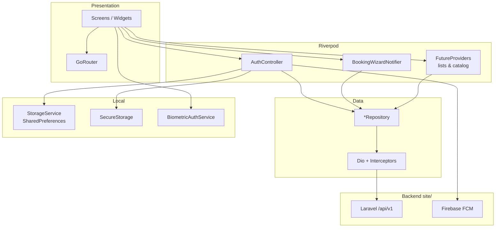
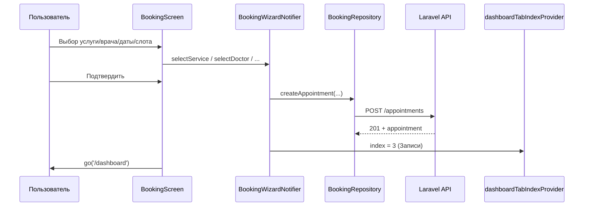
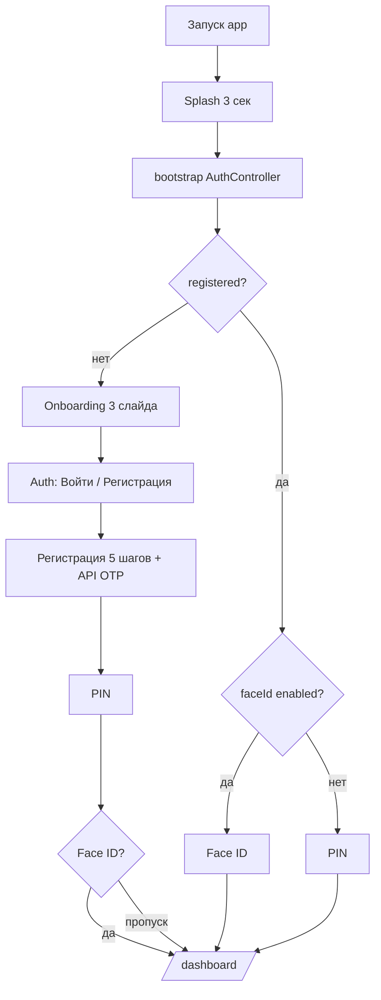
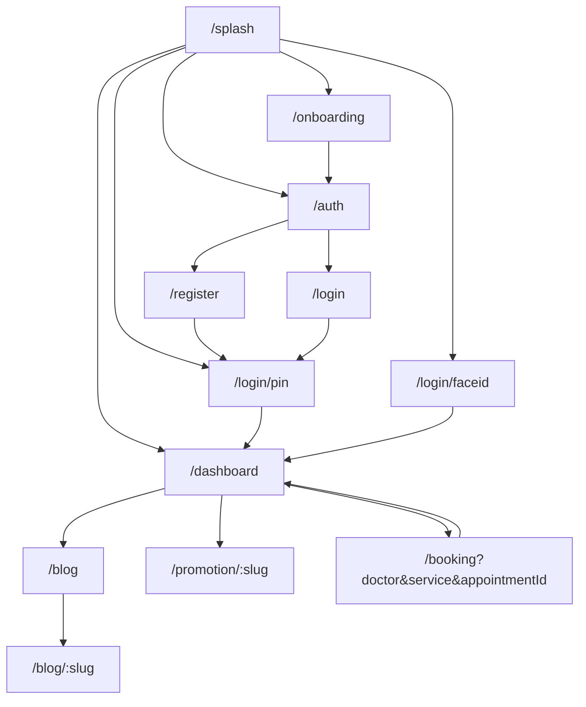
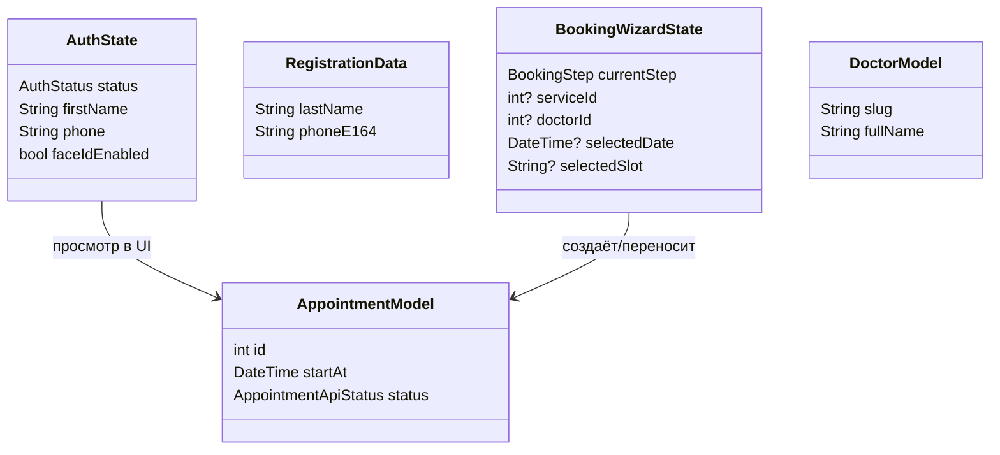
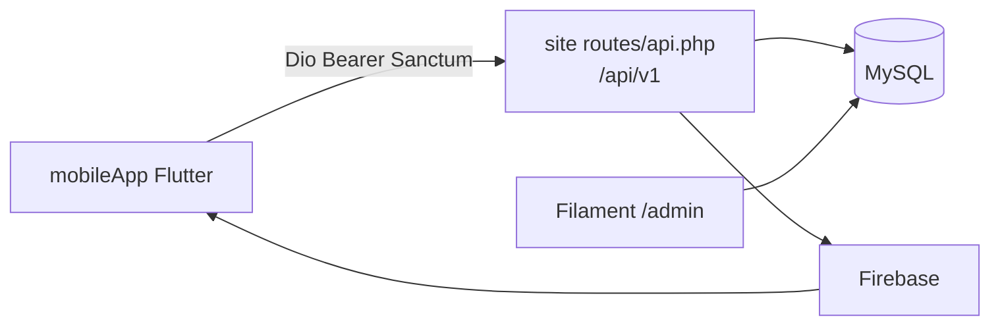

# Полное руководство по проекту «Маяк Здоровья» (mobileApp)

> ⚠️ **Если «ничего не понятно» — откройте [`GUIDEMOBILE-PODROBNO.md`](./GUIDEMOBILE-PODROBNO.md)** (~11 800 строк)  
> Там: §0–§14 с нуля, **§25 — все 85 `.dart` файлов** с кодом, построчно PIN/OTP/booking, FAQ, Mermaid.  
> **Этот файл (`GUIDEMOBILE.md`)** — справочник по всем 85 файлам + диаграммы (компактнее).

> **Путь:** `mobileApp/` — мобильное приложение Flutter (не HTML-сайт).  
> **Backend:** Laravel API `site/` → префикс **`/api/v1`**.  
> **Стек:** Flutter 3.10+ · Dart 3.10+ · Riverpod 2 · GoRouter 17 · Dio 5 · Firebase FCM.

| Документ | Для чего |
|----------|----------|
| **`GUIDEMOBILE-PODROBNO.md`** | Учебник с нуля, «разжёвано» |
| **`GUIDEMOBILE.md`** (вы здесь) | Полный каталог файлов + Mermaid + §14–15 |

---

## Содержание

1. [Введение](#1-введение)
2. [Структура проекта](#2-структура-проекта)
3. [Как работает приложение](#3-как-работает-приложение)
4. [Mermaid-диаграммы](#4-mermaid-диаграммы)
5. [Корень проекта](#5-корень-проекта)
6. [lib/ — каждый Dart-файл (85)](#6-lib--каждый-dart-файл-85)
7. [assets/](#7-assets)
8. [android/](#8-android)
9. [ios/](#9-ios)
10. [web/, windows/, linux/, macos/](#10-web-windows-linux-macos)
11. [Связь с backend site/](#11-связь-с-backend-site)
12. [Запуск и отладка](#12-запуск-и-отладка)
13. [Глоссарий](#13-глоссарий)
14. [**Последовательный разбор кода (учебник)**](#14-последовательный-разбор-кода-учебник) ← **читать для полного понимания**
15. [Остальные файлы lib/ — код и пояснения](#15-остальные-файлы-lib--код-и-пояснения)

---

> **Как учиться (рекомендуемый порядок):**  
> 1) **[`GUIDEMOBILE-PODROBNO.md`](./GUIDEMOBILE-PODROBNO.md)** §0–§7 — понять общую картину;  
> 2) [§14](#14-последовательный-разбор-кода-учебник) здесь — 15 шагов с кодом;  
> 3) [§15](#15-остальные-файлы-lib--код-и-пояснения);  
> 4) справочно [§6](#6-lib--каждый-dart-файл-85).

## 1. Введение

### 1.1. Назначение

Мобильное приложение — **личный кабинет пациента** и **витрина клиники**:

- регистрация и вход по SMS OTP;
- быстрый вход по PIN и Face ID / отпечатку;
- просмотр врачей, услуг, блога, акций;
- онлайн-запись и перенос приёма (мастер из 3–5 шагов);
- push-напоминания о приёме (Firebase);
- профиль и выход.

Администрирование контента — только в **web** (`site/admin`), не в приложении.

### 1.2. Архитектурный паттерн

| Слой | Технология | Папка |
|------|------------|-------|
| UI (экраны) | Flutter Widgets | `lib/features/**` |
| Навигация | GoRouter + redirect по auth | `lib/app/router.dart` |
| Состояние | Riverpod (Provider, StateNotifier, FutureProvider) | `*_providers.dart`, `*_controller.dart` |
| Сеть | Dio + interceptors | `lib/core/network/` |
| Репозитории | Классы `*Repository` | `lib/features/**/data/` |
| Локальные данные | SharedPreferences + SecureStorage | `lib/core/storage/` |
| Биометрия | local_auth | `lib/core/biometric/` |
| Push | FCM + flutter_local_notifications | `lib/core/notifications/` |

**Feature-first:** каждая фича (`auth`, `booking`, `dashboard`) содержит `data/`, `domain/`, `presentation/` (где нужно) и экраны.

### 1.3. Что не документируется построчно

- **`build/`** — артефакты сборки APK/AAB (тысячи файлов).
- **`android/.kotlin/errors/`** — логи Kotlin (временные).
- **`ios/Flutter/ephemeral/`**, **`macos/Flutter/ephemeral/`** — генерируются Flutter.
- **`GeneratedPluginRegistrant.*`** — автогенерация плагинов.

---

## 2. Структура проекта

```
mobileApp/
├── lib/                    # 85 Dart-файлов — вся логика приложения
│   ├── main.dart
│   ├── app/
│   ├── core/
│   └── features/
├── assets/images/          # Онбординг
├── android/                # Сборка Android + Firebase
├── ios/                    # Сборка iOS
├── web/                    # Web-оболочка (не основная цель)
├── windows/, linux/, macos/  # Desktop-таргеты Flutter
├── pubspec.yaml
└── GUIDEMOBILE.md (этот файл)
```

---

## 3. Как работает приложение

### 3.1. Запуск (`main.dart` → `App`)

1. `WidgetsFlutterBinding.ensureInitialized()`
2. Если `USE_FIREBASE=true` (по умолчанию): `Firebase.initializeApp()`, регистрация `firebaseMessagingBackgroundHandler`
3. `runApp(ProviderScope(child: App()))`
4. `App` подписывается на FCM, синхронизирует push-токен, слушает смену `AuthStatus` для повторной отправки токена после логина
5. `MaterialApp.router` с `GoRouter` из `appRouterProvider`

### 3.2. Auth lifecycle (`AuthStatus`)

| Статус | Значение | Куда ведёт redirect |
|--------|----------|---------------------|
| `unknown` | Старт, bootstrap не завершён | Только `/splash` |
| `unregistered` | Нет флага `mayak_registered` | `/auth`, `/onboarding`, `/register`, `/login` |
| `registeredLoggedOut` | Зарегистрирован, PIN/Face ID не пройдены | `/login/pin` или `/login/faceid` |
| `authenticated` | PIN/Face ID OK | `/dashboard`; публичные маршруты → редирект на dashboard |

**Bootstrap на splash:** читает SharedPreferences → при наличии токена в SecureStorage вызывает `GET /me` для актуализации профиля.

### 3.3. Регистрация (5 шагов UI)

1. **Персональные данные** — ФИО, дата рождения, пол  
2. **Телефон** — `POST /auth/register/request-otp`  
3. **OTP** — `POST /auth/register/verify` → access token в SecureStorage  
4. **PIN** — 4 цифры в SharedPreferences  
5. **Face ID** (опционально) — флаг `mayak_faceId` → `markAuthenticated()` → `/dashboard`

### 3.4. Повторный вход

- **PIN:** 4 цифры, сравнение с `mayak_pin`, блокировка после 5 ошибок  
- **Face ID:** `local_auth.authenticate()` → `markAuthenticated()`  
- **OTP-вход** (`/login`): телефон → OTP → снова настройка PIN/Face ID (через `Navigator`, не GoRouter)

### 3.5. Dashboard (5 вкладок, `IndexedStack`)

| Index | Вкладка | Экран |
|-------|---------|-------|
| 0 | Главная | `HomeScreen` |
| 1 | Врачи | `DoctorsScreen` |
| 2 | Услуги | `ServicesScreen` |
| 3 | Записи | `AppointmentsScreen` |
| 4 | Профиль | `ProfileScreen` |

Двойное нажатие «Назад» на dashboard — выход из приложения (SnackBar «Нажмите ещё раз»).

### 3.6. Booking wizard

**Шаги enum:** `service` → `doctor` → `date` → `slot` → `confirm`

Динамический список шагов (`BookingWizardNotifier._computeSteps`):
- если в URL нет `?service=` — показывается шаг выбора услуги;
- если нет `?doctor=` — шаг выбора врача;
- всегда: дата, слот, подтверждение.

**Deep link:** `/booking?doctor=slug&service=slug` — пропуск ранних шагов.  
**Перенос:** `/booking?appointmentId=123` — только date → slot → confirm → `POST /appointments/{id}/reschedule`.

### 3.7. Сеть

- База: `resolvedApiBaseUrl` из `--dart-define=API_BASE` или `API_BASE_URL` (дефолт `http://10.0.2.2:8000/api/v1` для Android-эмулятора).
- `_AuthInterceptor` добавляет `Authorization: Bearer {access_token}`.
- `_ErrorInterceptor` превращает 401 в `UnauthorizedException`, остальное — `ApiException` с текстом из Laravel `message` / `errors`.

### 3.8. Push-уведомления

1. FCM выдаёт токен → `PushTokenSync` → `POST /devices/register` с `{ fcm_token, platform }`
2. В foreground — дублирование через `LocalNotificationsService`
3. Tap по уведомлению → `NotificationRouter` (часть маршрутов `/news/{id}` **не зарегистрирована** в GoRouter — известный пробел)

---

## 4. Mermaid-диаграммы

### 4.1. Архитектура слоёв



### 4.2. Поток данных (создание записи)



### 4.3. Пользовательский путь (первый запуск)



### 4.4. Карта навигации (GoRouter)



### 4.5. Модели данных (клиент)



---

## 5. Корень проекта

### `pubspec.yaml`
**Роль:** манифест Flutter-пакета `flutter_application_diplom` v0.1.0.

**Зависимости (группы):**
- UI: `flutter_animate`, `flutter_svg`, `google_fonts`, `smooth_page_indicator`
- Навигация: `go_router`
- State: `flutter_riverpod`
- API: `dio`
- Storage: `shared_preferences`, `flutter_secure_storage`, `local_auth` (+ platform)
- Push: `firebase_core`, `firebase_messaging`, `flutter_local_notifications`
- HTML: `flutter_html`, `html`

**Важно:** в `flutter:` секции **нет** объявления `assets:` — изображения онбординга подключаются по полному пути в коде (`assets/images/...`); для production стоит добавить assets в pubspec.

### `pubspec.lock`
Зафиксированные версии всех транзитивных пакетов. Не редактировать вручную.

### `analysis_options.yaml`
Правила линтера Dart (`flutter_lints`). Включает `package:flutter_lints/flutter.yaml`.

### `.metadata`
Версия Flutter SDK, платформы проекта — для `flutter create` совместимости.

### `.gitignore`
Исключает `.dart_tool/`, `build/`, `.flutter-plugins`, `local.properties`, и т.д.

### `.flutter-plugins-dependencies`
Автогенерируемый список нативных плагинов и их путей.

### `README.md`
Шаблон Flutter по умолчанию — **не описывает** приложение клиники.

---

## 6. lib/ — каждый Dart-файл (85)

Ниже — **все** файлы в `lib/`. Формат: путь → назначение → ключевые символы → связи → API (если есть).

---

### 6.1. `lib/main.dart`

| | |
|---|---|
| **Содержимое** | `async main()`, инициализация Firebase, background handler, `ProviderScope` |
| **Роль** | Единственная точка входа Dart |
| **Ключевой код** | `FirebaseMessaging.onBackgroundMessage(firebaseMessagingBackgroundHandler)` — обработка push когда app в фоне |
| **Связи** | → `app/app.dart`, `core/firebase_config.dart`, `firebase_messaging_service.dart` |
| **API** | — |

---

### 6.2. `lib/app/`

#### `lib/app/app.dart`

| | |
|---|---|
| **Тип** | `ConsumerWidget` — корень UI |
| **Роль** | `MaterialApp.router`, тема (#4682B4), locale `ru_RU`, инициализация push |
| **Ключевое** | `ref.watch(notificationControllerProvider)` — side-effect запуск FCM; `ref.listen(authControllerProvider)` → `resendAfterLogin()` |
| **Связи** | `router.dart`, `auth_controller`, `notifications/providers` |

#### `lib/app/router.dart`

| | |
|---|---|
| **Тип** | GoRouter + auth redirect |
| **Роль** | Все маршруты приложения, guard по `AuthStatus` |
| **Ключевое** | `_AuthRefreshNotifier` слушает `authControllerProvider` и вызывает `notifyListeners()` для пересчёта redirect |
| **Маршруты** | `/splash`, `/onboarding`, `/auth`, `/register`, `/login`, `/login/pin`, `/login/faceid`, `/dashboard`, `/blog`, `/blog/:slug`, `/promotion/:slug`, `/booking` |
| **Переходы** | `_buildPage` — fade 280ms; `_buildPageSlide` — slide-up 320ms (booking) |
| **Query booking** | `doctor`, `service`, `appointmentId` |
| **Связи** | Все feature-экраны |

---

### 6.3. `lib/core/`

#### `lib/core/firebase_config.dart`

```dart
const bool kFirebaseEnabled = bool.fromEnvironment('USE_FIREBASE', defaultValue: true);
```

Отключение: `flutter run --dart-define=USE_FIREBASE=false`.

#### `lib/core/constants/app_colors.dart`
Палитра UI: `primary` #4682B4, градиенты header, фоны карточек, статусы (success/warning). Используется во всех feature-экранах.

#### `lib/core/constants/app_text_styles.dart`
Стили текста через `GoogleFonts` (Inter): заголовки, body, caption. Зависит от `app_colors.dart`.

#### `lib/core/network/api_exception.dart`

| Класс | Когда |
|-------|-------|
| `ApiException` | Ошибка API с `message`, `statusCode` |
| `NetworkException` | Нет сети |
| `UnauthorizedException` | HTTP 401 |

#### `lib/core/network/dio_client.dart`

| | |
|---|---|
| **Провайдер** | `dioProvider` → singleton `Dio` |
| **baseUrl** | `resolvedApiBaseUrl` — см. комментарии про `10.0.2.2`, `adb reverse` |
| **Interceptors** | `_AuthInterceptor` — Bearer из SecureStorage; `_ErrorInterceptor` — маппинг ошибок |
| **Таймауты** | connect 15s, receive/send 20s |
| **Связи** | Все `*Repository` через `ref.read(dioProvider)` |

#### `lib/core/storage/storage_service.dart`

**SharedPreferences keys:**

| Key | Тип | Назначение |
|-----|-----|------------|
| `mayak_registered` | bool | Прошёл регистрацию |
| `mayak_firstName` | String | Имя |
| `mayak_lastName` | String | Фамилия |
| `mayak_middleName` | String | Отчество |
| `mayak_phone` | String | Телефон |
| `mayak_birthDate` | String | Дата рождения |
| `mayak_gender` | String | Пол |
| `mayak_pin` | String | PIN (4 цифры) |
| `mayak_faceId` | bool | Включён быстрый вход по биометрии |

Методы: `saveRegistration`, `isRegistered`, `getPin`/`setPin`, `isFaceIdEnabled`/`setFaceIdEnabled`, `clear()` при logout.

#### `lib/core/storage/secure_storage.dart`

| Key | Назначение |
|-----|------------|
| `auth_access_token` | Sanctum Bearer |
| `auth_refresh_token` | Refresh (если API вернёт) |

`FlutterSecureStorage` с encrypted shared preferences на Android.

#### `lib/core/storage/providers.dart`

| Provider | Тип |
|----------|-----|
| `storageServiceProvider` | `StorageService` |
| `secureStorageProvider` | `SecureStorage` |
| `biometricAuthServiceProvider` | `BiometricAuthService` |

#### `lib/core/biometric/biometric_auth_service.dart`
Обёртка `LocalAuthentication`: `canCheckBiometrics`, `authenticate()` с русскими `AndroidAuthMessages` / `IOSAuthMessages` (`kLocalAuthMessagesRu`).

#### `lib/core/widgets/primary_button.dart`
Filled кнопка на всю ширину, цвет `AppColors.primary`, disabled state.

#### `lib/core/widgets/outline_button.dart`
`AppOutlineButton` — контурная кнопка для вторичных действий.

#### `lib/core/widgets/clinic_logo.dart`
`ClinicLogo` — SVG/виджет логотипа на splash, auth, login.

#### `lib/core/notifications/notification_payload.dart`
`NotificationPayload.fromMap` — парсит `data` из FCM: `type`, `appointment_id`, `slug`, и т.д.

#### `lib/core/notifications/firebase_messaging_service.dart`

| | |
|---|---|
| **Роль** | Permission, `onMessage`, `onMessageOpenedApp`, `getInitialMessage`, token refresh |
| **Top-level** | `firebaseMessagingBackgroundHandler` — `@pragma('vm:entry-point')` для isolate |
| **Связи** | `notification_payload.dart` |

#### `lib/core/notifications/local_notifications_service.dart`
Канал Android `mayak_default`, показ notification когда app на переднем плане (иначе FCM не показывает banner на Android).

#### `lib/core/notifications/notification_router.dart`
`handleTap(BuildContext, payload)` → `context.go(...)` по типу push. **Внимание:** маршрут `/news/{id}` не объявлен в `router.dart`.

#### `lib/core/notifications/providers.dart`

| Provider / класс | Роль |
|------------------|------|
| `notificationControllerProvider` | Инициализация FCM + local notifications |
| `pushTokenSyncProvider` | `PushTokenSync` — отправка FCM token на backend |
| `PushTokenSync.resendAfterLogin()` | Повтор `POST /devices/register` с Bearer |

**API:** `POST /devices/register` body: `{ "fcm_token": "...", "platform": "android"|"ios" }`

---

### 6.4. `lib/features/splash/`

#### `lib/features/splash/splash_screen.dart`

| | |
|---|---|
| **UI** | Анимация волн (`CustomPainter`), логотип, 3 секунды |
| **Логика** | `initState` → `authController.bootstrap()` → по `AuthStatus` `context.go(...)` |
| **Навигация** | unregistered → onboarding; registeredLoggedOut → pin/faceid; authenticated → dashboard |
| **Связи** | `auth_controller`, `clinic_logo` |

---

### 6.5. `lib/features/onboarding/`

#### `lib/features/onboarding/onboarding_screen.dart`

| | |
|---|---|
| **UI** | `PageView` 3 слайда, `smooth_page_indicator`, кнопка «Начать» |
| **Контент** | Тексты про клинику; изображения `assets/images/onboarding/onboarding_1.png` (+ внешние URL в коде) |
| **Действие** | `context.go('/auth')` |
| **Связи** | `app_colors` |

---

### 6.6. `lib/features/auth/`

#### `lib/features/auth/auth_screen.dart`
Экран выбора: **«Войти»** → `/login`, **«Зарегистрироваться»** → `/register`. Виджеты: `ClinicLogo`, `PrimaryButton`, `AppOutlineButton`.

#### `lib/features/auth/domain/auth_state.dart`

```dart
enum AuthStatus { unknown, unregistered, registeredLoggedOut, authenticated }

class AuthState {
  final AuthStatus status;
  final String? firstName, lastName, middleName, phone, birthDate, gender;
  final bool faceIdEnabled;
  // copyWith(...)
}
```

#### `lib/features/auth/data/patient_auth_repository.dart`

| Метод | API |
|-------|-----|
| `registerRequestOtp(phone, ...)` | `POST /auth/register/request-otp` |
| `registerVerify(phone, code, ...)` | `POST /auth/register/verify` |
| `loginRequestOtp(phone)` | `POST /auth/login/request-otp` |
| `loginVerify(phone, code)` | `POST /auth/login/verify` |
| `me()` | `GET /me` |
| `updateMe(...)` | `PATCH /me` |
| `logout()` | `POST /me/logout` |

Парсит JSON пациента в `Map` / модель для `AuthController`.

#### `lib/features/auth/data/patient_auth_providers.dart`
`patientAuthRepositoryProvider` = `PatientAuthRepository(ref.read(dioProvider))`.

#### `lib/features/auth/presentation/controllers/auth_controller.dart`

| Метод | Действие |
|-------|----------|
| `bootstrap()` | prefs + optional `GET /me` |
| `completeRegistrationWithApiToken` | token + saveRegistration → `registeredLoggedOut` |
| `completeLoginWithApiToken` | token + profile → `registeredLoggedOut` |
| `markAuthenticated()` | → `authenticated` |
| `verifyPin(pin)` | сравнение с storage, счётчик ошибок |
| `setPin` / `enableFaceId` / `disableFaceId` | локальные настройки |
| `logout()` | API logout + `clear()` prefs/secure |
| `updateProfile` | `PATCH /me` |

`authControllerProvider` = `StateNotifierProvider<AuthController, AuthState>`.

---

### 6.7. `lib/features/registration/`

#### `lib/features/registration/registration_screen.dart`
`ConsumerStatefulWidget`: `AnimatedSwitcher` между шагами 1–5 по `registrationController.currentStep`.

#### `lib/features/registration/domain/registration_data.dart`
Mutable DTO: ФИО, `birthDate`, `gender`, `phone`, `phoneE164` getter (формат +375…).

#### `lib/features/registration/presentation/controllers/registration_controller.dart`
`StateNotifier` шага (1–5) и ссылки на `RegistrationData`. Методы `nextStep`, `prevStep`, `update(...)`.

#### `lib/features/registration/steps/step1_personal.dart`
Форма: фамилия, имя, отчество, DatePicker, Dropdown пола. Валидация непустых полей → `nextStep`.

#### `lib/features/registration/steps/step2_phone.dart`
Маска BY телефона, кнопка «Получить код» → `PatientAuthRepository.registerRequestOtp` с данными из `RegistrationData`.

#### `lib/features/registration/steps/step3_otp.dart`
6 полей OTP (или одно поле), таймер повторной отправки, `registerVerify` → `authController.completeRegistrationWithApiToken`.

#### `lib/features/registration/steps/pin_setup.dart`
Двойной ввод PIN (создание + подтверждение), `_Numpad`, сохранение через `authController.setPin`.

#### `lib/features/registration/steps/face_id_setup.dart`
«Включить Face ID» / «Пропустить» → `enableFaceId` или пропуск → `markAuthenticated` → `go('/dashboard')`.

#### `lib/features/registration/steps/_reg_field.dart`
Стилизованное `TextFormField` для регистрации (label, error border).

#### `lib/features/registration/steps/_progress_bar.dart`
Линейный индикатор «Шаг X из 5».

#### `lib/features/registration/steps/_numpad.dart`
Сетка кнопок 0–9, backspace — переиспользуется в PIN-экранах.

---

### 6.8. `lib/features/login/`

#### `lib/features/login/login_screen.dart`
Табы или переключатель: режим телефона (`LoginPhoneScreen`) / OTP (`LoginOtpScreen`) через `loginFlowControllerProvider`.

#### `lib/features/login/presentation/controllers/login_flow_controller.dart`
`StateNotifier<int>` — текущий подшаг (1 = phone, 2 = otp).

#### `lib/features/login/login_phone.dart`
Ввод телефона → `loginRequestOtp` → переход на шаг 2.

#### `lib/features/login/login_otp.dart`
Verify OTP → `completeLoginWithApiToken` → **Navigator.push** `PinSetupScreen` → `FaceIdSetupScreen` (не через GoRouter).

#### `lib/features/login/login_pin.dart`
Ввод 4 цифр, `verifyPin`, ссылки «Face ID» / «Войти по номеру», блокировка 5 попыток.

#### `lib/features/login/login_face_id.dart`
Анимация сканера, автоматический вызов `biometricAuthService.authenticate()`, fallback на PIN.

---

### 6.9. `lib/features/dashboard/`

#### `lib/features/dashboard/dashboard_screen.dart`
`Scaffold` + `IndexedStack` + кастомный `_BottomNav`. `PopScope` / `WillPopScope` для double-back exit.

#### `lib/features/dashboard/dashboard_tab_provider.dart`
`StateProvider<int>` — индекс вкладки 0–4. Booking после успеха ставит `3`.

#### `lib/features/dashboard/home/home_screen.dart`
**Самый насыщенный экран:** промо-карусель, ближайшие записи (`upcomingAppointmentsProvider`), категории услуг, сетка врачей, блок блога, контакты клиники, кнопка «Записаться» → `/booking`. Много private widgets (`_PromoCard`, `_AppointmentChip`, …).

#### `lib/features/dashboard/profile/profile_screen.dart`
Аватар-инициалы, ФИО, телефон, пункты меню (редактировать, записи), **Выход** → `logout()` → `/auth`.

#### `lib/features/dashboard/profile/edit_profile_screen.dart`
Форма редактирования → `authController.updateProfile` → `PATCH /me`.

#### `lib/features/dashboard/doctors/doctor_models.dart`
`DoctorModel`, `DoctorDetailModel`, `SpecializationModel` — `fromJson` factory.

#### `lib/features/dashboard/doctors/doctors_repository.dart`
`fetchList()`, `fetchBySlug(slug)` → `GET /doctors`, `GET /doctors/{slug}`.

#### `lib/features/dashboard/doctors/doctors_providers.dart`

| Provider | Тип |
|----------|-----|
| `doctorsListProvider` | `FutureProvider<List<DoctorModel>>` |
| `doctorDetailProvider(slug)` | `FutureProvider.family` |
| `doctorsSubNavProvider` | вложенная навигация list↔detail внутри вкладки |

#### `lib/features/dashboard/doctors/doctors_screen.dart`
~1900 строк: список с фильтром по специализации, поиск, детальный экран с отзывами, кнопка «Записаться» с `?doctor={slug}`.

#### `lib/features/dashboard/widgets/doctor_grid_card.dart`
Компактная карточка: фото, имя, специализация, рейтинг — для home и services.

#### `lib/features/dashboard/services/services_data.dart`
`ServiceCategory`, `ServiceOffer` — модели с `fromJson`, fallback image URL.

#### `lib/features/dashboard/services/services_repository.dart`
`GET /service-directions`, `GET /service-directions/{slug}/services`.

#### `lib/features/dashboard/services/services_providers.dart`
`serviceDirectionsProvider`, `servicesForDirectionProvider(slug)`, `serviceDetailProvider`, связка с `bookingCatalogRepository` для врачей услуги.

#### `lib/features/dashboard/services/services_screen.dart`
Трёхуровневая навигация: направления → список услуг → деталь с ценой/описанием и CTA запись.

#### `lib/features/dashboard/appointments/appointment_model.dart`
`AppointmentModel`, вложенные `AppointmentDoctor`, `AppointmentService`, enum `AppointmentApiStatus` (new, processing, completed, cancelled).

#### `lib/features/dashboard/appointments/appointments_repository.dart`

| Метод | API |
|-------|-----|
| `fetchAll()` | `GET /appointments` |
| `cancel(id, reason?)` | `POST /appointments/{id}/cancel` |
| `reschedule(id, startAt)` | `POST /appointments/{id}/reschedule` |

#### `lib/features/dashboard/appointments/appointments_providers.dart`
`upcomingAppointmentsProvider`, `pastAppointmentsProvider` — фильтрация по дате/статусу на клиенте.

#### `lib/features/dashboard/appointments/appointments_screen.dart`
TabBar «Предстоящие» / «Прошедшие», карточки с датой/врачом/услугой, swipe или кнопки отмена/перенос, bottom sheet деталей, `go('/booking?appointmentId=')`.

#### `lib/features/dashboard/blog/article_model.dart`
`ArticleModel`: slug, title, excerpt, imageUrl, publishedAt, category.

#### `lib/features/dashboard/blog/blog_repository.dart`
`GET /articles`, `GET /article-categories`, `GET /articles/{slug}`.

#### `lib/features/dashboard/blog/blog_providers.dart`
`blogListProvider`, `articleCategoriesProvider`, `articleDetailProvider(slug)`.

#### `lib/features/dashboard/blog/blog_screen.dart`
Список статей, чипы категорий, `go('/blog/$slug')`.

#### `lib/features/dashboard/blog/article_screen.dart`
Заголовок, дата, `HtmlProse` для body HTML с backend.

#### `lib/features/dashboard/promotions/promotion_model.dart`
`PromotionModel`, `resolveImageUrl` — относительные пути дополняются origin API.

#### `lib/features/dashboard/promotions/promotions_repository.dart`
`GET /promotions`, `GET /promotions/{slug}`.

#### `lib/features/dashboard/promotions/promotions_providers.dart`
`promotionsListProvider`, `promotionDetailProvider(slug)`.

#### `lib/features/dashboard/promotions/promotion_detail_screen.dart`
Деталь акции, HTML описание, период действия.

#### `lib/features/dashboard/common/html_prose.dart`
Обёртка `flutter_html` с `onLinkTap`, базовый URL для относительных ссылок из Laravel.

---

### 6.10. `lib/features/booking/`

#### `lib/features/booking/data/booking_models.dart`
`BookingServiceItem` (id, name, slug, duration), `BookingDoctorItem` (id, slug, fullName, photo).

#### `lib/features/booking/data/booking_catalog_repository.dart`

| Метод | API | Query |
|-------|-----|-------|
| `fetchServices` | `GET /booking/services` | doctor_id? |
| `fetchDoctors` | `GET /booking/doctors` | service_id? |
| `fetchDates` | `GET /booking/dates` | doctor_id, service_id |
| `fetchSlots` | `GET /booking/slots` | doctor_id, service_id, date |

#### `lib/features/booking/data/booking_repository.dart`
`createAppointment(...)` → `POST /appointments` с `doctor_id`, `service_id`, `starts_at`, `note`.

#### `lib/features/booking/data/booking_providers.dart`
Family FutureProviders: `bookingServicesProvider`, `bookingDoctorsProvider`, `bookingDatesProvider`, `bookingSlotsProvider` — autoDispose при смене параметров.

#### `lib/features/booking/state/booking_wizard_state.dart`

```dart
enum BookingStep { service, doctor, date, slot, confirm }
class BookingWizardState { ... copyWith, initial from query params }
```

#### `lib/features/booking/state/booking_wizard_notifier.dart`
`Notifier<BookingWizardState>`:
- `_computeSteps()` — динамический pipeline;
- `selectService` / `selectDoctor` / `selectDate` / `selectSlot`;
- `submit()` — create или reschedule;
- invalidation providers после успеха.

#### `lib/features/booking/presentation/booking_screen.dart`
`BookingProgressBar` + `AnimatedSwitcher` на текущий step widget. `PopScope` — назад по шагам.

#### `lib/features/booking/presentation/widgets/booking_progress_bar.dart`
Сегменты по `state.steps.length`, подсветка текущего.

#### `lib/features/booking/presentation/steps/booking_service_step.dart`
`ListView` услуг из `bookingServicesProvider`, выбор → notifier.

#### `lib/features/booking/presentation/steps/booking_doctor_step.dart`
Список врачей с аватарами, фильтр по выбранной услуге.

#### `lib/features/booking/presentation/steps/booking_date_step.dart`
`_MonthCalendar` — доступные даты с API, недоступные disabled.

#### `lib/features/booking/presentation/steps/booking_slot_step.dart`
Сетка слотов времени (Chip/Button), loading/error states.

#### `lib/features/booking/presentation/steps/booking_confirm_step.dart`
Сводка: врач, услуга, дата/время, поле заметки, кнопка «Подтвердить» → `submit()`.

---

## 7. assets/

### `assets/images/onboarding/onboarding_1.png`
Растровое изображение для первого слайда онбординга.  
**Связь:** `OnboardingScreen` → `Image.asset('assets/images/onboarding/onboarding_1.png')`.  
**Рекомендация:** добавить в `pubspec.yaml` секцию `flutter: assets:`.

---

## 8. android/

### `android/settings.gradle.kts`
Подключение Flutter Gradle plugin, репозитории.

### `android/build.gradle.kts`
Root buildscript, версии AGP.

### `android/gradle.properties`
 JVM args, AndroidX.

### `android/gradle/wrapper/gradle-wrapper.properties`
Версия Gradle wrapper.

### `android/gradlew`, `gradlew.bat`
Скрипты запуска Gradle.

### `android/local.properties`
**Локальный** путь к Flutter SDK и Android SDK (не в git).

### `android/.gitignore`
Игнор `local.properties`, `.gradle/`, build outputs.

### `android/app/build.gradle.kts`

| Параметр | Значение |
|----------|----------|
| `applicationId` | `com.example.flutter_application_diplom` |
| `namespace` | то же |
| Plugins | `com.google.gms.google-services` (Firebase) |
| Java/Kotlin | 17, coreLibraryDesugaring |
| Release signing | пока debug keys (TODO в комментарии) |

### `android/app/google-services.json`
Конфиг Firebase Android (package name должен совпадать с applicationId). **Секретный файл** — не публиковать в открытых репозиториях.

### `android/app/src/main/AndroidManifest.xml`

| Элемент | Назначение |
|---------|------------|
| `INTERNET` | API и FCM |
| `USE_BIOMETRIC` | Face ID / fingerprint |
| `usesCleartextTraffic="true"` | HTTP к dev API без TLS |
| `MainActivity` | `singleTop`, `adjustResize` для клавиатуры |

### `android/app/src/main/kotlin/.../MainActivity.kt`
Стандартная `FlutterActivity` — точка входа Android.

### `android/app/src/main/java/.../GeneratedPluginRegistrant.java`
Автогенерация регистрации Flutter-плагинов.

### `android/app/src/main/res/values/styles.xml`
`LaunchTheme`, `NormalTheme` — splash и post-init.

### `android/app/src/main/res/values-night/styles.xml`
Тёмная тема launch (если система в dark mode).

### `android/app/src/main/res/drawable/launch_background.xml`
Splash drawable до первого кадра Flutter.

### `android/app/src/main/res/drawable-v21/launch_background.xml`
Вариант для API 21+.

### `android/app/src/main/res/mipmap-*/ic_launcher.png`
Иконки приложения (hdpi … xxxhdpi).

### `android/app/src/debug/AndroidManifest.xml`
Debug-специфичные overlay (обычно INTERNET уже в main).

### `android/app/src/profile/AndroidManifest.xml`
Profile mode manifest.

---

## 9. ios/

### `ios/Runner/Info.plist`

| Ключ | Назначение |
|------|------------|
| `NSFaceIDUsageDescription` | Текст для диалога Face ID |
| `NSAppTransportSecurity` | Разрешение HTTP / local network для dev |

### `ios/Runner/AppDelegate.swift`
`@UIApplicationMain`, регистрация Flutter, Firebase (если добавлен в Podfile).

### `ios/Runner/Main.storyboard`, `LaunchScreen.storyboard`
Нативный launch до Flutter.

### `ios/Runner/Assets.xcassets/AppIcon.appiconset/*`
Иконки приложения всех размеров + `Contents.json`.

### `ios/Runner/Assets.xcassets/LaunchImage.imageset/*`
Статичный launch image.

### `ios/Runner/GeneratedPluginRegistrant.h/.m`
Автогенерация плагинов.

### `ios/Runner/Runner-Bridging-Header.h`
Bridging header для Swift/ObjC.

### `ios/RunnerTests/RunnerTests.swift`
Заглушка unit test target.

### `ios/Flutter/*.xcconfig`
`Debug.xcconfig`, `Release.xcconfig`, `Generated.xcconfig` — пути Flutter.

### `ios/Runner.xcodeproj/*`
Проект Xcode, scheme Runner.

### `ios/Runner.xcworkspace/*`
Workspace с Pods (после `pod install`).

### `ios/.gitignore`
Pods, ephemeral, DerivedData.

---

## 10. web/, windows/, linux/, macos/

Стандартные **Flutter platform folders** для сборки не на Android/iOS.

| Платформа | Ключевые файлы | Роль |
|-----------|----------------|------|
| **web/** | `index.html`, `manifest.json`, `icons/` | PWA-оболочка; не основной target клиники |
| **windows/** | `runner/main.cpp`, `flutter_window.cpp`, `CMakeLists.txt` | Desktop Windows |
| **linux/** | `runner/main.cc`, `my_application.cc` | Desktop Linux |
| **macos/** | `Runner/AppDelegate.swift`, `MainFlutterWindow.swift` | Desktop macOS |

Все содержат `generated_plugin_registrant.*` — автогенерация.

---

## 11. Связь с backend site/



| Функция app | Endpoint site | Controller site |
|-------------|---------------|-----------------|
| OTP регистрация | `POST /auth/register/*` | `PatientAuthController` |
| OTP вход | `POST /auth/login/*` | `PatientAuthController` |
| Профиль | `GET/PATCH /me` | `PatientApiController` |
| FCM token | `POST /devices/register` | `DeviceController` |
| Каталог записи | `GET /booking/*` | `BookingCatalogController` |
| Записи | `POST/GET /appointments` | `AppointmentApiController` |
| Врачи | `GET /doctors` | `DoctorController` |
| Услуги | `GET /service-directions` | `ServiceDirectionController` |
| Блог | `GET /articles` | `ArticleController` |
| Акции | `GET /promotions` | `PromotionController` |

**Совпадение моделей:** `Appointment.status`, `start_at`, `doctor_id`, `service_id` — см. `site/app/Models/Appointment.php` и `appointment_model.dart`.

---

## 12. Запуск и отладка

### Установка

```bash
cd mobileApp
flutter pub get
```

### Backend должен слушать 0.0.0.0

```bash
cd site
php artisan serve --host=0.0.0.0 --port=8000
php artisan queue:work
```

### Запуск на эмуляторе Android

```bash
flutter run --dart-define=API_BASE_URL=http://10.0.2.2:8000/api/v1
```

### Физическое устройство (Wi‑Fi)

```bash
flutter run --dart-define=API_BASE_URL=http://192.168.x.x:8000/api/v1
```

### USB + adb reverse

```bash
adb reverse tcp:8000 tcp:8000
flutter run --dart-define=API_BASE_URL=http://127.0.0.1:8000/api/v1
```

### Без Firebase

```bash
flutter run --dart-define=USE_FIREBASE=false
```

### Release APK

```bash
flutter build apk --release --dart-define=API_BASE_URL=https://your-clinic.by/api/v1
```

---

## 13. Глоссарий

| Термин | В приложении |
|--------|----------------|
| **Riverpod** | DI и reactive state |
| **GoRouter** | Декларативная навигация + redirect |
| **ProviderScope** | Корень дерева провайдеров |
| **FutureProvider** | Асинхронная загрузка списков с API |
| **StateNotifier** | Auth, Registration, Booking wizard |
| **Dio** | HTTP-клиент |
| **Sanctum token** | `auth_access_token` в SecureStorage |
| **PIN** | 4 цифры локально, не на сервере |
| **Bootstrap** | Восстановление сессии на splash |
| **Wizard** | Многошаговый booking flow |
| **autoDispose** | Сброс кэша provider при уходе с экрана |

---

## Приложение: полный список Dart-файлов (85)

```
lib/main.dart
lib/app/app.dart
lib/app/router.dart
lib/core/firebase_config.dart
lib/core/constants/app_colors.dart
lib/core/constants/app_text_styles.dart
lib/core/network/api_exception.dart
lib/core/network/dio_client.dart
lib/core/storage/storage_service.dart
lib/core/storage/secure_storage.dart
lib/core/storage/providers.dart
lib/core/biometric/biometric_auth_service.dart
lib/core/widgets/primary_button.dart
lib/core/widgets/outline_button.dart
lib/core/widgets/clinic_logo.dart
lib/core/notifications/notification_payload.dart
lib/core/notifications/firebase_messaging_service.dart
lib/core/notifications/local_notifications_service.dart
lib/core/notifications/notification_router.dart
lib/core/notifications/providers.dart
lib/features/splash/splash_screen.dart
lib/features/onboarding/onboarding_screen.dart
lib/features/auth/auth_screen.dart
lib/features/auth/domain/auth_state.dart
lib/features/auth/data/patient_auth_repository.dart
lib/features/auth/data/patient_auth_providers.dart
lib/features/auth/presentation/controllers/auth_controller.dart
lib/features/registration/registration_screen.dart
lib/features/registration/domain/registration_data.dart
lib/features/registration/presentation/controllers/registration_controller.dart
lib/features/registration/steps/step1_personal.dart
lib/features/registration/steps/step2_phone.dart
lib/features/registration/steps/step3_otp.dart
lib/features/registration/steps/pin_setup.dart
lib/features/registration/steps/face_id_setup.dart
lib/features/registration/steps/_reg_field.dart
lib/features/registration/steps/_progress_bar.dart
lib/features/registration/steps/_numpad.dart
lib/features/login/login_screen.dart
lib/features/login/presentation/controllers/login_flow_controller.dart
lib/features/login/login_phone.dart
lib/features/login/login_otp.dart
lib/features/login/login_pin.dart
lib/features/login/login_face_id.dart
lib/features/dashboard/dashboard_screen.dart
lib/features/dashboard/dashboard_tab_provider.dart
lib/features/dashboard/home/home_screen.dart
lib/features/dashboard/profile/profile_screen.dart
lib/features/dashboard/profile/edit_profile_screen.dart
lib/features/dashboard/doctors/doctor_models.dart
lib/features/dashboard/doctors/doctors_repository.dart
lib/features/dashboard/doctors/doctors_providers.dart
lib/features/dashboard/doctors/doctors_screen.dart
lib/features/dashboard/widgets/doctor_grid_card.dart
lib/features/dashboard/services/services_data.dart
lib/features/dashboard/services/services_repository.dart
lib/features/dashboard/services/services_providers.dart
lib/features/dashboard/services/services_screen.dart
lib/features/dashboard/appointments/appointment_model.dart
lib/features/dashboard/appointments/appointments_repository.dart
lib/features/dashboard/appointments/appointments_providers.dart
lib/features/dashboard/appointments/appointments_screen.dart
lib/features/dashboard/blog/article_model.dart
lib/features/dashboard/blog/blog_repository.dart
lib/features/dashboard/blog/blog_providers.dart
lib/features/dashboard/blog/blog_screen.dart
lib/features/dashboard/blog/article_screen.dart
lib/features/dashboard/promotions/promotion_model.dart
lib/features/dashboard/promotions/promotions_repository.dart
lib/features/dashboard/promotions/promotions_providers.dart
lib/features/dashboard/promotions/promotion_detail_screen.dart
lib/features/dashboard/common/html_prose.dart
lib/features/booking/data/booking_models.dart
lib/features/booking/data/booking_catalog_repository.dart
lib/features/booking/data/booking_repository.dart
lib/features/booking/data/booking_providers.dart
lib/features/booking/state/booking_wizard_state.dart
lib/features/booking/state/booking_wizard_notifier.dart
lib/features/booking/presentation/booking_screen.dart
lib/features/booking/presentation/widgets/booking_progress_bar.dart
lib/features/booking/presentation/steps/booking_service_step.dart
lib/features/booking/presentation/steps/booking_doctor_step.dart
lib/features/booking/presentation/steps/booking_date_step.dart
lib/features/booking/presentation/steps/booking_slot_step.dart
lib/features/booking/presentation/steps/booking_confirm_step.dart
```

---

## 14. Последовательный разбор кода (учебник)

Изучайте проект **в этом порядке** — каждый шаг опирается на предыдущий. Код приведён из репозитория; комментарии `// →` объясняют строки.

### Карта шагов

| Шаг | Файл | Что поймёте |
|-----|------|-------------|
| 1 | `main.dart` | Старт, Firebase, Riverpod |
| 2 | `app.dart` | Корневой виджет, push, тема |
| 3 | `router.dart` | Маршруты и защита по auth |
| 4 | `auth_state.dart` | 4 статуса пользователя |
| 5 | `storage_service.dart` + `secure_storage.dart` | Где лежат PIN и токен |
| 6 | `dio_client.dart` | HTTP к Laravel |
| 7 | `patient_auth_repository.dart` | OTP API |
| 8 | `auth_controller.dart` | Мозг авторизации |
| 9 | `splash_screen.dart` | Первый экран и bootstrap |
| 10 | `registration_screen.dart` | Мастер регистрации |
| 11 | `step3_otp.dart` | Верификация SMS |
| 12 | `login_pin.dart` | PIN и блокировка |
| 13 | `booking_wizard_state.dart` + `notifier` | Визард записи |
| 14 | `booking_repository.dart` | POST записи |
| 15 | `providers.dart` (notifications) | FCM → backend |

---

### Шаг 1. `lib/main.dart` — точка входа

```dart
Future<void> main() async {
  WidgetsFlutterBinding.ensureInitialized();  // → обязательно до async/ Firebase

  if (kFirebaseEnabled) {                     // → из firebase_config.dart
    try {
      await Firebase.initializeApp();
      FirebaseMessaging.onBackgroundMessage(  // → top-level handler в фоне
        firebaseMessagingBackgroundHandler,
      );
    } catch (e, st) { ... }
  }

  runApp(const ProviderScope(child: App()));  // → Riverpod + корень UI
}
```

**Логика:**
1. Без `ensureInitialized()` плагины (Firebase, SharedPreferences) могут падать.
2. `kFirebaseEnabled` = `bool.fromEnvironment('USE_FIREBASE', defaultValue: true)` — можно отключить при разработке без Google Services.
3. `ProviderScope` — **все** `ref.watch` / `ref.read` работают только внутри дерева ниже `App`.
4. Background handler **не** может использовать `ref` — только чистый Dart.

---

### Шаг 2. `lib/app/app.dart` — приложение «Маяк Здоровья»

```dart
class App extends ConsumerWidget {
  @override
  Widget build(BuildContext context, WidgetRef ref) {
    ref.watch(notificationControllerProvider);  // → side-effect: старт FCM
    ref.watch(pushTokenSyncProvider);           // → отправка токена на сервер

    ref.listen<AuthState>(authControllerProvider, (previous, current) {
      if (current.status == AuthStatus.authenticated &&
          previous?.status != AuthStatus.authenticated) {
        ref.read(pushTokenSyncProvider).resendAfterLogin();  // → Bearer уже есть
      }
    });

    final router = ref.watch(appRouterProvider);

    return MaterialApp.router(
      routerConfig: router,
      locale: const Locale('ru', 'RU'),
      theme: ThemeData(
        colorScheme: ColorScheme.fromSeed(seedColor: Color(0xFF4682B4)),
        ...
      ),
    );
  }
}
```

**Почему `ref.watch` на notifications без присваивания?**  
Провайдер при первом `watch` запускает `Future(() { local.init(); fcm.init(); })` — инициализация push **один раз** при старте.

**Почему `ref.listen` на auth?**  
После PIN/Face ID статус меняется на `authenticated` — нужно **повторно** отправить FCM-токен с заголовком `Authorization`, иначе backend не свяжет push с пациентом.

---

### Шаг 3. `lib/app/router.dart` — навигация и «охранник»

**Ключ: `redirect`** — вызывается при каждой смене маршрута и при `notifyListeners()` от `_AuthRefreshNotifier`.

```dart
redirect: (context, state) {
  final auth = ref.read(authControllerProvider);
  final status = auth.status;
  final loc = state.matchedLocation;

  if (status == AuthStatus.unknown) {
    return loc == '/splash' ? null : '/splash';  // → null = разрешить переход
  }

  const publicRoutes = ['/splash', '/onboarding', '/auth', '/register',
      '/login', '/login/pin', '/login/faceid'];
  final isPublic = publicRoutes.any((r) => loc.startsWith(r));

  if (status == AuthStatus.unregistered) {
    return isPublic ? null : '/auth';              // → чужие URL → на auth
  }

  if (status == AuthStatus.registeredLoggedOut) {
    if (loc == '/login' || loc == '/login/pin' || loc == '/login/faceid' ||
        loc.startsWith('/register')) {
      return null;                                 // → разрешить flow входа
    }
    return auth.faceIdEnabled ? '/login/faceid' : '/login/pin';
  }

  if (status == AuthStatus.authenticated && isPublic) {
    return '/dashboard';                           // → уже вошёл — не на login
  }

  return null;
},
```

**`_AuthRefreshNotifier`:** подписан на `authControllerProvider`; при смене `status` вызывает `notifyListeners()` → GoRouter **пересчитывает** redirect (например после `markAuthenticated()` сразу уводит с `/login/pin` на `/dashboard`).

**Маршрут booking с query:**
```dart
GoRoute(
  path: '/booking',
  pageBuilder: (context, state) {
    final doctor = state.uri.queryParameters['doctor'];
    final service = state.uri.queryParameters['service'];
    final appointmentId = int.tryParse(state.uri.queryParameters['appointmentId'] ?? '');
    return _buildPageSlide(state, BookingScreen(
      doctorSlug: doctor,
      serviceSlug: service,
      appointmentId: appointmentId,
    ));
  },
),
```

Пример: `context.push('/booking?doctor=ivanov&service=uzi')` — визард пропустит шаги service/doctor.

---

### Шаг 4. `lib/features/auth/domain/auth_state.dart`

```dart
enum AuthStatus {
  unknown,              // splash ещё не вызвал bootstrap
  unregistered,       // mayak_registered == false
  registeredLoggedOut,  // есть профиль+токен, PIN/Face ID не пройден
  authenticated,      // PIN/Face ID OK — полный доступ
}
```

**Важно:** `registeredLoggedOut` ≠ «вышел из аккаунта». Это **нормальное** состояние после OTP: токен уже в SecureStorage, но UI кабинета закрыт до PIN.

**Геттеры `fullName` / `shortName`** — склеивают ФИО для profile/home без дублирования в UI.

---

### Шаг 5. Хранилище — два уровня безопасности

#### `storage_service.dart` (SharedPreferences — не шифруется)

```dart
static const _keyRegistered = 'mayak_registered';
static const _keyPin = 'mayak_pin';
// ...

Future<void> saveRegistration({...}) async {
  final p = await _prefs;
  await p.setString(_keyFirstName, firstName);
  // ...
  await p.setBool(_keyRegistered, true);  // → флаг «прошёл регистрацию»
}

Future<String> getPin() async =>
    (await _prefs).getString(_keyPin) ?? '0000';  // → дефолт для dev
```

**Почему PIN не в SecureStorage?** Исторически проще; PIN — локальный «замок UI», не секрет сервера. Токен API — в secure.

#### `secure_storage.dart`

```dart
Future<void> saveTokens({required String accessToken, String? refreshToken}) async {
  await _storage.write(key: _keyAccessToken, value: accessToken);
}
```

**Связь с Dio:** `_AuthInterceptor` читает `readAccessToken()` **на каждый** запрос и ставит `Authorization: Bearer ...`.

---

### Шаг 6. `lib/core/network/dio_client.dart`

```dart
const String kApiBaseUrlFromEnv = String.fromEnvironment(
  'API_BASE_URL',
  defaultValue: 'http://10.0.2.2:8000/api/v1',  // → эмулятор Android
);

String get resolvedApiBaseUrl { ... }  // → убирает trailing /

dio.interceptors.add(_AuthInterceptor(secure));
dio.interceptors.add(_ErrorInterceptor());
```

**`_AuthInterceptor.onRequest`:** асинхронно читает токен → если есть, добавляет header. Запросы **без** токена (OTP) тоже проходят — header просто пустой.

**`_ErrorInterceptor`:**  
- `401` → `UnauthorizedException` (можно обработать глобально).  
- иначе парсит `response.data['message']` или первый элемент `errors` — как в Laravel validation.

---

### Шаг 7. `lib/features/auth/data/patient_auth_repository.dart`

Тонкий слой над Dio — **только HTTP**, без UI:

```dart
Future<void> registerRequestOtp({required String phone, ...}) async {
  await _dio.post('/auth/register/request-otp', data: {
    'phone': phone,           // → E.164 без «+», напр. 375291234567
    'last_name': lastName,
    ...
  });
}

Future<({String token, Map<String, dynamic> patient})> registerVerify(...) async {
  final res = await _dio.post('/auth/register/verify', data: {'phone': phone, 'otp': otp});
  return _parseTokenAndPatient(res);  // → data.token + data.patient из JSON Laravel
}
```

**Формат ответа Laravel (Sanctum):**
```json
{ "data": { "token": "1|....", "patient": { "first_name": "...", "phone": "..." } } }
```

`_parseTokenAndPatient` бросает `StateError` если структура не та — защита от поломки API.

---

### Шаг 8. `lib/features/auth/presentation/controllers/auth_controller.dart`

#### `bootstrap()` — сердце cold start

```dart
Future<void> bootstrap() async {
  if (!await _storage.isRegistered()) {
    state = state.copyWith(status: AuthStatus.unregistered);
    return;
  }
  // читаем профиль из prefs → registeredLoggedOut (или сохраняем authenticated)
  final token = await _secureStorage.readAccessToken();
  if (token != null && token.isNotEmpty) {
    try {
      final p = await _authRepository.me();      // GET /me
      await _applyPatientData(p, keepPhone: phone);
    } on DioException { /* офлайн — OK */ }
  }
}
```

**Сценарии:**
| Условие | status после bootstrap |
|---------|------------------------|
| Не registered | `unregistered` |
| Registered, был authenticated | `authenticated` |
| Registered, иначе | `registeredLoggedOut` |
| Есть токен + сеть | профиль обновлён с сервера |

#### После OTP регистрации

```dart
Future<void> completeRegistrationWithApiToken({required String accessToken, ...}) async {
  await _secureStorage.saveTokens(accessToken: accessToken);
  await _storage.saveRegistration(...);
  state = state.copyWith(status: AuthStatus.registeredLoggedOut);  // → ещё не в кабинет!
}
```

Дальше пользователь **обязан** создать PIN (шаг 4 регистрации) и опционально Face ID → `markAuthenticated()`.

#### `markAuthenticated()` и `logout()`

```dart
void markAuthenticated() {
  state = state.copyWith(status: AuthStatus.authenticated);  // → GoRouter redirect
}

Future<void> logout() async {
  try { await _authRepository.logout(); } on DioException {}
  await _storage.clear();
  await _secureStorage.clear();
  state = const AuthState(status: AuthStatus.unregistered);
}
```

---

### Шаг 9. `lib/features/splash/splash_screen.dart`

```dart
Future<void> _navigate() async {
  await ref.read(authControllerProvider.notifier).bootstrap();
  final auth = ref.read(authControllerProvider);
  switch (auth.status) {
    case AuthStatus.registeredLoggedOut:
      context.go(auth.faceIdEnabled ? '/login/faceid' : '/login/pin');
      break;
    case AuthStatus.authenticated:
      context.go('/dashboard');
      break;
    case AuthStatus.unregistered:
    case AuthStatus.unknown:
      context.go('/onboarding');
  }
}
```

**Тайминг:** `Future.delayed(3000ms)` в `initState` — минимум 3 сек брендинг, **параллельно** можно было бы bootstrap раньше (сейчас bootstrap внутри `_navigate` после задержки).

**UI:** `AnimationController` + `_WavePainter` рисует синусоиду — чистая отрисовка, не связана с бизнес-логикой.

---

### Шаг 10. `lib/features/registration/registration_screen.dart`

```dart
WidgetsBinding.instance.addPostFrameCallback((_) {
  ref.read(registrationControllerProvider.notifier).reset();  // → чистый старт
});

return AnimatedSwitcher(
  child: _buildStep(step, ctrl),  // → step 1..5
);

Widget _buildStep(int step, RegistrationController ctrl) {
  switch (step) {
    case 1: return Step1Personal(onNext: () => ctrl.goToStep(2), ...);
    case 2: return Step2Phone(onNext: () => ctrl.goToStep(3), ...);
    case 3: return Step3Otp(onNext: () => ctrl.goToStep(4), ...);
    case 4: return PinSetupScreen(onNext: () => ctrl.goToStep(5));
    case 5: return FaceIdSetupScreen();  // → сам уходит на dashboard
  }
}
```

**Паттерн:** родитель держит **номер шага** в `RegistrationController` (StateNotifier), дочерние экраны получают колбэки `onNext`/`onBack` — без GoRouter на каждый шаг (меньше redirect-конфликтов).

---

### Шаг 11. `lib/features/registration/steps/step3_otp.dart`

```dart
Future<void> _confirm() async {
  final data = ref.read(registrationControllerProvider).data;
  final result = await ref.read(patientAuthRepositoryProvider).registerVerify(
    phone: data.phoneE164,
    otp: _otp,
  );
  await ref.read(authControllerProvider.notifier).completeRegistrationWithApiToken(
    accessToken: result.token,
    firstName: ...,
    phone: phone,
  );
  widget.onNext();  // → шаг 4 PIN
}
```

**Автоподтверждение:** при вводе 6-й цифры `_onDigitChanged` вызывает `_confirm()` — UX без кнопки.

**Ошибки:** HTTP 4xx → «Неверный или просроченный код»; сеть → SnackBar с `ApiException.message`.

---

### Шаг 12. `lib/features/login/login_pin.dart`

```dart
void _checkPin(String pin) {
  if (pin == _storedPin) {
    ref.read(authControllerProvider.notifier).markAuthenticated();
    Future.delayed(900ms, () => context.go('/dashboard'));
  } else {
    _attempts++;
    if (_attempts >= 5) {
      _lockUntilMs = now + 5*60*1000;  // → блокировка 5 минут
      _status = _Status.locked;
    }
  }
}
```

**Биометрия:** `_tryBiometric()` → `local_auth` → при успехе тоже `markAuthenticated()` без сравнения PIN.

**Связь с router:** после `markAuthenticated` redirect увидит `authenticated` и не пустит обратно на `/login/pin`.

---

### Шаг 13. Booking — состояние и логика

#### `booking_wizard_state.dart`

```dart
enum BookingStep { service, doctor, date, slot, confirm }

BookingStep get currentStep => steps[stepIndex];  // → динамический список steps
```

`copyWith(clearDoctor: true)` — при смене услуги сбрасываем врача/дату/слот (зависимые данные).

#### `booking_wizard_notifier.dart` — `_computeSteps`

```dart
static List<BookingStep> _computeSteps({required bool hasDoctor, required bool hasService}) {
  final steps = <BookingStep>[];
  if (!hasService) steps.add(BookingStep.service);
  if (!hasDoctor) steps.add(BookingStep.doctor);
  steps.add(BookingStep.date);
  steps.add(BookingStep.slot);
  steps.add(BookingStep.confirm);
  return steps;
}
```

**Prefetch:** если открыли `/booking?service=uzi&doctor=ivanov`, в `build()` через `Future.microtask` подгружаются объекты для экрана confirm.

#### `submit()`

```dart
if (arg.isReschedule) {
  await appointmentsRepository.rescheduleAppointment(arg.appointmentId!, slot);
} else {
  await bookingRepository.createAppointment(
    serviceId: service.id,
    doctorId: doctor.id,
    startAt: slot,
    note: note,
  );
}
ref.invalidate(upcomingAppointmentsProvider);  // → список записей обновится
state = state.copyWith(done: true);
```

**Ошибки booking:** `_parseError` разворачивает `DioException.error` как `ApiException` — сообщение с backend («Это время уже занято»).

---

### Шаг 14. `lib/features/booking/data/booking_repository.dart`

```dart
final body = {
  'service_id': serviceId,
  'doctor_id': doctorId,
  'start_at': startAt.toUtc().toIso8601String(),  // → UTC для Laravel Carbon
  if (note != null) 'note': note.trim(),
};
final res = await _dio.post('/appointments', data: body);
```

Соответствует `AppointmentApiController::store` на `site/`. Требует `auth:sanctum` — токен из шага 5.

---

### Шаг 15. `lib/core/notifications/providers.dart`

```dart
class PushTokenSync {
  void start() {
    _refreshSub = fcm.onTokenRefresh.listen(_sendToBackend);
    fcm.getToken().then((token) { if (token != null) _sendToBackend(token); });
  }

  Future<void> _sendToBackend(String token) async {
    await dio.post('/devices/register', data: {
      'fcm_token': token,
      'platform': defaultTargetPlatform.name,  // android / ios
    });
  }
}
```

**Два момента отправки:** при старте app (может быть без Bearer — backend должен принять или игнорировать) и `resendAfterLogin()` после `authenticated`.

---

### Сквозной сценарий (соберите в голове)

```
main → App → watch notifications
  → Splash 3s → bootstrap()
    → unregistered → Onboarding → Auth → Register
      → step2 POST request-otp
      → step3 POST verify → token в SecureStorage → registeredLoggedOut
      → PIN → Face ID → markAuthenticated()
        → redirect /dashboard
          → Home → push /booking
            → wizard → POST /appointments
              → invalidate appointments → tab «Записи»
```

Параллельно: `PushTokenSync` шлёт FCM на `POST /devices/register`; Laravel шлёт reminder → FCM → `LocalNotificationsService` в foreground.

---

## 15. Остальные файлы lib/ — код и пояснения

Ниже — **все остальные** Dart-файлы (не вошедшие в §14), с фрагментами кода и объяснением.

### `lib/core/firebase_config.dart`

```dart
const bool kFirebaseEnabled = bool.fromEnvironment('USE_FIREBASE', defaultValue: true);
```
Один флаг — отключает весь Firebase в `main.dart` без правок кода.

---

### `lib/core/constants/app_colors.dart` / `app_text_styles.dart`

Статические константы цветов и `GoogleFonts.inter(...)` — **единый дизайн**. UI-файлы импортируют их, а не хардкодят `#4682B4` (кроме legacy мест).

---

### `lib/core/network/api_exception.dart`

```dart
class ApiException implements Exception {
  final String message;
  final int? statusCode;
}
```
Оборачивается в `DioException.error` — UI ловит `e.error is ApiException`.

---

### `lib/core/storage/providers.dart`

```dart
final storageServiceProvider = Provider((ref) => StorageService());
final secureStorageProvider = Provider((ref) => SecureStorage());
final biometricAuthServiceProvider = Provider((ref) => BiometricAuthService());
```
Фабрики для Riverpod — один экземпляр на scope.

---

### `lib/core/biometric/biometric_auth_service.dart`

```dart
Future<bool> authenticate({required String localizedReason}) async {
  return _auth.authenticate(
    localizedReason: localizedReason,
    options: const AuthenticationOptions(biometricOnly: true),
    authMessages: kLocalAuthMessagesRu,
  );
}
```
`biometricOnly: true` — не предлагать PIN устройства на Android, только биометрию.

---

### `lib/core/widgets/primary_button.dart` / `outline_button.dart`

```dart
PrimaryButton({required String label, required VoidCallback onTap, bool isEnabled = true})
```
Общая кнопка CTA — высота, радиус, disabled opacity. Снижает дублирование в 20+ экранах.

---

### `lib/core/widgets/clinic_logo.dart`

SVG/виджет логотипа с параметрами `width`, `color` — splash, auth, login.

---

### `lib/core/notifications/firebase_messaging_service.dart`

- `init()` — `requestPermission`, подписка на `onMessage`, `onMessageOpenedApp`, `getInitialMessage`
- `onMessage` → stream `NotificationPayload` для foreground
- `firebaseMessagingBackgroundHandler` — **отдельный isolate**, только логирование (можно расширить)

---

### `lib/core/notifications/local_notifications_service.dart`

`showFromPayload` — создаёт Android notification channel `mayak_default`, показывает title/body из FCM data.

---

### `lib/core/notifications/notification_payload.dart` / `notification_router.dart`

Парсинг `Map<String, dynamic>` из FCM. Router делает `context.go('/news/$id')` — **маршрут не зарегистрирован** в `router.dart`; для appointment reminder нужно добавить, например, `context.go('/dashboard')` + смена tab.

---

### `lib/features/onboarding/onboarding_screen.dart`

`PageController` + 3 страницы → `context.go('/auth')`. Картинки из assets/Unsplash.

---

### `lib/features/auth/auth_screen.dart`

Две кнопки — маршруты `/login` и `/register`. Stateless UI.

---

### `lib/features/auth/data/patient_auth_providers.dart`

```dart
final patientAuthRepositoryProvider = Provider(
  (ref) => PatientAuthRepository(ref.watch(dioProvider)),
);
```

---

### `lib/features/registration/domain/registration_data.dart`

```dart
String get phoneE164 => phone.replaceAll(RegExp(r'\D'), '');
```
Убирает скобки/пробелы перед отправкой на API.

---

### `lib/features/registration/presentation/controllers/registration_controller.dart`

```dart
class RegistrationController extends StateNotifier<RegistrationFlowState> {
  void goToStep(int n) => state = state.copyWith(step: n);
  void reset() => state = RegistrationFlowState.initial();
}
```
Держит `RegistrationData data` и `step` 1–5.

---

### `lib/features/registration/steps/step1_personal.dart`

`TextFormField` + `DropdownButton` для пола + `showDatePicker`. По «Далее» пишет в `registrationController.update(...)`.

---

### `lib/features/registration/steps/step2_phone.dart`

Маска `+375 (XX) XXX-XX-XX`, валидация длины → `registerRequestOtp` с полями из `RegistrationData`.

---

### `lib/features/registration/steps/pin_setup.dart`

Два прохода PIN (ввод + подтверждение) → `authController.savePin` → `onNext()` на Face ID.

---

### `lib/features/registration/steps/face_id_setup.dart`

`setFaceIdEnabled(true/false)` → `markAuthenticated()` → `context.go('/dashboard')`.

---

### `lib/features/registration/steps/_reg_field.dart` / `_progress_bar.dart` / `_numpad.dart`

Приватные UI-компоненты регистрации/ PIN: поле, «Шаг X из 5», клавиатура 3×4.

---

### `lib/features/login/login_screen.dart`

Переключает `loginFlowController` step 1↔2 между `LoginPhoneScreen` и `LoginOtpScreen`.

---

### `lib/features/login/presentation/controllers/login_flow_controller.dart`

`StateNotifier<int>` — только номер подшага (1 phone, 2 otp).

---

### `lib/features/login/login_phone.dart`

`requestLoginOtp(phone)` → при успехе `goToStep(2)`.

---

### `lib/features/login/login_otp.dart`

`verifyLoginOtp` → `completeLoginWithApiToken` → **Navigator.push** `PinSetupScreen` (повторная настройка PIN после OTP-входа).

---

### `lib/features/login/login_face_id.dart`

Анимация + `authenticate()` → `markAuthenticated` → `/dashboard`. Fallback ссылки на PIN и `/login`.

---

### `lib/features/dashboard/dashboard_screen.dart`

```dart
IndexedStack(
  index: tabIndex,
  children: [HomeScreen(), DoctorsScreen(), ServicesScreen(),
             AppointmentsScreen(), ProfileScreen()],
)
```
`IndexedStack` сохраняет state всех вкладок при переключении. `PopScope` — double back to exit.

---

### `lib/features/dashboard/dashboard_tab_provider.dart`

```dart
final dashboardTabIndexProvider = StateProvider<int>((ref) => 0);
```
Booking после успеха: `ref.read(dashboardTabIndexProvider.notifier).state = 3`.

---

### `lib/features/dashboard/home/home_screen.dart`

Композиция: `ref.watch(promotionsListProvider)`, `upcomingAppointmentsProvider`, `serviceDirectionsProvider`, `doctorsListProvider`, `blogListProvider`. Кнопки ведут на `/booking`, `/blog`, внутренние списки.

---

### `lib/features/dashboard/profile/profile_screen.dart` / `edit_profile_screen.dart`

Profile: `authController` для отображения, `logout()`. Edit: форма → `updateProfile` → `PATCH /me`.

---

### `lib/features/dashboard/doctors/*`

| Файл | Код-идея |
|------|----------|
| `doctor_models.dart` | `DoctorModel.fromJson(json['data'])` |
| `doctors_repository.dart` | `GET /doctors`, `GET /doctors/$slug` |
| `doctors_providers.dart` | `FutureProvider.autoDispose` |
| `doctors_screen.dart` | `doctorsSubNavProvider` — 0=list, 1=detail без GoRouter |
| `doctor_grid_card.dart` | `GestureDetector` → `onTap` callback |

---

### `lib/features/dashboard/services/*`

| Файл | Код-идея |
|------|----------|
| `services_data.dart` | `ServiceCategory.fromJson` |
| `services_repository.dart` | directions + services by slug |
| `services_providers.dart` | цепочка providers по slug |
| `services_screen.dart` | 3 уровня навигации внутри вкладки |

---

### `lib/features/dashboard/appointments/*`

```dart
// appointments_repository.dart
Future<void> cancelAppointment(int id, {String? reason}) =>
  _dio.post('/appointments/$id/cancel', data: {...});

// appointment_model.dart
bool get isUpcoming => startAt.isAfter(DateTime.now()) && !isCancelled;
```

`appointments_screen.dart` — `TabController`, pull-to-refresh через `ref.invalidate`.

---

### `lib/features/dashboard/blog/*` / `promotions/*`

`HtmlProse(html: article.body)` для rich content с сайта. `ArticleScreen` / `PromotionDetailScreen` — `FutureProvider` по slug.

---

### `lib/features/dashboard/common/html_prose.dart`

```dart
Html(data: html, onLinkTap: (url, ...) => launchUrl(...))
```
Нормализует относительные `href="/documents"` к полному URL API.

---

### `lib/features/booking/data/booking_catalog_repository.dart`

```dart
Future<List<BookingServiceItem>> fetchServices({String? doctorSlug}) =>
  _dio.get('/booking/services', queryParameters: {...});

Future<List<String>> fetchDates({required int doctorId, required int serviceId}) =>
  _dio.get('/booking/dates', queryParameters: {...});
```

Соответствует `BookingCatalogController` на backend.

---

### `lib/features/booking/data/booking_providers.dart`

```dart
final bookingSlotsProvider = FutureProvider.autoDispose.family<List<DateTime>, SlotParams>(
  (ref, params) => catalog.fetchSlots(...),
);
```
`family` + `autoDispose` — при смене даты старый запрос слотов отменяется.

---

### `lib/features/booking/presentation/booking_screen.dart`

```dart
final params = BookingWizardParams(doctorSlug: ..., serviceSlug: ..., appointmentId: ...);
final state = ref.watch(bookingWizardProvider(params));
// switch (state.currentStep) → BookingServiceStep() / ...
```

`PopScope.onPopInvoked` → `notifier.back()` или закрытие.

---

### `lib/features/booking/presentation/steps/*.dart`

| Step | Действие пользователя | Provider |
|------|----------------------|----------|
| `booking_service_step` | tap услуги | `bookingServicesProvider` |
| `booking_doctor_step` | tap врача | `bookingDoctorsProvider(serviceSlug)` |
| `booking_date_step` | tap день | `bookingDatesProvider` |
| `booking_slot_step` | tap время | `bookingSlotsProvider` |
| `booking_confirm_step` | кнопка «Записаться» | `notifier.submit(note)` |

---

### `lib/features/booking/presentation/widgets/booking_progress_bar.dart`

`Row` из `Expanded` сегментов — `index <= stepIndex` окрашен в primary.

---

## Как проверить понимание (чеклист)

- [ ] Объяснить разницу `registeredLoggedOut` и `authenticated`
- [ ] Проследить путь OTP-токена от `registerVerify` до заголовка Dio
- [ ] Нарисовать список `BookingStep` для URL `/booking?doctor=a&service=b`
- [ ] Понять, почему после login OTP снова показывается PIN setup
- [ ] Найти, где инвалидируется список записей после booking
- [ ] Запустить с `API_BASE_URL` и `USE_FIREBASE=false`

---

*Документ описывает `mobileApp/` целиком: 85 Dart-файлов, платформенные оболочки, интеграцию с `site/` API v1 и Firebase. Папка `build/` и автогенерация не разбираются построчно. **§14–§15** добавлены для пошагового разбора кода.*
