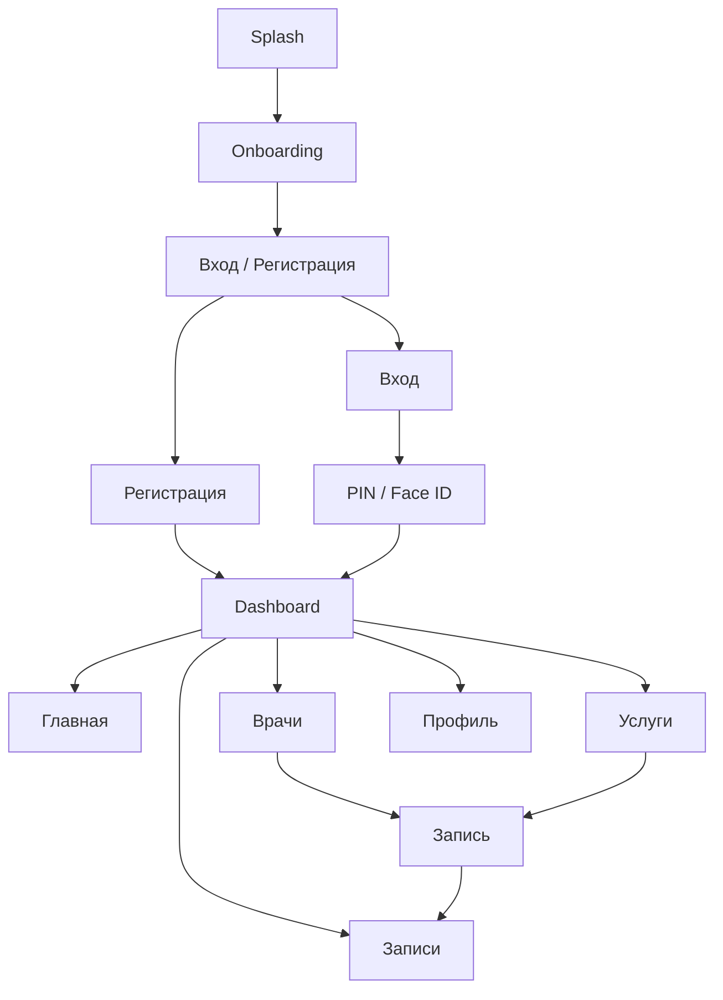
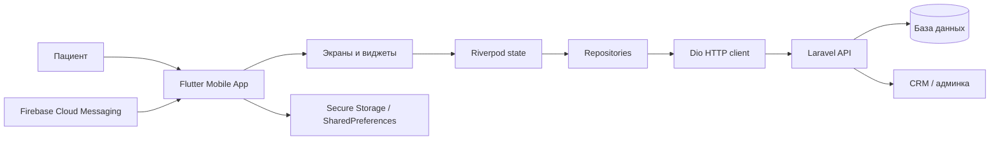
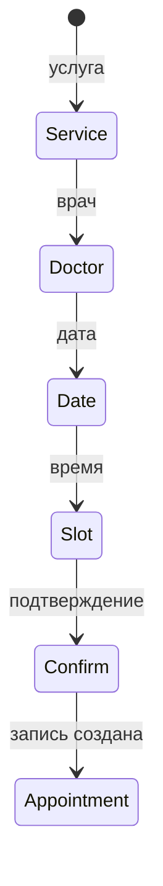

# Презентация для предзащиты проекта «Маяк Здоровья»

**Формат:** Markdown-сценарий презентации  
**Тема:** мобильное приложение пациента клиники «Маяк Здоровья»  
**Проект:** `mobileApp/` — Flutter-приложение + API Laravel-сайта  
**Хронометраж:** 7–10 минут  
**Рекомендуемый объём:** 10–12 слайдов  
**Главный акцент:** визуально показать пользовательский путь, архитектуру, технологии и практическую ценность приложения.

---

## 1. Общая идея презентации

На предзащите важно не перегружать комиссию кодом. Лучше показать:

1. **Проблему** — пациенту неудобно записываться через звонок, клинике сложно быстро обрабатывать обращения.
2. **Решение** — мобильное приложение пациента с регистрацией, личным кабинетом, записью, врачами, услугами, блогом и уведомлениями.
3. **Архитектуру** — Flutter-клиент + Laravel API + база данных + Firebase push.
4. **Пользовательский путь** — от запуска приложения до записи на приём.
5. **Техническую реализацию** — Riverpod, GoRouter, Dio, secure storage, biometrics, Firebase.
6. **Результат** — готовый интерфейс и понятная структура для дальнейшего развития.

### Как должен выглядеть стиль презентации

- Фон светлый, медицинский: белый, голубой, светло-серый.
- Основной цвет — синий/голубой, как в приложении.
- Минимум текста на слайдах: 3–5 тезисов максимум.
- Больше скриншотов приложения, схем и стрелок.
- Код — только на 1 техническом слайде, маленьким фрагментом.
- На каждом слайде должна быть понятная визуальная идея: экран, схема, диаграмма, путь пользователя.

---

## 2. Структура презентации по слайдам

## Слайд 1. Титульный

**Название слайда:**  
`Мобильное приложение пациента клиники «Маяк Здоровья»`

**Что показать визуально:**

- Слева: название проекта, ФИО, группа, руководитель, год.
- Справа: крупный mockup телефона с главным экраном приложения.
- На фоне можно использовать лёгкий медицинский паттерн: крест, сердце, контур клиники, голубой градиент.

**Текст на слайде:**

- Мобильное приложение пациента
- Онлайн-запись к врачу
- Личный кабинет и уведомления
- Flutter + Laravel API

**Что говорить:**

> Уважаемые члены комиссии, тема моей работы — мобильное приложение пациента для клиники «Маяк Здоровья». Приложение позволяет пациенту зарегистрироваться, посмотреть врачей и услуги, записаться на приём, управлять своими записями и получать уведомления. Основной упор в проекте сделан на удобный пользовательский путь и интеграцию мобильного клиента с серверной частью клиники.

**Совет по визуалу:**  
Не ставьте на титульный слайд много текста. Лучше один большой красивый скрин приложения в рамке телефона.

---

## Слайд 2. Проблема и цель проекта

**Название слайда:**  
`Зачем нужно приложение`

**Что показать визуально:**

Сделайте схему «Было → Стало».

Слева:

- Пациент звонит в регистратуру.
- Нужно уточнять врача, услугу, время.
- Нет быстрого просмотра записей.

Справа:

- Пациент открывает приложение.
- Выбирает врача/услугу.
- Видит свободные слоты.
- Управляет записью в личном кабинете.

**Текст на слайде:**

| Было | Стало |
|---|---|
| Запись через звонок | Запись в приложении |
| Нет личного кабинета | История и будущие записи |
| Нет push-уведомлений | Напоминания и статусы |
| Зависимость от оператора | Самостоятельный выбор |

**Что говорить:**

> Основная проблема — пациенту приходится обращаться в регистратуру, чтобы уточнить врачей, услуги и свободное время. Это занимает время и для пациента, и для сотрудников клиники. Цель проекта — сделать мобильное приложение, где пациент самостоятельно проходит весь путь: от просмотра информации до записи на приём и контроля своих визитов.

**Визуальный акцент:**  
Покажите не «техническую проблему», а проблему обычного пациента. Комиссии проще понять ценность через пользовательский сценарий.

---

## Слайд 3. Что реализовано в мобильном приложении

**Название слайда:**  
`Основные возможности`

**Что показать визуально:**

Сетка из 6 карточек с иконками:

1. Регистрация и вход по SMS-коду.
2. PIN и Face ID / биометрия.
3. Главный экран пациента.
4. Каталог врачей и услуг.
5. Онлайн-запись.
6. Записи, профиль, блог, акции.

**Текст на слайде:**

- Онбординг и авторизация
- Личный кабинет пациента
- Каталог врачей и услуг
- Мастер онлайн-записи
- Управление визитами
- Push-уведомления

**Что говорить:**

> В мобильном приложении реализованы ключевые функции для пациента. Новый пользователь проходит онбординг, регистрируется по номеру телефона и SMS-коду, затем настраивает PIN и биометрию. После входа он видит главный экран, врачей, услуги, свои записи, профиль, блог и акции. Центральный сценарий — запись на приём через пошаговый мастер.

**Что лучше показать:**  
Коллаж из реальных экранов приложения: onboarding, dashboard, врачи, услуги, запись, профиль.

---

## Слайд 4. Пользовательский путь

**Название слайда:**  
`Путь пациента в приложении`

**Что показать визуально:**

Горизонтальная схема:

```text
Запуск → Онбординг → Регистрация/Вход → PIN/Face ID → Главная → Выбор услуги/врача → Запись → Мои записи
```

Можно сделать в виде ленты с маленькими скриншотами каждого шага.

**Текст на слайде:**

1. Пользователь открывает приложение.
2. Проходит onboarding.
3. Регистрируется или входит.
4. Подтверждает доступ через PIN/биометрию.
5. Выбирает услугу и врача.
6. Записывается на свободное время.
7. Видит запись в личном кабинете.

**Что говорить:**

> Приложение построено вокруг понятного пользовательского пути. Сначала пользователь знакомится с приложением, затем входит или регистрируется. После локальной защиты через PIN или Face ID он попадает в dashboard. Оттуда можно перейти к врачам, услугам или сразу к записи. После подтверждения запись появляется во вкладке «Записи».

**Визуальный акцент:**  
На этом слайде не надо показывать архитектуру. Покажите именно путь человека, который впервые открыл приложение.

---

## Слайд 5. Карта экранов приложения

**Название слайда:**  
`Навигация и структура экранов`

**Что показать визуально:**

Схема карты приложения:



**Текст на слайде:**

- Публичные экраны: splash, onboarding, login, register.
- Защищённые экраны: dashboard, booking, profile.
- Нижнее меню: главная, врачи, услуги, записи, профиль.
- Отдельные экраны: блог, акции, детальная карточка.

**Что говорить:**

> Структура приложения разделена на публичную и защищённую части. До входа пользователь видит splash, onboarding и экраны авторизации. После входа основой становится dashboard с нижним меню. Внутри dashboard есть главная, врачи, услуги, записи и профиль. Отдельно открываются блог, акции и мастер записи.

**Визуальный акцент:**  
Используйте цветовое разделение: публичные экраны — серые, защищённые — синие, booking — зелёный как ключевой сценарий.

---

## Слайд 6. Архитектура приложения

**Название слайда:**  
`Как устроена система`

**Что показать визуально:**

Схема из четырёх крупных блоков:

```text
Flutter Mobile App
  ↓ Dio HTTP
Laravel API
  ↓
Database / CRM
  ↑
Firebase Push Notifications
```

Можно добавить внутри Flutter:

- UI Screens
- Riverpod State
- Repositories
- Storage

**Mermaid-схема для слайда:**



**Текст на слайде:**

- Flutter отвечает за интерфейс.
- Riverpod хранит состояние.
- Dio отправляет запросы.
- Laravel API отдаёт данные.
- Secure Storage хранит токены.
- Firebase отвечает за push-уведомления.

**Что говорить:**

> Архитектура построена по слоям. Мобильное приложение отвечает за интерфейс и пользовательские действия. Состояние хранится через Riverpod. Для запросов к серверу используется Dio. Серверная часть — Laravel API, где находятся данные о врачах, услугах, записях и профиле пациента. Для безопасного хранения токенов используется secure storage, а для уведомлений — Firebase Cloud Messaging.

**Визуальный акцент:**  
На слайде лучше показывать крупные блоки, а не файлы. Файлы можно упомянуть устно, если спросят.

---

## Слайд 7. Технологический стек

**Название слайда:**  
`Используемые технологии`

**Что показать визуально:**

Таблица или круговая схема с логотипами технологий.

| Часть | Технология | Роль |
|---|---|---|
| UI | Flutter | Отрисовка мобильного интерфейса |
| Язык | Dart | Логика приложения |
| Состояние | Riverpod | Управление состоянием |
| Навигация | GoRouter | Маршруты и redirect |
| API | Dio | HTTP-запросы |
| Хранилище | SharedPreferences / SecureStorage | Локальные данные и токены |
| Безопасность | local_auth | PIN / Face ID / биометрия |
| Уведомления | Firebase Messaging | Push-уведомления |
| Backend | Laravel API | Данные и бизнес-логика |

**Что говорить:**

> Для мобильной части выбран Flutter, потому что он позволяет создавать кроссплатформенное приложение из одной кодовой базы. Логика написана на Dart. Riverpod используется для управления состоянием, GoRouter — для маршрутизации, Dio — для сетевых запросов. Токены хранятся в secure storage, а простые настройки — в SharedPreferences. Для push-уведомлений используется Firebase, а backend предоставляет Laravel API.

**Что можно добавить на слайд мелко:**  
`pubspec.yaml` как источник зависимостей проекта.

---

## Слайд 8. Как работает авторизация

**Название слайда:**  
`Регистрация, вход и безопасность`

**Что показать визуально:**

Схема:

```text
Телефон → SMS OTP → Access Token → PIN → Face ID → Dashboard
```

Рядом поставьте 3–4 скриншота:

- ввод телефона;
- ввод OTP;
- создание PIN;
- Face ID / dashboard.

**Текст на слайде:**

- Вход по телефону и OTP.
- Токен хранится в Secure Storage.
- PIN и Face ID защищают локальный вход.
- Router не пускает в dashboard без авторизации.

**Что говорить:**

> Авторизация состоит из двух уровней. Первый уровень — серверный: пользователь подтверждает телефон SMS-кодом, после чего backend выдаёт access token. Второй уровень — локальная защита приложения: PIN и Face ID. Это удобно, потому что пользователю не нужно каждый раз вводить SMS-код, но доступ к приложению всё равно защищён.

**Если комиссия спросит про безопасность:**  
Скажите, что access token хранится отдельно в `FlutterSecureStorage`, а не в обычных настройках приложения.

---

## Слайд 9. Онлайн-запись на приём

**Название слайда:**  
`Ключевой сценарий: запись к врачу`

**Что показать визуально:**

Покажите пошаговый wizard:

1. выбор услуги;
2. выбор врача;
3. выбор даты;
4. выбор времени;
5. подтверждение.

**Схема:**



**Текст на слайде:**

- Шаги зависят от выбранного врача или услуги.
- Приложение загружает доступные даты и слоты.
- После подтверждения запись отправляется в API.
- Список записей обновляется автоматически.

**Что говорить:**

> Центральная функция приложения — онлайн-запись. Мастер записи построен пошагово: пользователь выбирает услугу, врача, дату и свободное время. Если пользователь пришёл с карточки врача или услуги, часть шагов может быть пропущена. После подтверждения приложение отправляет запрос на backend, а список записей обновляется.

**Визуальный акцент:**  
Сделайте этот слайд самым наглядным: 5 экранов в одну линию с номерами 1–5.

---

## Слайд 10. Главный экран и разделы пациента

**Название слайда:**  
`Личный кабинет пациента`

**Что показать визуально:**

Большой скрин dashboard и пять маленьких блоков нижнего меню:

- Главная
- Врачи
- Услуги
- Записи
- Профиль

**Текст на слайде:**

- Главная: приветствие, акции, ближайшие записи.
- Врачи: список, фильтры, карточки.
- Услуги: направления и услуги.
- Записи: будущие и прошлые визиты.
- Профиль: данные пациента и выход.

**Что говорить:**

> После входа пользователь попадает в dashboard. Он сделан как вкладочный интерфейс с нижней навигацией. Главная показывает важную информацию и быстрые переходы. Во вкладках врачей и услуг пользователь выбирает медицинское направление. Во вкладке записей он видит будущие и прошлые визиты, а в профиле — свои данные.

**Технический акцент, если нужно:**  
Внутри используется `IndexedStack`, поэтому вкладки сохраняют своё состояние при переключении.

---

## Слайд 11. Визуальный дизайн и UX

**Название слайда:**  
`Дизайн и удобство использования`

**Что показать визуально:**

Moodboard:

- палитра цветов;
- примеры кнопок;
- карточка врача;
- карточка услуги;
- нижняя навигация;
- форма OTP/PIN.

**Текст на слайде:**

- Медицинская цветовая палитра.
- Большие понятные кнопки.
- Карточки с краткой информацией.
- Пошаговые сценарии.
- Анимации для плавности интерфейса.

**Что говорить:**

> Визуальная часть сделана так, чтобы пациенту было понятно, куда нажимать. Используются крупные кнопки, карточки, нижняя навигация и пошаговые формы. Цветовая палитра спокойная, медицинская: светлый фон, голубые акценты, понятные статусы. Для плавности интерфейса используются анимации переходов.

**Совет:**  
На этом слайде не надо говорить про код. Это слайд про восприятие пользователем.

---

## Слайд 12. Итоги и дальнейшее развитие

**Название слайда:**  
`Результат и развитие проекта`

**Что показать визуально:**

Слева: список «Реализовано».  
Справа: список «Можно развивать дальше».

**Реализовано:**

- мобильное приложение пациента;
- регистрация и вход;
- защищённый доступ через PIN/Face ID;
- каталог врачей и услуг;
- онлайн-запись;
- профиль и история записей;
- push-уведомления;
- интеграция с Laravel API.

**Дальнейшее развитие:**

- полноценная карта клиники;
- онлайн-оплата;
- медицинские документы;
- чат с администратором;
- расширенная аналитика;
- улучшение push-сценариев;
- публикация в App Store / Google Play.

**Что говорить:**

> В результате получено мобильное приложение, которое закрывает основной путь пациента: регистрация, выбор врача или услуги, запись на приём и просмотр своих визитов. Архитектура построена так, чтобы проект можно было развивать дальше: добавлять оплату, документы, чат, расширенные уведомления и публикацию в магазинах приложений.

**Финальная фраза:**

> Таким образом, проект решает практическую задачу клиники — делает взаимодействие пациента с медицинским центром быстрее, удобнее и современнее.

---

## 3. Рекомендуемый порядок демонстрации

Если на предзащите можно показать live-демо или видео, лучше идти так:

1. Открыть приложение.
2. Показать splash/onboarding.
3. Показать вход или регистрацию.
4. Показать главный экран.
5. Открыть врачей.
6. Открыть услуги.
7. Запустить запись на приём.
8. Показать выбор даты/слота.
9. Показать вкладку «Записи».
10. Показать профиль.

Если backend или Firebase на защите может быть нестабилен, лучше подготовить короткое видео или GIF с прохождением сценария.

---

## 4. Какие скриншоты подготовить

Обязательные:

- splash screen;
- onboarding;
- экран входа/регистрации;
- OTP;
- PIN или Face ID;
- dashboard;
- список врачей;
- карточка врача;
- список услуг;
- booking wizard: услуга/врач/дата/слот/подтверждение;
- вкладка записей;
- профиль.

Дополнительные:

- блог;
- акция;
- push-уведомление;
- ошибка/empty state;
- экран загрузки.

**Как лучше оформлять скриншоты:**

- использовать одинаковые рамки телефонов;
- не ставить слишком мелкие скрины;
- важные элементы обводить голубой рамкой;
- для wizard использовать номера шагов 1–5;
- рядом со скрином писать короткую подпись, а не длинный абзац.

---

## 5. Какие схемы нарисовать

### Схема 1. Пользовательский путь

```text
Запуск → Онбординг → Вход → Главная → Выбор врача/услуги → Запись → Мои записи
```

### Схема 2. Архитектура

```text
Flutter App → Dio → Laravel API → Database / CRM
     ↑                         ↓
 Secure Storage          Firebase Push
```

### Схема 3. Внутренние слои Flutter

```text
Screen Widget
→ Riverpod Provider
→ Repository
→ Dio Client
→ API
→ Model
→ UI update
```

### Схема 4. Авторизация

```text
Телефон → OTP → Token → Secure Storage → PIN/Face ID → Dashboard
```

### Схема 5. Booking wizard

```text
Услуга → Врач → Дата → Время → Подтверждение → Запись создана
```

---

## 6. Что говорить, если спрашивают про технологии

### Почему Flutter?

> Flutter выбран, потому что позволяет разрабатывать кроссплатформенное мобильное приложение из одной кодовой базы. Это ускоряет разработку и упрощает поддержку Android и iOS.

### Почему Riverpod?

> Riverpod используется для управления состоянием. Он помогает отделить UI от логики и удобно связывает экраны, контроллеры, repositories и данные API.

### Почему GoRouter?

> GoRouter управляет переходами между экранами и позволяет централизованно проверять авторизацию через redirect. Благодаря этому защищённые экраны недоступны без входа.

### Почему Dio?

> Dio используется как HTTP-клиент. В проекте через interceptor автоматически добавляется access token и обрабатываются ошибки API.

### Зачем Secure Storage?

> Access token нельзя хранить как обычную настройку. Поэтому для токенов используется защищённое хранилище, а для обычных данных профиля — SharedPreferences.

### Зачем Firebase?

> Firebase Cloud Messaging нужен для push-уведомлений: напоминаний, статусов записи и других сообщений от клиники.

### Что делает Laravel API?

> Laravel API хранит и отдаёт данные: врачей, услуги, записи, профиль пациента, статьи, акции. Мобильное приложение является клиентом этого API.

---

## 7. Возможные вопросы комиссии и ответы

### Вопрос: Чем мобильное приложение отличается от сайта?

**Ответ:**

> Сайт больше ориентирован на публичную информацию и работу через браузер. Мобильное приложение ориентировано на постоянного пациента: быстрый вход, личный кабинет, записи, локальная защита PIN/Face ID и push-уведомления.

### Вопрос: Как защищены данные пользователя?

**Ответ:**

> Вход выполняется по OTP-коду, access token хранится в защищённом хранилище. Дополнительно доступ к приложению защищён PIN-кодом или биометрией. Приватные экраны закрыты через логику маршрутизации.

### Вопрос: Что будет, если пользователь откроет dashboard без входа?

**Ответ:**

> GoRouter проверяет `AuthStatus`. Если пользователь не авторизован, его перенаправит на экран входа, PIN или Face ID.

### Вопрос: Как приложение получает данные врачей и услуг?

**Ответ:**

> Экран обращается к Riverpod provider, provider вызывает repository, repository через Dio отправляет запрос в Laravel API, ответ преобразуется в Dart-модель и отображается в UI.

### Вопрос: Почему запись сделана в несколько шагов?

**Ответ:**

> Это проще для пользователя. Он последовательно выбирает услугу, врача, дату и время. Каждый следующий шаг зависит от предыдущего, поэтому приложение показывает только доступные варианты.

### Вопрос: Можно ли развивать проект дальше?

**Ответ:**

> Да. Архитектура модульная: отдельные features, repositories, providers и screens. Можно добавлять оплату, документы, чат, расширенные уведомления и публикацию в магазинах приложений.

---

## 8. Что не стоит делать на презентации

- Не показывать длинные куски кода на каждом слайде.
- Не читать весь текст со слайдов.
- Не начинать с технологий — сначала проблема и пользователь.
- Не говорить «просто приложение» — лучше говорить «мобильный клиент пациента».
- Не перегружать схемы десятками файлов.
- Не показывать недоделанные экраны без объяснения.

---

## 9. Мини-шпаргалка на 1 минуту

Если попросят очень кратко объяснить проект:

> Я разработал мобильное приложение пациента для клиники «Маяк Здоровья». Пользователь может зарегистрироваться по телефону, защитить вход PIN-кодом или Face ID, посмотреть врачей и услуги, записаться на приём и управлять своими визитами. Приложение написано на Flutter и Dart. Для состояния используется Riverpod, для маршрутизации GoRouter, для API-запросов Dio, для безопасного хранения токенов Secure Storage, для push-уведомлений Firebase. Backend предоставляет Laravel API. Архитектура разделена на экраны, providers, repositories, модели и core-сервисы, поэтому приложение можно поддерживать и развивать дальше.

---

## 10. Рекомендуемый финальный слайд

**Заголовок:**  
`Спасибо за внимание`

**На слайде:**

- 3–4 лучших скриншота приложения.
- QR-код на репозиторий или демо, если разрешено.
- Короткая фраза: `Мобильное приложение делает запись к врачу проще и быстрее`.

**Что сказать:**

> Спасибо за внимание. Готов ответить на вопросы по пользовательским сценариям, архитектуре и технической реализации приложения.
