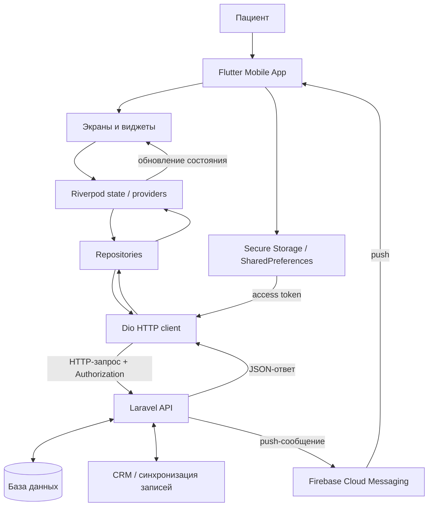
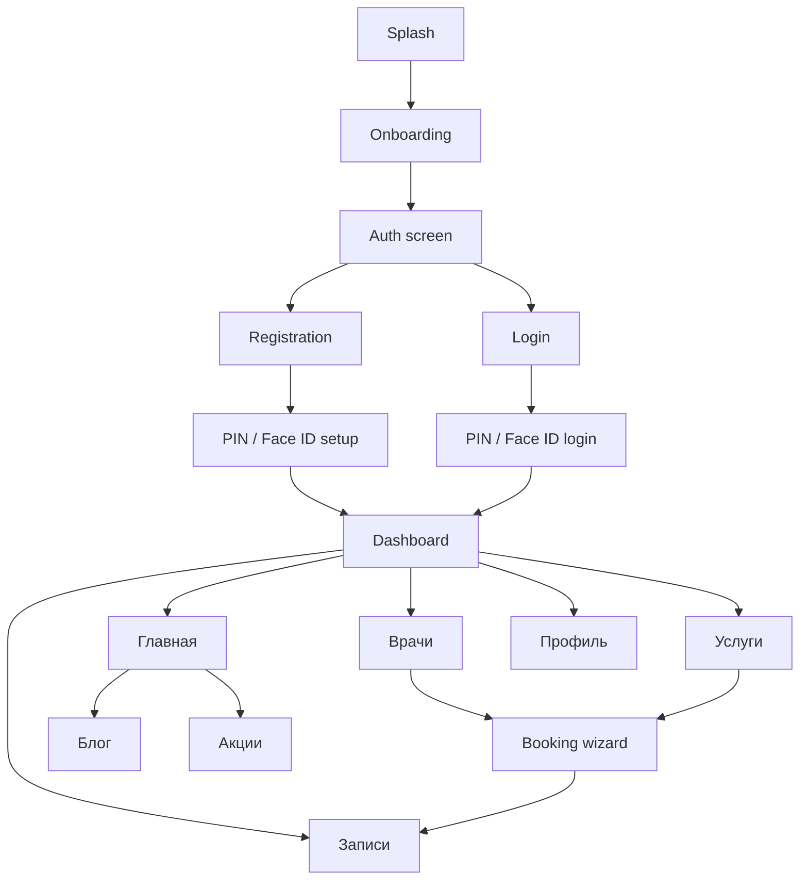
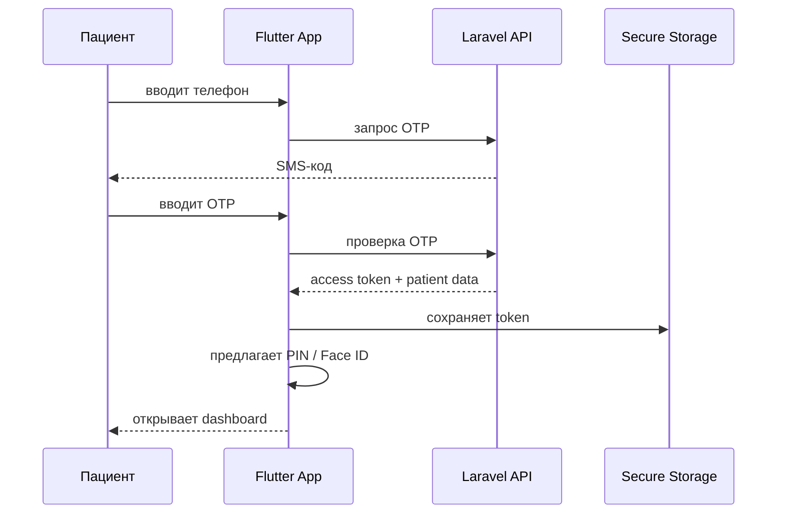
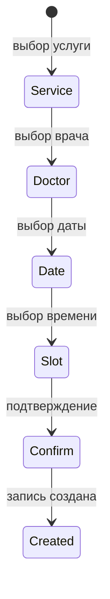
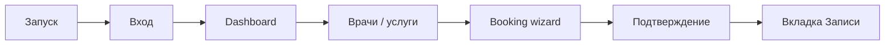

# Дипломная записка по мобильному приложению «Маяк Здоровья»

> Черновик дипломной записки по мобильному приложению из каталога `mobileApp`.  
> Документ написан как основа для переноса в Word: с главами, академическим текстом, таблицами, схемами Mermaid и листингами кода.  
> Перед сдачей необходимо адаптировать оформление под методические требования учебного заведения: поля, шрифт, нумерацию рисунков, подписи таблиц, список источников и титульный лист.

---

## Оглавление

1. [Введение](#введение)
2. [Глава 1. Анализ предметной области и аналогичных решений](#глава-1-анализ-предметной-области-и-аналогичных-решений)
3. [Глава 2. Проектирование мобильного приложения](#глава-2-проектирование-мобильного-приложения)
4. [Глава 3. Разработка мобильного приложения](#глава-3-разработка-мобильного-приложения)
5. [Глава 4. Тестирование и оценка результатов](#глава-4-тестирование-и-оценка-результатов)
6. [Заключение](#заключение)
7. [Список использованных источников](#список-использованных-источников)
8. [Приложения](#приложения)

---

# Введение

В настоящее время цифровые сервисы становятся важной частью работы медицинских организаций. Для пациента качество медицинского обслуживания определяется не только профессионализмом врачей, но и удобством взаимодействия с клиникой: возможностью быстро найти нужного специалиста, записаться на подходящее время, получить напоминание о визите и просмотреть информацию о будущих приёмах. Особенно актуально это для частных медицинских центров, где пациент ожидает не только медицинскую помощь, но и современный уровень сервиса.

Клиника «Маяк Здоровья» предоставляет широкий спектр медицинских услуг и работает с большим количеством пациентов. При традиционной записи через телефон, администратора или мессенджеры возникает ряд ограничений: пациенту приходится уточнять свободное время вручную, сотрудники клиники получают дополнительную нагрузку, а информация о врачах, услугах и визитах не всегда доступна пользователю в удобном формате. Кроме того, отсутствие своевременных уведомлений может приводить к пропускам приёмов и дополнительным организационным трудностям.

Одним из способов решения указанных проблем является разработка мобильного приложения пациента. Такое приложение может выступать отдельным цифровым каналом взаимодействия с клиникой. Через него пациент получает доступ к каталогу врачей и услуг, проходит регистрацию, записывается на приём, просматривает будущие и прошлые визиты, редактирует профиль и получает push-уведомления.

**Актуальность работы** обусловлена необходимостью повышения удобства записи пациентов на приём и снижения нагрузки на администраторов клиники за счёт разработки мобильного приложения, связанного с серверной частью медицинского веб-ресурса.

**Цель работы** — спроектировать и разработать мобильное приложение пациента для клиники «Маяк Здоровья», обеспечивающее просмотр информации о врачах и услугах, авторизацию пациента, онлайн-запись на приём, работу с личным кабинетом и получение уведомлений.

Для достижения поставленной цели необходимо решить следующие задачи:

1. Проанализировать предметную область и особенности цифрового взаимодействия пациента с медицинской клиникой.
2. Рассмотреть аналогичные мобильные приложения медицинской тематики и выделить их сильные и слабые стороны.
3. Сформировать функциональные и нефункциональные требования к мобильному приложению.
4. Спроектировать архитектуру клиентской части и её взаимодействие с серверным API.
5. Разработать структуру экранов и основные пользовательские сценарии.
6. Реализовать мобильное приложение на Flutter с использованием Dart.
7. Настроить маршрутизацию, управление состоянием, сетевой слой и локальное хранение данных.
8. Реализовать сценарии авторизации, просмотра врачей и услуг, записи на приём, работы с профилем и уведомлениями.
9. Провести проверку основных пользовательских сценариев и оценить результаты разработки.

**Объект исследования** — процесс цифрового взаимодействия пациента с медицинской клиникой.

**Предмет исследования** — мобильное приложение для записи пациента на приём и управления личными визитами.

**Практическая значимость работы** заключается в создании мобильного клиента, который может использоваться пациентами клиники для самостоятельной записи на приём, просмотра информации о специалистах и услугах, получения уведомлений и доступа к личному кабинету. Разработанная архитектура позволяет расширять приложение за счёт новых функций: онлайн-оплаты, медицинских документов, чата с администратором и более глубокой интеграции с CRM.

---

# Глава 1. Анализ предметной области и аналогичных решений

## 1.1 Анализ предметной области

Медицинская клиника работает с несколькими типами данных. С одной стороны, существуют общедоступные сведения: список врачей, перечень услуг, описания направлений, статьи, акции и контактная информация. С другой стороны, есть персональные данные пациента: ФИО, номер телефона, история посещений, будущие записи и статусы приёмов. Для корректной работы цифрового сервиса эти группы данных необходимо разделять, так как требования к их хранению, обработке и отображению различаются.

Для пациента наиболее важным является быстрый доступ к понятной информации и возможность выполнить целевое действие без лишних шагов. В контексте медицинского приложения таким целевым действием является запись на приём. Пользователь должен иметь возможность выбрать услугу или врача, увидеть доступные даты и время, подтвердить запись и затем проверить её в личном кабинете.

Для клиники мобильное приложение решает организационные задачи. Оно снижает количество однотипных обращений к администраторам, уменьшает риск ошибок при ручной записи, позволяет централизованно обновлять информацию о врачах и услугах, а также создаёт дополнительный канал коммуникации с пациентом через push-уведомления.

Особенностью медицинской предметной области является повышенное внимание к удобству интерфейса. Среди пациентов могут быть пользователи разного возраста и разного уровня цифровой грамотности. Поэтому интерфейс должен быть лаконичным, контрастным и предсказуемым. Основные действия должны быть доступны в несколько касаний, а формы ввода не должны перегружать пользователя.

## 1.2 Анализ аналогичных мобильных приложений

Для определения требований к разрабатываемому приложению целесообразно рассмотреть аналогичные решения. В качестве примеров можно использовать мобильные приложения частных медицинских центров и лабораторных сетей, например EVACLINIC и INVITRO. Такие приложения имеют схожую направленность: помогают пользователю искать медицинские услуги, выбирать специалистов, записываться на приём и работать с личным кабинетом.

При анализе аналогов следует оценивать не только набор функций, но и то, насколько быстро пользователь достигает цели. Для медицинского приложения важны следующие критерии:

- понятность главного экрана;
- доступность кнопки записи;
- наличие каталога врачей;
- наличие каталога услуг;
- поиск и фильтрация;
- отображение свободного времени;
- наличие личного кабинета;
- уведомления о визитах;
- визуальная простота интерфейса.

Таблица 1.1 — Сравнение мобильных приложений-аналогов

| Критерий | EVACLINIC | INVITRO | Разрабатываемое приложение |
|---|---:|---:|---:|
| Просмотр врачей | есть | частично | есть |
| Каталог услуг | есть | есть | есть |
| Онлайн-запись | есть | есть | есть |
| Выбор даты и времени | есть | есть | есть |
| Личный кабинет | есть | есть | есть |
| Push-уведомления | есть | есть | предусмотрены |
| Быстрый вход | есть | есть | PIN / Face ID |
| Акцент на простоту интерфейса | средний | средний | высокий |
| Интеграция с сайтом клиники | зависит от реализации | зависит от реализации | через Laravel API |

По результатам анализа можно сделать вывод, что основные функции медицинского мобильного приложения уже являются привычными для пользователей. Поэтому разрабатываемое приложение должно включать каталог врачей, каталог услуг, запись на приём и личный кабинет. При этом важно избежать перегруженности интерфейса, так как приложение ориентировано не только на молодых пользователей, но и на пациентов среднего и старшего возраста.

## 1.3 Требования к мобильному приложению

На основе анализа предметной области и аналогов были сформулированы функциональные требования.

Таблица 1.2 — Функциональные требования

| Номер | Требование | Описание |
|---|---|---|
| F1 | Онбординг | Приложение должно показывать приветственные экраны для нового пользователя. |
| F2 | Регистрация | Пользователь должен иметь возможность зарегистрироваться по номеру телефона. |
| F3 | Авторизация | Пользователь должен входить по OTP-коду, PIN-коду или биометрии. |
| F4 | Просмотр врачей | Приложение должно отображать список врачей и информацию о специалисте. |
| F5 | Просмотр услуг | Приложение должно отображать категории и список медицинских услуг. |
| F6 | Онлайн-запись | Пользователь должен выбирать услугу, врача, дату и свободное время. |
| F7 | Личный кабинет | Пользователь должен видеть профиль и персональные данные. |
| F8 | История записей | Приложение должно показывать будущие и прошедшие визиты. |
| F9 | Уведомления | Приложение должно поддерживать push-уведомления. |
| F10 | Информационные материалы | Пользователь должен иметь доступ к блогу и акциям клиники. |

Также были определены нефункциональные требования.

Таблица 1.3 — Нефункциональные требования

| Номер | Требование | Описание |
|---|---|---|
| NF1 | Удобство интерфейса | Основные действия должны выполняться за минимальное количество шагов. |
| NF2 | Безопасность | Access token должен храниться в защищённом хранилище. |
| NF3 | Масштабируемость | Архитектура должна позволять добавлять новые модули. |
| NF4 | Поддерживаемость | Код должен быть разделён на экраны, состояния, repositories и core-сервисы. |
| NF5 | Отказоустойчивость | Ошибки API должны обрабатываться и отображаться пользователю понятным текстом. |
| NF6 | Локализация | Основной интерфейс должен быть ориентирован на русскоязычного пользователя. |

## 1.4 Выводы по главе 1

В первой главе была рассмотрена предметная область и выявлена необходимость разработки мобильного приложения для пациента клиники. Было установлено, что ключевым сценарием является онлайн-запись на приём, а дополнительными значимыми функциями являются просмотр врачей и услуг, личный кабинет, уведомления и быстрый повторный вход. Анализ аналогов показал, что разрабатываемое приложение должно сочетать привычный набор функций с более простой и понятной структурой интерфейса.

---

# Глава 2. Проектирование мобильного приложения

## 2.1 Общая концепция приложения

Разрабатываемое приложение представляет собой мобильный клиент пациента клиники «Маяк Здоровья». Оно не хранит основную бизнес-логику внутри мобильного устройства, а взаимодействует с серверной частью через API. Такой подход соответствует клиент-серверной архитектуре: мобильное приложение отвечает за отображение интерфейса и обработку пользовательских действий, а серверная часть — за хранение данных, проверку авторизации и выполнение операций записи.

Основной пользовательский путь приложения можно представить следующим образом:

```text
Запуск приложения
→ онбординг
→ регистрация или вход
→ настройка PIN / Face ID
→ главный экран
→ выбор врача или услуги
→ выбор даты и времени
→ подтверждение записи
→ просмотр записи в личном кабинете
```

## 2.2 Пользовательские роли

В рамках мобильного приложения основная роль — пациент. Администратор клиники напрямую не работает с мобильным приложением, однако влияет на отображаемые данные через серверную часть и административную панель сайта.

Таблица 2.1 — Пользовательские роли

| Роль | Возможности |
|---|---|
| Незарегистрированный пользователь | Просмотр онбординга, переход к регистрации или входу. |
| Зарегистрированный пациент | Вход по PIN/Face ID, просмотр dashboard, врачей, услуг, записей и профиля. |
| Администратор клиники | Управление данными на стороне сайта/API, которые затем отображаются в приложении. |

## 2.3 Проектирование архитектуры

Архитектура приложения строится вокруг нескольких слоёв:

1. **Presentation layer** — экраны и виджеты Flutter.
2. **State layer** — состояние и контроллеры Riverpod.
3. **Data layer** — repositories и модели данных.
4. **Core layer** — сетевой клиент, локальное хранилище, уведомления, биометрия.
5. **Backend layer** — Laravel API, база данных, CRM и Firebase.

Рисунок 2.1 — Общая архитектура мобильного приложения



Важной особенностью архитектуры является то, что мобильное приложение не обращается к базе данных и CRM напрямую. Все операции проходят через Laravel API. Это упрощает безопасность, так как мобильный клиент работает только с контролируемым набором endpoints.

## 2.4 Проектирование навигации

Навигация приложения разделяется на публичную и защищённую части. К публичным экранам относятся splash, onboarding, auth, register и login. Защищённая часть начинается после подтверждения пользователя и включает dashboard, booking, profile, appointments и другие разделы.

Рисунок 2.2 — Карта экранов приложения



## 2.5 Проектирование сценария авторизации

Авторизация в приложении состоит из двух уровней. Первый уровень связан с backend: пользователь подтверждает номер телефона через OTP-код, после чего сервер возвращает access token. Второй уровень является локальным: пользователь может входить повторно через PIN-код или биометрию без повторного ввода SMS-кода.

Рисунок 2.3 — Сценарий авторизации



Такой подход повышает удобство пользователя. SMS-код нужен для первичной проверки телефона, а PIN/Face ID упрощают повторный вход в уже зарегистрированное приложение.

## 2.6 Проектирование сценария записи на приём

Запись на приём реализуется как пошаговый мастер. Пользователь последовательно выбирает услугу, врача, дату и свободное время. Если пользователь открывает запись из карточки врача или услуги, часть шагов может быть предварительно заполнена.

Рисунок 2.4 — Состояния мастера записи



Преимущество пошагового сценария заключается в том, что каждый следующий выбор зависит от предыдущего. Например, список врачей зависит от выбранной услуги, а список свободных слотов зависит от врача и даты.

## 2.7 Выводы по главе 2

Во второй главе была спроектирована структура мобильного приложения, определены основные пользовательские сценарии, описана клиент-серверная архитектура и разработаны схемы взаимодействия. Принятое архитектурное решение разделяет интерфейс, состояние, работу с API и локальное хранение данных, что повышает поддерживаемость и расширяемость приложения.

---

# Глава 3. Разработка мобильного приложения

## 3.1 Структура Flutter-проекта

Мобильное приложение расположено в каталоге `mobileApp` и разработано на Flutter. Основной код находится в директории `lib`. Структура проекта организована по функциональным модулям:

```text
lib/
  app/                 корневой виджет и маршрутизация
  core/                общие сервисы: сеть, storage, уведомления, биометрия
  features/            функциональные модули приложения
    auth/              авторизация и состояние пользователя
    registration/      регистрация пациента
    login/             повторный вход
    dashboard/         главный экран после входа
    booking/           запись на приём
    onboarding/        приветственные экраны
    splash/            стартовая загрузка
```

Такое разделение позволяет изолировать функциональные области. Например, логика записи находится в `features/booking`, а сетевые настройки — в `core/network`. Благодаря этому при изменении одного модуля не требуется просматривать весь проект.

Файл `pubspec.yaml` содержит зависимости приложения. Основные библиотеки представлены в таблице 3.1.

Таблица 3.1 — Основные зависимости мобильного приложения

| Библиотека | Назначение |
|---|---|
| `flutter_riverpod` | Управление состоянием и зависимостями |
| `go_router` | Маршрутизация между экранами |
| `dio` | HTTP-запросы к Laravel API |
| `shared_preferences` | Хранение простых локальных данных |
| `flutter_secure_storage` | Защищённое хранение access token |
| `local_auth` | Биометрическая авторизация |
| `firebase_messaging` | Push-уведомления |
| `flutter_local_notifications` | Локальное отображение уведомлений |
| `flutter_html` | Отображение HTML-контента статей и акций |
| `intl` | Форматирование дат и времени |

## 3.2 Реализация запуска приложения

Точкой входа является файл `lib/main.dart`. В нём выполняется инициализация Flutter, Firebase и запуск корневого виджета приложения.

Листинг 3.1 — Точка входа приложения

```dart
Future<void> main() async {
  WidgetsFlutterBinding.ensureInitialized();

  if (kFirebaseEnabled) {
    try {
      await Firebase.initializeApp();
      FirebaseMessaging.onBackgroundMessage(
        firebaseMessagingBackgroundHandler,
      );
    } catch (e, st) {
      if (kDebugMode) {
        debugPrint('[main] Firebase init failed: $e\n$st');
      }
    }
  }

  runApp(const ProviderScope(child: App()));
}
```

Метод `WidgetsFlutterBinding.ensureInitialized()` подготавливает Flutter к выполнению асинхронных операций до запуска интерфейса. Это необходимо, так как перед `runApp` может выполняться инициализация Firebase. Виджет `ProviderScope` подключает Riverpod ко всему приложению, после чего любые дочерние экраны могут использовать providers.

## 3.3 Реализация корневого виджета

Корневой виджет `App` расположен в файле `lib/app/app.dart`. Он отвечает за подключение маршрутизатора, локализации, темы и глобальных сервисов уведомлений.

Листинг 3.2 — Корневой виджет приложения

```dart
class App extends ConsumerWidget {
  const App({super.key});

  @override
  Widget build(BuildContext context, WidgetRef ref) {
    ref.watch(notificationControllerProvider);
    ref.watch(pushTokenSyncProvider);

    ref.listen<AuthState>(authControllerProvider, (previous, current) {
      if (current.status == AuthStatus.authenticated &&
          previous?.status != AuthStatus.authenticated) {
        ref.read(pushTokenSyncProvider).resendAfterLogin();
      }
    });

    final router = ref.watch(appRouterProvider);

    return MaterialApp.router(
      title: 'Маяк Здоровья',
      debugShowCheckedModeBanner: false,
      routerConfig: router,
      locale: const Locale('ru', 'RU'),
      theme: ThemeData(
        colorScheme: ColorScheme.fromSeed(
          seedColor: const Color(0xFF4682B4),
        ),
        useMaterial3: true,
      ),
    );
  }
}
```

Виджет является `ConsumerWidget`, поэтому может обращаться к Riverpod через `WidgetRef`. При построении приложения запускаются сервисы уведомлений и синхронизации push-токена. Дополнительно через `ref.listen` отслеживается изменение состояния авторизации: после успешного входа push-токен отправляется повторно уже с действующим заголовком авторизации.

## 3.4 Реализация маршрутизации и защиты экранов

Маршрутизация реализована с помощью библиотеки GoRouter. В файле `lib/app/router.dart` описаны маршруты и логика перенаправления пользователя в зависимости от состояния авторизации.

Листинг 3.3 — Фрагмент логики redirect

```dart
redirect: (context, state) {
  final auth = ref.read(authControllerProvider);
  final status = auth.status;
  final loc = state.matchedLocation;

  if (status == AuthStatus.unknown) {
    return loc == '/splash' ? null : '/splash';
  }

  const publicRoutes = ['/splash', '/onboarding', '/auth', '/register',
      '/login', '/login/pin', '/login/faceid'];
  final isPublic = publicRoutes.any((r) => loc.startsWith(r));

  if (status == AuthStatus.unregistered) {
    return isPublic ? null : '/auth';
  }

  if (status == AuthStatus.registeredLoggedOut) {
    if (loc == '/login' ||
        loc == '/login/pin' ||
        loc == '/login/faceid' ||
        loc.startsWith('/register')) {
      return null;
    }
    return auth.faceIdEnabled ? '/login/faceid' : '/login/pin';
  }

  if (status == AuthStatus.authenticated && isPublic) {
    return '/dashboard';
  }

  return null;
}
```

Данный фрагмент обеспечивает защиту экранов. Если статус пользователя ещё неизвестен, приложение остаётся на splash-экране. Если пользователь не зарегистрирован, он перенаправляется к авторизации. Если пользователь зарегистрирован, но не прошёл локальную проверку, открывается PIN или Face ID. Если пользователь уже авторизован, публичные экраны входа становятся недоступными и происходит переход на dashboard.

## 3.5 Реализация сетевого слоя

Для взаимодействия с серверной частью используется HTTP-клиент Dio. Он создаётся через Riverpod provider, что позволяет использовать единый настроенный экземпляр во всех repositories.

Листинг 3.4 — Создание Dio-клиента

```dart
final dioProvider = Provider<Dio>((ref) {
  final secure = ref.watch(secureStorageProvider);

  final dio = Dio(
    BaseOptions(
      baseUrl: resolvedApiBaseUrl,
      connectTimeout: const Duration(seconds: 15),
      receiveTimeout: const Duration(seconds: 20),
      sendTimeout: const Duration(seconds: 20),
      headers: {
        'Accept': 'application/json',
        'Content-Type': 'application/json',
      },
    ),
  );

  dio.interceptors.add(_AuthInterceptor(secure));
  dio.interceptors.add(_ErrorInterceptor());

  return dio;
});
```

В `BaseOptions` задаётся базовый адрес API, таймауты и стандартные HTTP-заголовки. Interceptor авторизации автоматически добавляет access token к запросам.

Листинг 3.5 — Interceptor авторизации

```dart
class _AuthInterceptor extends Interceptor {
  final SecureStorage _storage;

  _AuthInterceptor(this._storage);

  @override
  Future<void> onRequest(
    RequestOptions options,
    RequestInterceptorHandler handler,
  ) async {
    final token = await _storage.readAccessToken();
    if (token != null && token.isNotEmpty) {
      options.headers['Authorization'] = 'Bearer $token';
    }
    handler.next(options);
  }
}
```

Такой подход позволяет не добавлять токен вручную в каждом repository. Любой запрос, отправляемый через Dio, автоматически получает заголовок `Authorization`, если токен сохранён в защищённом хранилище.

## 3.6 Реализация авторизации пользователя

Состояние авторизации хранится в `AuthController`. Он наследуется от `StateNotifier<AuthState>` и управляет состояниями пользователя: неизвестен, не зарегистрирован, зарегистрирован без входа и полностью авторизован.

Листинг 3.6 — Загрузка состояния пользователя

```dart
Future<void> bootstrap() async {
  final isRegistered = await _storage.isRegistered();
  if (!isRegistered) {
    state = state.copyWith(status: AuthStatus.unregistered);
    return;
  }

  final firstName = await _storage.getFirstName();
  final lastName = await _storage.getLastName();
  final phone = await _storage.getPhone();
  final faceId = await _storage.isFaceIdEnabled();

  final nextStatus = state.status == AuthStatus.authenticated
      ? AuthStatus.authenticated
      : AuthStatus.registeredLoggedOut;

  state = AuthState(
    status: nextStatus,
    firstName: firstName,
    lastName: lastName,
    phone: phone,
    faceIdEnabled: faceId,
  );

  final token = await _secureStorage.readAccessToken();
  if (token != null && token.isNotEmpty) {
    try {
      final p = await _authRepository.me();
      await _applyPatientData(p, keepPhone: phone);
    } on DioException {
      // Сеть / протухший токен — остаёмся на локальных данных
    }
  }
}
```

Метод `bootstrap` вызывается при запуске приложения. Он проверяет наличие локальной регистрации, загружает данные профиля и определяет, какой экран должен быть открыт дальше. Если access token существует, приложение пытается обновить профиль через API. При ошибке сети пользователь остаётся на локально сохранённых данных, что повышает устойчивость приложения.

## 3.7 Реализация главного экрана

После успешного входа пользователь попадает на `DashboardScreen`. Он содержит пять основных вкладок: главная, врачи, услуги, записи и профиль. Для сохранения состояния вкладок используется `IndexedStack`.

Листинг 3.7 — Структура dashboard

```dart
body: IndexedStack(
  index: currentIndex,
  children: const [
    HomeScreen(),
    DoctorsScreen(),
    ServicesScreen(),
    AppointmentsScreen(),
    ProfileScreen(),
  ],
),
bottomNavigationBar: _BottomNav(
  currentIndex: currentIndex,
  onTap: (i) {
    ref.read(dashboardTabIndexProvider.notifier).state = i;
  },
),
```

`IndexedStack` не уничтожает неактивные вкладки, а сохраняет их состояние. Это удобно, если пользователь открыл список врачей, затем перешёл на другую вкладку и вернулся обратно. Индекс текущей вкладки хранится в Riverpod provider `dashboardTabIndexProvider`.

## 3.8 Реализация записи на приём

Логика записи на приём вынесена в `BookingWizardNotifier`. Он управляет шагами мастера записи, выбранной услугой, врачом, датой, временем, состоянием отправки и ошибками.

Листинг 3.8 — Вычисление шагов записи

```dart
static List<BookingStep> _computeSteps({
  required bool hasDoctor,
  required bool hasService,
}) {
  final steps = <BookingStep>[];
  if (!hasService) steps.add(BookingStep.service);
  if (!hasDoctor) steps.add(BookingStep.doctor);
  steps.add(BookingStep.date);
  steps.add(BookingStep.slot);
  steps.add(BookingStep.confirm);
  return steps;
}
```

Данный метод делает мастер записи гибким. Если пользователь переходит к записи из карточки услуги, шаг выбора услуги можно пропустить. Если уже известны и врач, и услуга, приложение сразу предлагает выбрать дату и время.

При изменении раннего выбора зависимые данные очищаются. Например, если пользователь выбрал другую услугу, необходимо сбросить врача, дату и слот, так как старые значения могут стать недействительными.

Листинг 3.9 — Выбор услуги

```dart
void selectService(BookingServiceItem item) {
  state = state.copyWith(
    service: item,
    clearDoctor: true,
    clearDate: true,
    clearSlot: true,
    clearError: true,
    stepIndex: state.stepIndex + 1,
  );
}
```

Финальная отправка записи выполняется методом `submit`.

Листинг 3.10 — Подтверждение записи

```dart
Future<bool> submit(String? note) async {
  var service = state.service;
  var doctor = state.doctor;
  final slot = state.slot;

  if (service == null || doctor == null || slot == null) {
    state = state.copyWith(error: 'Заполните все шаги перед отправкой');
    return false;
  }

  state = state.copyWith(isSubmitting: true, clearError: true);

  try {
    if (arg.isReschedule) {
      await ref
          .read(appointmentsRepositoryProvider)
          .rescheduleAppointment(arg.appointmentId!, slot);
    } else {
      await ref.read(bookingRepositoryProvider).createAppointment(
            serviceId: service.id,
            doctorId: doctor.id,
            startAt: slot,
            note: note,
          );
    }

    ref.invalidate(upcomingAppointmentsProvider);
    ref.invalidate(pastAppointmentsProvider);

    state = state.copyWith(isSubmitting: false, done: true);
    return true;
  } catch (e) {
    final msg = _parseError(e);
    state = state.copyWith(isSubmitting: false, error: msg);
    return false;
  }
}
```

После успешной записи списки будущих и прошедших приёмов инвалидируются через Riverpod. Это означает, что при следующем открытии вкладки данные будут загружены заново и пользователь увидит актуальную информацию.

## 3.9 Реализация уведомлений

В приложении предусмотрена поддержка Firebase Cloud Messaging. При запуске приложения Firebase инициализируется, а обработчик фоновых сообщений регистрируется в `main.dart`. В корневом виджете запускаются providers, отвечающие за настройку уведомлений и синхронизацию FCM-токена с backend.

Push-уведомления используются для доставки важных сообщений от клиники, например напоминаний о приёме или изменения статуса записи. Если уведомление приходит во время активной работы приложения, оно может быть отображено через локальные уведомления.

## 3.10 Обработка ошибок

Ошибки сетевого слоя обрабатываются централизованно через `_ErrorInterceptor`. Если сервер возвращает статус `401`, создаётся `UnauthorizedException`. В остальных случаях interceptor пытается извлечь текст ошибки из поля `message` или из структуры `errors`.

Листинг 3.11 — Обработка ошибок API

```dart
void onError(DioException err, ErrorInterceptorHandler handler) {
  final status = err.response?.statusCode;

  if (status == 401) {
    handler.reject(DioException(
      requestOptions: err.requestOptions,
      response: err.response,
      error: const UnauthorizedException(),
      type: err.type,
    ));
    return;
  }

  final message = _extractMessage(err);

  handler.reject(DioException(
    requestOptions: err.requestOptions,
    response: err.response,
    error: ApiException(message, statusCode: status, raw: err),
    type: err.type,
  ));
}
```

Централизованная обработка ошибок позволяет не дублировать одинаковую логику во всех экранах. Пользователь получает более понятные сообщения, а разработчику проще поддерживать поведение приложения при ошибках API.

## 3.11 Выводы по главе 3

В третьей главе была описана реализация мобильного приложения. Были рассмотрены структура Flutter-проекта, запуск приложения, маршрутизация, сетевой слой, авторизация, главный экран, мастер записи и обработка ошибок. Реализация построена по модульному принципу, что упрощает поддержку и дальнейшее развитие приложения.

---

# Глава 4. Тестирование и оценка результатов

## 4.1 План тестирования

Тестирование мобильного приложения должно включать проверку основных пользовательских сценариев и технических механизмов. Основная цель тестирования — убедиться, что пользователь может пройти путь от запуска приложения до записи на приём без критических ошибок.

Таблица 4.1 — План тестирования

| Номер | Проверка | Ожидаемый результат |
|---|---|---|
| T1 | Первый запуск приложения | Открывается splash/onboarding. |
| T2 | Регистрация по телефону | Пользователь проходит OTP и сохраняется локально. |
| T3 | Повторный вход | Пользователь входит по PIN или Face ID. |
| T4 | Навигация dashboard | Переключаются вкладки главная, врачи, услуги, записи, профиль. |
| T5 | Загрузка врачей | Список врачей загружается из API и отображается. |
| T6 | Загрузка услуг | Каталог услуг загружается и отображается. |
| T7 | Запись на приём | Пользователь выбирает услугу, врача, дату, слот и создаёт запись. |
| T8 | Обновление записей | После записи вкладка «Записи» показывает актуальные данные. |
| T9 | Ошибка API | Пользователь получает понятное сообщение об ошибке. |
| T10 | Push token | После входа FCM-токен повторно отправляется на backend. |

## 4.2 Проверка пользовательского сценария записи

Ключевой сценарий тестирования — создание записи на приём. Он включает следующие действия:

1. Запустить приложение.
2. Войти в аккаунт пациента.
3. Перейти в раздел услуг или врачей.
4. Нажать кнопку записи.
5. Выбрать услугу, если она не была выбрана заранее.
6. Выбрать врача.
7. Выбрать дату.
8. Выбрать свободный слот.
9. Подтвердить запись.
10. Перейти во вкладку «Записи» и проверить наличие новой записи.

Рисунок 4.1 — Проверяемый пользовательский путь



## 4.3 Проверка взаимодействия с API

Для проверки взаимодействия с серверной частью необходимо убедиться, что приложение корректно отправляет HTTP-запросы и обрабатывает JSON-ответы. Особое внимание следует уделить авторизованным запросам, так как они требуют наличия access token.

Проверяются следующие ситуации:

- запрос без токена к защищённому endpoint должен возвращать ошибку авторизации;
- после входа токен должен автоматически добавляться в заголовок `Authorization`;
- при успешном ответе данные должны преобразовываться в модели;
- при ошибке backend пользователь должен увидеть понятное сообщение;
- при создании записи список записей должен быть обновлён.

## 4.4 Оценка результатов разработки

В результате разработки было создано мобильное приложение пациента клиники «Маяк Здоровья». Приложение реализует основные сценарии: авторизацию, просмотр врачей и услуг, запись на приём, просмотр записей, работу с профилем и поддержку уведомлений.

Основные результаты:

- разработана клиентская часть на Flutter;
- настроена маршрутизация через GoRouter;
- реализовано управление состоянием через Riverpod;
- создан сетевой слой на Dio;
- реализовано хранение токенов в защищённом хранилище;
- реализован dashboard с нижней навигацией;
- реализован пошаговый мастер записи;
- предусмотрена поддержка Firebase Cloud Messaging;
- реализована централизованная обработка ошибок API.

## 4.5 Ограничения и перспективы развития

Несмотря на реализованный функционал, приложение может быть расширено. В дальнейшем целесообразно добавить:

- онлайн-оплату услуг;
- отображение медицинских документов;
- чат с администратором;
- расширенные настройки уведомлений;
- карту клиники и построение маршрута;
- расширенное тестирование на реальных устройствах;
- публикацию приложения в Google Play и App Store.

## 4.6 Выводы по главе 4

В четвёртой главе был предложен план тестирования мобильного приложения и описаны критерии проверки основных сценариев. Наиболее важным сценарием является запись пациента на приём, так как именно она отражает практическую ценность проекта. Проведённая оценка показывает, что разработанная архитектура позволяет поддерживать приложение и расширять его функциональность.

---

# Заключение

В ходе выполнения дипломного проекта было спроектировано и разработано мобильное приложение пациента для клиники «Маяк Здоровья». Приложение предназначено для упрощения взаимодействия пациента с клиникой и предоставляет функции авторизации, просмотра врачей и услуг, записи на приём, работы с личным кабинетом и получения уведомлений.

В первой главе была рассмотрена предметная область и выявлены основные проблемы традиционной записи на приём. Был проведён анализ аналогичных решений, который показал необходимость реализации понятного интерфейса, каталога врачей и услуг, личного кабинета и удобного сценария записи.

Во второй главе были сформированы требования к приложению, спроектированы пользовательские сценарии, карта экранов и архитектура взаимодействия мобильного клиента с Laravel API. Было принято решение использовать клиент-серверную архитектуру, при которой мобильное приложение не обращается напрямую к базе данных или CRM, а работает через серверное API.

В третьей главе была описана реализация приложения на Flutter. Были рассмотрены точка входа, корневой виджет, маршрутизация, управление состоянием, сетевой слой, авторизация, dashboard, мастер записи и обработка ошибок. В качестве основных технологий использованы Dart, Flutter, Riverpod, GoRouter, Dio, Flutter Secure Storage и Firebase Cloud Messaging.

В четвёртой главе был предложен план тестирования и описаны основные проверки пользовательских сценариев. Особое внимание уделено проверке записи на приём, так как этот сценарий является центральным для мобильного приложения.

Таким образом, цель работы была достигнута: разработано мобильное приложение, которое позволяет пациенту удобнее взаимодействовать с клиникой, самостоятельно записываться на приём и получать доступ к информации о своих визитах. Разработанная структура проекта является модульной и может быть использована для дальнейшего развития приложения.

---

# Список использованных источников

1. Flutter documentation. [Электронный ресурс]. Режим доступа: https://docs.flutter.dev. Дата доступа: 25.05.2026.
2. Dart programming language. [Электронный ресурс]. Режим доступа: https://dart.dev. Дата доступа: 25.05.2026.
3. Riverpod documentation. [Электронный ресурс]. Режим доступа: https://riverpod.dev. Дата доступа: 25.05.2026.
4. GoRouter package. [Электронный ресурс]. Режим доступа: https://pub.dev/packages/go_router. Дата доступа: 25.05.2026.
5. Dio package. [Электронный ресурс]. Режим доступа: https://pub.dev/packages/dio. Дата доступа: 25.05.2026.
6. Flutter Secure Storage package. [Электронный ресурс]. Режим доступа: https://pub.dev/packages/flutter_secure_storage. Дата доступа: 25.05.2026.
7. Firebase Cloud Messaging documentation. [Электронный ресурс]. Режим доступа: https://firebase.google.com/docs/cloud-messaging. Дата доступа: 25.05.2026.
8. Laravel documentation. [Электронный ресурс]. Режим доступа: https://laravel.com/docs. Дата доступа: 25.05.2026.
9. Android Developers documentation. [Электронный ресурс]. Режим доступа: https://developer.android.com. Дата доступа: 25.05.2026.
10. Material Design. [Электронный ресурс]. Режим доступа: https://m3.material.io. Дата доступа: 25.05.2026.

---

# Приложения

## Приложение А. Рекомендуемые рисунки для дипломной записки

1. Главный экран мобильного приложения.
2. Экран онбординга.
3. Экран входа по телефону.
4. Экран ввода OTP-кода.
5. Экран PIN / Face ID.
6. Список врачей.
7. Список услуг.
8. Мастер записи на приём.
9. Экран подтверждения записи.
10. Вкладка «Записи».
11. Экран профиля.
12. Архитектурная схема Flutter + Laravel API.

## Приложение Б. Рекомендуемые таблицы

1. Сравнение приложений-аналогов.
2. Функциональные требования.
3. Нефункциональные требования.
4. Основные зависимости Flutter-проекта.
5. План тестирования.
6. Соответствие модулей приложения пользовательским сценариям.

## Приложение В. Рекомендуемые листинги

1. `main.dart` — запуск приложения.
2. `app.dart` — корневой виджет.
3. `router.dart` — маршрутизация и redirect.
4. `dio_client.dart` — сетевой слой и interceptors.
5. `auth_controller.dart` — состояние авторизации.
6. `dashboard_screen.dart` — главный экран с вкладками.
7. `booking_wizard_notifier.dart` — логика записи на приём.
