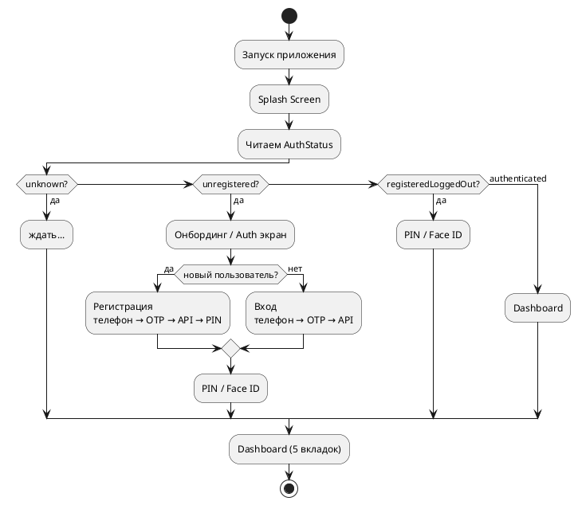
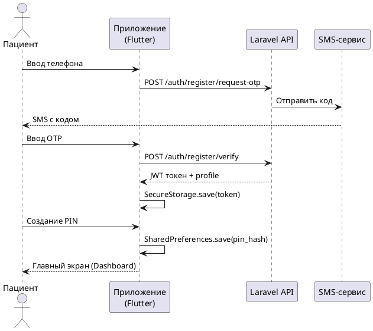
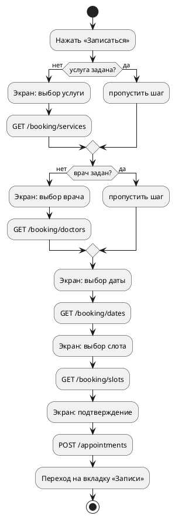
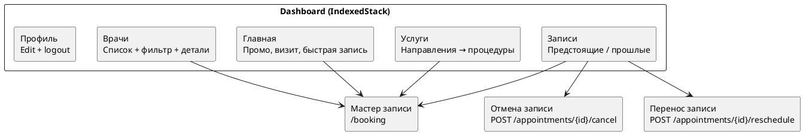
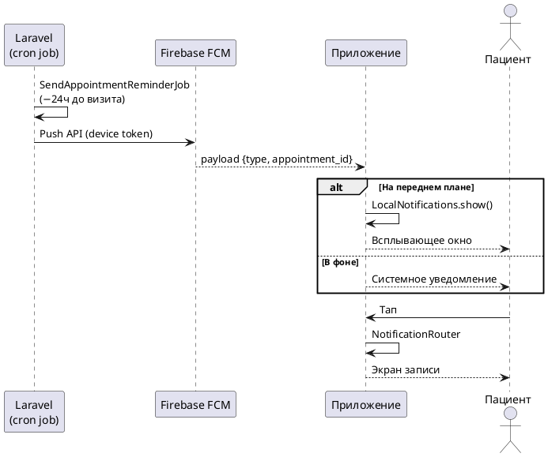
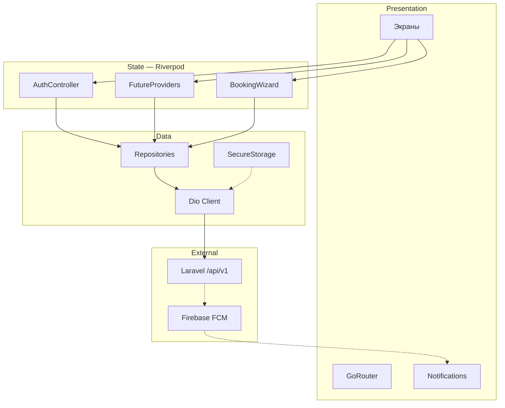
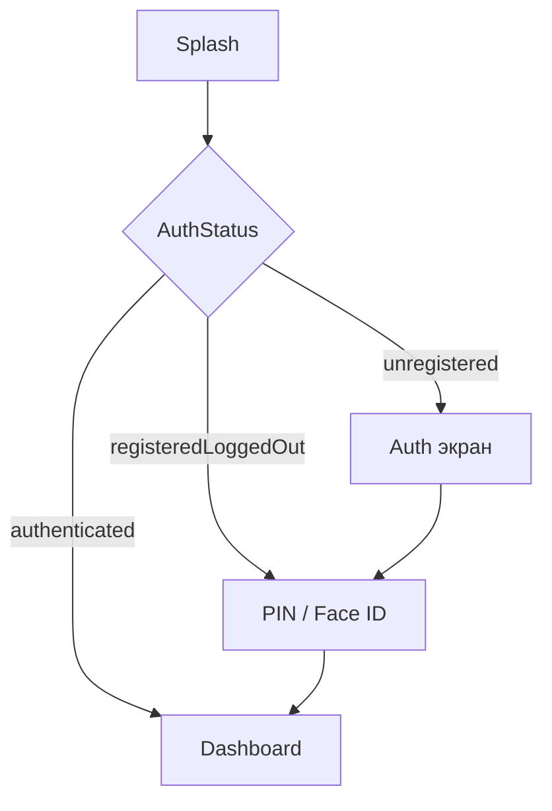
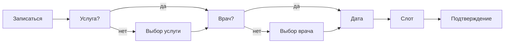
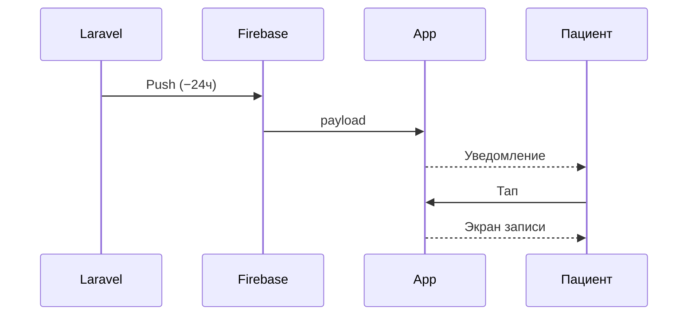

# Презентация дипломной работы: мобильное приложение «Маяк Здоровья»

**Платформа:** Flutter / Android  
**Стек:** Riverpod 2.x · GoRouter · Dio · Firebase FCM · Laravel REST API  
**Хронометраж:** ~10–12 минут (11 слайдов, ~55–65 сек на слайд)  
**Принцип:** на экране — скриншоты устройства и схемы; без кода  
**Веб-сайт:** отдельная презентация (`presentation-site-diploma.md`)

---

## Оглавление

1. [Слайды: визуал и текст доклада](#слайды-визуал-и-текст-доклада)
2. [Чеклист скриншотов](#чеклист-скриншотов)
3. [Схемы для слайдов (draw.io / Mermaid)](#схемы-для-слайдов)
4. [Вопросы комиссии и защита](#вопросы-комиссии-и-защита)
5. [Live-демо](#live-демо)

---

## Слайды: визуал и текст доклада

---

### Слайд 1. Титульный (~30 сек)

**На слайде:**
- Название дипломной работы
- ФИО, группа, год, научный руководитель
- Подзаголовок: *Мобильное приложение для пациентов медицинского центра «Маяк Здоровья»*
- Справа: скрин главного экрана приложения на телефоне (mockup iPhone/Android frame)
- Строка внизу: *Flutter · Android · Laravel REST API*

**Текст доклада:**

> Уважаемые члены комиссии! Тема моей дипломной работы — [название]. Объект разработки — мобильное приложение для пациентов клиники «Маяк Здоровья» компании ООО «ЗАРГА Медика». Сегодня я покажу, как спроектировано и реализовано приложение: от регистрации по SMS до онлайн-записи к врачу и push-уведомлений о предстоящем визите.

---

### Слайд 2. Задача, аудитория и результат (~55 сек)

**На слайде:**
- **Слева:** проблема — пациент звонит, ждёт, записывается через администратора
- **Стрелка →**
- **Справа:** коллаж 3 скринов (онбординг / домашний экран / запись)
- Аудитория: *пациенты клиники, Android-устройства, русский язык*
- Задачи (4 пункта):
  - Регистрация и безопасный вход по OTP
  - Онлайн-запись к врачу со слотами
  - Управление записями и профилем
  - Push-уведомления о визитах

**Текст доклада:**

> До появления приложения пациент звонил в регистратуру или использовал веб-сайт только с компьютера. Цель работы — дать пациенту инструмент в кармане: посмотреть врачей, выбрать удобное время, записаться и получить напоминание. Приложение работает на Android, интерфейс полностью на русском языке. Логика записи на стороне сервера — это тот же Laravel-бэкенд, что обслуживает веб-сайт, поэтому данные едины для всех каналов.

**Скриншоты:** онбординг (3 страницы), home-экран.

---

### Слайд 3. Архитектура приложения (~65 сек)

**На слайде:**
- Схема: [4-слойная архитектура](#схема-1--4-слойная-архитектура-слайд-3) — основная схема из `mobile-architecture.html`
- Подписи слоёв: Presentation · State · Data · External
- Краткий список под схемой:
  - Presentation: Flutter Widgets, GoRouter
  - State: Riverpod (AuthController, BookingWizard, FutureProviders)
  - Data: Repositories, Dio Client, SecureStorage
  - External: Laravel API, MySQL, Firebase FCM

**Текст доклада:**

> Приложение построено по четырёхслойной архитектуре. Верхний слой — Presentation: экраны и виджеты Flutter, навигация через GoRouter. Под ним — слой State: всё состояние управляется библиотекой Riverpod; здесь живут контроллер авторизации, мастер записи и провайдеры данных для списков. Ниже — слой Data: репозитории, которые делают запросы через Dio, и безопасное хранилище для JWT-токена. Внешний слой — сервер Laravel с MySQL и Firebase для push. Такая структура разделяет ответственность: экраны не знают про HTTP, а репозитории не знают про виджеты.

**Схема:** Используйте [Схему 1](#схема-1--4-слойная-архитектура-слайд-3) или откройте `mobile-architecture.html` напрямую — там готовая интерактивная диаграмма.

---

### Слайд 4. Навигация и жизненный цикл сессии (~60 сек)

**На слайде:**
- Схема: [GoRouter + Auth Guard](#схема-2--gorouter-и-auth-guard-слайд-4)
- Статусы сессии (4 состояния):
  - `unknown` → только Splash
  - `unregistered` → онбординг / регистрация
  - `registeredLoggedOut` → PIN / Face ID
  - `authenticated` → Dashboard
- Скрин: экран PIN-кода или onboarding

**Текст доклада:**

> Навигация реализована через GoRouter с охранником авторизации. При каждом переходе охранник проверяет текущий статус сессии и решает, куда направить пользователя. Если приложение запущено впервые — онбординг и регистрация. Если пользователь уже зарегистрирован, но сессия закрыта — экран PIN или биометрии. Только после успешной проверки открывается основной экран. Это значит, что маршруты защищены на уровне навигации, а не в каждом экране отдельно. Статус сессии хранится в `AuthController` (Riverpod) и автоматически обновляет роутер.

---

### Слайд 5. Регистрация и вход (~65 сек)

**На слайде:**
- Схема: [OTP + PIN-поток](#схема-3--регистрация-и-вход-otp--pin-слайд-5)
- **3–4 скрина в ряд:**
  1. Экран ввода телефона
  2. Экран OTP
  3. Создание PIN
  4. (опционально) Face ID
- Подпись: *«Без пароля — только телефон и PIN»*

**Текст доклада:**

> Вход и регистрация реализованы без традиционного пароля. Пользователь вводит номер телефона, получает SMS с одноразовым кодом — это стандарт Sanctum Laravel API. После верификации сервер возвращает JWT-токен, который сохраняется в зашифрованном хранилище устройства. Затем пользователь создаёт короткий PIN для быстрого входа при следующих запусках; опционально подключается биометрия Face ID или Touch ID. Это двухуровневая защита: удалённая авторизация по OTP и локальная по PIN. Токен при выходе инвалидируется через `POST /me/logout`.

**Скриншоты:** auth-экран, ввод телефона, OTP, PIN.

---

### Слайд 6. Онлайн-запись — мастер шагов (~70 сек)

**На слайде:**
- Схема: [мастер записи](#схема-4--мастер-записи-слайд-6) (5 шагов)
- **5 скринов ①②③④⑤:**
  1. Выбор услуги
  2. Выбор врача
  3. Выбор даты
  4. Выбор слота времени
  5. Подтверждение
- Подпись: *«Глубокие ссылки: врач или услуга пропускают соответствующий шаг»*

**Текст доклада:**

> Мастер онлайн-записи — главная функция приложения. Пользователь проходит до пяти шагов: выбирает услугу, потом врача, потом дату, свободный слот и подтверждает. Состояние всего мастера хранится в одном Riverpod-провайдере `BookingWizard`. Если пользователь нажал «Записаться» прямо с карточки врача или услуги — соответствующий шаг пропускается автоматически, нужные данные уже переданы через параметры маршрута. Для переноса существующей записи шаги «выбор услуги» и «выбор врача» тоже пропускаются — остаётся только выбрать новое время. После подтверждения приложение переходит на вкладку «Записи».

**Скриншоты:** каждый из 5 шагов; переход на вкладку Записи.

---

### Слайд 7. Личный кабинет — 5 вкладок (~60 сек)

**На слайде:**
- Схема: [структура Dashboard](#схема-5--dashboard-5-вкладок-слайд-7)
- **5 мини-скринов** по вкладкам:
  1. Главная (промо, предстоящий визит)
  2. Врачи (список + фильтр)
  3. Услуги (направления → список)
  4. Записи (предстоящие / прошлые)
  5. Профиль (редактирование)
- Нижнее меню видно на каждом скрине

**Текст доклада:**

> После входа пользователь попадает в личный кабинет с пятью вкладками. Главный экран — сводка: ближайший визит, промо-акции, быстрый переход к записи. Вкладка «Врачи» — каталог с карточками и фильтрацией; с каждой карточки можно сразу начать запись. «Услуги» — список направлений медицины и конкретных процедур. «Записи» — история визитов с возможностью отменить или перенести. «Профиль» — просмотр и редактирование личных данных, синхронизация с сервером через `PATCH /me`. Все вкладки реализованы через `IndexedStack`, чтобы не перестраивать экраны при переключении.

**Скриншоты:** все 5 вкладок; детальный экран записи (отмена/перенос).

---

### Слайд 8. Push-уведомления (~55 сек)

**На слайде:**
- Схема: [цепочка FCM](#схема-6--push-уведомления-fcm-слайд-8)
- **2 скрина:**
  1. Уведомление в шторке Android
  2. Экран записи после тапа на уведомление
- Подпись: *«Напоминание за 24 ч до визита → тап → экран записи»*

**Текст доклада:**

> Push-уведомления работают через Firebase Cloud Messaging. Сервер Laravel за 24 часа до приёма запускает фоновую задачу, которая отправляет push через FCM на устройство пациента. Приложение принимает уведомление в любом состоянии: на переднем плане показывает локальное всплывающее окно, в фоне — системное уведомление. При тапе на уведомление маршрутизатор анализирует payload и открывает нужный экран — например, детали конкретной записи. FCM-токен устройства регистрируется на сервере через `POST /devices/register` при первом входе и обновляется при смене токена.

**Скриншоты:** уведомление Android, экран после тапа.

---

### Слайд 9. Интеграция с Laravel API (~55 сек)

**На слайде:**
- Схема: [API-запросы и авторизация](#схема-7--dio-и-laravel-api-слайд-9)
- Таблица групп эндпоинтов (коротко):

| Группа | Примеры |
|--------|---------|
| Авторизация | `/auth/register/...`, `/auth/login/...`, `/me` |
| Запись | `/booking/services`, `/booking/slots`, `POST /appointments` |
| Управление | `PATCH /me`, `/appointments/{id}/cancel`, `/reschedule` |
| Контент | `/doctors`, `/service-directions`, `/articles`, `/promotions` |
| Устройство | `POST /devices/register` |

**Текст доклада:**

> Все запросы к серверу идут через единый Dio-клиент с Bearer-интерцептором: токен из зашифрованного хранилища автоматически добавляется к каждому запросу. API поделено на группы: авторизация, бронирование, управление записями, контент и регистрация устройства. Мобильное приложение и веб-сайт используют один и тот же `/api/v1` — это значит, что данные синхронизируются: запись через сайт видна в приложении и наоборот. При ошибке 401 пользователь получает статус `UnauthorizedException` и перенаправляется к экрану входа.

---

### Слайд 10. Итоги (~45 сек)

**На слайде:**
- Мозаика 2×3 скринов: онбординг, вход, главная, запись (шаг 3), записи, профиль
- Галочки:
  - ✓ Регистрация и вход по OTP + PIN + биометрия
  - ✓ Полный мастер онлайн-записи
  - ✓ Личный кабинет (5 вкладок)
  - ✓ Отмена и перенос записей
  - ✓ Push-уведомления FCM
  - ✓ Единый API с веб-сайтом
- Стек одной строкой: Flutter · Dart · Riverpod · GoRouter · Dio · Firebase

**Текст доклада:**

> В результате разработано мобильное приложение, которое закрывает полный цикл взаимодействия пациента с клиникой: от регистрации и выбора врача до напоминания о визите. Приложение работает на Android, русский интерфейс, Material 3 дизайн. Данные всегда актуальны — бэкенд общий с веб-сайтом. Технологический стек: Flutter и Dart, состояние через Riverpod, навигация GoRouter, сеть Dio, push Firebase.

---

### Слайд 11. Заключение (~30 сек)

**На слайде:**
- Скрин главного экрана (как на титуле)
- Цель достигнута · практическая значимость для клиники
- **Спасибо за внимание! Готов ответить на вопросы.**

**Текст доклада:**

> Цель работы достигнута: пациент может самостоятельно записаться к врачу с телефона в любое время, получить подтверждение и напоминание. Практическая значимость — для медицинского центра «Маяк Здоровья». Спасибо за внимание, готов ответить на вопросы.

---

## Чеклист скриншотов

Снимать на реальном устройстве или эмуляторе в режиме **portrait, без полосы разработчика**.

| № | Экран | Файл |
|---|-------|------|
| 1 | Онбординг (3 страницы) | `01-onboarding.png` |
| 2 | Экран входа (телефон) | `02-auth.png` |
| 3 | Экран OTP | `03-otp.png` |
| 4 | Экран PIN | `04-pin.png` |
| 5 | Главный экран (home tab) | `05-home.png` |
| 6 | Список врачей | `06-doctors.png` |
| 7 | Карточка врача | `07-doctor-detail.png` |
| 8 | Шаг 1 записи (услуга) | `08-booking-service.png` |
| 9 | Шаг 3 записи (дата/слот) | `09-booking-slot.png` |
| 10 | Подтверждение записи | `10-booking-confirm.png` |
| 11 | Список записей | `11-appointments.png` |
| 12 | Детали записи | `12-appointment-detail.png` |
| 13 | Профиль | `13-profile.png` |
| 14 | Уведомление Android | `14-notification.png` |

**Перед вставкой:** заблюрить ФИО, телефон, личные данные.

---

## Схемы для слайдов

Для вставки в draw.io: [app.diagrams.net](https://app.diagrams.net) → **+** → **Расширенные** → **Mermaid** или **PlantUML** → вставить код → **Вставить** → Экспорт PNG.

Основная архитектурная схема — открыть в браузере готовый файл `mobile-architecture.html` → `Ctrl+PrintScreen` или `Ctrl+P` → PDF → вставить в PPT.

---

### Схема 1 — 4-слойная архитектура (слайд 3)

**Mermaid:**

```
flowchart TB
    subgraph presentation [Presentation]
        Phone[Телефон Android]
        Main[main.dart]
        Router[GoRouter]
        Screens[Экраны UI]
        LocalNotif[Local Notifications]
    end

    subgraph state [State — Riverpod]
        AuthCtrl[AuthController]
        FutureP[FutureProviders]
        Booking[BookingWizard]
    end

    subgraph data [Data]
        Repos[Репозитории]
        Dio[Dio Client]
        Storage[SecureStorage JWT]
    end

    subgraph external [External]
        API[Laravel API /api/v1]
        DB[(MySQL)]
        FCM[Firebase FCM]
    end

    Phone --> Main --> Router --> Screens
    Router <-->|AuthStatus| AuthCtrl
    Screens <-->|watch| FutureP
    Screens <-->|watch| Booking
    AuthCtrl --> Repos
    FutureP --> Repos
    Booking --> Repos
    AuthCtrl -.->|JWT| Storage
    Repos --> Dio
    Storage -.->|JWT| Dio
    Dio <--> API
    API --> DB
    API -.->|push| FCM
    FCM -.->|уведомление| LocalNotif
    LocalNotif -.->|тап| Screens
```

**PlantUML:**

```plantuml
@startuml schema1_mobile_arch
top to bottom direction

package "Presentation" {
  [Телефон Android] as Phone
  [main.dart\nProviderScope] as Main
  [GoRouter\nAuth Guard] as Router
  [Экраны UI] as Screens
  [Local Notifications] as LocalNotif
}

package "State — Riverpod" {
  [AuthController\nStateNotifier] as AuthCtrl
  [FutureProviders\ndoctors · booking] as FutureP
  [BookingWizard\nNotifierProvider] as Booking
}

package "Data" {
  [Репозитории] as Repos
  [Dio Client\nBearer JWT] as Dio
  [SecureStorage\nJWT токен] as Storage
}

cloud "External" {
  [Laravel API /api/v1] as API
  database "MySQL" as DB
  [Firebase FCM] as FCM
}

Phone --> Main --> Router --> Screens
Router <--> AuthCtrl : AuthStatus
Screens <--> FutureP : watch()
Screens <--> Booking : watch()
AuthCtrl --> Repos
FutureP --> Repos
Booking --> Repos
AuthCtrl ..> Storage : JWT
Repos --> Dio
Storage ..> Dio : JWT
Dio <--> API : REST/JSON
API --> DB
API ..> FCM : SendReminder
FCM ..> LocalNotif : push
LocalNotif ..> Screens : tap → deep link
@enduml
```

---

### Схема 2 — GoRouter и Auth Guard (слайд 4)

**Mermaid:**

```
flowchart TD
    Start[Запуск приложения] --> Splash[Splash Screen]
    Splash --> Check{AuthStatus?}

    Check -->|unknown| Splash
    Check -->|unregistered| Auth[Auth / Онбординг]
    Check -->|registeredLoggedOut| Lock[PIN / Face ID]
    Check -->|authenticated| Dashboard[Dashboard]

    Auth --> Reg[Регистрация\nтелефон → OTP → PIN]
    Auth --> Login[Вход\nтелефон → OTP]
    Reg --> Lock
    Login --> Lock
    Lock -->|успех| Dashboard
    Dashboard -->|выход| Auth
```

**PlantUML:**



---

### Схема 3 — Регистрация и вход: OTP + PIN (слайд 5)

**Mermaid:**

```
sequenceDiagram
    participant U as Пациент
    participant A as Приложение
    participant S as Сервер Laravel
    participant SMS as SMS

    U->>A: Ввод телефона
    A->>S: POST /auth/register/request-otp
    S->>SMS: Отправка кода
    SMS-->>U: SMS с кодом
    U->>A: Ввод OTP
    A->>S: POST /auth/register/verify
    S-->>A: JWT токен + данные пациента
    A->>A: SecureStorage.save(token)
    U->>A: Создание PIN
    A->>A: SharedPreferences.save(pin)
    A-->>U: Dashboard
```

**PlantUML:**



---

### Схема 4 — Мастер записи (слайд 6)

**Mermaid:**

```
flowchart LR
    Entry[Нажать\nЗаписаться]

    Entry --> CheckS{Услуга\nизвестна?}
    CheckS -->|нет| StepS[Выбор услуги]
    CheckS -->|да| CheckD{Врач\nизвестен?}
    StepS --> CheckD

    CheckD -->|нет| StepD[Выбор врача]
    CheckD -->|да| StepDate[Выбор даты]
    StepD --> StepDate

    StepDate --> StepSlot[Выбор слота]
    StepSlot --> Confirm[Подтверждение]
    Confirm --> API[POST /appointments]
    API --> Done[Вкладка Записи]
```

**PlantUML:**



---

### Схема 5 — Dashboard: 5 вкладок (слайд 7)

**Mermaid:**

```
flowchart TD
    Dashboard[Dashboard\nIndexedStack]

    Dashboard --> Tab0[Главная\nПромо · визит · быстрая запись]
    Dashboard --> Tab1[Врачи\nСписок · фильтр · детали]
    Dashboard --> Tab2[Услуги\nНаправления · список]
    Dashboard --> Tab3[Записи\nПредстоящие · прошлые]
    Dashboard --> Tab4[Профиль\nРедактирование · выход]

    Tab0 --> Booking[Мастер записи /booking]
    Tab1 --> Booking
    Tab2 --> Booking
    Tab3 --> Cancel[Отмена записи]
    Tab3 --> Reschedule[Перенос записи]
    Tab3 --> Booking
```

**PlantUML:**



---

### Схема 6 — Push-уведомления FCM (слайд 8)

**Mermaid:**

```
sequenceDiagram
    participant L as Laravel (cron)
    participant FCM as Firebase FCM
    participant App as Приложение
    participant U as Пациент

    L->>L: SendAppointmentReminderJob\n(за 24 ч до визита)
    L->>FCM: HTTP Push API (токен устройства)
    FCM-->>App: Payload {type: appointment, id}

    alt Приложение на переднем плане
        App->>App: LocalNotificationsService\n.showFromPayload()
        App-->>U: Всплывающее окно
    else Приложение в фоне / закрыто
        App-->>U: Системное уведомление Android
    end

    U->>App: Тап на уведомление
    App->>App: NotificationRouter\nанализирует payload
    App-->>U: Экран деталей записи
```

**PlantUML:**



---

### Схема 7 — Dio и Laravel API (слайд 9)

**Mermaid:**

```
flowchart LR
    subgraph app [Мобильное приложение]
        Repo[Repository]
        Dio[Dio Client]
        Interceptor[AuthInterceptor\nBearer JWT]
        Storage[SecureStorage\nJWT токен]
    end

    subgraph server [Сервер]
        API[Laravel /api/v1]
        Sanctum[Sanctum Guard]
        DB[(MySQL)]
    end

    Repo --> Dio
    Storage -.->|читает токен| Interceptor
    Interceptor --> Dio
    Dio -->|Authorization: Bearer| API
    API --> Sanctum --> DB
    DB -.->|JSON| API -.->|response| Dio
```

**PlantUML:**

```plantuml
@startuml schema7_dio
package "Приложение" {
  [Repository] as Repo
  [Dio Client] as Dio
  [AuthInterceptor] as Inter
  [SecureStorage] as Store
}

package "Сервер" {
  [Laravel /api/v1] as API
  [Sanctum] as Sanctum
  database "MySQL" as DB
}

Repo --> Dio
Store ..> Inter : JWT token
Inter --> Dio
Dio --> API : Bearer token
API --> Sanctum --> DB
DB ..> API
API ..> Dio : JSON response
@enduml
```

---

### Схема 8 — Полный пользовательский путь (для вопросов)

**Mermaid:**

```
flowchart TD
    Install[Установка приложения] --> Onboard[Онбординг]
    Onboard --> Register[Регистрация: OTP + PIN]
    Register --> Home[Главный экран]

    Home --> FindDoctor[Найти врача/услугу]
    FindDoctor --> Book[Мастер записи]
    Book --> Confirm[Запись создана]
    Confirm --> Cabinet[Кабинет: предстоящие]

    Cabinet --> Push[Push за 24ч]
    Push --> Visit[Визит в клинику]
    Visit --> History[История записей]
```

---

### Просмотр схем в Markdown (preview в VS Code)

#### Схема: 4 слоя (preview)



#### Схема: Auth Guard (preview)



#### Схема: Мастер записи (preview)



#### Схема: FCM-цепочка (preview)



---

## Вопросы комиссии и защита

---

### 1. Типовые вопросы

#### Предметная область

| Вопрос | Как отвечать |
|--------|--------------|
| Почему Flutter, а не нативное Android? | Один код = Android (и в перспективе iOS). Dart строго типизирован, производительность на JIT/AOT сравнима с нативным. |
| Почему именно Android? | Целевая аудитория — СНГ, там Android > 70% рынка. Платформа Flutter позволит добавить iOS без переписывания логики. |
| Чем отличается от веб-записи? | Мобильное приложение + Push-напоминания + PIN/биометрия + офлайн-кэш контента. |
| Для кого это приложение? | Пациенты клиники: регистрация, запись, история визитов. Не для сотрудников. |

#### Архитектура

| Вопрос | Как отвечать |
|--------|--------------|
| Почему Riverpod, а не Bloc или Provider? | Riverpod — современный Dart-first подход. Нет BuildContext в логике, провайдеры компонуются, тестировать легче чем Bloc без шаблонного кода. `flutter_riverpod ^2.6.1`. |
| Почему GoRouter, а не Navigator 2.0? | GoRouter — официальный пакет Flutter team. Декларативные маршруты, deep links, redirect guard, не нужно вручную управлять стеком. |
| Что такое Auth Guard? | Функция `redirect` в GoRouter смотрит на `AuthStatus` из `AuthController` и автоматически перенаправляет при каждом переходе. |
| Repository pattern — зачем? | Экраны и провайдеры не знают про HTTP; при смене API достаточно заменить репозиторий. |

#### Безопасность

| Вопрос | Как отвечать |
|--------|--------------|
| Как хранится JWT? | `flutter_secure_storage` — зашифрованное хранилище (Android Keystore). Не в SharedPreferences и не в коде. |
| Что будет, если украдут телефон? | Экран блокировки: PIN или Face ID. Без PIN токен читается, но экранов нет. Добавить принудительный logout по таймауту — направление развития. |
| Как защищён OTP? | Логика на сервере (Laravel): throttle по IP и телефону, срок кода 15 мин, одноразовость. |
| Refresh token? | JWT хранится, refresh token не задействован (есть в `SecureStorage`, но автоматического refresh-interceptor нет). При 401 — экран входа. Это слабое место, см. раздел ниже. |

#### Запись

| Вопрос | Как отвечать |
|--------|--------------|
| Как приложение знает, когда врач свободен? | `GET /booking/slots?doctor=&service=&date=` — сервер считает слоты из расписания и возвращает список свободных времён. |
| Можно ли записаться на занятое время? | Нет — слоты возвращает сервер; финальная проверка конфликта — в `BookingService` Laravel с блокировкой строки. |
| Что такое reschedule? | Перенос: `POST /appointments/{id}/reschedule` с новым `start_at`; старая запись отменяется. |

#### Push и Firebase

| Вопрос | Как отвечать |
|--------|--------------|
| Как FCM знает токен устройства? | При первом входе `POST /devices/register {fcm_token, platform}`. При обновлении токена — `onTokenRefresh`. |
| Что если уведомление пришло, когда телефон выключен? | FCM держит очередь до 4 недель; при следующем запуске уведомление доставляется через `getInitialMessage`. |
| Какие уведомления реализованы? | Напоминание за 24 ч до визита (прото-тип). Тип `appointment` в payload маршрутизируется в `NotificationRouter`. |

---

### 2. Реальные слабые места

| № | Слабое место | Факт из кода | Риск |
|---|--------------|-------------|------|
| 1 | **Нет тестов** | Нет `test/` директории, нет `*_test.dart` | «Как проверяли?» |
| 2 | **Нет refresh token** | `readRefreshToken()` есть в Storage, но нет Dio-интерцептора | При протухании JWT — просто выход |
| 3 | **OTP-демо `111111`** | На стороне сервера (см. `PatientOtpService`) | Вопрос «это реальный SMS?» |
| 4 | **Firebase по умолчанию включён** | `kFirebaseEnabled = true`, но нужен `google-services.json` | Без файла приложение не соберётся |
| 5 | **Placeholder-пункты в профиле** | «Уведомления», «Безопасность», «Помощь» — UI есть, логика не подключена | «Эти разделы работают?» |
| 6 | **Нет кэша** | Каждый экран делает fetch заново, нет локального DB (Hive/Isar) | «Что видит пользователь без сети?» |
| 7 | **Только Android** | `pubspec.yaml` цель — Android; iOS возможен но не тестировался | «На iPhone работает?» |
| 8 | **Нет сортировки/фильтрации по дате** | Список записей разбит на upcoming/past, но сортировки нет | «Как найти запись трёхлетней давности?» |
| 9 | **Токен не инвалидируется при удалении** | Нет вызова `/me/logout` при удалении приложения | Теоретическая уязвимость |
| 10 | **Хардкод base URL в debug** | `10.0.2.2:8000` в `dio_client.dart` для эмулятора | Надо `--dart-define=API_BASE` для prod |

---

### 3. Как защищаться по слабым местам

#### 1. Нет тестов

> «Тестирование проводилось вручную: все сценарии — онбординг, OTP, запись, отмена, push — проверены на реальном устройстве. Автоматические тесты — следующий этап: Riverpod упрощает их написание через `ProviderContainer.overrideWith`. Это сознательный компромисс для MVP.»

---

#### 2. Нет refresh token

> «JWT-токен хранится в защищённом хранилище. При истечении срока пользователь проходит повторный вход — это стандартная практика для мобильных MVP. Refresh token уже предусмотрен в `SecureStorage`, автоматическое обновление — следующий шаг.»

---

#### 3. OTP `111111`

> «Логика OTP на сервере; на демо используется фиксированный код. Для production на сервере подключается SMS-провайдер — интерфейс `SmsSender` уже есть, нужен только ключ. С точки зрения приложения изменений нет.»

---

#### 4. Firebase без `google-services.json`

> «Firebase настраивается через конфигурационный файл, который не хранится в репозитории — это стандарт безопасности. Для демо файл добавлен локально; флаг `USE_FIREBASE=false` позволяет запустить без Firebase.»

---

#### 5. Placeholder-пункты профиля

> «Разделы "Уведомления", "Безопасность" и "Помощь" — спроектированы в UI для полноты интерфейса. Функциональность планируется в следующей итерации.»

---

#### 6. Нет кэша (офлайн)

> «Текущая версия требует подключения. Это осознанное решение для MVP — упростить архитектуру. Локальный кэш через Hive или Isar — направление развития. Flutter имеет хорошую экосистему для этого.»

---

#### 7. Только Android

> «Flutter по умолчанию кроссплатформенный; добавление iOS сводится к конфигурации и тестированию. В рамках работы выбран Android как приоритетная платформа для целевой аудитории в Беларуси.»

---

#### 10. Хардкод base URL

> «Base URL конфигурируется через `--dart-define=API_BASE` при сборке. В debug режиме стоит адрес эмулятора `10.0.2.2`; для staging и production заменяется без правки кода.»

---

### 4. Сильные стороны (противовес слабым)

- **4-слойная архитектура** — чистое разделение экранов, состояния, данных
- **Riverpod 2.x** — современный, тестируемый state management
- **GoRouter + Auth Guard** — навигация и безопасность в одном месте
- **Двойная защита** — OTP + JWT (сервер) + PIN/биометрия (устройство)
- **Единый API** с веб-сайтом — одни данные, нет дублирования логики
- **FCM + `NotificationRouter`** — нажатие уведомления открывает нужный экран
- **Deep links** в мастере записи — запись с 1 тапа из уведомления или промо

Фраза-якорь:

> «Слабости — в основном **production-конфигурация** (SMS, Firebase json) и отсутствие автотестов. Архитектура и пользовательские сценарии реализованы и проверены вручную.»

---

### 5. Краткая шпаргалка (30 сек)

| Вопрос | Одна фраза |
|--------|------------|
| Почему Flutter? | Один код для Android (и iOS), производительность близкая к нативной |
| State management? | Riverpod 2.x — провайдеры, FutureProvider, StateNotifier |
| Навигация? | GoRouter с Auth Redirect Guard |
| OTP? | Сервер Laravel + Sanctum; фиксированный код только в dev |
| Слоты? | Сервер считает по расписанию; двойная запись — блокировка на сервере |
| JWT? | `flutter_secure_storage`; refresh — следующий этап |
| Push? | Firebase FCM → LocalNotif → `NotificationRouter` → нужный экран |
| Тесты? | Ручные; Riverpod упрощает unit-тесты как следующий шаг |
| Только Android? | Целевая аудитория; iOS — конфигурация, не переписывание |
| Связь с вебом? | Тот же `/api/v1`, данные едины |

---

### 6. Чеклист перед защитой

- [ ] Запущен эмулятор или подключено реальное устройство
- [ ] В БД есть врач с расписанием на «завтра»
- [ ] Пройдена полная цепочка: вход → запись → кабинет
- [ ] Проверена работа уведомлений (или подготовлен скрин)
- [ ] Записано видео-демо 3–4 мин
- [ ] Скрины без личных данных
- [ ] `google-services.json` добавлен (или Firebase выключен)
- [ ] Продуманы ответы на OTP, тесты, refresh token

---

## Live-демо

**Сценарий 3–4 мин:**

1. Запуск → онбординг (пролистать быстро)
2. Регистрация: телефон → `111111` → PIN
3. Главный экран → «Записаться»
4. Мастер: услуга → врач → дата → слот → подтвердить
5. Вкладка «Записи» → предстоящий визит
6. (опционально) Детали → «Отменить» или «Перенести»
7. (опционально) Профиль → данные

Заранее записать **видео 3 мин** на случай проблем с эмулятором.

---

## Оформление PowerPoint

- Скрины мобильного в **рамке телефона** (mockup) — выглядит профессионально
- Инструмент: [MockUPhone](https://mockuphone.com) или Figma (добавить устройство вокруг скрина)
- 3–4 скрина на слайде — не больше
- Подписи под скринами крупно — 16+ pt
- Схема и скрины на одном слайде: схема слева (40%), скрины справа (60%)

---

## Связанные файлы в проекте

| Файл | Назначение |
|------|------------|
| `mobile-architecture.html` | Готовая интерактивная схема 4 слоёв |
| `mobileApp/pubspec.yaml` | Зависимости и версии |
| `mobileApp/lib/app/router.dart` | GoRouter + Auth Guard |
| `mobileApp/lib/features/auth/` | AuthController, AuthState |
| `mobileApp/lib/features/booking/` | Мастер записи |
| `mobileApp/lib/features/dashboard/` | 5 вкладок |
| `mobileApp/lib/core/notifications/` | FCM |
| `mobileApp/lib/core/network/dio_client.dart` | Dio + интерцептор |

---

*Документ подготовлен для защиты дипломной работы. Веб-сайт (`site/`) — отдельная презентация (`presentation-site-diploma.md`).*
