# Презентация дипломной работы: веб-ресурс медицинской клиники «Маяк Здоровья»

**Проект:** `site/` (Laravel 13)  
**Хронометраж:** ~7–8 минут (9 слайдов, ~45–50 сек на слайд)  
**Принцип:** на экране — скриншоты и схемы, без кода  
**Мобильное приложение:** отдельная презентация (не включать)

---

## Оглавление документа

1. [Слайды: визуал и текст доклада](#слайды-визуал-и-текст-доклада)
2. [Чеклист скриншотов](#чеклист-скриншотов)
3. [Схемы для слайдов](#схемы-для-слайдов-код-для-drawio-и-др)
4. [Вопросы комиссии и защита](#вопросы-комиссии-и-защита)
5. [Live-демо](#live-демо)

---

## Слайды: визуал и текст доклада

### Слайд 1. Титульный (~30 сек)

**На слайде:**
- Название дипломной работы
- ФИО, группа, год, научный руководитель
- Подзаголовок: *Веб-приложение медицинского центра «Маяк Здоровья» (ООО «ЗАРГА Медика»)*
- Справа или фоном: скрин главной с кнопкой «Записаться»

**Текст доклада:**

> Уважаемые члены комиссии! Тема моей дипломной работы — [название]. Объект — веб-ресурс медицинской клиники «Маяк Здоровья». Сегодня покажу, как спроектирован и реализован сайт с онлайн-записью и личным кабинетом пациента.

---

### Слайд 2. Задача и результат (~50 сек)

**На слайде:**
- Слева: «Было» — старый сайт / иконка «информация + звонок»
- Стрелка →
- Справа: коллаж «Стало» (главная, запись, кабинет)
- Подписи: информация · **онлайн-запись** · **личный кабинет** · **CRM**
- Схема: [Было → Стало](#схема-1--было--стало-слайд-2) (опционально)

**Текст доклада:**

> Раньше сайт в основном информировал о клинике — пациент звонил в регистратуру, чтобы записаться. Цель работы — портал с каталогом услуг, онлайн-записью на конкретное время, личным кабинетом и передачей заявок в CRM. На слайде видно, что изменилось для пациента и для администраторов.

---

### Слайд 3. Публичный сайт (~50 сек)

**На слайде:**
- Крупно: главная `/`
- Снизу 3 мини-скрина: `/doctors`, страница услуги, mega-меню в шапке
- Схема: [структура сайта](#схема-3--структура-публичного-сайта-слайд-3)
- Строка: *«Врачи, услуги, блог, акции, контакты»*

**Текст доклада:**

> Публичная часть — информационный портал на русском языке. Единый дизайн, адаптивная вёрстка под телефон и компьютер. Пациент видит врачей с отзывами, направления медицины, цены и подготовку к процедурам. Страницы формируются на сервере — это удобно для поисковых систем. С любой страницы услуги или врача можно перейти к записи.

**Скриншоты:** `/`, `/doctors`, `/services/{slug}`, кроп header.

---

### Слайд 4. Онлайн-запись (~60 сек)

**На слайде:**
- 4 скрина ①②③④: старт → выбор → календарь/слоты → подтверждение
- Прогресс-бар мастера виден на скринах
- Схема: [путь записи](#схема-4--путь-онлайн-записи-слайд-4)
- Подпись: *«Запись без звонка в регистратуру»*

**Текст доклада:**

> Ключевая функция — мастер онлайн-записи. Пациент начинает с услуги или врача, система показывает только подходящих специалистов, затем — календарь со свободными слотами по расписанию и длительности приёма. Перед подтверждением нужен вход в аккаунт. На экране — весь путь пользователя за несколько шагов.

**Скриншоты:** `/booking/start` → выбор → `/booking/slot` → confirm.

---

### Слайд 5. Вход и личный кабинет (~50 сек)

**На слайде:**
- Слева: экран OTP (SMS)
- Справа: `/cabinet` — список записей
- Схема: [OTP](#схема-6--вход-по-otp-слайд-5) (опционально)

**Текст доклада:**

> Регистрация и вход по номеру телефона и коду из SMS — без пароля. После входа — личный кабинет: просмотр записей, отмена и перенос визита, редактирование профиля. Статус синхронизации с CRM виден пациенту — заявка принята клиникой.

**Скриншоты:** `/patient/login` или OTP, `/cabinet`.

---

### Слайд 6. Панель администратора (~45 сек)

**На слайде:**
- Крупно: Filament `/admin` (врачи или услуга)
- Стрелка → тот же врач на `/doctors/{slug}`
- Схема: [Filament → сайт](#схема-8--filament--публичный-сайт-слайд-6)
- Подпись: *«Контент без программиста»*

**Текст доклада:**

> Для сотрудников клиники — панель Filament: врачи, услуги, акции, блог, заявки с контактов, настройки телефонов и адреса. Изменения сразу появляются на сайте, без правки кода.

**Скриншоты:** `/admin` + публичная карточка врача.

---

### Слайд 7. Архитектура и CRM (~50 сек)

**На слайде:**
- Схема: [архитектура](#схема-2--общая-архитектура-слайд-7) или [Laravel ↔ EspoCRM](#схема-7--laravel-и-espocrm-слайд-7)
- Тезис: *«Запись сохраняется даже при недоступности CRM»*
- Скрин статуса синхронизации в кабинете (если есть)

**Текст доклада:**

> Сайт построен на Laravel: публичные страницы, логика записи и кабинет — в одном приложении. Интеграция с EspoCRM: заявка сохраняется на сайте и уходит в CRM через фоновую очередь. Если CRM недоступна, запись не теряется — синхронизация повторится позже. Пациент видит статус в личном кабинете.

---

### Слайд 8. Итоги (~45 сек)

**На слайде:**
- Мозаика 2×2: главная, запись, кабинет, админка
- Галочки: портал · запись · OTP/кабинет · Filament · CRM
- Стек: Laravel · PHP · MySQL · Filament
- Мелко: проверка на desktop / tablet / mobile

**Текст доклада:**

> Реализованы все основные модули: портал, запись со слотами, вход по SMS, личный кабинет, админка и связь с CRM. Проверена работа на разных устройствах. Стек — PHP, Laravel, MySQL, Filament. Система готова к опытной эксплуатации при подключении SMS и CRM в рабочей среде.

---

### Слайд 9. Заключение (~30 сек)

**На слайде:**
- Скрин главной
- Цель достигнута · практическая значимость · «Спасибо за внимание!»

**Текст доклада:**

> Цель работы достигнута: пациент записывается онлайн, клиника управляет контентом и получает заявки в CRM. Практическая значимость — для медицинского центра «Маяк Здоровья». Спасибо за внимание, готов ответить на вопросы.

---

## Чеклист скриншотов

| № | URL / экран | Файл |
|---|-------------|------|
| 1 | `/` | `01-home.png` |
| 2 | `/doctors` + услуга | `02-catalog.png` |
| 3 | `/booking/start` … confirm | `03-booking.png` |
| 4 | OTP | `04-otp.png` |
| 5 | `/cabinet` | `05-cabinet.png` |
| 6 | `/admin` + врач на сайте | `06-admin.png` |
| 7 | Статус CRM в кабинете | `07-crm-status.png` |

**Перед вставкой:** заблюрить телефоны, ФИО, email.

**Экспорт:** PNG ≥ 1920 px по ширине для проектора.

---

## Схемы для слайдов (код для draw.io и др.)

У каждой схемы **два варианта кода**: **Mermaid** и **PlantUML**. Оба вставляются в [draw.io / diagrams.net](https://app.diagrams.net/) без ручной перерисовки.

### Как получить картинку

| Сервис | Действие |
|--------|----------|
| **draw.io** | Открыть [app.diagrams.net](https://app.diagrams.net/) → **+** (Вставить) → **Расширенные** → **Mermaid** или **PlantUML** → вставить код из блока ниже → **Вставить** → **Файл → Экспорт как → PNG/SVG** |
| **mermaid.live** | Вставить блок `mermaid` → Export PNG/SVG |
| **plantuml.com** | Вставить блок `plantuml` → SVG/PNG |

> В draw.io: если пункта Mermaid нет — обновите сайт или используйте **PlantUML** (обычно есть всегда).

### Оглавление схем

| № | Название | Слайд |
|---|----------|-------|
| 1 | [Было → Стало](#схема-1--было--стало-слайд-2) | 2 |
| 2 | [Общая архитектура](#схема-2--общая-архитектура-слайд-7) | 7 |
| 3 | [Структура сайта](#схема-3--структура-публичного-сайта-слайд-3) | 3 |
| 4 | [Путь онлайн-записи](#схема-4--путь-онлайн-записи-слайд-4) | 4 |
| 5 | [Расчёт слотов](#схема-5--расчёт-слотов-запасной) | запасной |
| 6 | [Вход по OTP](#схема-6--вход-по-otp-слайд-5) | 5 |
| 7 | [Laravel и EspoCRM](#схема-7--laravel-и-espocrm-слайд-7) | 7 |
| 8 | [Filament → сайт](#схема-8--filament--публичный-сайт-слайд-6) | 6 |
| 9 | [Уведомления](#схема-9--уведомления-слайд-78) | 7–8 |

---

### Схема 1 — Было → Стало (слайд 2)

**Mermaid** — скопировать всё между строками (без слова `mermaid` в draw.io; в mermaid.live — весь блок):

```
flowchart LR
    subgraph before [Было]
        OldSite[Статичный сайт]
        Phone[Звонок в регистратуру]
        OldSite --> Phone
    end
    subgraph after [Стало]
        Portal[Портал клиники]
        Booking[Онлайн-запись]
        Cabinet[Личный кабинет]
        CRM[EspoCRM]
        Portal --> Booking
        Booking --> Cabinet
        Booking --> CRM
    end
    before -->|цифровизация| after
```

**PlantUML** — для draw.io → PlantUML:

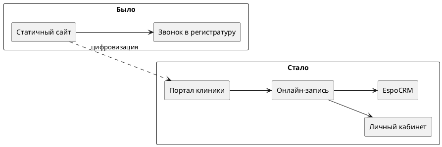

---

### Схема 2 — Общая архитектура (слайд 7)

**Mermaid:**

```
flowchart TB
    Patient[Пациент]
    subgraph webLayer [Веб-слой]
        PublicSite[Публичный сайт]
        BookingWizard[Мастер записи]
        PatientCabinet[Личный кабинет]
    end
    subgraph backend [Сервер Laravel]
        AppLogic[Бизнес-логика]
        Queue[Очередь задач]
    end
    subgraph storage [Данные]
        DB[(База MySQL)]
    end
    subgraph admin [Администрирование]
        Filament[Панель Filament]
    end
    subgraph external [Внешние сервисы]
        Espo[EspoCRM]
        SMS[SMS]
        Email[Email]
        FCM[Push FCM]
    end
    Patient --> PublicSite
    Patient --> BookingWizard
    Patient --> PatientCabinet
    PublicSite --> AppLogic
    BookingWizard --> AppLogic
    PatientCabinet --> AppLogic
    Filament --> DB
    AppLogic --> DB
    AppLogic --> Queue
    Queue --> Espo
    AppLogic --> SMS
    AppLogic --> Email
    Queue --> FCM
```

**PlantUML:**

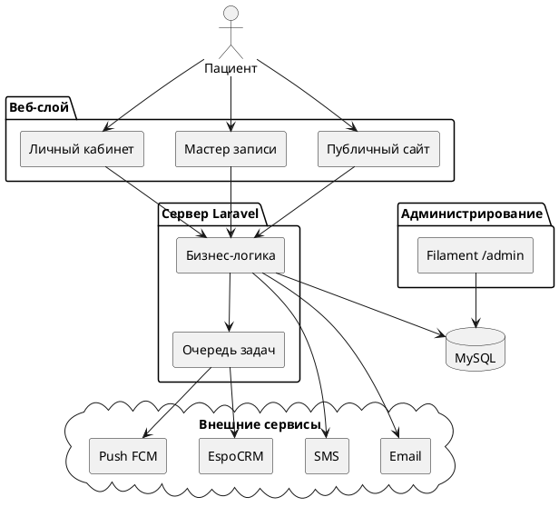

---

### Схема 3 — Структура публичного сайта (слайд 3)

**Mermaid:**

```
flowchart TD
    Home["Главная /"]
    Home --> Doctors["Врачи /doctors"]
    Home --> Services["Услуги /services"]
    Home --> Blog["Блог /blog"]
    Home --> Promo["Акции /promotions"]
    Home --> Contacts["Контакты /contacts"]
    Services --> ServicePage[Страница услуги]
    ServicePage --> BookBtn[Записаться]
    Doctors --> DoctorPage[Страница врача]
    DoctorPage --> BookBtn
```

**PlantUML:**

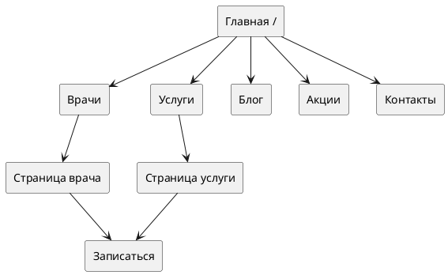

---

### Схема 4 — Путь онлайн-записи (слайд 4)

**Mermaid:**

```
flowchart LR
    S1[1. Старт]
    S2[2. Выбор врача и услуги]
    S3[3. Календарь и слот]
    S4[4. Вход по SMS]
    S5[5. Подтверждение]
    S6[6. Личный кабинет]
    S1 --> S2 --> S3 --> S4 --> S5 --> S6
```

**PlantUML:**

```plantuml
@startuml schema4_booking_flow
left to right direction

rectangle "1. Старт" as S1
rectangle "2. Выбор" as S2
rectangle "3. Слот" as S3
rectangle "4. Вход SMS" as S4
rectangle "5. Подтверждение" as S5
rectangle "6. Кабинет" as S6

S1 --> S2 --> S3 --> S4 --> S5 --> S6
@enduml
```

---

### Схема 5 — Расчёт слотов (запасной)

**Mermaid:**

```
flowchart TD
    Schedule[Расписание врача]
    Duration[Длительность услуги]
    Busy[Занятые записи]
    Rules[Мин. время до приёма]
    Calc[Расчёт свободных слотов]
    Calendar[Календарь для пациента]
    Choice[Выбор времени]
    Save[Сохранение записи]
    Schedule --> Calc
    Duration --> Calc
    Busy --> Calc
    Rules --> Calc
    Calc --> Calendar --> Choice --> Save
```

**PlantUML:**

```plantuml
@startuml schema5_slots
top to bottom direction

rectangle "Расписание врача" as Schedule
rectangle "Длительность услуги" as Duration
rectangle "Занятые записи" as Busy
rectangle "Мин. время до приёма" as Rules
rectangle "Расчёт слотов" as Calc
rectangle "Календарь" as Calendar
rectangle "Выбор времени" as Choice
rectangle "Сохранение" as Save

Schedule --> Calc
Duration --> Calc
Busy --> Calc
Rules --> Calc
Calc --> Calendar --> Choice --> Save
@enduml
```

---

### Схема 6 — Вход по OTP (слайд 5)

**Mermaid** (диаграмма последовательности):

```
sequenceDiagram
    participant P as Пациент
    participant W as Сайт
    participant S as SMS
    P->>W: Ввод телефона
    W->>S: Отправка кода
    S-->>P: SMS с кодом
    P->>W: Ввод кода
    W-->>P: Доступ в кабинет
```

**PlantUML:**

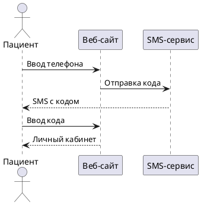

---

### Схема 7 — Laravel и EspoCRM (слайд 7)

**Mermaid:**

```
flowchart LR
    subgraph patientSide [Пациент]
        WebUI[Сайт и кабинет]
    end
    subgraph laravelDB [Laravel зеркало]
        Appt[Запись appointments]
        SyncFlag[Статус синхронизации]
    end
    subgraph espo [EspoCRM]
        Meeting[Приём в CRM]
    end
    WebUI -->|создать запись| Appt
    Appt -->|очередь| Meeting
    Meeting -->|ID из CRM| Appt
    Appt --> SyncFlag
    SyncFlag --> WebUI
```

**PlantUML:**

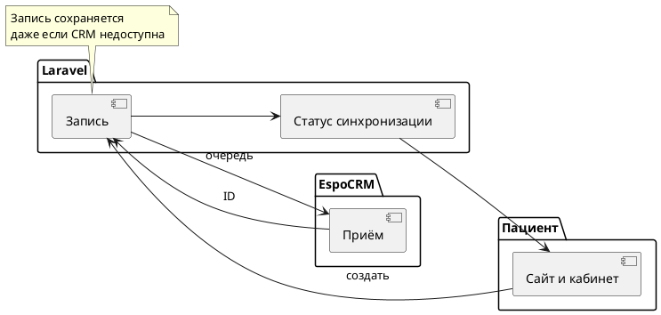

---

### Схема 8 — Filament → публичный сайт (слайд 6)

**Mermaid:**

```
flowchart LR
    Admin[Сотрудник клиники]
    Filament[Панель Filament]
    DB[(База данных)]
    Blade[Публичный сайт]
    Visitor[Посетитель]
    Admin --> Filament
    Filament --> DB
    DB --> Blade
    Blade --> Visitor
```

**PlantUML:**

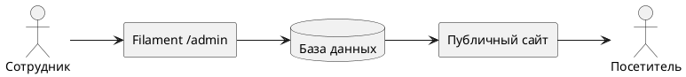

---

### Схема 9 — Уведомления (слайд 7–8)

**Mermaid:**

```
flowchart TD
    Event[Событие: запись отмена перенос]
    Event --> Email[Email]
    Event --> SMS[SMS]
    Event --> Push[Push за 24ч]
    Email --> Patient[Пациент]
    SMS --> Patient
    Push --> Patient
```

**PlantUML:**

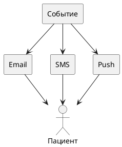

---

### Просмотр Mermaid прямо в Markdown

Если редактор поддерживает Mermaid (GitHub, GitLab, VS Code с расширением), используйте блоки:

````markdown

````

Ниже — те же схемы 1–4 в формате `mermaid` для предпросмотра в IDE.

#### Схема 1 (preview)

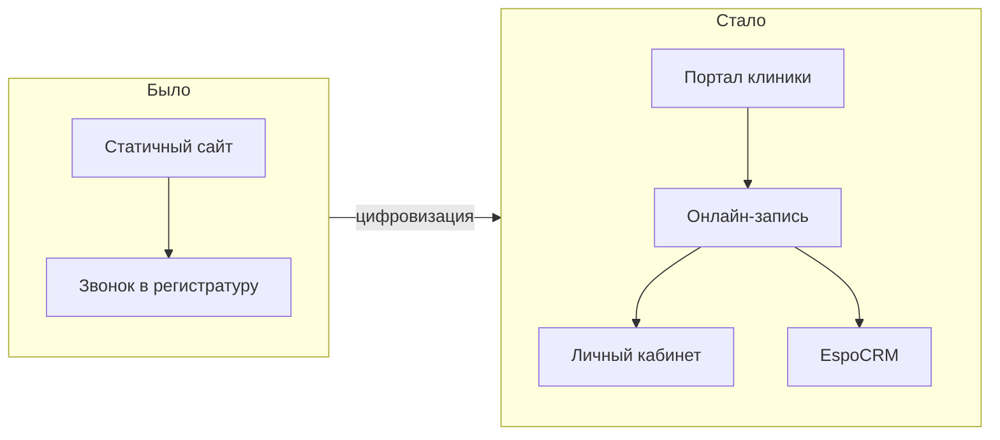

#### Схема 2 (preview)

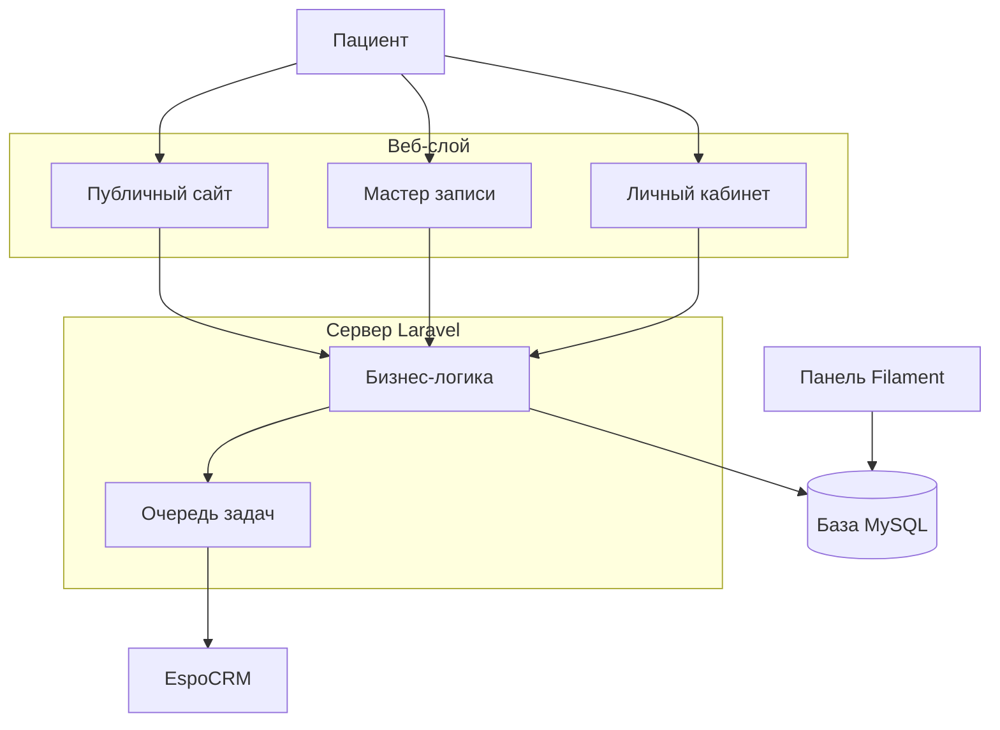

#### Схема 4 (preview)

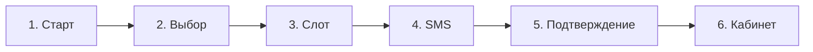

#### Схема 6 (preview)

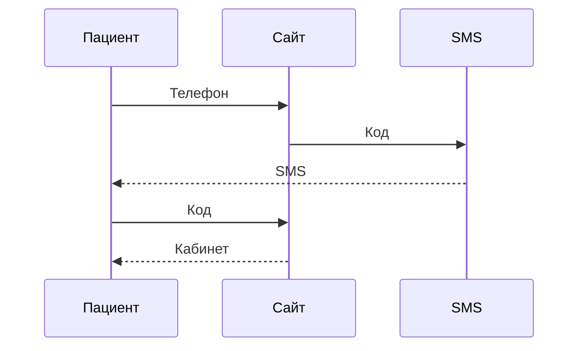

---

## Вопросы комиссии и защита

Блок для подготовки к Q&A. Слабые места — **реальные** по текущему коду `site/`, не выдуманные.

---

### 1. Типовые вопросы комиссии

#### Предметная область и актуальность

| Вопрос | Как отвечать |
|--------|----------------|
| Почему именно эта клиника? | Частная клиника в Минске, много направлений, нагрузка на регистратуру; сайт снижает звонки и ошибки при записи. |
| Чем ваш сайт лучше сайтов-аналогов? | Не «лучше всех», а **полный цикл**: каталог → слот → кабинет → CRM. У многих аналогов только форма «оставьте заявку» без времени. |
| Кто пользователи системы? | Пациент (веб), сотрудник (Filament), клиника (EspoCRM для учёта). |

#### Технологии и архитектура

| Вопрос | Как отвечать |
|--------|----------------|
| Почему Laravel, а не WordPress / 1С-Битрикс? | Нужна **своя бизнес-логика** (слоты, OTP, CRM, API), а не только CMS. Laravel даёт структуру, очереди, тесты, админку Filament в одном проекте. |
| Почему не SPA (React/Vue)? | Медицинский сайт — **SEO и быстрый первый экран**; контент отдаётся с сервера (Blade). Интерактив записи — точечный JS, без тяжёлого фронтенд-приложения. |
| Как устроена архитектура? | Пациент → Blade/JS → Laravel → MySQL; Filament для контента; очередь → EspoCRM, SMS, email, FCM. Схема на слайде 7. |
| Где бизнес-логика записи? | Сервис `BookingService` — один вход для веба и API, чтобы не дублировать правила. |
| Зачем Filament? | Операторы клиники сами правят врачей, услуги, акции без разработчика. |

#### Онлайн-запись и данные

| Вопрос | Как отвечать |
|--------|----------------|
| Как считаются свободные слоты? | Расписание врача по дням недели (`DoctorSchedule`) + длительность услуги → шаг слотов + вычитание занятых записей + минимальное время до приёма. |
| Как избежать двойной записи на один слот? | Транзакция БД и `lockForUpdate()` на врача при создании/переносе записи в `BookingService`. |
| Почему запись только после входа? | Чтобы привязать визит к `Patient`, показать в кабинете и синхронизировать с CRM. |
| Что хранится в БД? | Врачи, услуги, расписания, пациенты, записи, события аудита, контент; связь с CRM — `espo_entity_id`, статусы синхронизации. |

#### Безопасность и персональные данные

| Вопрос | Как отвечать |
|--------|----------------|
| Как защищён вход? | OTP: лимиты `throttle:otp-by-ip-phone`, код одноразовый, срок 15 минут, без хранения «пароля» пациента. |
| Где хранятся персональные данные? | В БД Laravel; в CRM — после синхронизации. Доступ к админке — отдельные пользователи Filament (не пациенты). |
| HTTPS, CSRF? | Стандарт Laravel: сессии, CSRF на формах, Sanctum для API. На production — обязательно HTTPS. |

#### CRM и интеграции

| Вопрос | Как отвечать |
|--------|----------------|
| Зачем EspoCRM, если есть своя БД? | CRM уже используется клиникой для учёта; сайт не заменяет CRM, а **подаёт заявки** в привычную систему. |
| Что если CRM недоступна? | Запись сохраняется локально со статусом синхронизации; job повторяет отправку (очередь, backoff). |
| Двусторонняя синхронизация? | Сейчас упор на **отправку** записи в CRM; обратный pull/webhook — зона развития (см. слабые места). |

#### Тестирование и качество

| Вопрос | Как отвечать |
|--------|----------------|
| Как тестировали? | Автотесты Pest: `BookingServiceTest`, API записи и OTP, расписание; ручная проверка UI на desktop/tablet/phone. |
| Покрытие тестами? | Покрыты **критичные сценарии** (слоты, API), не каждая страница блога — осознанный приоритет. |

#### Эксплуатация

| Вопрос | Как отвечать |
|--------|----------------|
| Что нужно для запуска в production? | Сервер PHP 8.3+, MySQL, очередь (`queue:work`), cron для напоминаний, `ESPO_ENABLED`, SMS-провайдер, Firebase для push. |
| Нужен ли Redis? | Не обязателен на старте; очередь может быть database. Redis — для масштабирования. |

#### Общие «капканные» вопросы

| Вопрос | Как отвечать |
|--------|----------------|
| Что бы вы улучшили в первую очередь? | Production SMS для OTP, включение CRM без dry-run, админ-раздел записей в Filament (см. ниже — честно и с планом). |
| Ваш личный вклад? | Проектирование структуры сайта, мастер записи, кабинет, интеграция CRM, админка, тесты — перечислить конкретно по модулям. |
| Мобильное приложение? | Отдельный проект на том же API; сегодня защищаю **веб-ресурс**. |

---

### 2. Слабые места проекта (честно)

| № | Слабое место | Что в коде / факте | Риск на защите |
|---|----------------|-------------------|----------------|
| 1 | **OTP-демо** | `PatientOtpService` принимает только код `111111`, SMS при логине **не отправляется** | Спросят про безопасность и «фейк» |
| 2 | **CRM выключена по умолчанию** | `ESPO_ENABLED=false`, `ESPO_DRY_RUN=true` в `config/espo.php` | «Интеграция не работает?» |
| 3 | **Нет Filament для записей/пациентов** | Есть Doctor, Service, Article… **нет** Appointment/Patient в `/admin` | «Как администратор видит записи?» |
| 4 | **Обратная синхронизация из CRM** | Job отправляет в Espo; webhook/pull из CRM в Laravel — не в маршрутах | «Кто меняет статус — сайт или CRM?» |
| 5 | **Очередь обязательна** | `SyncAppointmentToEspo`, напоминания — jobs; без `queue:work` CRM и push не сработают | «А на localhost всё работает?» |
| 6 | **SMS по умолчанию `log`** | `SMS_DRIVER=log` — в лог, не на телефон (кроме уведомлений через `SmsChannel`) | Путаница с OTP |
| 7 | **Два стиля фронта** | Публичный сайт: `public/styles` + Blade; админка: Vite + Tailwind | «Почему не единый фронт?» |
| 8 | **Мало UI-тестов** | Нет автотестов браузера на весь мастер записи | «Как проверяли вёрстку?» |
| 9 | **Зависимость от расписания** | Без заполненного `DoctorSchedule` слотов нет | «Пустой календарь» на демо |
| 10 | **Профиль пациента vs CRM** | ФИО в Laravel + синхронизация с Contact; возможны расхождения | Теоретический вопрос по модели данных |

---

### 3. Как защищаться по каждому слабому месту

#### 1. OTP `111111`

**Не оправдываться.** Сказать прямо:

> «На этапе разработки и демонстрации используется фиксированный код, чтобы не тратить бюджет SMS и не зависеть от оператора на защите. Архитектура готова: есть `SmsSender`, драйверы `log` и `sms_by`, throttle на запросы. Для production в `PatientOtpService` останется заменить генерацию на случайный код и вызов SMS — это отдельный шаг внедрения, не переделка системы.»

**На демо:** заранее сказать: «Ввожу демонстрационный код из ТЗ разработки».

---

#### 2. CRM disabled / dry_run

> «Интеграция **реализована** — job `SyncAppointmentToEspo`, сервис синхронизации, поля `espo_*` в БД. В dev отключена намеренно, чтобы не слать мусор в боевую CRM. На production включается `ESPO_ENABLED=true`, `ESPO_DRY_RUN=false` и API-ключ. Могу показать лог job или статус в кабинете.»

Подготовить: один скрин `espo_sync_status` в кабинете или запись в `storage/logs`.

---

#### 3. Нет админки для записей

> «Filament сейчас закрывает **контент-маркетинг** — врачи, услуги, акции. Записи пациент видит в кабинете; оператор работает в **EspoCRM** после синхронизации. Ресурс Appointment в Filament — запланированное улучшение для регистратуры, когда не нужен вход в CRM.»

Не обещать «сделаю завтра», если нет в работе.

---

#### 4. Обратная синхронизация CRM

> «Источник правды для приёма в клинике — CRM. Сайт создаёт зеркало и пушит встречу. Изменения статуса со стороны оператора в CRM на следующем этапе подтягиваются webhook или периодическим sync — это стандартная схема интеграции, заложена в архитектуру очередей.»

---

#### 5. Очередь

> «Для надёжности CRM и push вынесены в очередь Laravel — чтобы не тормозить ответ пользователю. В production крутится `php artisan queue:work` или supervisor. На защите показываю синхронный сценарий записи в БД; фоновая отправка в CRM — по логам.»

---

#### 6. SMS log

> «Драйвер `log` — для разработки. OTP переведём на `sms_by` вместе с генерацией случайного кода. Уведомления о записи уже идут через абстракцию `SmsChannel`.»

---

#### 7. Два фронта

> «Публичный сайт наследует готовую вёрстку клиники — Blade и статические стили, быстрый SEO. Админка — современный стек Filament + Vite. Объединять в один SPA для медицинского портала нецелесообразно.»

---

#### 8. UI-тесты

> «Автотесты покрывают **бизнес-логику** слотов и API — это дороже всего ошибиться. Визуальную часть проверял вручную на трёх ширинах экрана; для регрессии можно добавить Pest Browser — как направление развития.»

---

#### 9. Пустое расписание на демо

**Обязательно перед защитой:** сидер/ручное заполнение `DoctorSchedule` для 1–2 врачей, тестовая запись в БД.

> «Слоты строятся из расписания врача; без расписания календарь пустой — это корректное поведение, не баг.»

---

#### 10. Два источника профиля

> «На сайте — кэш профиля для форм и кабинета; в CRM — полная карточка пациента. При синхронизации приоритет у CRM; на сайте показываем статус, чтобы пациент видел принятие заявки.»

---

### 4. Чего избегать на защите

| Не делать | Почему |
|-----------|--------|
| Открывать `.env` с ключами | Безопасность |
| Говорить «всё на 100% в production» | Не правда про OTP и CRM |
| Live без подготовленных данных | Пустой календарь, нет врача |
| Уходить в код на 5 минут | Комиссия смотрит продукт |
| Критиковать клинику/заказчика | Тон нейтральный |

---

### 5. Сильные стороны (противовес слабым)

Использовать, если давят на минусы:

- Единый **`BookingService`** для веба и API.
- **`lockForUpdate`** — продуманная конкуренция за слот.
- **Аудит** `AppointmentEvent` — история действий.
- **Rate limiting** на OTP и запись.
- **Filament** — реальный инструмент для клиники, не «голый Laravel».
- **Тесты Pest** на критичную логику.
- **Отказоустойчивость CRM** — запись не теряется.

Фраза-якорь:

> «Слабые места — в основном **внедрение в production** (SMS, ключи CRM), а не в архитектуре. Ядро записи и кабинета реализовано и проверено тестами.»

---

### 6. Краткая шпаргалка (30 секунд)

| Вопрос | Одна фраза |
|--------|------------|
| SPA? | Blade + SEO, JS только где нужно |
| Слоты? | Расписание + длительность − занятые |
| Двойная запись? | Транзакция + блокировка строки врача |
| OTP 111111? | Демо; в prod — SMS + случайный код |
| CRM не работает? | Выключена в dev; код интеграции есть |
| Админ записей? | Кабинет + CRM; Filament — контент |
| Тесты? | Booking + API; UI — вручную |
| Улучшения? | SMS, CRM prod, Filament appointments |

---

### 7. Чеклист перед защитой

- [ ] В БД есть врач с расписанием и услуга со слотами на «завтра»
- [ ] Проверена цепочка: запись → кабинет → статус sync
- [ ] Записано видео-демо 2–3 мин
- [ ] Скрины без реальных телефонов пациентов
- [ ] Продуманы ответы на OTP и CRM (п. 1 и 2 выше)
- [ ] Открыт этот файл на телефоне / второй вкладке

---

## Live-демо

**Сценарий 3–5 мин** (после слайда 8 или вместо части слайда 4):

1. Главная → услуга → «Записаться»
2. Врач и слот
3. OTP / вход
4. Подтверждение → кабинет
5. (опционально) Filament: правка → сайт

Заранее записать **видео 2–3 мин** на случай сбоя сети.

---

## Оформление PowerPoint

- Не более **6 строк текста** на слайд
- Один слайд = **1 мысль** + скрин или схема
- Цвета: синий / бирюза под стиль клиники
- Подпись под схемой: **одна фраза**

---

## Связанные материалы в репозитории

| Файл | Назначение |
|------|------------|
| `site/routes/web.php` | Маршруты публичной части |
| `site/public/styles/booking-wizard.css` | Стили мастера записи |
| `zarga_booking_plan.md` | Архитектура CRM и записи |
| `site/tests/` | Автотесты (упоминать на защите) |

---

*Документ подготовлен для защиты дипломной работы. Мобильное приложение (`mobileApp/`) — отдельная презентация.*
