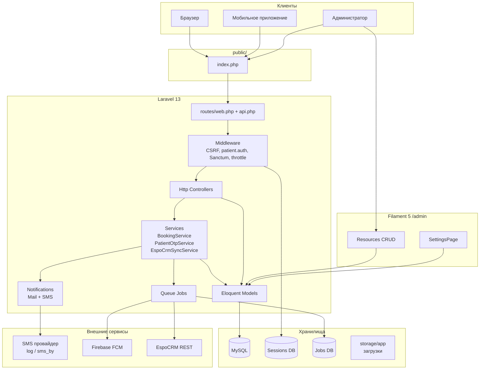
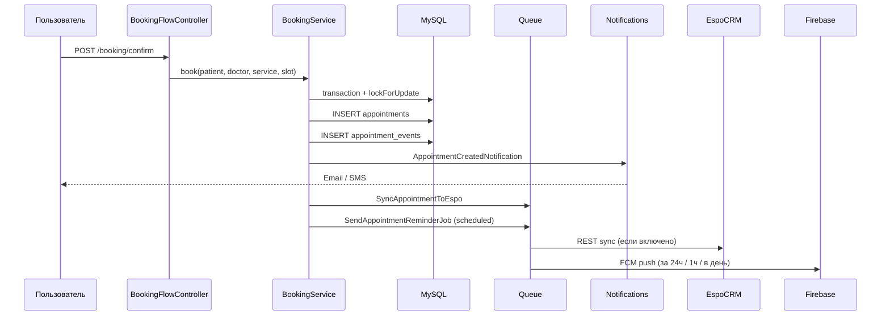
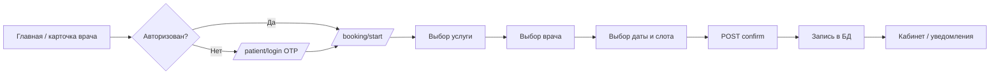
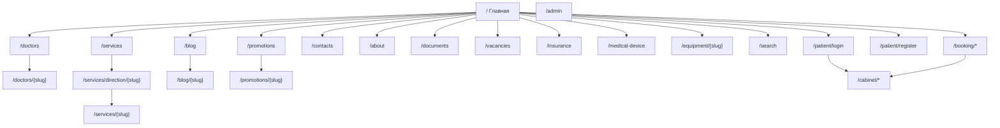
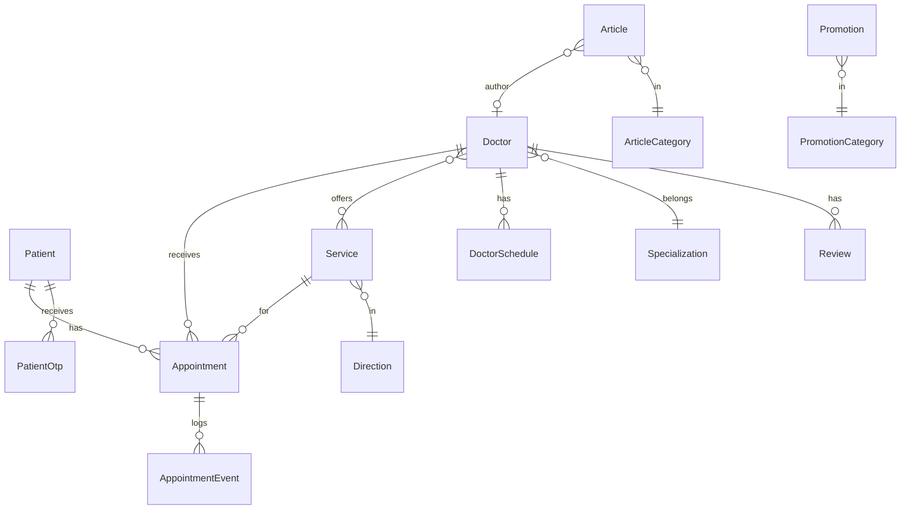

# Полное руководство по проекту «Маяк Здоровья» (site)

> **Путь проекта:** `site/` — веб-приложение медицинской клиники «Маяк Здоровья» в составе репозитория Zarga Medica Project.  
> **Стек:** Laravel 13 · PHP 8.3+ · Filament 5 · Livewire 4 · Tailwind CSS 4 · Vite 8 · MySQL · Sanctum · Firebase FCM · EspoCRM (опционально).

---

## Содержание

1. [Введение](#1-введение)
2. [Структура каталогов](#2-структура-каталогов)
3. [Как работает сайт](#3-как-работает-сайт)
4. [Mermaid-диаграммы](#4-mermaid-диаграммы)
5. [Файлы корня проекта](#5-файлы-корня-проекта)
6. [bootstrap/](#6-bootstrap)
7. [routes/](#7-routes)
8. [config/](#8-config)
9. [app/ — прикладной код](#9-app--прикладной-код)
10. [database/](#10-database)
11. [resources/](#11-resources)
12. [public/](#12-public)
13. [tests/](#13-tests)
14. [Зависимости vendor и node_modules](#14-зависимости-vendor-и-node_modules)
15. [Запуск и развёртывание](#15-запуск-и-развёртывание)
16. [Глоссарий](#16-глоссарий)

---

## 1. Введение

### 1.1. Назначение проекта

Проект `site/` — это **полнофункциональный backend и публичный сайт** частной медицинской клиники. Он решает три связанные задачи:

| Канал | Для кого | Что делает |
|-------|----------|------------|
| **Публичный сайт** (`routes/web.php`) | Посетители | Каталог врачей, услуг, блог, акции, контакты, онлайн-запись, личный кабинет пациента |
| **REST API** (`/api/v1/*`) | Мобильное приложение | OTP-авторизация, каталог записи, управление приёмами, push-уведомления |
| **Админ-панель** (`/admin`) | Сотрудники клиники | Filament CMS: контент, врачи, расписания, обращения, настройки |

### 1.2. Ключевые технологии

- **Laravel 13** — маршрутизация, ORM Eloquent, очереди, планировщик, почта, сессии.
- **Filament 5** — админка на Livewire без отдельного SPA.
- **Laravel Sanctum** — API-токены для пациентов в мобильном приложении.
- **Vite + Tailwind v4** — сборка CSS/JS (в основном для Filament; публичный фронт — статические файлы в `public/`).
- **MySQL** — основное хранилище (см. `db.sql` — дамп для разработки).
- **Firebase Cloud Messaging** — push-напоминания о приёме (`kreait/laravel-firebase`).
- **EspoCRM** — опциональная синхронизация пациентов и встреч через REST API.

### 1.3. Что намеренно не документируется построчно

Каталоги **`vendor/`** (PHP-пакеты Composer) и **`node_modules/`** (npm) содержат десятки тысяч файлов сторонних библиотек. Они описаны в [разделе 14](#14-зависимости-vendor-и-node_modules). Вся **бизнес-логика клиники** живёт в `app/`, `routes/`, `resources/`, `database/`, `public/`, `config/`.

---

## 2. Структура каталогов

```
site/
├── app/                    # PHP: модели, контроллеры, сервисы, Filament, jobs
├── bootstrap/              # Загрузка Laravel, providers.php
├── config/                 # Конфигурация приложения
├── database/
│   ├── factories/          # Фабрики для тестов
│   ├── migrations/         # Схема БД
│   └── seeders/            # Начальные данные
├── public/                 # Document root (CSS, JS, images, index.php)
├── resources/
│   ├── css/                # Tailwind (Vite)
│   ├── js/                 # Vite + плагины Filament Rich Editor
│   └── views/              # Blade-шаблоны публичного сайта
├── routes/                 # web.php, api.php, console.php
├── storage/                # Кэш, сессии, загрузки, логи
├── tests/                  # Pest-тесты
├── vendor/                 # Composer (не в git обычно)
├── node_modules/           # npm (не в git обычно)
├── artisan                 # CLI Laravel
├── composer.json           # PHP-зависимости
├── package.json            # JS-зависимости
├── vite.config.js          # Сборка фронта
├── db.sql                  # SQL-дамп БД
└── GUIDE.md                # Этот файл
```

---

## 3. Как работает сайт

### 3.1. Жизненный цикл HTTP-запроса

1. Запрос попадает в **`public/index.php`** — точка входа веб-сервера.
2. Подключается autoload Composer (`vendor/autoload.php`).
3. Создаётся приложение из **`bootstrap/app.php`** — регистрируются маршруты, middleware, расписание, обработка исключений.
4. Laravel определяет маршрут (`web` или `api/v1`).
5. Срабатывает цепочка **middleware** (CSRF для web, `auth:sanctum` для API, `patient.auth` для кабинета).
6. **Контроллер** читает/пишет данные через **Eloquent-модели** или **сервисы** (`BookingService`, `PatientOtpService`).
7. Ответ: **Blade HTML** (сайт), **JSON** (API) или **редирект**.

### 3.2. Публичный сайт (Blade + статический JS/CSS)

Публичные страницы **не используют SPA**. Шаблон `layouts/app.blade.php` подключает:

- CSS из `public/styles/` (отдельный файл на тип страницы + общий `styles.css`).
- JS из `public/scripts/` (`script.js`, `shared-utils.js` + страничные скрипты через `@stack('scripts')`).

**View Composer** в `AppServiceProvider` на все шаблоны (`*`) подставляет глобальные данные: телефон, адрес, соцсети, юридические ссылки, список направлений — из модели `Setting` и `Direction`. Поэтому header/footer всегда актуальны без дублирования в каждом контроллере.

### 3.3. Онлайн-запись (web)

Мастер записи — **многошаговый flow** с состоянием в **сессии**:

| Шаг | URL | Сессия |
|-----|-----|--------|
| Старт | `/booking/start` | `booking_pending`, `booking_slot_draft` |
| Услуга | `/booking/service` | выбор `service_id`, `from` (врач/любой) |
| Врач | `/booking/doctor` | `doctor_id` |
| Слот | `/booking/slot` | дата/время |
| Подтверждение | POST `/booking/confirm` | требует `patient.auth` |

`BookingFlowController` делегирует расчёт слотов и создание записи в **`BookingService`**:

- Слоты строятся из **`DoctorSchedule`** (день недели + интервал) и **`Service::duration_minutes`**.
- Учитывается **`Setting`** `booking.min_lead_minutes` — минимальный запас до приёма.
- Конфликты с существующими `Appointment` проверяются с **`lockForUpdate()`** в транзакции.
- После записи: email/SMS-уведомления, job в EspoCRM, FCM-напоминания.

### 3.4. Пациент: OTP и личный кабинет

- Guard **`patient`** (`config/auth.php`) — модель `Patient`.
- Регистрация/вход: телефон → SMS с OTP (`PatientOtpService` + драйвер `SmsSender`) → сессия.
- Кабинет `/cabinet/*` за middleware **`patient.auth`** (`EnsurePatientAuthenticated`).
- API: Sanctum-токены + **refresh token** в таблице `patients`.

### 3.5. REST API для мобильного приложения

Префикс: **`/api/v1`** (задан в `bootstrap/app.php`).

- Публично: auth OTP, каталог booking, врачи, услуги, статьи, акции.
- С `Authorization: Bearer`: профиль, записи, FCM `devices/register`.
- Ошибки бронирования: `BookingException` → JSON **422** с полем `errors.booking`.

### 3.6. Админ-панель Filament

- URL: **`/admin`**, бренд «Маяк Здоровья».
- Ресурсы auto-discover из `app/Filament/Resources/`.
- Rich Editor с кастомными Tiptap-плагинами (highlight, line-height, blockquote).
- Страница **Настройки** (`SettingsPage`) — key-value в таблице `settings`.

### 3.7. Фоновые процессы

| Механизм | Файл | Назначение |
|----------|------|------------|
| Очередь `database` | `config/queue.php` | Jobs: FCM, Espo sync |
| Schedule hourly | `SendAppointmentReminders` | Записи через ~24ч → FCM |
| Queue worker | `php artisan queue:work` | Обработка jobs |

### 3.8. Адаптивность

Публичный UI — **чистый CSS** в `public/styles/` с media queries (не Tailwind на публичных страницах). Filament/Tailwind — только админка.

---

## 4. Mermaid-диаграммы

### 4.1. Архитектура компонентов



*Пояснение:* все каналы сходятся в одном Laravel-приложении; Filament — отдельная панель поверх тех же моделей.

### 4.2. Поток данных (запись на приём)



### 4.3. Пользовательский путь (онлайн-запись web)



### 4.4. Карта сайта (sitemap)



### 4.5. Диаграмма моделей (основные сущности)



---

## 5. Файлы корня проекта

### `artisan`
**Тип:** PHP CLI. **Роль:** точка входа для команд Laravel (`migrate`, `serve`, `queue:work`, `test`). Все операции обслуживания идут через него.

### `composer.json` / `composer.lock`
**Тип:** конфигурация PHP. **Роль:** зависимости — Laravel 13, Filament 5, Sanctum, Firebase, phonenumber. Скрипты `composer run dev` поднимают serve + queue + vite одновременно.

### `package.json` / `package-lock.json`
**Тип:** конфигурация npm. **Роль:** Vite 8, Tailwind 4, Tiptap для rich editor. Скрипты: `npm run dev`, `npm run build`.

### `vite.config.js`
**Тип:** конфигурация сборки. **Входы:** `resources/css/app.css`, `resources/js/app.js`, `resources/css/filament/admin/theme.css`. **Связь:** Laravel Vite plugin пишет manifest в `public/build/`.

### `phpunit.xml`
**Тип:** конфигурация тестов. **Роль:** Pest/PHPUnit, окружение `testing`.

### `.env` / `.env.example`
**Тип:** секреты и переменные окружения. **Ключевое:** `DB_*`, `QUEUE_CONNECTION=database`, `ESPO_*`. Firebase и SMS задаются отдельно в runtime (`config/firebase.php`, `SMS_DRIVER`).

### `db.sql`
**Тип:** SQL-дамп. **Роль:** готовая схема+данные для локальной разработки без миграций с нуля.

### `cacert.pem`
**Тип:** сертификаты CA. **Роль:** используется `FirebaseSslMiddleware` для HTTPS к Firebase на Windows.

### `boost.json`, `AGENTS.md`, `.cursor/`
**Тип:** метаданные для AI/IDE (Laravel Boost, skills). **На работу сайта не влияют.**

### `.editorconfig`, `.gitattributes`, `.gitignore`, `.npmrc`
**Тип:** соглашения репозитория.

### `README.md`
Стандартный README Laravel skeleton (не описывает домен клиники).

---

## 6. bootstrap/

### `bootstrap/app.php`
**Роль:** конфигурация приложения Laravel 11+ style.

**Ключевые блоки:**
- `withSchedule` — каждый час `SendAppointmentReminders` (FCM за ~24 часа).
- `withRouting` — `web`, `api` с префиксом **`api/v1`**, health `/up`.
- `withMiddleware` — alias `patient.auth` → `EnsurePatientAuthenticated`.
- `withExceptions` — `BookingException` → JSON 422 для API.

### `bootstrap/providers.php`
Регистрирует `AppServiceProvider` и `Filament\AdminPanelProvider`.

### `bootstrap/cache/`
Скомпилированные `packages.php`, `services.php` — кэш автозагрузки пакетов.

---

## 7. routes/

### `routes/web.php`
**Роль:** все публичные HTML-маршруты. Группы: контент, patient OTP, booking, cabinet. Throttle на OTP и booking (см. `AppServiceProvider`).

### `routes/api.php`
**Роль:** REST для мобильного клиента. Группы: `auth/*`, booking catalog, `auth:sanctum` (appointments, me, devices).

### `routes/console.php`
**Роль:** closure-команда `inspire` (демо Laravel).

---

## 8. config/

| Файл | Назначение |
|------|------------|
| `app.php` | Имя приложения, timezone, locale |
| `auth.php` | Guards: `web` (User), **`patient`** (Patient) |
| `database.php` | MySQL, SQLite для тестов |
| `session.php` | Driver `database` |
| `queue.php` | Driver `database` |
| `cache.php` | Driver `database` |
| `sanctum.php` | API tokens, stateful domains |
| `firebase.php` | FCM: `FIREBASE_PROJECT`, credentials, SSL middleware |
| `sms.php` | `SMS_DRIVER`: `log` (по умолчанию) или `sms_by` |
| `espo.php` | EspoCRM REST, dry-run, entity Meeting |
| `mail.php`, `filesystems.php`, `logging.php`, `hashing.php`, `services.php`, `livewire.php` | Стандарт Laravel/Filament |

---

## 9. app/ — прикладной код

Ниже — **все 202 PHP-файла** в `app/`, сгруппированные по папкам. Повторяющиеся Filament Resources следуют одному шаблону (см. [9.10](#910-filament-admin)).

### 9.1. `app/Console/Commands/`

#### `SendAppointmentReminders.php`
**Роль:** Artisan `reminders:send`. Ищет активные записи с `start_at` ≈ now+24h, диспатчит `SendAppointmentReminderJob` с типом напоминания. Запускается планировщиком **ежечасно**.

### 9.2. `app/Contracts/`

#### `SmsSender.php`
Интерфейс `send(string $phone, string $message)`. Реализации: `LogSmsSender`, `SmsBy`.

### 9.3. `app/Enums/`

| Файл | Значения / роль |
|------|-----------------|
| `AppointmentStatus.php` | new, processing, completed, cancelled, rescheduled |
| `AppointmentSource.php` | web, api, … — откуда создана запись |
| `AppointmentEventAction.php` | created, cancelled, rescheduled, … |
| `AppointmentEventActor.php` | patient, admin, system |
| `Weekday.php` | Понедельник–воскресенье для `DoctorSchedule` |

### 9.4. `app/Exceptions/`

#### `BookingException.php`
Бизнес-ошибки («слот занят», «вне расписания»). Рендерится в `bootstrap/app.php` как 422 JSON для API.

### 9.5. `app/Jobs/`

| Job | Очередь | Действие |
|-----|---------|----------|
| `SendAppointmentReminderJob.php` | default | FCM push пациенту |
| `SyncPatientToEspo.php` | crm | POST Contact в Espo |
| `SyncAppointmentToEspo.php` | crm | POST/PUT Meeting в Espo |

### 9.6. `app/Models/` (24 модели)

| Модель | Таблица | Назначение |
|--------|---------|------------|
| `User` | users | Админ Filament |
| `Patient` | patients | Пациент: OTP, Sanctum, FCM, Espo |
| `PatientOtp` | patient_otps | Коды подтверждения телефона |
| `Doctor` | doctors | Врач: slug, специализация, рейтинг, Espo user id |
| `DoctorSchedule` | doctor_schedules | Рабочие окна по `Weekday` |
| `Service` | services | Услуга: duration, связь с врачами |
| `Direction` | directions | Мед. направление / отделение |
| `Specialization` | specializations | Специальность врача |
| `Appointment` | appointments | Запись: start_at, end_at, status, source |
| `AppointmentEvent` | appointment_events | Аудит изменений записи |
| `Review` | reviews | Отзыв на врача |
| `Article` / `ArticleCategory` | articles, … | Блог |
| `Promotion` / `PromotionCategory` | promotions, … | Акции |
| `PromoSlide` | promo_slides | Слайдер на главной |
| `Equipment` | equipments | Страницы оборудования |
| `Document` | documents | Файлы для скачивания |
| `Vacancy` | vacancies | Вакансии |
| `License` | licenses | Лицензии клиники |
| `ContactMessage` | contact_messages | Форма обратной связи |
| `Setting` | settings | Key-value настройки (группы: contacts, booking, legal, …) |
| `Page` | pages | CMS-страницы |
| `Media` | media | Медиафайлы |

**Пример ключевой логики `Setting`:**

```php
public static function getValue(string $group, string $key, $default = null): ?string
{
    return static::where('group_name', $group)
                 ->where('key', $key)
                 ->value('value') ?? $default;
}
```

Используется в `BookingService` для `min_lead_minutes` и в View Composer для контактов.

### 9.7. `app/Notifications/` + `Channels/`

| Класс | Каналы | Когда |
|-------|--------|-------|
| `AppointmentCreatedNotification` | mail, sms | Новая запись |
| `AppointmentCancelledNotification` | mail, sms | Отмена |
| `AppointmentRescheduledNotification` | mail, sms | Перенос |
| `Channels/SmsChannel.php` | — | Маршрутизация в `SmsSender` |

### 9.8. `app/Providers/`

#### `AppServiceProvider.php`
- Singleton: `BookingService`, `EspoCrmSyncService`.
- `SmsSender` — match по `config('sms.driver')`.
- Подмена Tiptap `Highlight` на `SafeHighlight` (PHP 8.4).
- **8 rate limiters** для OTP, booking, cabinet, API catalog.
- Регистрация JS-плагинов Filament.
- **View::composer('*')** — глобальные переменные для Blade.

#### `Filament/AdminPanelProvider.php`
Панель `/admin`, цвета клиники, группы навигации, discover resources/widgets, vite theme.

### 9.9. `app/Services/`

#### `BookingService.php` (~400 строк)
**Ядро бронирования.**

| Метод | Назначение |
|-------|------------|
| `availableDates` / `availableDatesBetween` | Даты со свободными слотами |
| `availableSlots` | Слоты на день с шагом `slotStepMinutes()` |
| `book` | Создание записи в транзакции + events + notify + jobs |
| `cancel` / `reschedule` | Отмена/перенос с аудитом |
| `doctorHasTimeConflict` | Пересечение интервалов |
| `scheduleWindowForDate` | Окно из `DoctorSchedule` |

**Важный фрагмент расчёта слотов:**

```php
$minLead = (int) Setting::getValue('booking', 'min_lead_minutes', '60');
$earliest = CarbonImmutable::now(config('app.timezone'))->addMinutes($minLead);
// ...
if ($t->gte($earliest) && ! $this->doctorHasTimeConflict(...)) {
    $slots->push($t);
}
```

#### `PatientOtpService.php`
Генерация/проверка OTP, лимиты, привязка к `PatientOtp`.

#### `Crm/EspoCrmSyncService.php`
REST Espo: Contact, Meeting; учитывает `ESPO_ENABLED`, `ESPO_DRY_RUN`.

#### `Sms/LogSmsSender.php` / `Sms/SmsBy.php`
Отправка SMS в лог или провайдер sms.by.

### 9.10. `app/Http/`

#### Middleware

**`EnsurePatientAuthenticated.php`** (`patient.auth`): если guard `patient` пуст — redirect `route('patient.login')`.

#### Web Controllers

| Контроллер | Методы / роль |
|------------|---------------|
| `HomeController` | `index` — главная: слайды, врачи, акции |
| `DoctorController` | каталог, карточка, `storeReview` |
| `ServiceController` | услуги, направление, карточка услуги |
| `BlogController` | список/статья |
| `PromotionController` | акции |
| `ContactController` | форма контактов → `ContactMessage` |
| `StaticPageController` | about, documents, vacancies, insurance, medical-device, search |
| `EquipmentController` | страница оборудования |
| `BookingFlowController` | мастер записи, сессии `SESSION_PENDING`, `SESSION_SLOT_DRAFT` |
| `BookingGuestCancelController` | отмена по signed URL из письма |
| `Patient/PatientRegisterController` | многошаговая регистрация |
| `Patient/PatientLoginController` | OTP-вход |
| `Patient/PatientLogoutController` | invokable logout |
| `Cabinet/CabinetController` | dashboard, appointments, profile, cancel/reschedule |

#### API V1 Controllers

| Контроллер | Эндпоинты |
|------------|-----------|
| `PatientAuthController` | register/login OTP, refresh token |
| `PatientApiController` | me, update, logout |
| `AppointmentApiController` | CRUD записей |
| `BookingCatalogController` | services, doctors, slots, dates |
| `DeviceController` | register FCM token |
| `DoctorController`, `ServiceDirectionController`, `ArticleController`, `PromotionController` | публичный контент JSON |

#### Form Requests (`app/Http/Requests/`)

Валидация входных данных по доменам: `Booking/*`, `Cabinet/*`, `Patient/*`, `Api/Auth/*`, `Api/Appointment/*`, `Api/Patient/*`. Пример: `BelarusPhone` rule, нормализация телефона в `NormalizesPatientPhone`.

#### API Resources (`app/Http/Resources/Api/`)

Трансформация моделей в JSON: `PatientResource`, `AppointmentResource`, `DoctorListResource`, `DoctorDetailResource`, и т.д. — единый формат для мобильного клиента.

### 9.11. `app/Rules/`, `app/Support/`, `app/Tiptap/`

| Файл | Роль |
|------|------|
| `BelarusPhone.php` | Валидация BY номера |
| `PatientPhone.php` | E.164 нормализация |
| `Slug.php` | Генерация slug для SEO URL |
| `RussianPlural.php` | «1 запись», «2 записи» |
| `DirectionFontAwesomeIcons.php` | Маппинг иконок направлений |
| `FirebaseSslMiddleware.php` | Guzzle middleware + cacert.pem |
| `Highlight.php`, `LineHeight.php` | Tiptap extensions для Filament |
| `BlockquoteGuillemets.php` | Типографика «ёлочки» |

### 9.12. Filament Admin

**Шаблон каждого Resource** (например `Doctors/`):

| Файл | Роль |
|------|------|
| `DoctorResource.php` | Регистрация ресурса, model, navigation |
| `Schemas/DoctorForm.php` | Поля формы create/edit |
| `Tables/DoctorsTable.php` | Колонки, фильтры, actions |
| `Pages/ListDoctors.php` | Список |
| `Pages/CreateDoctor.php` | Создание |
| `Pages/EditDoctor.php` | Редактирование |

**Список Resources (15 сущностей):**

ContactMessages, Doctors, Services, Directions, Specializations, Reviews, Articles, ArticleCategories, Promotions, PromotionCategories, PromoSlides, Equipment, Documents, Vacancies, Licenses.

**Дополнительно:**

| Путь | Роль |
|------|------|
| `Filament/Pages/SettingsPage.php` | Настройки сайта (contacts, booking, social, legal) |
| `Filament/Clusters/ClinicCategoriesCluster.php` | Группа: специализации + направления |
| `Filament/Widgets/StatsOverviewWidget.php` | Статистика на dashboard |
| `Filament/Widgets/RecentActivityWidget.php` | Последние события |
| `Filament/Forms/Plugins/HighlightRichContentPlugin.php` | Rich editor highlight |
| `Filament/Support/LocalPublicFileUpload.php` | Загрузка в public |
| `Filament/Resources/Directions/Concerns/NormalizesDirectionPayload.php` | Нормализация иконок направлений |

---

## 10. database/

### 10.1. Миграции (хронология домена)

| Миграция | Создаёт/меняет |
|----------|----------------|
| `0001_*_users` | users, sessions, password resets |
| `0001_*_cache`, `0001_*_jobs` | cache, queues |
| `2025_01_01_*` | specializations, doctors, directions, services, doctor_service, appointments, reviews, articles, promotions, licenses, media, pages, settings |
| `2026_01_01_*` | directions details, doctors rating |
| `2026_04_*` | equipments, promo_slides, documents, vacancies, articles author_doctor |
| `2026_05_02_*` | **patients**, patient_otps, appointments.patient_id, espo fields |
| `2026_05_14_*` | refresh_token, appointment source |
| `2026_05_15_*` | personal_access_tokens (Sanctum) |
| `2026_05_16_*` | doctor_schedules, service duration, appointments booking fields, appointment_events |
| `2026_05_17–19_*` | patient email, espo on doctors, fcm_token, contact_messages |

### 10.2. Seeders

| Seeder | Данные |
|--------|--------|
| `DatabaseSeeder` | Оркестратор |
| `UserSeeder` | Админ Filament |
| `SettingSeeder` | Контакты, booking defaults |
| `SpecializationSeeder`, `DirectionSeeder`, `DoctorSeeder`, `DoctorScheduleSeeder`, `ServiceSeeder` | Клиника |
| `Article*`, `Promotion*`, `ReviewSeeder`, `LicenseSeeder`, `PageSeeder`, `InitialContentSeeder` | Контент |

### 10.3. Factories

`UserFactory`, `DoctorFactory`, `DoctorScheduleFactory`, `SpecializationFactory` — для Pest-тестов.

---

## 11. resources/

### 11.1. `resources/views/` — каждый Blade-файл

| Файл | Страница / назначение |
|------|----------------------|
| `layouts/app.blade.php` | Основной layout: meta, CSS, header/footer, lightbox |
| `layouts/error.blade.php` | Layout страниц ошибок |
| `partials/header.blade.php` | Навигация, телефон, кнопка записи |
| `partials/footer.blade.php` | Подвал, ссылки, соцсети |
| `partials/doctor-card.blade.php` | Карточка врача (переиспользуемый) |
| `partials/cabinet-nav.blade.php` | Меню личного кабинета |
| `home.blade.php` | Главная |
| `doctors/index.blade.php`, `doctors/show.blade.php` | Врачи |
| `services/index.blade.php`, `direction.blade.php`, `show.blade.php` | Услуги |
| `blog/index.blade.php`, `show.blade.php` | Блог |
| `promotions/index.blade.php`, `show.blade.php` | Акции |
| `contacts.blade.php` | Контакты + форма |
| `static/about.blade.php` | О клинике |
| `static/documents.blade.php` | Документы |
| `static/vacancies.blade.php` | Вакансии |
| `static/insurance.blade.php` | Страхование |
| `static/medical-device.blade.php` | Мед. изделия |
| `static/search.blade.php` | Поиск |
| `equipment/show.blade.php` | Оборудование |
| `booking/start.blade.php` | Старт записи |
| `booking/service.blade.php`, `doctor.blade.php`, `slot.blade.php` | Шаги мастера |
| `booking/browse-doctors.blade.php` | Выбор врача |
| `booking/partials/progress.blade.php` | Индикатор шагов |
| `patient/register-*.blade.php`, `login*.blade.php` | OTP регистрация/вход |
| `patient/booking/guest-cancel-result.blade.php` | Результат гостевой отмены |
| `cabinet/dashboard.blade.php`, `appointments.blade.php`, `profile.blade.php`, `show.blade.php` | Кабинет |
| `mail/appointments/*.blade.php` | Email-шаблоны |
| `errors/*.blade.php` | 403, 404, 419, 429, 500, 503 |
| `errors/partials/error-card.blade.php` | Карточка ошибки |
| `filament/pages/settings-page.blade.php` | Кастомная страница настроек |
| `filament/forms/direction-icon-preview.blade.php` | Превью иконки |
| `components/direction-icon.blade.php` | Компонент иконки направления |
| `welcome.blade.php` | Legacy Laravel (не используется в продакшене) |

**Связь layout ↔ assets:** в `app.blade.php` подключаются `asset('styles/...')` и `asset('scripts/...')` — не `@vite`, т.е. публичный сайт **не зависит** от сборки Vite.

### 11.2. `resources/css/`

| Файл | Роль |
|------|------|
| `app.css` | Tailwind v4 + `@source` для Blade |
| `filament/admin/theme.css` | Кастомная тема админки |

### 11.3. `resources/js/`

| Файл | Роль |
|------|------|
| `app.js` | Placeholder для Vite |
| `filament/rich-content-plugins/*.js` | Исходники Tiptap-плагинов |
| `dist/filament/rich-content-plugins/*.js` | Собранные копии для FilamentAsset |

---

## 12. public/

### `index.php`
Document root: maintenance check → autoload → `bootstrap/app.php` → `handleRequest`.

### `.htaccess`
Rewrite на `index.php` (Apache).

### `styles/` (CSS публичного сайта)

| Файл | Страница |
|------|----------|
| `styles.css` | Базовые стили, header/footer |
| `style-medical-services-page.css` | Услуги |
| `style-our-doctors-page.css` | Врачи |
| `style-doctor-page.css` | Карточка врача |
| `style-blog-page.css`, `style-blog-post.css` | Блог |
| `style-contacts-page.css` | Контакты |
| `style-about-clinic-page.css` | О клинике |
| `style-promotions-page.css`, `style-one-promotion-page.css` | Акции |
| `promotions-slider.css` | Слайдер акций |
| `booking-wizard.css` | Мастер записи |
| `style-documents-page.css`, `style-vacancies-page.css`, … | Статические разделы |
| `style-error-page.css` | Ошибки |

### `scripts/` (JS публичного сайта)

| Файл | Роль |
|------|------|
| `script.js` | Общая логика UI (меню, модалки) |
| `shared-utils.js` | Утилиты, lightbox |
| `promotions-slider.js` | Слайдер на главной/акциях |
| `script-our-doctors-page.js`, `script-doctor-page.js`, … | Поведение конкретных страниц |
| `doctors-data.js`, `search-data.js` | Данные для клиентского поиска/фильтров |
| `header-footer-loader.js` | Динамическая подгрузка (если используется) |

### `admin-scripts/`
JS только для Filament: `custom-trix-editor.js`, `zm-file-upload-ui.js`, `zm-rich-editor-panels.js`.

### `build/`
Артефакты Vite: `manifest.json`, hashed `app-*.css/js`, `theme-*.css`.

### `images/`, `videos/`
Медиа контента сайта.

### `css/filament/`, `fonts/filament/`
Опубликованные ассеты Filament.

---

## 13. tests/

Стек: **Pest 4** + `RefreshDatabase`.

| Файл | Что проверяет |
|------|---------------|
| `Feature/BookingApiTest.php` | API бронирования |
| `Feature/PatientAuthApiTest.php` | OTP + токены |
| `Feature/ExtendAppointmentsBookingTest.php` | Расширенные сценарии записи |
| `Feature/ServiceSlotStepTest.php` | Шаг слотов |
| `Feature/DoctorScheduleSeederTest.php` | Сидер расписаний |
| `Unit/BookingServiceTest.php` | Логика слотов/конфликтов |
| `Unit/WeekdayTest.php` | Enum Weekday |

Запуск: `php artisan test --compact` или `composer test`.

---

## 14. Зависимости vendor и node_modules

| Каталог | Управление | Основные пакеты |
|---------|------------|-----------------|
| `vendor/` | Composer | laravel/framework, filament/filament, sanctum, kreait/firebase, brick/phonenumber, pest (dev) |
| `node_modules/` | npm | vite, tailwindcss, @tailwindcss/vite, laravel-vite-plugin, tiptap |

**Не редактировать вручную** — обновление через `composer update` / `npm update`.

---

## 15. Запуск и развёртывание

### Быстрый старт (из `composer.json` scripts)

```bash
cd site
composer run setup    # install, .env, key, migrate, npm build
composer run dev      # serve + queue + vite
```

### Production checklist

1. `APP_ENV=production`, `APP_DEBUG=false`, сильный `APP_KEY`.
2. `php artisan migrate --force`
3. `npm run build` — Vite manifest для Filament.
4. `php artisan config:cache`, `route:cache`, `view:cache`
5. Supervisor: `php artisan queue:work --queue=crm,default`
6. Cron: `* * * * * php artisan schedule:run`
7. Document root веб-сервера → **`public/`**
8. Настроить `FIREBASE_*`, `SMS_DRIVER`, `ESPO_*` при необходимости.

### Health check

`GET /up` — встроенный health endpoint Laravel 13.

---

## 16. Глоссарий

| Термин | Значение в проекте |
|--------|-------------------|
| **Patient** | Пользователь-пациент (guard `patient`), не путать с `User` (админ) |
| **Appointment** | Запись на приём с `start_at` / `end_at` |
| **Slot** | Начало интервала времени, доступного для бронирования |
| **Direction** | Медицинское направление (кардиология, УЗИ, …) |
| **Service** | Конкретная услуга с длительностью в минутах |
| **OTP** | Одноразовый код по SMS для входа |
| **Sanctum** | Bearer-токены для mobile API |
| **Filament Resource** | CRUD-экран в админке для модели |
| **EspoCRM** | Внешняя CRM; Meeting = приём |
| **FCM** | Firebase push на телефон пациента |
| **Signed URL** | Подписанная ссылка для гостевой отмены без входа |
| **Throttle** | Rate limiting (защита от brute-force и 429) |

---

*Документ сгенерирован по состоянию кодовой базы `site/` (Laravel 13, Filament 5, клиника «Маяк Здоровья»). При добавлении новых Resources или маршрутов обновляйте разделы 4, 7 и 9.*
