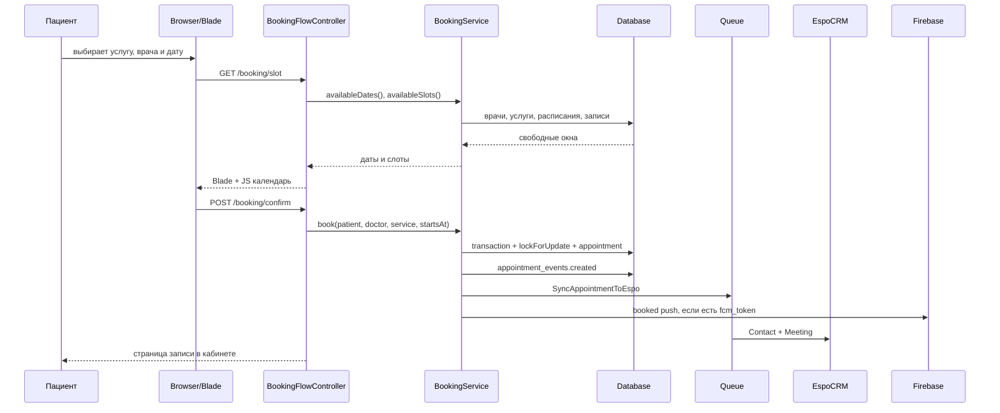
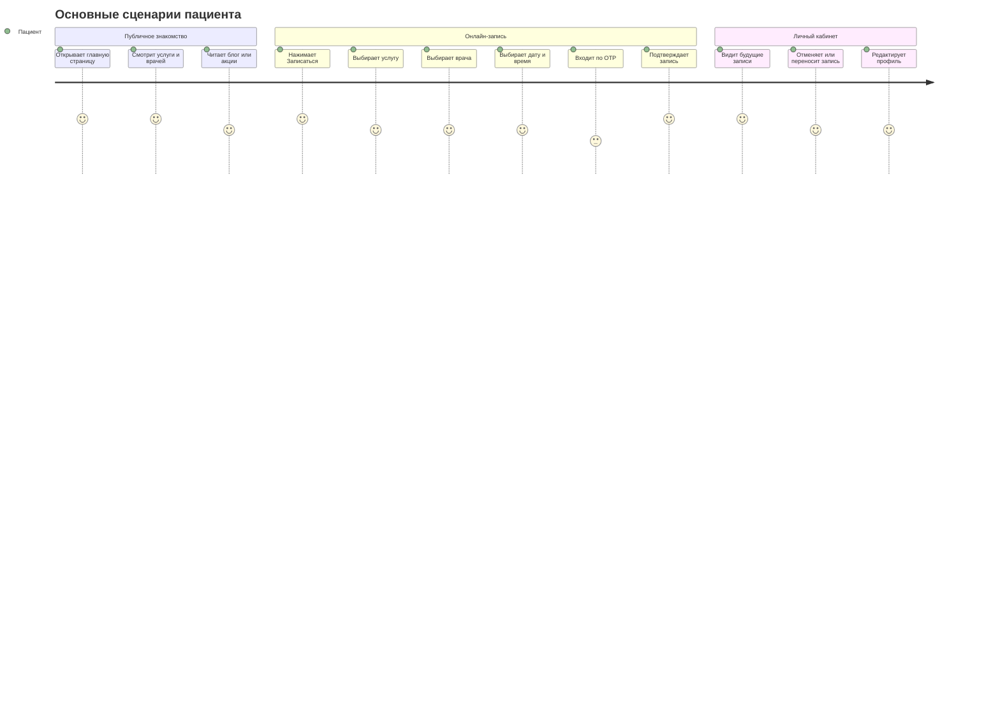
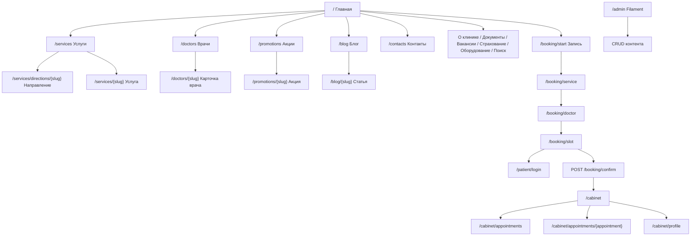
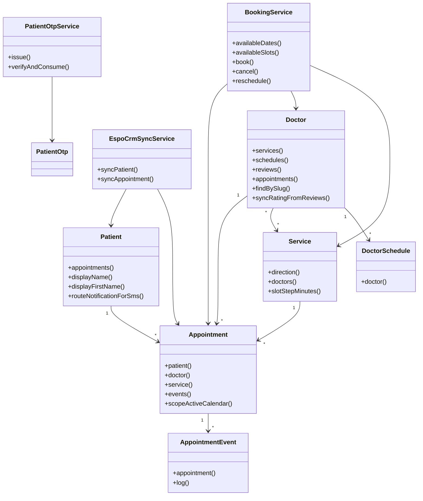

# Полное руководство по проекту Маяк Здоровья

## 1. Введение

`site` — это Laravel-приложение медицинского центра «Маяк Здоровья». Проект объединяет публичный сайт клиники, личный кабинет пациента, онлайн-запись к врачу, REST API для мобильного приложения, административную панель Filament, синхронизацию с EspoCRM, SMS/OTP-авторизацию и push-уведомления Firebase.

Главная идея архитектуры: пользователь видит обычные HTML-страницы Blade, выбирает услугу/врача/слот, авторизуется как пациент через OTP-код, после чего `BookingService` создаёт запись в базе, пишет аудит событий, отправляет уведомления и ставит синхронизацию с CRM в очередь.

Для новичка важно понимать три слоя:

1. **Маршруты (`routes/*`)** принимают HTTP-запрос и выбирают контроллер.
2. **Контроллеры (`app/Http/Controllers`)** подготавливают данные, вызывают сервисы и возвращают Blade-страницы или JSON.
3. **Модели и сервисы (`app/Models`, `app/Services`)** содержат данные и бизнес-логику: врачи, услуги, записи, пациенты, OTP, CRM.

## 2. Технологический стек

| Часть | Технологии | Роль |
|---|---|---|
| Backend | PHP 8.5, Laravel 13 | Маршрутизация, Eloquent ORM, очереди, расписание задач, валидация, уведомления |
| Админка | Filament 5, Livewire 4 | CRUD-управление врачами, услугами, статьями, акциями, настройками |
| API | Laravel Sanctum 4 | Bearer-токены для мобильного приложения пациента |
| Frontend | Blade, HTML, vanilla JS, CSS, Tailwind CSS 4 | Серверная отрисовка страниц, интерактивные фильтры, календарь записи |
| Сборка | Vite 8, `laravel-vite-plugin` | Сборка Tailwind и JS-расширений админки |
| Редактор контента | Tiptap 3 | Rich editor в Filament для статей/страниц |
| База данных | SQLite по умолчанию, также MySQL/PostgreSQL/SQL Server через Laravel config | Таблицы врачей, услуг, записей, пациентов, контента |
| Очереди | Laravel Queue | CRM sync, push-уведомления |
| Интеграции | EspoCRM REST API, Firebase Cloud Messaging, SMS.by | CRM-контакты/встречи, пуши, SMS |
| Тесты | Pest 4, PHPUnit 12 | Feature/unit-проверки бронирования, API, расписаний |
| Форматирование | Laravel Pint 1 | Стиль PHP-кода |

## 3. Как работает сайт от загрузки страницы до действия пользователя

1. Браузер открывает URL, например `/`.
2. `public/index.php` передаёт запрос Laravel-приложению.
3. `bootstrap/app.php` подключает маршруты `routes/web.php`, `routes/api.php`, `routes/console.php`, middleware и обработчики ошибок.
4. Web-маршрут вызывает контроллер, например `HomeController@index`.
5. Контроллер загружает модели (`Page`, `Direction`, `Doctor`, `Promotion`, `Review`) через Eloquent.
6. Laravel возвращает Blade-шаблон, например `resources/views/home.blade.php`.
7. Общий layout `resources/views/layouts/app.blade.php` подключает header, footer, CSS из `public/styles/*` и JavaScript из `public/scripts/*`.
8. JS после `DOMContentLoaded` включает мобильное меню, sticky header, плавный скролл, фильтры, слайдеры и анимации.
9. При записи к врачу пользователь проходит wizard:
   - `/booking/start`
   - `/booking/service`
   - `/booking/doctor`
   - `/booking/slot`
   - `/booking/confirm`
10. На шаге выбора слота Blade встраивает данные в HTML, а JS страницы через `/api/v1/booking/slots` подгружает свободное время.
11. Если пациент не вошёл, выбранный слот сохраняется в session, пользователь уходит на OTP-вход.
12. После OTP-входа `BookingService::book()` создаёт `appointments`, пишет `appointment_events`, уведомляет пациента и запускает CRM-sync.

Ключевой фрагмент API-маршрутов:

```php
Route::prefix('auth')->group(function (): void {
    Route::post('/register/request-otp', [PatientAuthController::class, 'registerRequestOtp'])
        ->middleware('throttle:otp-by-ip-phone');
    Route::post('/login/verify', [PatientAuthController::class, 'loginVerify'])
        ->middleware('throttle:12,1');
});

Route::middleware(['auth:sanctum'])->group(function (): void {
    Route::post('/appointments', [AppointmentApiController::class, 'store']);
    Route::get('/me', [PatientApiController::class, 'me']);
});
```

Этот блок важен потому, что разделяет публичные действия (получить OTP, каталог врачей) и защищённые действия (создать запись, посмотреть профиль).

## 4. Mermaid-диаграммы

### 4.1. Диаграмма архитектуры

```mermaid
flowchart TB
    Browser[Браузер пациента] --> WebRoutes[routes/web.php]
    Mobile[Мобильное приложение] --> ApiRoutes[routes/api.php]
    Admin[Администратор] --> Filament[/admin Filament Panel]

    WebRoutes --> WebControllers[Web Controllers]
    ApiRoutes --> ApiControllers[API V1 Controllers]
    Filament --> FilamentResources[Filament Resources]

    WebControllers --> Views[Blade templates]
    Views --> PublicAssets[public/styles + public/scripts + images]
    Views --> BookingApi[/api/v1/booking/slots]

    WebControllers --> Services[BookingService, PatientOtpService]
    ApiControllers --> Services
    FilamentResources --> Models[Eloquent Models]
    Services --> Models
    Models --> DB[(Database)]

    Services --> Jobs[Queue Jobs]
    Jobs --> Espo[EspoCRM REST API]
    Jobs --> Firebase[Firebase FCM]
    Notifications[Laravel Notifications] --> Sms[SMS.by or log]
    Services --> Notifications
```

### 4.2. Диаграмма потока данных записи на приём



### 4.3. Диаграмма пользовательского пути



### 4.4. Карта сайта



### 4.5. Диаграмма классов/компонентов



## 5. Анализ структуры каталогов

### `app/`

Главная папка PHP-кода приложения. Здесь находятся модели, контроллеры, сервисы, Jobs, уведомления, Filament-админка и вспомогательные классы.

### `app/Console/Commands/`

Команды Artisan. В проекте есть `SendAppointmentReminders.php`, который выбирает записи за ~24 часа и ~1 час до приёма и отправляет FCM-напоминания.

### `app/Contracts/`

Интерфейсы. `SmsSender.php` задаёт контракт для SMS-отправителей, чтобы код не зависел напрямую от SMS.by или лог-заглушки.

### `app/Enums/`

Типизированные перечисления бизнес-состояний: статус записи, источник записи, актор события, день недели.

### `app/Filament/`

Административная панель. Каждый ресурс Filament обычно разделён на:

- `*Resource.php` — связь с моделью, название пункта меню, страницы.
- `Schemas/*Form.php` — поля формы.
- `Tables/*Table.php` — колонки, фильтры и действия таблицы.
- `Pages/Create*.php`, `Edit*.php`, `List*.php` — страницы создания, редактирования и списка.

### `app/Http/Controllers/`

Контроллеры web-страниц и API. Web-контроллеры возвращают Blade, API-контроллеры возвращают JSON Resources.

### `app/Http/Requests/`

Form Request-классы. Они валидируют входные данные до попадания в контроллер: телефон, OTP, дату записи, профиль пациента, отмену/перенос записи.

### `app/Http/Resources/Api/`

JSON-представления моделей. Они скрывают внутреннюю структуру БД и возвращают клиенту стабильный API-формат.

### `app/Jobs/`

Очереди. Используются для CRM-синхронизации и push-уведомлений.

### `app/Models/`

Eloquent-модели, соответствующие таблицам БД. Здесь описаны связи (`doctor->services`, `patient->appointments`) и полезные методы (`displayName`, `scopeActive`).

### `app/Notifications/`

Уведомления о создании, отмене и переносе записи. Laravel Notifications позволяет отправлять одно и то же бизнес-событие по разным каналам: mail, SMS, custom channel.

### `app/Providers/`

Регистрация сервисов и админ-панели. `AppServiceProvider` связывает интерфейсы с реализациями и настраивает rate limiters.

### `app/Services/`

Бизнес-логика, которую нельзя оставлять в контроллерах. Самые важные классы: `BookingService`, `PatientOtpService`, `EspoCrmSyncService`.

### `bootstrap/`

Точка сборки Laravel-приложения: маршруты, middleware alias, scheduler, exception mapping.

### `config/`

Конфигурация приложения: база, auth guards, очереди, mail, Sanctum, Livewire, EspoCRM, Firebase, SMS.

### `database/`

Миграции, фабрики, сидеры и SQL-скрипт. Миграции описывают структуру таблиц; сидеры создают стартовый контент.

### `public/`

Веб-корень. Содержит `index.php`, публичные CSS/JS, изображения, шрифты, robots.txt, скрипты админ-редактора.

### `resources/`

Исходные Blade-шаблоны, Tailwind CSS и JS-исходники для Vite/Filament.

### `routes/`

`web.php` — страницы сайта, `api.php` — REST API v1, `console.php` — консольные маршруты.

### `tests/`

Pest-тесты feature/unit. Покрывают API авторизации, бронирование, слоты, расписания, enum Weekday.

## 6. Подробный анализ ключевых файлов

### `composer.json`

Определяет PHP-зависимости и скрипты. Важные зависимости: Laravel 13, Filament 5, Livewire 4, Sanctum 4, Firebase Admin SDK, SMS.by SDK, Pest, Pint. Скрипт `composer run dev` запускает одновременно сервер, очередь, pail и Vite; `composer test` очищает config cache и запускает тесты.

### `package.json`

Минимальная frontend-конфигурация: `npm run dev` запускает Vite, `npm run build` собирает ассеты. Dev-зависимости включают Tailwind 4, Tiptap 3 и Laravel Vite plugin.

### `vite.config.js`

Подключает Laravel Vite plugin и Tailwind plugin. Входные точки: `resources/css/app.css`, `resources/js/app.js`, CSS темы Filament и JS-плагины rich editor.

### `bootstrap/app.php`

Создаёт Laravel application builder. Важные блоки:

- `withRouting(...)` подключает web, api, console routes и задаёт API-префикс `api/v1`.
- `Schedule::command(SendAppointmentReminders::class)->hourly()` запускает напоминания каждый час.
- alias `patient.auth` указывает на `EnsurePatientAuthenticated`.
- `BookingException` превращается в JSON 422 для API-запросов.

### `routes/web.php`

Описывает публичный сайт, регистрацию/логин пациента, booking wizard и кабинет. Важная особенность: личный кабинет и подтверждение записи закрыты middleware `patient.auth`. Чувствительные действия ограничены throttle middleware.

Основные группы:

- `/` — главная.
- `/doctors`, `/doctors/{slug}` — список и карточка врача.
- `/services`, `/services/{slug}` — услуги.
- `/blog`, `/blog/{slug}` — статьи.
- `/promotions`, `/promotions/{slug}` — акции.
- `/booking/*` — online booking wizard.
- `/patient/register/*`, `/patient/login/*` — OTP-регистрация и вход.
- `/cabinet/*` — кабинет пациента.

### `routes/api.php`

REST API v1 для мобильного приложения и AJAX-календаря. Содержит:

- `auth/register/request-otp`, `auth/register/verify`;
- `auth/login/request-otp`, `auth/login/verify`;
- `auth/refresh`;
- публичный каталог `/booking/services`, `/booking/doctors`, `/booking/slots`, `/booking/dates`;
- защищённые Sanctum-маршруты `/me`, `/appointments`, `/devices/register`;
- публичные API справочники врачей, услуг, статей и акций.

### `routes/console.php`

Консольные маршруты Laravel. В проекте используется минимально; регулярные задачи фактически настраиваются в `bootstrap/app.php`.

### `app/Services/BookingService.php`

Центральная бизнес-логика записи. Контроллеры только собирают ввод, а этот сервис принимает решение, можно ли записать пациента.

Ключевые методы:

- `availableDates()` — ищет даты с хотя бы одним свободным слотом.
- `availableDatesBetween()` — то же в заданном диапазоне.
- `availableSlots()` — строит список свободных интервалов по расписанию врача.
- `book()` — создаёт запись.
- `cancel()` — отменяет запись, проверяя владельца и окно отмены.
- `reschedule()` — создаёт новую запись и помечает старую как перенесённую.

Фрагмент создания записи:

```php
$appointment = DB::transaction(function () use ($patient, $doctor, $service, $startsAt, $endsAt, $note, $source) {
    Doctor::query()->whereKey($doctor->id)->lockForUpdate()->first();

    $this->assertMinLead($startsAt);

    if (! $this->isSlotWithinSchedule($doctor, $startsAt, $endsAt)) {
        throw new BookingException('Выбранное время вне расписания врача.');
    }

    if ($this->doctorHasTimeConflict($doctor, $startsAt, $endsAt, null)) {
        throw new BookingException('Это время уже занято.');
    }

    return $patient->appointments()->create([...]);
});
```

Почему это важно:

- `DB::transaction()` гарантирует, что проверка и создание записи происходят атомарно.
- `lockForUpdate()` блокирует строку врача, уменьшая риск двойной записи в один слот.
- `assertMinLead()` запрещает запись слишком близко к текущему времени.
- `doctorHasTimeConflict()` проверяет пересечение с уже существующими записями.

### `app/Services/PatientOtpService.php`

Сервис OTP-кодов. Сейчас используется демо-код `111111`, срок действия — 15 минут.

Логика:

1. `issue($phone)` помечает старые неиспользованные OTP как consumed.
2. Создаёт новую строку `patient_otps`.
3. `verifyAndConsume($phone, $code)` принимает только `PatientOtp::DEMO_OTP_CODE`, проверяет срок и помечает строку использованной.

Это MVP-реализация: подключение реальной SMS-отправки возможно через `SmsSender`.

### `app/Services/Crm/EspoCrmSyncService.php`

Синхронизация с EspoCRM. Главные задачи:

- `syncPatient()` создаёт/обновляет Contact.
- `syncAppointment()` создаёт Meeting для записи или отменяет Meeting при отмене/переносе.
- `phoneForEspo()` нормализует белорусский телефон в E.164.
- `dry_run` режим позволяет тестировать без реальных HTTP-вызовов.

Связи:

- вызывается Jobs `SyncPatientToEspo` и `SyncAppointmentToEspo`;
- читает `config/espo.php`;
- пишет поля `espo_contact_id`, `espo_entity_id`, `espo_sync_status`, `espo_sync_error`.

### `app/Http/Controllers/BookingFlowController.php`

Web wizard записи. Хранит промежуточные данные в session (`booking.pending`, `booking.slot_draft`) и направляет пользователя по шагам.

Логика шагов:

- `start()` — старт wizard, учитывает query-параметры `from=doctor:slug` или `from=service:slug`.
- `browseBookingDoctors()` — выбор врача как точки входа.
- `pickService()` — выбор услуги.
- `pickDoctor()` — выбор врача для услуги.
- `pickSlot()` — календарь свободных слотов.
- `rememberSlotIntent()` — если пациент не вошёл, запоминает слот и отправляет на логин.
- `confirm()` — после auth вызывает `BookingService::book()`.

### `app/Http/Controllers/Cabinet/CabinetController.php`

Личный кабинет пациента:

- `dashboard()` и `appointments()` показывают будущие/прошедшие записи.
- `show()` показывает одну запись.
- `cancel()` отменяет через `BookingService::cancel()`.
- `rescheduleForm()` показывает повторно `booking.slot` в режиме переноса.
- `reschedule()` вызывает `BookingService::reschedule()`.
- `editProfile()` / `updateProfile()` редактируют данные пациента.

### `app/Http/Controllers/Api/V1/PatientAuthController.php`

API-регистрация и вход пациента:

- registration сначала кладёт анкету в cache на 15 минут;
- OTP выдаётся через `PatientOtpService`;
- после verify создаётся `Patient`;
- выдаются два токена: Sanctum access token и refresh token;
- refresh token хранится в БД как SHA-256 hash и живёт 90 дней.

### `app/Http/Controllers/Api/V1/AppointmentApiController.php`

API для мобильных записей. Методы:

- `index()` — список записей текущего пациента.
- `store()` — создать запись через `BookingService::book()` с источником `AppointmentSource::Api`.
- `show()` — показать запись.
- `cancel()` — отменить.
- `reschedule()` — перенести.
- `authorizeAppointment()` — защита от доступа к чужой записи.

### `app/Http/Controllers/Api/V1/BookingCatalogController.php`

API-каталог записи:

- `services()` — активные услуги, фильтр по врачу.
- `doctors()` — врачи для услуги.
- `slots()` — свободные слоты на дату.
- `dates()` — даты со свободными слотами.

Этот контроллер используется и мобильным приложением, и Blade-страницей календаря.

### `app/Http/Controllers/HomeController.php`

Собирает данные главной страницы: content page, directions, doctors, promotions, reviews, articles. Передаёт их в `home.blade.php`.

### `app/Http/Controllers/DoctorController.php`

Публичные страницы врачей:

- список врачей с фильтрами;
- карточка врача;
- `storeReview()` — создание отзыва к врачу с последующим пересчётом рейтинга.

### `app/Http/Controllers/ServiceController.php`

Публичные страницы услуг:

- список направлений/услуг;
- страница направления;
- страница конкретной услуги.

### `app/Http/Controllers/BlogController.php`, `PromotionController.php`, `EquipmentController.php`, `StaticPageController.php`, `ContactController.php`

Эти контроллеры обслуживают контентные страницы: блог, акции, оборудование, статические разделы, поиск и контакты. `ContactController@store` сохраняет сообщения обратной связи в `contact_messages`.

## 7. Анализ моделей

### `Appointment`

Запись на приём. Хранит пациента, врача, услугу, время начала/окончания, статус, источник (`web`/`api`), данные CRM и связь с переносами. Связи: `patient`, `doctor`, `service`, `events`, `rescheduledFrom`, `rescheduledChildren`.

### `AppointmentEvent`

Журнал событий записи: created, cancelled, rescheduled. Метод `log()` централизует запись аудита в таблицу.

### `Patient`

Пациент сайта/мобильного приложения. Наследует `Authenticatable`, поэтому может быть guard-пользователем. Имеет `appointments()`, методы отображения имени и маршруты уведомлений для mail/SMS.

### `PatientOtp`

Одноразовые коды входа. Константа `DEMO_OTP_CODE = '111111'`. Поля: телефон, код, срок действия, consumed timestamp.

### `Doctor`

Врач. Хранит ФИО, slug, специализацию, фото, опыт, рейтинг, CRM assigned user. Связи: `specialization`, `services`, `reviews`, `appointments`, `schedules`. Метод `findBySlug()` используется маршрутами.

### `DoctorSchedule`

Расписание врача по дням недели. `BookingService` читает его, чтобы построить окно доступных слотов.

### `Service`

Медицинская услуга. Связана с направлением и врачами. Метод `slotStepMinutes()` определяет шаг сетки слотов: настройка `booking.slot_step_minutes` или длительность услуги.

### `Direction`

Категория/направление услуг: название, slug, описание, иконка, изображение, details, статус, сортировка.

### `Specialization`

Специализация врача. Используется в карточках и фильтрах.

### `Review`

Отзывы пациентов о врачах. После создания/обновления пересчитывает рейтинг врача через модельную логику.

### `Article`, `ArticleCategory`

Блог. `Article` поддерживает published scope, автора-врача, cover image и HTML-контент для сайта. Категория группирует статьи.

### `Promotion`, `PromotionCategory`, `PromoSlide`

Акции и слайдеры акций. `Promotion::active()` фильтрует опубликованные акции, `imagePublicUrl()` отдаёт публичный URL изображения.

### `Page`

Статические страницы и JSON-контент главной. Например hero/features главной берутся из `pages.content`.

### `Setting`

Простое key-value хранилище настроек сайта. Методы `getValue`, `getGroup`, `setValue` используются для контактов, расписания, booking rules.

### `ContactMessage`

Сообщения с формы контактов. Метод `isNew()` помогает подсвечивать новые обращения в админке.

### `Equipment`, `Document`, `License`, `Vacancy`, `Media`

Контентные модели клиники: оборудование, документы, лицензии, вакансии, медиа-файлы.

### `User`

Администратор Filament. Реализует `FilamentUser`; метод `canAccessPanel()` ограничивает доступ к admin panel.

## 8. Анализ HTTP Requests и валидации

### API appointment requests

- `Api/Appointment/StoreAppointmentRequest.php` проверяет услугу, врача, дату/время и согласие.
- `CancelAppointmentRequest.php` проверяет причину отмены.
- `RescheduleAppointmentRequest.php` проверяет новое время и опционального нового врача.

### API auth requests

- `RegisterRequestOtpRequest.php` нормализует телефон, проверяет ФИО, дату рождения, пол.
- `RegisterVerifyRequest.php` проверяет телефон и OTP.
- `LoginRequestOtpRequest.php` и `LoginVerifyRequest.php` делают то же для входа.
- `Concerns/NormalizesPatientPhone.php` приводит телефон к единому формату.

### Web booking/cabinet requests

- `Booking/PickSlotRequest.php` валидирует query выбора слота.
- `Booking/SlotIntentRequest.php` сохраняет намерение неавторизованного пациента.
- `Booking/StoreBookingRequest.php` проверяет финальное подтверждение записи.
- `Cabinet/UpdateCabinetProfileRequest.php` валидирует профиль.
- `Patient/PatientPhoneRequest.php`, `VerifyPatientOtpRequest.php`, `StorePatientRegisterProfileRequest.php` обслуживают web OTP flow.

Важное правило: контроллеры почти не валидируют вручную, они принимают уже проверенный `$request->validated()`.

## 9. Анализ API Resources

- `AppointmentResource.php` форматирует запись: ID, врач, услуга, статус, время, заметка.
- `PatientResource.php` отдаёт профиль пациента.
- `DoctorListResource.php` и `DoctorDetailResource.php` разделяют краткую карточку и подробную страницу.
- `ServiceListResource.php` форматирует услуги для booking/API.
- `ArticleListResource.php`, `ArticleDetailResource.php`, `PromotionListResource.php`, `PromotionDetailResource.php` возвращают контентные сущности.
- `DoctorReviewResource.php` форматирует отзывы.

Resources важны, потому что API-клиент не зависит от внутренних имён колонок и Eloquent-связей.

## 10. Filament-админка

### `app/Providers/Filament/AdminPanelProvider.php`

Настраивает `/admin`: бренд «Маяк Здоровья», цвет `#4682b4`, auth, auto-discovery ресурсов, страниц и виджетов, тему `resources/css/filament/admin/theme.css`.

### `app/Filament/Pages/SettingsPage.php`

Страница настроек сайта. Заполняет форму текущими значениями `Setting` и сохраняет контакты, расписание, параметры booking.

### Ресурсы контента

| Ресурс | Модель | Назначение |
|---|---|---|
| `Articles/*` | `Article` | Статьи блога, cover image, rich content, автор-врач |
| `ArticleCategories/*` | `ArticleCategory` | Категории статей |
| `Promotions/*` | `Promotion` | Акции клиники |
| `PromotionCategories/*` | `PromotionCategory` | Категории акций |
| `PromoSlides/*` | `PromoSlide` | Слайды промо-блока |
| `Directions/*` | `Direction` | Направления услуг |
| `Services/*` | `Service` | Медицинские услуги |
| `Specializations/*` | `Specialization` | Специализации врачей |
| `Doctors/*` | `Doctor` | Врачи, образование, услуги, расписания, Espo user |
| `Reviews/*` | `Review` | Модерация отзывов |
| `ContactMessages/*` | `ContactMessage` | Просмотр обращений |
| `Documents/*` | `Document` | Документы на сайте |
| `Equipment/*` | `Equipment` | Оборудование |
| `Licenses/*` | `License` | Лицензии |
| `Vacancies/*` | `Vacancy` | Вакансии |

### `app/Filament/Forms/Plugins/HighlightRichContentPlugin.php`

Подключает Tiptap-расширения highlight/line-height в редактор Filament. Связан с `app/Tiptap/*` и JS в `resources/js/filament/rich-content-plugins/*`.

### `app/Filament/Support/LocalPublicFileUpload.php`

Помощник загрузки файлов в локальный public disk. Используется формами Filament, чтобы изображения контента попадали в публично доступные директории.

### Виджеты

- `StatsOverviewWidget.php` — статистика админки.
- `RecentActivityWidget.php` — последние материалы блога.

## 11. Очереди, уведомления и интеграции

### `app/Jobs/SyncPatientToEspo.php`

Job очереди `crm`. Загружает пациента и вызывает `EspoCrmSyncService::syncPatient()`.

### `app/Jobs/SyncAppointmentToEspo.php`

Job очереди `crm`. Загружает запись и вызывает `syncAppointment()`.

### `app/Jobs/SendAppointmentReminderJob.php`

Отправляет Firebase push. Типы:

- `booked` — сразу после записи;
- `day` — за 24 часа;
- `hour` — за 1 час.

Если Firebase сообщает, что токен невалиден, job очищает `patients.fcm_token`.

### `app/Console/Commands/SendAppointmentReminders.php`

Команда `reminders:send`. Каждый час ищет записи в окне ±10 минут вокруг 24 часов и 1 часа до приёма и ставит push-job в очередь.

### Notifications

- `AppointmentCreatedNotification.php`
- `AppointmentCancelledNotification.php`
- `AppointmentRescheduledNotification.php`
- `Channels/SmsChannel.php`

Уведомления отделяют текст сообщения от способа доставки.

### SMS services

- `app/Contracts/SmsSender.php` — интерфейс.
- `app/Services/Sms/LogSmsSender.php` — пишет SMS в лог, удобно для dev.
- `app/Services/Sms/SmsBy.php` — реальный SMS.by отправитель.
- `config/sms.php` — выбирает driver через `SMS_DRIVER`, по умолчанию `log`.

## 12. Frontend: Blade, CSS и JS

### Layout

`resources/views/layouts/app.blade.php` — базовая HTML-обёртка сайта. Подключает:

- meta/title;
- Font Awesome/шрифты;
- глобальный CSS `public/styles/styles.css`;
- `partials/header.blade.php`;
- `@yield('content')`;
- `partials/footer.blade.php`;
- глобальные скрипты.

### Header/Footer

- `partials/header.blade.php` показывает контакты, навигацию, меню услуг, кабинет/логин.
- `partials/footer.blade.php` повторяет навигацию, контакты и служебные ссылки.
- Данные контактов берутся из `Setting` и передаются view composer/service provider logic.

### Главная страница

`resources/views/home.blade.php` строит hero, преимущества, категории услуг, врачей, акции, отзывы и блог. Важные Blade-приёмы:

- `@extends('layouts.app')` — наследует общий layout.
- `@push('styles')` — добавляет CSS только для этой страницы.
- `@forelse` — показывает данные или fallback-карточки.
- `route('booking.start')` — безопасная генерация ссылок Laravel.

### Booking slot page

`resources/views/booking/slot.blade.php` — самая интерактивная Blade-страница. Она:

- подключает Flatpickr CDN;
- хранит доступные даты в `data-available`;
- выбирает action формы в зависимости от режима: перенос, auth confirm или login intent;
- через JS вызывает `/api/v1/booking/slots?service=...&doctor=...&date=...`;
- пишет выбранный ISO datetime в hidden input `start_at`.

Фрагмент AJAX:

```js
function slotsUrl(dateStr) {
    var p = new URLSearchParams({ service: service, doctor: doctor, date: dateStr });
    return '/api/v1/booking/slots?' + p.toString();
}
```

### `public/scripts/script.js`

Глобальный JS сайта. На `DOMContentLoaded` запускает:

- smooth scroll;
- form validation;
- dropdown/mobile menu;
- navigation submenus;
- search;
- accordion;
- back-to-top;
- scroll animations;
- map/stat counters/FAQ;
- sticky/condensed header;
- hero video handling.

### Страничные JS-файлы

| Файл | Назначение |
|---|---|
| `public/scripts/shared-utils.js` | Общие функции: back-to-top, кликабельные карточки, phone mask |
| `public/scripts/promotions-slider.js` | Слайдер акций: dots, arrows, autoplay |
| `public/scripts/script-about-clinic-page.js` | Аккордеоны направлений и модальные окна лицензий |
| `public/scripts/script-blog-page.js` | Фильтрация/сортировка блога |
| `public/scripts/script-contacts-page.js` | Валидация контактов и анимации |
| `public/scripts/script-doctor-page.js` | Слайдер отзывов и форма отзыва |
| `public/scripts/script-index-doctors.js` | Рендер карточек врачей на главной |
| `public/scripts/script-medical-services-page.js` | Аккордеоны и FAQ услуг |
| `public/scripts/script-our-doctors-page.js` | Фильтры, пагинация, custom selects врачей |
| `public/scripts/script-promotions-page.js` | Фильтры и пагинация акций |
| `public/scripts/script-search-page.js` | Поиск по `search-data.js` |
| `public/scripts/doctors-data.js` | Данные/форматирование карточек врачей |
| `public/scripts/search-data.js` | Индекс поиска |
| `public/scripts/header-footer-loader.js` | Legacy-загрузчик фрагментов header/footer для статических HTML-подходов |

### CSS

| Файл/группа | Роль |
|---|---|
| `public/styles/styles.css` | Главный CSS: переменные цветов, reset, layout, header/footer, общие компоненты |
| `public/styles/booking-wizard.css` | Стили wizard записи, кабинета и выбора слотов |
| `public/styles/promotions-slider.css` | Слайдер акций |
| `public/styles/style-*.css` | Страничные стили: about, blog, contacts, doctors, documents, error, insurance, services, promotions, search, vacancies |
| `resources/css/app.css` | Tailwind entrypoint для Vite |
| `resources/css/filament/admin/theme.css` | Кастомная тема админки Filament |

## 13. База данных

### Основные таблицы

| Таблица | Назначение |
|---|---|
| `users` | Администраторы Filament |
| `patients` | Пациенты сайта/API |
| `patient_otps` | OTP-коды |
| `doctors` | Врачи |
| `doctor_schedules` | Расписание врачей |
| `specializations` | Специализации |
| `directions` | Направления услуг |
| `services` | Услуги |
| `doctor_service` | many-to-many врач ↔ услуга |
| `appointments` | Записи на приём |
| `appointment_events` | Аудит действий с записью |
| `reviews` | Отзывы |
| `articles`, `article_categories` | Блог |
| `promotions`, `promotion_categories`, `promo_slides` | Акции |
| `pages` | Статические страницы/контент |
| `settings` | Key-value настройки |
| `contact_messages` | Обратная связь |
| `documents`, `licenses`, `equipments`, `vacancies`, `media` | Контент клиники |
| `personal_access_tokens` | Sanctum access tokens |
| `jobs`, `failed_jobs`, `job_batches` | Очереди |
| `cache`, `cache_locks`, `sessions` | Laravel infrastructure |

### Миграции

Каждый файл `database/migrations/*.php` либо создаёт таблицу, либо добавляет колонку:

- `0001_*` — стандартные Laravel users/cache/jobs.
- `2025_01_01_*` — базовые справочники клиники и контент.
- `2026_05_02_*` — пациенты, OTP, CRM-поля.
- `2026_05_14_*` — refresh tokens и source записи.
- `2026_05_16_*` — расписания, длительность услуг, расширение appointments, appointment_events.
- `2026_05_18_*` — Espo assigned user и FCM token.
- `2026_05_19_*` — contact messages.

### Seeders

Seeders создают стартовые данные: направления, услуги, врачей, расписания, статьи, акции, страницы, отзывы, настройки и администратора.

`DatabaseSeeder.php` — центральный сидер, который вызывает остальные.

### Factories

Factories (`DoctorFactory`, `DoctorScheduleFactory`, `SpecializationFactory`, `UserFactory`) используются в тестах для быстрого создания моделей.

## 14. Конфигурация

### `config/auth.php`

Два session guard:

- `web` для `User`/админов;
- `patient` для `Patient`.

Это важно: пациент не является обычным `User`; у него отдельная модель и отдельная логика входа.

### `config/database.php`

По умолчанию `DB_CONNECTION=sqlite`, но доступны mysql, mariadb, pgsql, sqlsrv. Это делает проект удобным для локальной разработки.

### `config/espo.php`

EspoCRM:

- `enabled`;
- `dry_run`;
- `base_url`;
- `api_key`;
- `default_assigned_user_id`;
- `meeting_entity`.

### `config/firebase.php`

Конфиг Kreait Firebase SDK. Credentials берутся из `FIREBASE_CREDENTIALS` или `GOOGLE_APPLICATION_CREDENTIALS`.

### `config/filesystems.php`

Диски:

- `local` — приватные файлы;
- `public` — `storage/app/public`;
- `public_assets` — прямо `public_path()`;
- `s3` — облачное хранилище.

### Остальные config-файлы

- `app.php` — имя, timezone, locale.
- `cache.php` — cache stores.
- `hashing.php` — password hashing.
- `livewire.php` — Livewire.
- `logging.php` — каналы логов, включая audit/crm/default.
- `mail.php` — SMTP/mail.
- `queue.php` — очереди.
- `sanctum.php` — Sanctum stateful domains/token config.
- `services.php` — внешние сервисы.
- `session.php` — cookie/session.
- `sms.php` — SMS driver.

## 15. Постатейный каталог файлов проекта

Ниже — практический каталог: для каждого файла указана его роль и связи. Для однотипных generated/static asset-файлов объяснение короче, потому что их логика определяется типом ресурса.

### Корневые файлы

| Файл | Что содержит и как связан |
|---|---|
| `.editorconfig` | Правила отступов/кодировки для редакторов; помогает единообразию PHP/JS/CSS. |
| `.env.example` | Шаблон переменных окружения: APP, DB, cache, mail, queue, Espo, Firebase, SMS. |
| `.gitattributes` | Git-атрибуты, обычно normalizes line endings и исключения export. |
| `.gitignore` | Исключает `.env`, vendor, node_modules, storage build artifacts. |
| `.npmrc` | Настройки npm для frontend-зависимостей. |
| `AGENTS.md` | Инструкции Laravel Boost для агентов/разработчиков. |
| `README.md` | Краткое описание проекта и команды запуска. |
| `artisan` | CLI-вход Laravel Artisan. |
| `boost.json` | Конфигурация Laravel Boost. |
| `cacert.pem` | CA bundle для HTTPS-запросов, полезен интеграциям вроде Firebase/Espo в окружениях с SSL-проблемами. |
| `composer.json` / `composer.lock` | PHP зависимости и зафиксированные версии. |
| `package.json` / `package-lock.json` | JS зависимости и lock-файл. |
| `phpunit.xml` | Конфигурация PHPUnit/Pest. |
| `vite.config.js` | Сборка Vite/Tailwind/Filament assets. |
| `db.sql` | SQL-дамп/снимок базы, служебный артефакт данных проекта. |

### `app/Console`, `Contracts`, `Enums`, `Exceptions`

| Файл | Назначение |
|---|---|
| `app/Console/Commands/SendAppointmentReminders.php` | Artisan-команда напоминаний о приёмах за 24 часа и 1 час. |
| `app/Contracts/SmsSender.php` | Интерфейс SMS-отправителя. |
| `app/Enums/AppointmentEventAction.php` | Действия audit event: created/cancelled/rescheduled. |
| `app/Enums/AppointmentEventActor.php` | Кто совершил действие: patient/system/admin. |
| `app/Enums/AppointmentSource.php` | Источник записи: сайт или API/мобильное приложение. |
| `app/Enums/AppointmentStatus.php` | Статусы записи: new, processing, completed, cancelled, rescheduled и т.п. |
| `app/Enums/Weekday.php` | День недели и преобразование Carbon dayOfWeek в доменную enum-модель. |
| `app/Exceptions/BookingException.php` | Бизнес-ошибка записи, превращается в понятные 422/ошибки формы. |

### `app/Filament`

| Файл | Назначение |
|---|---|
| `app/Filament/Clusters/ClinicCategoriesCluster.php` | Группирует ресурсы услуг/направлений/специализаций в админке. |
| `app/Filament/Forms/Plugins/HighlightRichContentPlugin.php` | Подключает Tiptap highlight/line-height tools. |
| `app/Filament/Pages/SettingsPage.php` | UI настроек сайта и booking. |
| `app/Filament/Resources/*/*Resource.php` | Главные классы CRUD-ресурсов: модель, меню, страницы. |
| `app/Filament/Resources/*/Pages/Create*.php` | Страница создания записи ресурса. |
| `app/Filament/Resources/*/Pages/Edit*.php` | Страница редактирования, часто содержит DeleteAction и нормализацию данных. |
| `app/Filament/Resources/*/Pages/List*.php` | Страница списка и кнопка Create. |
| `app/Filament/Resources/*/Schemas/*Form.php` | Поля формы: TextInput, FileUpload, RichEditor, Select, Repeater. |
| `app/Filament/Resources/*/Tables/*Table.php` | Колонки таблиц, фильтры и row actions. |
| `app/Filament/Resources/Directions/Concerns/NormalizesDirectionPayload.php` | Trait для нормализации payload направления перед сохранением. |
| `app/Filament/Support/LocalPublicFileUpload.php` | Настройка сохранения upload-файлов в public storage. |
| `app/Filament/Widgets/RecentActivityWidget.php` | Виджет последних материалов. |
| `app/Filament/Widgets/StatsOverviewWidget.php` | Виджет статистики. |

### `app/Http/Controllers`

| Файл | Назначение |
|---|---|
| `Api/V1/AppointmentApiController.php` | CRUD записей пациента для mobile/API. |
| `Api/V1/ArticleController.php` | API категорий/списка/деталей статей. |
| `Api/V1/BookingCatalogController.php` | API услуг, врачей, дат и слотов записи. |
| `Api/V1/DeviceController.php` | Регистрация FCM token устройства пациента. |
| `Api/V1/DoctorController.php` | API списка и карточки врачей. |
| `Api/V1/PatientApiController.php` | `/me`, обновление профиля, logout. |
| `Api/V1/PatientAuthController.php` | OTP-register/login, Sanctum access token, refresh token. |
| `Api/V1/PromotionController.php` | API акций. |
| `Api/V1/ServiceDirectionController.php` | API направлений и услуг внутри направления. |
| `BlogController.php` | Web-страницы блога. |
| `BookingFlowController.php` | Web wizard записи. |
| `BookingGuestCancelController.php` | Отмена записи по подписанной ссылке гостя/уведомления. |
| `Cabinet/CabinetController.php` | Кабинет пациента, записи, профиль, отмена/перенос. |
| `ContactController.php` | Контакты и сохранение формы обратной связи. |
| `Controller.php` | Базовый Laravel controller. |
| `DoctorController.php` | Web-список/карточка врачей и отзывы. |
| `EquipmentController.php` | Страница оборудования. |
| `HomeController.php` | Главная страница. |
| `Patient/PatientLoginController.php` | Web OTP-вход. |
| `Patient/PatientLogoutController.php` | Выход пациента из session guard. |
| `Patient/PatientRegisterController.php` | Web OTP-регистрация в несколько шагов. |
| `PromotionController.php` | Web-акции. |
| `ServiceController.php` | Web-услуги и направления. |
| `StaticPageController.php` | About/documents/vacancies/insurance/medical-device/search. |

### `app/Http/Requests`

| Файл | Назначение |
|---|---|
| `Api/Appointment/CancelAppointmentRequest.php` | Валидирует API-отмену записи. |
| `Api/Appointment/RescheduleAppointmentRequest.php` | Валидирует API-перенос. |
| `Api/Appointment/StoreAppointmentRequest.php` | Валидирует API-создание записи. |
| `Api/Auth/Concerns/NormalizesPatientPhone.php` | Общая нормализация телефона. |
| `Api/Auth/LoginRequestOtpRequest.php` | Телефон для API login OTP. |
| `Api/Auth/LoginVerifyRequest.php` | Телефон + OTP для API login verify. |
| `Api/Auth/RegisterRequestOtpRequest.php` | Анкета + телефон для API register OTP. |
| `Api/Auth/RegisterVerifyRequest.php` | Подтверждение API регистрации. |
| `Api/Patient/UpdatePatientProfileRequest.php` | Обновление API-профиля пациента. |
| `Booking/CancelRequest.php` | Web-отмена booking. |
| `Booking/PickSlotRequest.php` | Query выбора service/doctor/date. |
| `Booking/RescheduleRequest.php` | Web-перенос записи. |
| `Booking/SlotIntentRequest.php` | Сохранение выбранного слота перед login. |
| `Booking/StoreBookingRequest.php` | Финальное подтверждение записи. |
| `Cabinet/CancelAppointmentRequest.php` | Отмена из кабинета. |
| `Cabinet/RescheduleAppointmentRequest.php` | Перенос из кабинета. |
| `Cabinet/UpdateCabinetProfileRequest.php` | Редактирование профиля. |
| `Patient/PatientPhoneRequest.php` | Телефон для web login/register. |
| `Patient/StorePatientRegisterProfileRequest.php` | ФИО/дата рождения/пол. |
| `Patient/VerifyPatientOtpRequest.php` | OTP-код в web flow. |

### `app/Http/Resources/Api`

| Файл | Назначение |
|---|---|
| `AppointmentResource.php` | JSON записи. |
| `ArticleDetailResource.php` | Детальная статья. |
| `ArticleListResource.php` | Карточка статьи. |
| `DoctorDetailResource.php` | Детальная карточка врача. |
| `DoctorListResource.php` | Карточка врача в списке. |
| `DoctorReviewResource.php` | Отзыв врача. |
| `PatientResource.php` | Профиль пациента. |
| `PromotionDetailResource.php` | Детальная акция. |
| `PromotionListResource.php` | Карточка акции. |
| `ServiceListResource.php` | Услуга для каталога/booking. |

### `app/Jobs`, `Notifications`, `Providers`, `Rules`, `Services`, `Support`, `Tiptap`

| Файл | Назначение |
|---|---|
| `app/Jobs/SendAppointmentReminderJob.php` | FCM push о записи. |
| `app/Jobs/SyncAppointmentToEspo.php` | Queue sync записи в CRM. |
| `app/Jobs/SyncPatientToEspo.php` | Queue sync пациента в CRM. |
| `app/Notifications/AppointmentCancelledNotification.php` | Уведомление об отмене. |
| `app/Notifications/AppointmentCreatedNotification.php` | Уведомление о создании. |
| `app/Notifications/AppointmentRescheduledNotification.php` | Уведомление о переносе. |
| `app/Notifications/Channels/SmsChannel.php` | Custom notification channel для SMS. |
| `app/Providers/AppServiceProvider.php` | DI bindings, rate limiters, view data, Tiptap binding. |
| `app/Providers/Filament/AdminPanelProvider.php` | Конфигурация Filament. |
| `app/Rules/BelarusPhone.php` | Валидация белорусского телефона. |
| `app/Services/BookingService.php` | Бизнес-логика записи. |
| `app/Services/Crm/EspoCrmSyncService.php` | CRM sync. |
| `app/Services/PatientOtpService.php` | OTP issue/verify. |
| `app/Services/Sms/LogSmsSender.php` | SMS в лог. |
| `app/Services/Sms/SmsBy.php` | SMS.by sender. |
| `app/Support/BlockquoteGuillemets.php` | Оборачивание цитат в «ёлочки». |
| `app/Support/DirectionFontAwesomeIcons.php` | Список иконок направлений. |
| `app/Support/FirebaseSslMiddleware.php` | SSL middleware для Firebase HTTP client. |
| `app/Support/PatientPhone.php` | Нормализация телефона пациента. |
| `app/Support/RussianPlural.php` | Склонение русских слов по числу. |
| `app/Support/Slug.php` | Генерация slug. |
| `app/Tiptap/Highlight.php` | PHP Tiptap extension highlight. |
| `app/Tiptap/LineHeight.php` | PHP Tiptap extension line-height. |

### `resources/views`

| Файл | Назначение |
|---|---|
| `blog/index.blade.php` | Список статей. |
| `blog/show.blade.php` | Детальная статья. |
| `booking/browse-doctors.blade.php` | Выбор врача как вход в booking. |
| `booking/doctor.blade.php` | Выбор врача для услуги. |
| `booking/partials/progress.blade.php` | Индикатор шагов wizard. |
| `booking/service.blade.php` | Выбор услуги. |
| `booking/slot.blade.php` | Календарь дат/слотов и форма подтверждения. |
| `booking/start.blade.php` | Старт записи. |
| `cabinet/appointments.blade.php` | Список записей. |
| `cabinet/dashboard.blade.php` | Главная кабинета. |
| `cabinet/profile.blade.php` | Редактирование профиля. |
| `cabinet/show.blade.php` | Детальная запись. |
| `components/direction-icon.blade.php` | Компонент иконки направления. |
| `contacts.blade.php` | Контакты и форма. |
| `doctors/index.blade.php` | Список врачей. |
| `doctors/show.blade.php` | Карточка врача. |
| `equipment/show.blade.php` | Оборудование. |
| `errors/*.blade.php` | Страницы ошибок 403/404/419/429/500/503. |
| `errors/partials/error-card.blade.php` | Общая карточка ошибки. |
| `filament/forms/direction-icon-preview.blade.php` | Preview иконки в админ-форме. |
| `filament/pages/settings-page.blade.php` | Blade страницы настроек Filament. |
| `home.blade.php` | Главная. |
| `layouts/app.blade.php` | Основной layout. |
| `layouts/error.blade.php` | Layout ошибок. |
| `mail/appointments/*.blade.php` | Email-шаблоны уведомлений. |
| `partials/cabinet-nav.blade.php` | Навигация кабинета. |
| `partials/doctor-card.blade.php` | Карточка врача. |
| `partials/footer.blade.php` | Footer. |
| `partials/header.blade.php` | Header. |
| `patient/booking/guest-cancel-result.blade.php` | Результат гостевой отмены. |
| `patient/login*.blade.php` | Web OTP login. |
| `patient/register*.blade.php` | Web OTP registration. |
| `promotions/index.blade.php`, `promotions/show.blade.php` | Акции. |
| `services/index.blade.php`, `services/direction.blade.php`, `services/show.blade.php` | Услуги. |
| `static/*.blade.php` | О клинике, документы, страхование, поиск, вакансии, оборудование. |
| `welcome.blade.php` | Стандартная/резервная welcome-страница Laravel. |

### `public`

| Файл/группа | Назначение |
|---|---|
| `public/index.php` | Front controller Laravel. |
| `public/.htaccess` | Apache rewrite на `index.php`. |
| `public/robots.txt` | Правила индексации. |
| `public/favicon.ico` | Иконка сайта. |
| `public/images/*` | Изображения страниц, врачей, блога, акций, лицензий, логотипы. |
| `public/fonts/filament/*` | Локальные шрифты Filament. |
| `public/js/filament/*` | Скомпилированные JS-ассеты Filament. |
| `public/js/app/rich-content-plugins/*` | Скомпилированные rich editor plugins. |
| `public/admin-scripts/custom-trix-editor.js` | Админский rich editor helper. |
| `public/admin-scripts/zm-file-upload-ui.js` | UI helper file upload в админке. |
| `public/admin-scripts/zm-rich-editor-panels.js` | Helper панелей rich editor. |
| `public/scripts/*.js` | Frontend-интерактивность страниц. |
| `public/styles/*.css` | CSS сайта по страницам и компонентам. |

### `database`

| Файл/группа | Назначение |
|---|---|
| `database/.gitignore` | Исключает локальные SQLite/артефакты. |
| `database/factories/*.php` | Генерация тестовых моделей. |
| `database/migrations/*.php` | Эволюция схемы БД. |
| `database/seeders/*.php` | Начальные данные. |
| `database/scripts/seed_doctor_stolyarova_example.sql` | SQL-пример сидирования врача. |

### `tests`

| Файл | Назначение |
|---|---|
| `tests/Feature/BookingApiTest.php` | API booking: даты, слоты, создание, профиль, logout. |
| `tests/Feature/DoctorScheduleSeederTest.php` | Проверка сидера расписаний. |
| `tests/Feature/ExampleTest.php` | Smoke test главной. |
| `tests/Feature/ExtendAppointmentsBookingTest.php` | Расширенные поля appointments. |
| `tests/Feature/PatientAuthApiTest.php` | OTP API registration/login/me. |
| `tests/Feature/ServiceSlotStepTest.php` | Шаг слота услуги. |
| `tests/Pest.php` | Pest bootstrap. |
| `tests/TestCase.php` | Базовый test case. |
| `tests/Unit/BookingServiceTest.php` | Unit/business tests BookingService. |
| `tests/Unit/ExampleTest.php` | Минимальный unit example. |
| `tests/Unit/WeekdayTest.php` | Проверка enum Weekday. |

## 16. Безопасность и ограничения

- Пациентские web-страницы закрываются guard `patient`.
- API пациента закрывается `auth:sanctum`.
- OTP и booking endpoints ограничиваются rate limiters.
- Refresh token хранится не в открытом виде, а SHA-256 хешем.
- Записи нельзя отменять/переносить, если они принадлежат другому пациенту.
- Отмена ограничена окном `booking.cancel_window_hours`.
- Создание записи проверяет расписание и конфликт времени внутри транзакции.
- `.env` не должен попадать в Git.

## 17. Типовые сценарии разработки

### Локальный запуск

Обычно:

```bash
composer install
npm install
cp .env.example .env
php artisan key:generate
php artisan migrate --seed
composer run dev
```

### Сборка фронтенда

```bash
npm run build
```

### Тесты

```bash
php artisan test --compact
```

### Форматирование PHP

```bash
vendor/bin/pint --format agent
```

## 18. Глоссарий

- **Blade** — шаблонизатор Laravel, превращает `.blade.php` в HTML.
- **Controller** — класс, принимающий request и возвращающий response.
- **Eloquent Model** — PHP-класс таблицы БД.
- **Form Request** — отдельный класс валидации HTTP-ввода.
- **Guard** — механизм авторизации Laravel. Здесь есть `web` и `patient`.
- **Sanctum** — Laravel-пакет API-токенов.
- **Filament Resource** — CRUD-раздел админки.
- **Queue Job** — фоновая задача.
- **OTP** — одноразовый код входа.
- **FCM** — Firebase Cloud Messaging, push-уведомления.
- **EspoCRM** — внешняя CRM, куда синхронизируются пациенты и записи.
- **Slug** — человекочитаемый идентификатор в URL.
- **Throttle** — ограничение частоты запросов.
- **Seeder** — класс заполнения БД стартовыми данными.
- **Migration** — версия изменения схемы БД.

## 19. Краткая итоговая схема проекта

Проект построен как классическое Laravel-приложение с сильным разделением ответственности:

- публичный сайт и кабинет — Blade + CSS/JS;
- мобильный/API слой — `/api/v1` + JSON Resources + Sanctum;
- админка — Filament Resources;
- бизнес-правила записи — `BookingService`;
- авторизация пациента — OTP + отдельный guard `patient`;
- интеграции — queue jobs + dedicated services;
- данные — Eloquent models + migrations + seeders;
- качество — Pest tests + Pint.

Если нужно изменить сайт, сначала ищите маршрут в `routes/web.php` или `routes/api.php`, затем контроллер, затем модель/сервис, затем Blade/API Resource. Это самый быстрый путь понять, где находится нужная логика.
